# Making interactive maps

In this class we will make zoomable interactive versions of the static seismic risk and earthquakes map we made using QGIS in week 9.

We will do this two ways. First, we will design a "tileset" from the data using TileMill. We will save this on Mapbox's servers, and then make a webpage displaying the tiles over a basemap. To do this we will use [Mapbox.js](https://www.mapbox.com/mapbox.js/), a JavaScript code library for making interactive maps. You will need a Mapbox account: Go to the [Mapbox website](https://www.mapbox.com/), click the `Sign up` button at top right, and follow the instructions to obtain a free "Starter" plan.

Then we will create a very similar map entirely from GeoJSON, so there is no need to host a tileset on Mapbox's servers (which can become costly for maps that receive high traffic). We will also include a call to the U.S. Geological Survey's API to obtain the earthquakes data in real time. This means that each time the map loads in a user's web browser, it will automatically include any new quakes that meet our search criteria, rather than reflecting a static snapshot of the data from the time we made the map.

This will demonstrate the value of working with an API to obtain data for online interactives, where this is possible, rather than using a static dataset that will not update.

We will make the second map using [Leaflet](http://leafletjs.com/), the most widely-used JavaScript code library for making interactive online maps. (Mapbox.js is built on top of Leaflet, so the two are very similar.)

### Introducing TileMill

[TileMill](https://www.mapbox.com/tilemill/) is a design studio for making customized tilesets, which function like the tiles that power Google or Bing Maps, as we saw in week 8:


(Source: [Microsoft Developer Network](http://msdn.microsoft.com/en-us/library/bb259689.aspx))

You can design tilesets that include basemaps, or you can design a tileset to work as an overlay, placing it over an existing online basemap. We will do the latter.

TileMill can handle various types of geodata, including shapefiles and GeoJSON. It can also work with CSV files including fields containing latitude and longitude co-ordinates. By default, it makes maps in the Google Mercator projection used for most zoomable online maps. (It is possible to "hack" your project to make a tileset in another map projection, but we will not do that today.)

Tilesets are styled using a language called [CartoCSS](https://www.mapbox.com/tilemill/docs/manual/carto/), which is very similar to the standard CSS used to style web pages. If you have any experience using CSS for web design, you should find TileMill simple and intuitive to work with.

### Authorize TileMill to save tilesets to your Mapbox account

Before saving a tileset to the Mapbox cloud, you need to authorize TileMill to save to your Mapbox account. Select `TileMill>Preferences` from the top menu, click the `Authorize` button, and you will be sent to the Mapbox website, where you will need to enter your account details:


Click `Allow` at the next screen, and TileMill should be authorized to save to your account.

### The data we will import into TileMill

Download the data we will use today from [here](./data/earthquakes.zip). The folder `data_for_tilemill` contains two files: `seismic_risk.geojson`, which is a version of the seismic risk layer we worked with in QGIS in week 9, saved as GeoJSON; and `quakes.csv`, which is based on the same earthquakes data we worked with previously.

However, I have edited the second file in LibreOffice Calc. First, I created a new field called `amplit` from the existing field `mag`, for earthquake magnitude, using the spreadsheet formula: `=SQRT(10^[A2])`.

Here, `A2` would be replaced by the co-ordinate for the first cell in the `mag` field, and then the formula would be copied down the rest of the new column. `10^A2` is the same formula for converting earthquake magnitude into amount of ground shaking that we used in week 9. But notice that I then took the square root of that number using the function `SQRT()`. This is because TileMill sets the size of circles by their width/diameter, or twice their radius. As we noted in week 2, the area of a circle is given by the formula: `area = π * radius^2`. So when scaling circles using radius or diameter, we need to use the square root of the data values to get the circles to scale correctly, by area.

I also made a new column giving the dates in a format that can be read easily by people, rather than the standard format understood by data analysis software. This is because we are going to display the dates, along with other data, when a user hovers over each quake.

### Use TileMill to design a tileset displaying the seismic hazard and earthquakes data

Launch TileMill, and click the `New project` button at top left. Fill in the dialog box that appears as follows:


Choose a simple, abbreviated `Filename` with no spaces; `Name` can be more descriptive. If you leave `Default data` checked, the project will automatically be created with a world map showing country borders. That can be useful if you want to style your own basemap. However, as we are just making a data overlay, we don't want this option.

Click `Add` and a new project should appear. Click on the new project to open it up, and you should see a screen like this:

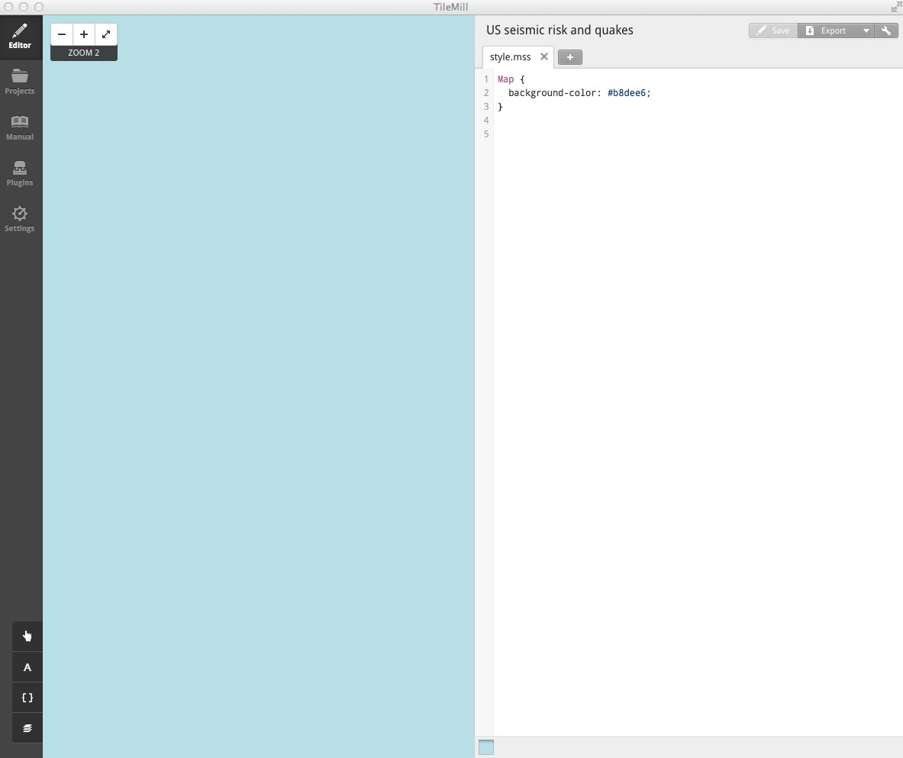

The left side of the screen shows the map we are making, currently just a blue background, and the right side shows the CartoCSS used to style the map, defining that background color by its HEX value:

```CSS
Map {
  background-color: #b8dee6;
}
```

We don't need a background, so we can simply delete this code. Save the project using `⌘-S` and the background will disappear.

To import geodata, click the `Layers` button:


Then click `+ Add layer`, and at the next dialog box `Browse` to where you saved the two files. Select `seismic_risk.geojson` and click `Done`:


At the next dialog box, click `Save & Style`, and the data should load into the map. Use the zoom controls and pan, like you would on a Google Map, to get it in central view, filling most of the map panel:

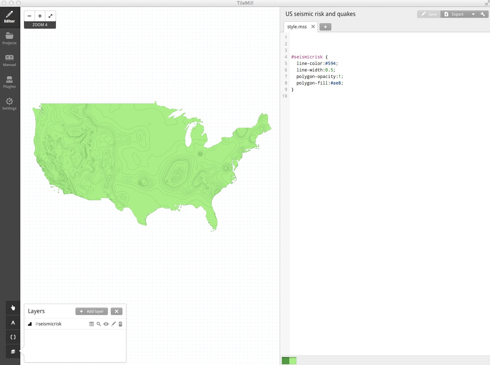

The default green colors are defined by this CartoCSS:

```CSS
#seismicrisk {
  line-color:#594;
  line-width:0.5;
  polygon-opacity:1;
  polygon-fill:#ae8;
}
```
In the `Layers` panel, click on the data table symbol () to see that the data contains a field called `ACC_VAL`, as for the shapefile in week 9.

Close that table, and then edit the CartoCSS for the seismic risk layer to the following:

```CSS
#seismicrisk {
  line-width:0;
  polygon-opacity:0.7;
  [ACC_VAL >= 0] { polygon-fill:#fee5d9; }
  [ACC_VAL >= 20] { polygon-fill:#fcae91; }
  [ACC_VAL >= 40] { polygon-fill:#fb6a4a; }
  [ACC_VAL >= 60] { polygon-fill:#de2d26; }
  [ACC_VAL >= 80] { polygon-fill:#a50f15; }
}
```
This reduces the width of the lines to zero, and makes the polygons partially transparent, so the base map will later be visible through the layer. It then applies some conditional styling, based on values of `ACC_VAL`, to apply the same [ColorBrewer](http://colorbrewer2.org/) scheme we used for the static map in week 9, using the colors' HEX vales.

Save the project using `⌘-S` and the layer will take on the style defined by the CartoCSS:


In the `Layers` panel, click `+ Add layer` and import `quakes.csv` in the same way as before. The map should populate with points:

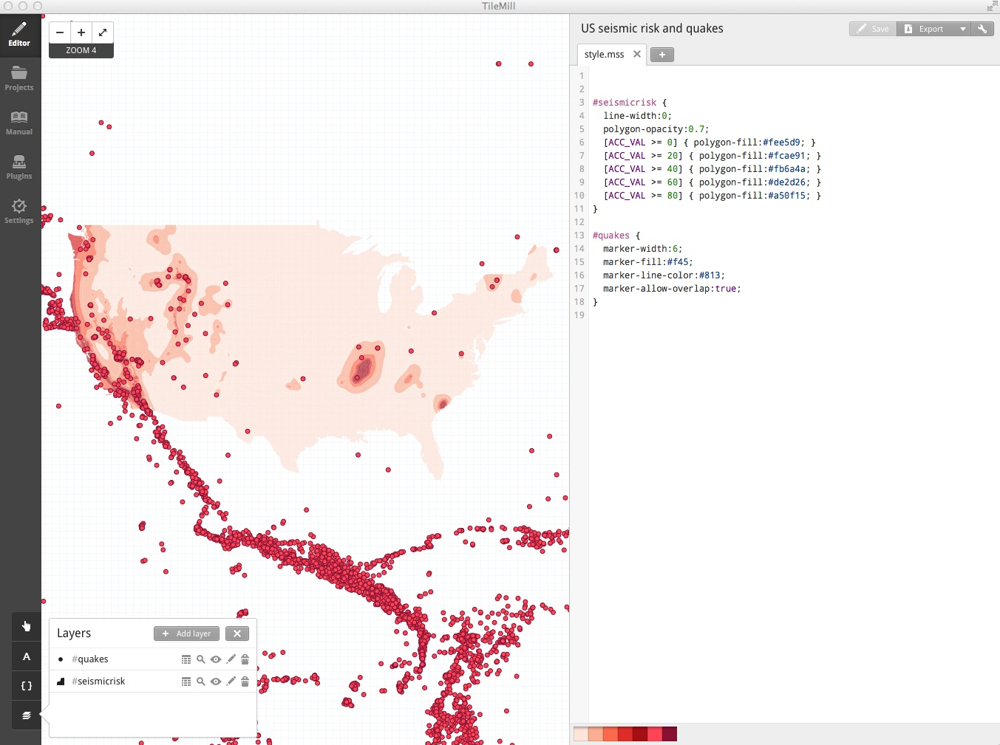

Their style is defined by this default CartoCSS:

```CSS
#quakes {
  marker-width:6;
  marker-fill:#f45;
  marker-line-color:#813;
  marker-allow-overlap:true;
}
```
Again, we will edit this, to the following:

```CSS
#quakes {
  marker-width:[amplit]/120;
  marker-fill:#ffffff;
  marker-line-color:#000000;
  marker-allow-overlap:true;
  marker-opacity: 0.5;
  marker-line-opacity: 0.5;
}
```

This scales the diameter of the circles by the field `amplit`, divided by 120 to give a reasonable display -- a value I settled on through trial and error. It fills the markers with white, gives them a black border, and then makes the circles semi-transparent by applying 50% opacity to both fill and line.

The map should now look like this:


We have only explored some of the options available in CartoCSS, which allows for many possibilities, including adjusting the visibility or appearance of features at different zoom levels. See [here](https://github.com/mapbox/carto/blob/master/docs/latest.md) for a complete CartoCSS reference.

Having styled the map, we will now add a legend and a tooltip to be displayed when each quake is hovered over (or tapped, on mobile devices). To add these features, click on this icon:

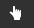

In the `Legend` tab, enter the following HTML:

```HTML
<p><strong>Seismic risk:</strong></p></br>
<p>Low
<span style="color:#fee5d9">▉</span>
<span style="color:#fcae91">▉</span>
<span style="color:#fb6a4A">▉</span>
<span style="color:#de2d26">▉</span>
<span style="color:#a50f15">▉</span>
High</p><br />
<p>Circles show quakes of magnitude 5 or greater, from 1964 to 2013, scaled by the amount of ground shaking. Hover over/tap each quake for details.</p>
```
Note that ▉ is the Unicode character for a [filled square](http://www.fileformat.info/info/unicode/char/25a0/index.htm).

In the `Teaser` tab, set `quakes` as the layer to use for interaction data, using the control at bottom left:

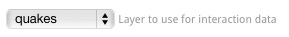

Then enter the following HTML:

```HTML
<strong>Date:</strong> {{{date}}} <br />
<strong>Magnitude:</strong> {{{mag}}} <br />
<strong>Depth:</strong> {{{depth}}} kilometers
```

Here the moustache tags, `{{{ }}}`, enclose the names of fields from the data. When a user hovers over (or taps, on a mobile device) each circle, the corresponding data for that quake will appear.

Save the project using `⌘-S`, close the `Templates` panel, and the map should look like this:

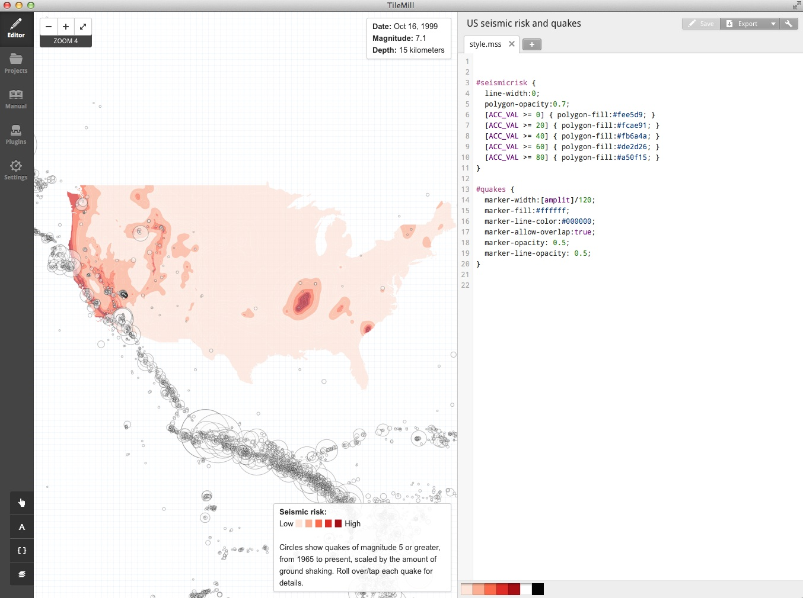


Now click on the `Settings` icon at top right (  )and zoom the map to level 4. Click on the existing center pin to remove it:

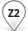

Another pin, at the correct zoom level, should appear. Pan the map so the area we want to display is in view and click somewhere in the center of the United States to move the center pin to that position.

Then adjust the `Project settings` to the following:

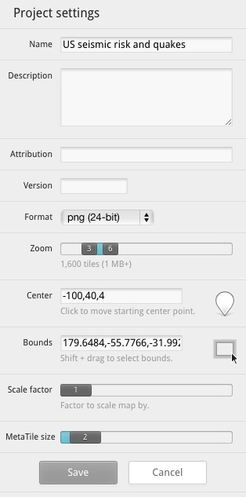

This limits the tileset that will be saved to zoom levels 3 through 6, and sets the initial map view centered at a latitude of 40 degrees North and a longitude of 100 degrees West, displayed at zoom level 4.

Click `Save` to save these settings, then select `Export>Upload` and and click the `Upload` button. The tileset should now upload to your Mapbox account. When the upload is complete, click `View` to see the online map.

You can now quit TileMill.

### Make a simple web page to display the tileset over a basemap

Launch TextWrangler or another text editor optimized for authoring web pages (**not** TextEdit!).

First paste the following to set up the document as a web page, saving it with an appropriate name, such as `seismic.html`:

```HTML
<!DOCTYPE html>
<html>

</html>
```
Between the `<html> </html>` tags, paste this HTML:

```HTML
<head>

	<meta charset=utf-8 />
	<title>Seismic hazards in the continental U.S.</title>
	<meta name="viewport" content="initial-scale=1,maximum-scale=1,user-scalable=no" />
	<script src="https://api.tiles.mapbox.com/mapbox.js/v2.1.4/mapbox.js"></script>
	<link href="https://api.tiles.mapbox.com/mapbox.js/v2.1.4/mapbox.css" rel="stylesheet" />

	<style>
	  body { margin:0; padding:0; }
	  #map { position:absolute; top:0; bottom:0; width:100%; }
	</style>

</head>

```
This should look familiar if you have previously authored any web pages. It is the head for the webpage, containing some basic settings and loading resources that will be used by the page. It accesses Mapbox.js, which we will use to set up and control the map, and there is also a link to a Mapbox CSS stylesheet.

The code between the `<style> </style>` tags is some very simple CSS to make the map display full screen.

Beneath the page head, but above the closing `</html>` tag, paste the code for the body of the web page:

```HTML
<body>

	<div id="map"></div>

	<script>
		L.mapbox.accessToken = "*Your access token*";

		var map = L.mapbox.map("map", "mapbox.world-bright,*Your map*", {maxZoom: 6, minZoom: 3})
			.setView([40, -100], 4);
	</script>

</body>
```

This code first sets up a div to contain the map.

The code between the `<script> </script>` tags is some simple JavaScript telling Mapbox.js how to set up the map.

You will need to replace `*Your access token*` with the token for your account. Sign in on the [Mapbox website](https://www.mapbox.com/), then click on the `Apps` tab:


Copy the `Default public token` and paste it in place of `*Your access token*`.

The code to set up the map first calls in a free Mapbox basemap (see [here](http://a.tiles.mapbox.com/v3/mapbox/maps.html) for others you can use), and then adds your tileset over that. You will need to replace `*Your map*` with the id for your map.

If the url for your map on the Mapbox website is of the form `http://a.tiles.mapbox.com/v3/paldhous.us_seismic/page.html`, then the id is: `paldhous.us_seismic`.

The code also restricts zooming to between levels 3 and 6, the limits we set in TileMill for the tileset, and again sets the initial view to to zoom level 4, centered on a latitude of 40 degrees North and a longitude of 100 degrees West.

Save your HTML file, open it in a web browser, and you should see a map that looks like this:

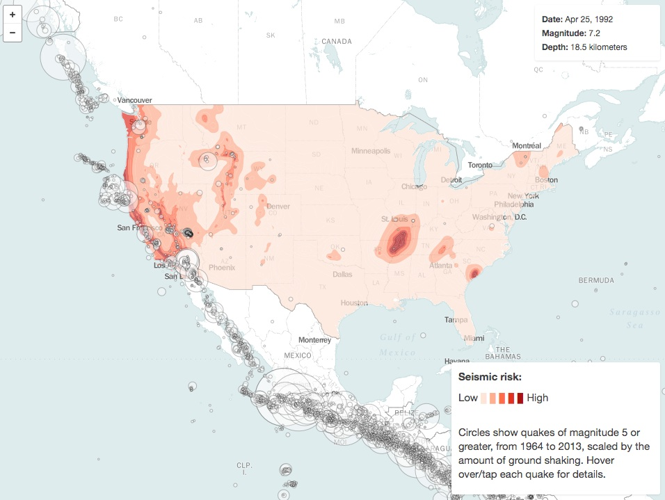

### Make a Leaflet map using GeoJSON and the U.S. Geological Survey earthquakes API

Now we will make a similar map with the data layers made entirely from GeoJSON. We will do this in the `map` folder. Notice that it contains two subfolders, `data` and `src`. The first contains a single file `seismic_risk.js`. This contains the seismic risk GeoJSON data we earlier imported into TileMill, declared as a JavaScript variable by pasting it into the following code:

```Javascript
var seismic_risk =
//GeoJSON pasted here
;
```

The `src` folder contains two JavaScript files, `date-format.js` and `leaflet.ajax.min.js`. The first is a [script by web developer Steven Levithan](http://blog.stevenlevithan.com/archives/date-time-format), which we will use to format dates. The second is a [Leaflet plugin](https://github.com/calvinmetcalf/leaflet-ajax), which turns GeoJSON returned by an API into a Leaflet map layer.

(Note, Leaflet has many useful plugins that extend its basic functionality. View them [here](http://leafletjs.com/plugins.html).)

First we need to set up a web page for our map. In TextWrangler or another text editor, paste the following into a new document, saving it as `index.html` in the main `map` folder:

```HTML
<!DOCTYPE html>
<html>

</html>
```
Now paste the following code, for the head of the web page, between the `<html> </html>` tags:

```HTML
<head>

	<meta charset=utf-8 />
	<title>Seismic hazards in the continental U.S.</title>
	<meta name="viewport" content="initial-scale=1,maximum-scale=1,user-scalable=no" />
	<script type="text/javascript" src="http://code.jquery.com/jquery.min.js"></script>
	<link rel="stylesheet" href="http://cdn.leafletjs.com/leaflet-0.7.3/leaflet.css" />
	<script src="http://cdn.leafletjs.com/leaflet-0.7.3/leaflet.js"></script>
	<script src="src/leaflet.ajax.min.js"></script>
	<script src="src/date.format.js"></script>
	<script src="data/seismic_risk.js"></script>

	<style>
		body {margin:0; padding:0;}
		#map {position:absolute; top:0; bottom:0; width:100%;}
		#legend {
			background: #ffffff;
			position: absolute;
			bottom: 30px;
			left: 10px;
			padding: 0px 10px;
			width: 200px;
			font-family: arial;
			font-size: small;
			-webkit-border-radius:4px 4px 4px 4px;
			border-radius:4px 4px 4px 4px;
			-webkit-box-shadow: 0px 1px 5px rgba(153,153,153,1);
			-moz-box-shadow: 0px 1px 5px rgba(153,153,153,1);
			box-shadow: 0px 1px 5px rgba(153,153,153,1);
		}
		@media (max-width:767px) {
		#legend-text {display:none;}
		#legend {width: 140px;}
		}
		@media (min-width:768px) {
		#legend-text-alt {display:none;}
		}
	</style>

</head>
```

This loads the resources we will need to make the map, including Leaflet and its associated CSS stylesheet, the two JavaScript files in our `src` folder, and the seismic risk data. It also loads [jQuery](http://jquery.com/), which we will use later to give the map some basic responsive design.

The CSS in between the `<style> </style>` tags is as for the previous map, plus style for a legend, which will make it look consistent with Leaflet's map controls. Note also the `@media` rules at the end, which will display different text on the legend for different screen sizes, and shrink the size of the legend box on small screens. (All of this CSS could be placed into an external stylesheet, if you wished.)

Now, beneath the head, but above the closing `</html>` tag, paste the following HTML for the body of the web page:

```HTML
<body>

	<div id="map">

		<script src="src/maps.js"></script>

	</div>

	<div id="legend">
		<p><strong>Seismic risk:</strong></p>
		<p>Low
		<span style="color:#fee5d9">▉</span>
		<span style="color:#fcae91">▉</span>
		<span style="color:#fb6a4A">▉</span>
		<span style="color:#de2d26">▉</span>
		<span style="color:#a50f15">▉</span>
		High</p>
		<div id="legend-text">
			<p>Circles show significant quakes, from 1965 to present, scaled by the amount of ground shaking. Click/tap for details.</p>
		</div>
		<div id="legend-text-alt">
			<p>Tap quakes for details.</p>
		</div>
	</div>

</body>
```

The HTML for the legend div is very similar to the code we used earlier to make a legend in TileMill, but note the two versions of the div containing the text describing the quakes, the second much condensed for small screens.

As before, there is a div to contain the map, but the JavaScript to control the map will be loaded in from the file we now need to create, called `maps.js`. So open a new document in your text editor, and save it under this name in the `src` subfolder.

Now paste the following into the `maps.js` file:


```Javascript
// creates two basemap layers
var bright = L.tileLayer("https://{s}.tiles.mapbox.com/v3/mapbox.world-bright/{z}/{x}/{y}.png", {
	attribution: "<a href='http://www.mapbox.com/about/maps/' target='_blank'>Terms &amp; Feedback</a>"
});
var satellite = L.tileLayer("https://{s}.tiles.mapbox.com/v3/mapbox.blue-marble-topo-jul-bw/{z}/{x}/{y}.png", {
	attribution: "<a href='http://www.mapbox.com/about/maps/' target='_blank'>Terms &amp; Feedback</a>"
});
```
This declares two JavaScript variables, `bright` and `satellite`, which correspond to Mapbox tilesets, converted to Leaflet map layers. We will use these as basemaps. You are not limited to using Mapbox tilesets: For example, this code would create an OpenStreetMap layer:

```Javascript
var osm = L.tileLayer("http://{s}.tile.openstreetmap.org/{z}/{x}/{y}.png", {
	attribution: "<a href='http://openstreetmap.org'>OpenStreetMap</a> contributors,<a href='http://creativecommons.org/licenses/by-sa/2.0/'> CC-BY-SA</a>"
});
```
The [Leaflet providers](https://github.com/leaflet-extras/leaflet-providers) plugin can also be useful for identifying basemaps, and adding them to your projects; see [the demo](https://github.com/leaflet-extras/leaflet-providers).

Now paste this code into the file:

```Javascript
// creates the map and sets initial view, including layers to be displayed, plus limits for zoom and maximum extent
var map = L.map("map", {
	center: new L.LatLng(40, -100),
	zoom: 4,
	maxZoom: 6,
	minZoom: 3,
	maxBounds: ([
	[-10, -160],
	[70, -40]
	]),
	layers: [bright]
});
```

This creates the map, setting its initial zoom level to 4, and the minimum and maximum zoom levels to 3 and 6 respectively. It centers the initial view at a latitude of 40 degrees North and a longitude of 100 degrees West. You will notice the similarity to the Mapbox.js code we used previously.

`maxBounds` sets southwest and northeast co-ordinates for the maximum extent of the map view: If a user tries to pan the map beyond these limits, it will spring back to the allowed view. The last line loads the `bright` layer we created above.

Next, paste this code into the file:

```Javascript
// Defines the two basemaps
var baseMaps = {
	"Satellite": satellite,
	"Map": bright
};

// Defines the overlay maps. For now this variable is empty, because we haven't created any overlay layers
var overlayMaps = {

};

// Adds a Leaflet layer control, using basemaps and overlay maps defined above
var layersControl = new L.Control.Layers(baseMaps, overlayMaps, {collapsed: false});
map.addControl(layersControl);
```
This sets up a Leaflet layer control, allowing users to switch between the two basemaps. Later it will also allow them to adjust the visibility of the overlay layers showing earthquakes and siesmic risk.

Save the `maps.js` file then open `index.html` in your web browser. The following map should appear:


Notice how you can switch between the two basemap layers. See what happens if you replace  `{collapsed: false}` with `{collapsed: true}` in the `layersControl` code.

Now we will add the seismic risk layer. First add this code directly under the code creating the basemaps, to create a GeoJSON layer from the `siesmic_risk` variable defined in the file `seismic.js`:

```Javascript
var seismic = L.geoJson(seismic_risk);
```

Now add this layer to the code defining the overlay maps:

```Javascript
var overlayMaps = {
 	"Seismic risk": seismic
};
```

Also add it to the layers that will display when the map loads:

```Javascript
var map = L.map("map", {
	center: new L.LatLng(40, -100),
	zoom: 4,
	maxZoom: 6,
	minZoom: 3,
	maxBounds: ([
	[-10, -160],
	[70, -40]
	]),
	layers: [bright, seismic] 
});
```
Save the `maps.js` file, refresh `index.html` in your web browser, and the map should look like this:

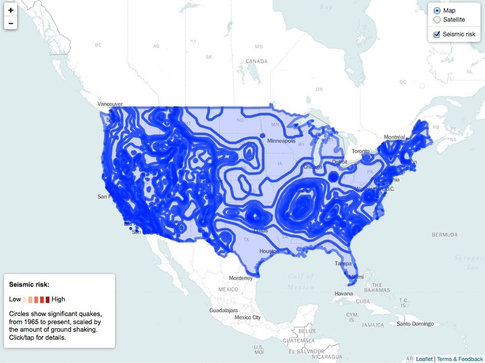

This is how unstyled GeoJSON appears on a Leaflet map, so now we need to style it. To do that, remove the single line of code creating the `seismic` layer, and replace it with this:

```Javascript
// functions to style the seismic risk layer
function getColor(a) {
			return a > 79 ? "#a50f15":
				   a > 59 ? "#de2d26" :
				   a > 39  ? "#fb6a4A" :
				   a > 19 ? "#fcae91" :
				   "#fee5d9";
			}

function getStyle(feature) {
				return {
					fillColor: getColor(feature.properties.ACC_VAL),
					color: getColor(feature.properties.ACC_VAL),
					weight: 1,
					opacity: 0.4,
					fillOpacity: 0.7
				};
			}


// the seismic risks layer, styled using functions above
var seismic = L.geoJson(seismic_risk, {style:getStyle});
```

The `getColor` function is fairly easy to understand: it gets the HEX values for the same ColorBrewer color scheme we used previously, according to the values listed.

The `getStyle` function applies `getColor` to values for ACC_VAL in the data, so that these colors are assigned to both the lines and the fill for the polygons. Here is the GeoJSON for one of the polygons in the seismic risk data, which should make the logic of `feature.properties.ACC_VAL` easy to follow:

```JSON
{ "type": "Feature", "properties": { "ACC_VAL": 18, "VALLEY": 0 }, "geometry": { "type": "Polygon", "coordinates": [ [ [ -78.0, 37.365031051635675 ], [ -78.017343139648474, 37.367344284057566 ], [ -78.03101501464846, 37.368985366821327 ], [ -78.1, 37.378542709350597 ], [ -78.116345214843804, 37.383655929565464 ], [ -78.143249511718778, 37.393249893188475 ], [ -78.153375244140662, 37.396623611450167 ], [ -78.162326049804719, 37.400000381469681 ], [ -78.189303588867219, 37.410696029663058 ], [ -78.2, 37.415526199340775 ], [ -78.221560668945358, 37.428441238403309 ], [ -78.251376342773483, 37.448622512817352 ], [ -78.28023071289067, 37.469771194458019 ], [ -78.3, 37.486327743530268 ], [ -78.307220458984403, 37.492779159545904 ], [ -78.31434020996096, 37.500000381469711 ], [ -78.328512573242222, 37.52148780822754 ], [ -78.338735961914111, 37.538737106323218 ], [ -78.347268676757835, 37.552730941772467 ], [ -78.365298461914108, 37.584701156616219 ], [ -78.373092651367216, 37.600000381469691 ], [ -78.384274291992242, 37.700000381469692 ], [ -78.376583862304742, 37.726585769653305 ], [ -78.364724731445349, 37.764723587036102 ], [ -78.352359008789094, 37.800000381469708 ], [ -78.330413818359403, 37.830413436889629 ], [ -78.307797241210977, 37.857796096801799 ], [ -78.3, 37.866172409057668 ], [ -78.282803344726617, 37.882802963256815 ], [ -78.262322998046912, 37.900000381469667 ], [ -78.255227661132849, 37.905229568481374 ], [ -78.225012207031298, 37.925011825561469 ], [ -78.2, 37.939875411987288 ], [ -78.192904663085983, 37.942905044555616 ], [ -78.156692504882855, 37.956692123413085 ], [ -78.136401367187545, 37.963599014282224 ], [ -78.119662475585969, 37.969662094116181 ], [ -78.1, 37.975945663452194 ], [ -78.034487915039108, 37.984489059448194 ], [ -78.0, 37.988642501831045 ], [ -77.9, 37.981746292114266 ], [ -77.87483520507817, 37.975164413452106 ], [ -77.835671997070349, 37.964329910278302 ], [ -77.8, 37.95324516296386 ], [ -77.797760009765668, 37.952238845825171 ], [ -77.764578247070361, 37.935423660278325 ], [ -77.732861328125054, 37.917139053344741 ], [ -77.706625366210972, 37.900000381469667 ], [ -77.702761840820344, 37.897238540649404 ], [ -77.7, 37.894968795776357 ], [ -77.677008056640673, 37.872991561889677 ], [ -77.653109741210969, 37.846889114379856 ], [ -77.630596923828179, 37.819403457641613 ], [ -77.616723632812537, 37.800000381469708 ], [ -77.611972045898469, 37.788029098510783 ], [ -77.59919433593754, 37.750805282592765 ], [ -77.586868286132841, 37.713131332397516 ], [ -77.583099365234418, 37.700000381469692 ], [ -77.593188476562545, 37.600000381469691 ], [ -77.595449829101597, 37.595450210571244 ], [ -77.612869262695341, 37.56286964416509 ], [ -77.631304931640656, 37.53130607604983 ], [ -77.651373291015673, 37.500000381469711 ], [ -77.676461791992224, 37.476461410522433 ], [ -77.7, 37.456859207153336 ], [ -77.703982543945358, 37.453983688354448 ], [ -77.73429870605473, 37.434299087524423 ], [ -77.765908813476599, 37.415910720825217 ], [ -77.796795654296929, 37.40000038146971 ], [ -77.8, 37.3985080718994 ], [ -77.837515258789097, 37.387516403198234 ], [ -77.876998901367216, 37.376997756957984 ], [ -77.9, 37.371197891235305 ], [ -78.0, 37.365031051635675 ] ], [ [ -78.0, 37.425953292846657 ], [ -77.9, 37.433411788940397 ], [ -77.887353515625023, 37.437353134155259 ], [ -77.85, 37.449983596801772 ], [ -77.813735961914105, 37.46373786926268 ], [ -77.8, 37.469122695922827 ], [ -77.78084106445317, 37.480842971801749 ], [ -77.751492309570352, 37.500000381469697 ], [ -77.727679443359406, 37.5276798248291 ], [ -77.70921325683598, 37.550000381469644 ], [ -77.7, 37.561656570434536 ], [ -77.684979248046929, 37.584979629516589 ], [ -77.675885009765665, 37.600000381469691 ], [ -77.666900634765668, 37.700000381469692 ], [ -77.676461791992224, 37.723538589477528 ], [ -77.687655639648483, 37.75000038146969 ], [ -77.691400146484412, 37.758599472045923 ], [ -77.7, 37.776056289672859 ], [ -77.708975219726597, 37.791025924682565 ], [ -77.714547729492224, 37.800000381469708 ], [ -77.733038330078159, 37.816961288452141 ], [ -77.75, 37.831132888793981 ], [ -77.760403442382852, 37.839598464965789 ], [ -77.773834228515668, 37.850000381469719 ], [ -77.788818359375028, 37.861182022094717 ], [ -77.8, 37.868613815307633 ], [ -77.822052001953153, 37.877946853637681 ], [ -77.857522583007849, 37.892478561401362 ], [ -77.876547241210972, 37.900000381469667 ], [ -77.89393920898442, 37.906061935424759 ], [ -77.9, 37.907944107055656 ], [ -77.938540649414094, 37.91146049499514 ], [ -78.0, 37.916647720336911 ], [ -78.057867431640673, 37.907867813110393 ], [ -78.1, 37.900716781616204 ], [ -78.101760864257841, 37.900000381469667 ], [ -78.134426879882867, 37.884426498413127 ], [ -78.167617797851591, 37.867616653442333 ], [ -78.2, 37.849556350707999 ], [ -78.226348876953168, 37.826350021362302 ], [ -78.25, 37.804281234741175 ], [ -78.254208374023477, 37.800000381469708 ], [ -78.269543457031304, 37.769543838501008 ], [ -78.278686523437528, 37.75000038146969 ], [ -78.285430908203168, 37.735432052612317 ], [ -78.3, 37.702294540405298 ], [ -78.300872802734403, 37.700000381469692 ], [ -78.288168334960986, 37.600000381469691 ], [ -78.272650146484423, 37.577350234985381 ], [ -78.251855468750037, 37.54814491271965 ], [ -78.229464721679733, 37.520535659789999 ], [ -78.212561035156298, 37.500000381469711 ], [ -78.205477905273469, 37.494522476196252 ], [ -78.2, 37.490776443481408 ], [ -78.17280273437504, 37.477198410034219 ], [ -78.139053344726605, 37.460947799682621 ], [ -78.115493774414105, 37.450000381469707 ], [ -78.104769897460983, 37.445229721069339 ], [ -78.1, 37.443348312377921 ], [ -78.06331176757817, 37.436689376831055 ], [ -78.0, 37.425953292846657 ] ] ] } }
```

In addition, `weight` sets the width of the lines, `opacity` sets the transparency for the lines, and `fillOpacity` sets the transparency for the polygon fills. I settled on these values through trial and error, seeking the most atttractive display.

The last line creates the seismic risk layer as before, but this time applies the `getStyle` function to style the GeoJSON. Save the `maps.js` file, refresh `index.html` in your browser, and the map should look like this:

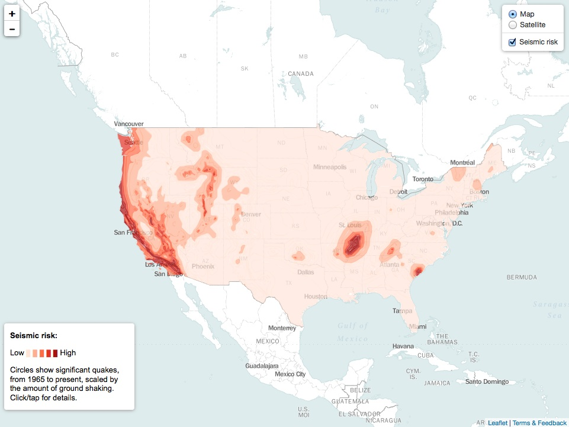

Now we need to to add the layer for the quakes, which is achieved with this code:

```Javascript
// the url to send to the USGS API
var quakedataUrl = "http://earthquake.usgs.gov/fdsnws/event/1/query?starttime=1965-01-01T00:00:00&minmagnitude=6&format=geojson&latitude=39.828175&longitude=-98.5795&maxradiuskm=6000&orderby=magnitude&callback="


// the quakes layer, uses leaflet.ajax to make API call
var quakes = L.geoJson.ajax(quakedataUrl, {

			dataType:"jsonp",

			// calls the function below to create on-click pop-up for each quake
			onEachFeature: popupText,

			// makes points into circle markers and styles them, scaling using JavaScript Math; magnitude value for each quake from parsed JSON
			pointToLayer: function (feature, latlng) {
				return L.circleMarker(latlng, {
					radius: Math.sqrt(Math.pow(10, feature.properties.mag)/50000),
					fillColor: "#fff",
					color: "#000",
					weight: 1,
					opacity: 0.2,
					fillOpacity: 0.5
				});
			}
			});

// function to write HTML for pop-ups; date, magnitude and depth values for each quake from parsed JSON
function  popupText (feature, layer) {
	 var date = new Date(feature.properties.time)
	 // uses date-format to format the date
	 var dateString = date.format("mmm d, yyyy")
	 layer.bindPopup("<strong>Date: </strong>" + dateString + "<br />"
					+ "<strong>Magnitude: </strong>" + feature.properties.mag + "<br />"
					+ "<strong>Depth: </strong>" + feature.geometry.coordinates[2] + " kilometers")
}
```

This code starts by declaring the variable `quakedataUrl`, which will return from the U.S. Geological Survey earthquakes API GeoJSON for quakes over the same area as we considered previously. This time I have asked for quakes of magnitude 6 and above, to limit the amount of data returned, which will help the map load more quickly -- you can experiment with different values here. I have set the start date as the beginning of 1965 with no end date, which means the map will always include the most recent quakes in the USGS data each time it loads.

The second section of code uses the Leaflet Ajax plugin, in the file `leaflet.ajax.min.js`, to call the USGS API and convert the data returned into a Leaflet GeoJSON layer. The `pointToLayer` function turns each feature into a circle marker, styled as defined in the code.

Here is the GeoJSON for one of the quakes, which should make the code easier to follow:

```JSON
{"type":"Feature","properties":{"mag":6.5,"place":"Seattle-Tacoma urban area, Washington","time":-147515475000,"updated":1408399017684,"tz":null,"url":"http://earthquake.usgs.gov/earthquakes/eventpage/centennial19650429152845","detail":"http://earthquake.usgs.gov/fdsnws/event/1/query?eventid=centennial19650429152845&format=geojson","felt":175,"cdi":8.6,"mmi":7.19,"alert":null,"status":"reviewed","tsunami":null,"sig":800,"net":"centennial","code":"19650429152845","ids":",uutacoma65,atlas19650429152845,centennial19650429152845,","sources":",uu,atlas,centennial,","types":",dyfi,origin,shakemap,trump,","nst":203,"dmin":null,"rms":null,"gap":null,"magType":"mb","type":"earthquake","title":"M 6.5 - Seattle-Tacoma urban area, Washington"},"geometry":{"type":"Point","coordinates":[-122.333,47.317,65.7]},"id":"centennial19650429152845"}
```

Scroll to the right of this code, and notice that the quake has three `coordinates`: The first two are its longitude and latitude; the third is its depth in kilometers. `latlng` centers each circle on the latitude and  longitude `coordinates`.

`fillColor`, `color`, `weight`, `opacity` and `fillOpacity` are doing the same jobs as in the code that styled the seismic risk layer.

The size of the circles is set by this line of code:

```Javascript
radius: Math.sqrt(Math.pow(10, feature.properties.mag)/50000),
```

This uses [JavaScript Math](http://www.w3schools.com/jsref/jsref_obj_math.asp) to scale the circles according to their magnitude, or `mag`, so that their area corresponds to the amount of ground shaking. Leaflet sets the size of a circle by its radius, so to do this we need to raise ten to the power of each quake's magnitude, and then take the square root of this number. I also divided by 50,000 to give the circles a reasonable size when added to the map. Again, I settled on this value by trial and error.

The `popupText` function writes some html for the pop-up that will appear when the user clicks on each quake. `onEachFeature` applies this function to each of the circles on the map.

JavaScript indexes start at 0, so `feature.geometry.coordinates[2]` returns the third item from the `coordinates` for each quake, which is the depth, as required.

Look again at the GeoJSON above, and you will see no date, but instead a `time`, given as `-147515475000`. JavaScript calculates dates and time in milliseconds, relative to the start of 1970. Here is how to convert a JavaScript time to a date, demonstrated at [JSFiddle](http://jsfiddle.net/):


Notice that the `popupText` function similarly uses `new Date` to convert the JavaScript times into dates, and then formats these using the `date.format` function, from the script in the `date.format.js` file.

Again, add the new quakes layer to the code defining the overlay maps:

```Javascript
var overlayMaps = {
	"Earthquakes": quakes,
	"Seismic risk": seismic
};
```

Also add it to the layers that will display when the map loads:

```Javascript
var map = L.map("map", {
	center: new L.LatLng(40, -100),
	zoom: 4, 
	maxZoom: 6,
	minZoom: 3,
	maxBounds: ([
	[-10, -160],
	[70, -40]
	]),
	layers: [bright, seismic, quakes]
});
```

Finally, paste this code at the end of the `maps.js` file, to give the map some basic responsive design, altering zoom level depending on the size of the user's screen/browser windows:

```Javascript
// Uses jQuery to add some responsive design, resetting zoom levels for small and very large screens
function responsive() {
     width = $( window ).width();
     height = $( window ).height();
    if (width < 768) {
        // set the zoom level to 3
        map.setZoom(3);
    } else if (width > 1500) {
        // set the zoom level to 5
        map.setZoom(5);
    } else {
    	map.setZoom(4);
    }
 }

  // applies the function above both on initial load and window resize
   $(window).ready(responsive).resize(responsive);
```

Save the `maps.js` file and refresh `index.html` in your web browser. The finished map should look like this:

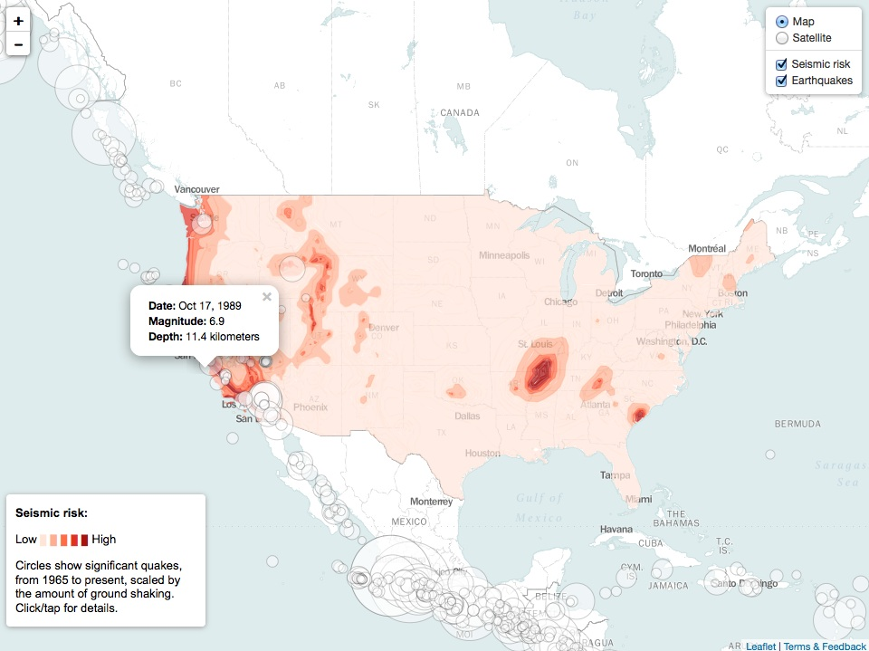

Notice that visibility for each overlay layer can be turned on and off using the checkboxes on the Leaflet layers control.

### Assignment

- Send me your finished online Leaflet map, i.e. zip the `map` folder and email that to me.
- Continue working on your final project, sending me a progress report.

### Further reading/resources

[TileMill manual](https://www.mapbox.com/tilemill/docs/manual/)

[CartoCSS reference](https://github.com/mapbox/carto/blob/master/docs/latest.md)

[Documentation for Mapbox.js code](https://www.mapbox.com/mapbox.js/) (includes [examples](https://www.mapbox.com/mapbox.js/example/v1.0.0/) and [plugins](https://www.mapbox.com/mapbox.js/plugins/))

[Leaflet tutorials](http://leafletjs.com/examples.html)

[Documentation for Leaflet code](http://leafletjs.com/reference.html)

[Leaflet plugins](http://leafletjs.com/plugins.html)

