# Interviewing data: exploratory graphical analysis

### Introducing Tableau Public

In this week's class we will work with [**Tableau Public**](http://www.tableausoftware.com/public/), which allows you to create a wide variety of interactive charts, maps and tables and organize them into **dashboards** and **stories** that can be saved to the cloud and embedded on the web.

Tableau was developed for exploratory graphical data analysis, so it is a good tool for exploring a new dataset -- filtering, sorting and aggregating the data in different ways while experimenting with various chart types.

Although Tableau was not designed as a publication tool, the ability to embed finished dashboards and stories has also allowed newsrooms that lack JavaScript coding expertise to create interactive online graphics.

### Data: Berkeley traffic accidents

We will analyze the Berkeley traffic accident data we discussed in Week 1, which is [here](./data/berkeley_traffic/collisions.csv). To make sense of this data, you will also need the [codebook](./data/traffic_accidents/SWITRS_codebook.pdf) describing the fields/variables.

### Connect to the data

The data is in a text file with the fields separated by commas, with the suffix `.csv`, for "comma separated values" -- a common data format.

Open Tableau Public, and from the top menu select `Data>Connect to Data`. Then select `Text File` and navigate to where you saved the data, select it and hit `Open`. At this point, you can view the data, which will be labeled as follows:

 - Text: `Abc`
 - Numbers: `#`
 - Dates: calendar symbol
 - Geography: globe symbol

Tableau doesn't always recognize entries correctly, but you can edit fields to give them the correct data type. In a dataset like this, for instance, where many categorical variables are stored as numbers, you may wish to reclassify them as text by selecting `String`, a computing term for one or a sequence of characters that are treated as text:

In this case, because there are so many fields to reclassify, we'll edit as required later, only as we use them.

Once the data has loaded, click `Go to Worksheet` and you should see a screen like this:

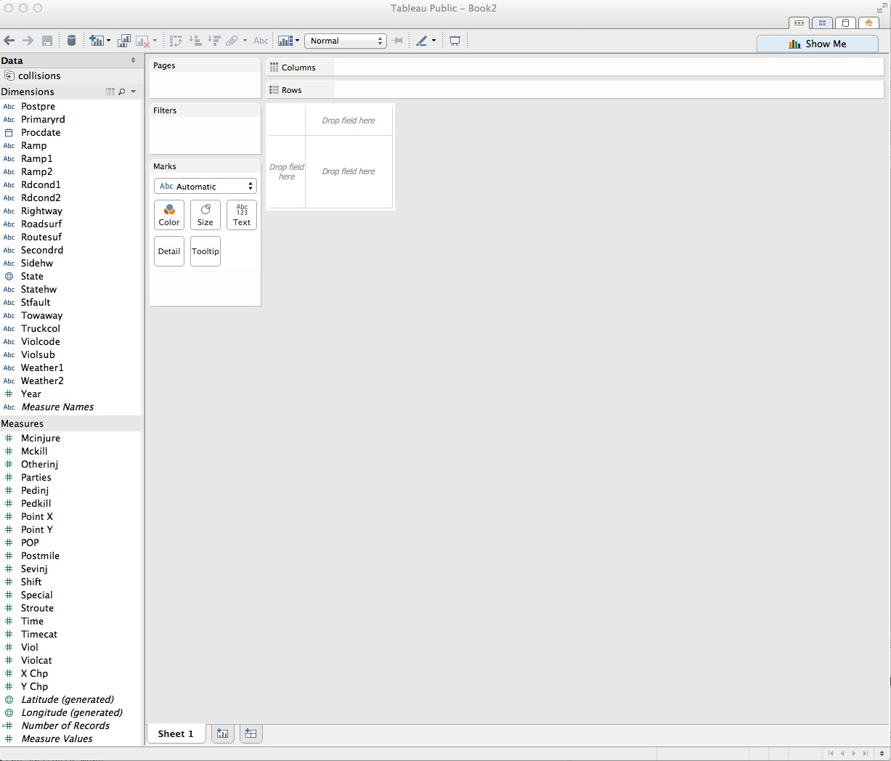

### Dimensions and measures: categorical and continuous

Notice that Tableau has divided the fields into `Dimensions` and `Measures`. If the fields are all classified correctly, these broadly correspond to categorical and continuous variables. Dimensions are fields containing text or dates, while measures contain numbers.

### Columns and rows: X and Y axes

The starting point for creating any chart or map in Tableau is to place fields into `Columns` and `Rows`, which for most charts correspond to the X and Y axes, respectively. When making maps, longitude is the X axis and latitude the Y. If you display the data as a table, then these labels are self-explanatory.

### Start by asking questions

Good data journalism and visualization projects rarely emerge from poking around aimlessly within a dataset. Instead, formulate questions and then try to answer them from the data. These are the questions that will drive our analysis today: Where did the collisions occur? How many people were killed or injured in each one? When did the collisions occur (both by year and day of the week)? In which collisions were cyclists or pedestrians involved?

### Map the position of each collision

We will start by placing all the collisions as points on a map. From the codebook, notice that longitude and latitude are in the fields `Point X` and `Point Y`. We need to tell Tableau that this is the case. Select `Point X`, click on the little downward-pointing triangle that appears, and select `Geographic Role>Longitude`. Similarly, tell Tableau that `Point Y` is latitude. Both should now be labeled with the globe symbol.

Drag `Point X` into Rows and `Point Y` into columns. If Tableau does not recognize that you want a make a map, click on `Show Me` and then hover over and click on `symbol map`. `Show Me` reveals the types of chart that Tableau can draw, and is your go-to resource when experimenting with different visualization possibilities. Click on it again to hide the options.

The screen should now look like this:

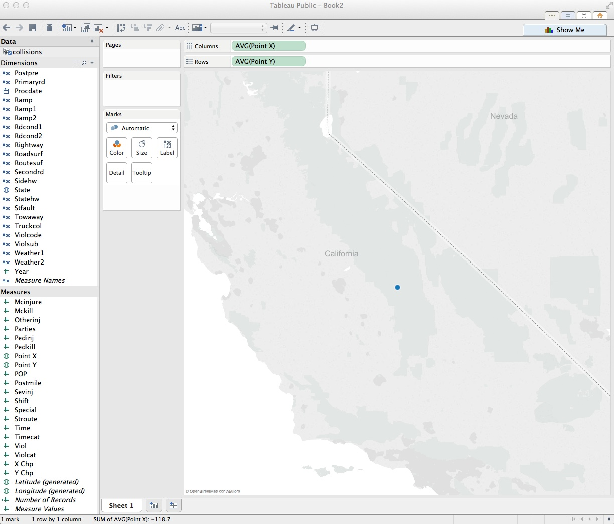

Why is there a single point, somewhere in the Sierra Nevada? Look at `Columns` and `Rows`, and notice that, by default, Tableau has aggregated all the longitudes and latitudes, calculating an average. Turn off that aggregation by selecting `Analysis>Aggregate Measures` from the top menu.

There should now be two clusters of points, one paradoxically lying just off the coast of West Africa. Hover over these points, and notice that these have latitudes and longitudes of zero.  We can examine this data by right-clicking on the dots, selecting `View Data` and clicking the `Underlying` tab. These are collisions for which there is no latitude and longitude in the dataset, sitting at what map-makers sometimes call "null island."

Ideally, we would want to look at the addresses for these collisions and assign their locations -- an example of the data "cleaning" that is often required before analyzing and visualizing a dataset. But for now we will ignore them and move on.

Click on the rectangle symbol on the controls at the top left of the map, then draw a small rectangle with your mouse around the points in Berkeley to zoom in. You may need to do this a few times to get the points filling most of the map. You can also pan the map by clicking on it and holding, then moving your mouse (unfortunately, this doesn't well work with a trackpad). On the way in, you'll notice a couple of points outside of Berkeley -- more data cleaning required there!

The map should look something like this:

Tableau's default basemap is very stripped down, but we can add more features. Select `Map>Map Options` form the top menu, and check `Streets and Highways`.

The map should now look like this:

### Encode other variables using area and color

Close the `Map Options` panel to show the variables in the dataset once more. `Injured` is a continuous variable giving the number of people injured in each collision. Drag and drop it onto `Size`. The points will resize, and a legend will appear -- notice that Tableau's default behavior is to size cicles correctly, by area:

`Crashsev` is a categorical variable giving the severity of the collision: fatal and three levels of injury, rated by of the most serious injury suffered. To correct the data type, select `Crashsev`, then click on the downward-pointing triangle and select `Convert to Dimension`. It will now move to the Dimensions panel. Hover again and select `Change Data Type>String`. It should now have an `Abc` label, designating it as text.

Drag and drop `Crashsev` to `Color`. The map should now look this:

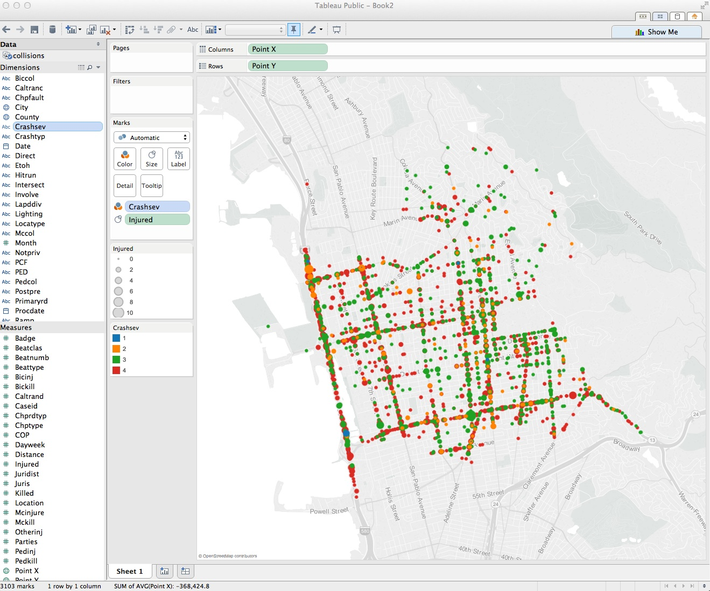

What if you want to highlight the difference between collisions in which people died, and all of the others? First remove `Crashsev` from `Color`, either by dragging and dropping it back into the `Data` panel, or using the back arrow at top left. These controls are useful for undoing failed experiments, and stepping back and forth through your actions with a dataset.

Now click on `Crashsev` and select `Create Group`. At the dialog box, select 1, click `Group` and call it "Fatal." Select 2, 3 and 4, click `Group` and call this group "Injuries only." Name the new variable "Crash severity." When the dialog box looks like this, click `OK`:

Drag the new variable to `Color`. The map should look like this:

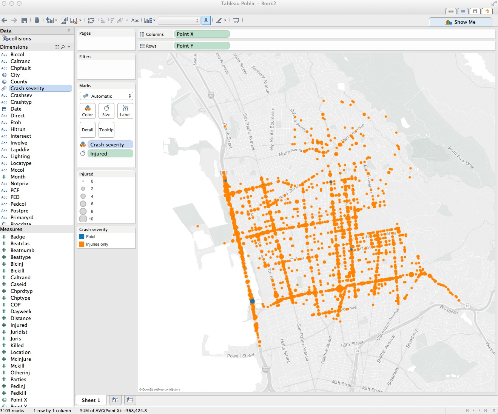

Tableau's default color scheme for categorical variables has picked blue and orange, on opposite sides of the color wheel. That's OK, but the vibrant orange tends to dominate the blue, so let's change the colors.

Under `Marks`, click `Color>Edit Colors`, and double-click on the color square for "fatal" to call up a color picker: the first three options allow you to use a color wheel, RGB sliders, and a color selector, where you can choose the `Web Safe Colors` palette to pick colors by their HEX values. Type a value of `ffcc00` for a yellow, highlight it in the panel above and click OK. Repeat the process for injury crashes, giving them a HEX value of `999999`, for a gray. Click `OK` again to update the color scheme and exit the dialog box.

This is better, but is clear from reviewing the map that some circles lie over the top of one another. Adding some transparency will help reveal overlapping circles. Click on `Color`, and reduce the transparency to 60%. Also add a border to help delineate each circle, selecting the gray at the base of the color ramp that starts with black.

The map should now look like this:

### Create a new calculated field, and resize the circles

Reviewing the map again, there is still a problem with the fatal crashes -- any with deaths but no injuries are so small they are just about invisible. It makes little intuitive sense to de-emphasize crashes in which someone died, compared to those causing a single injury. We can fix that by resizing the circles to reflect the total number of deaths *and* injuries.

Drag `Injured` back to the `Data` panel, and notice that more fatal crashes appear. Then from the top menu select `Analysis>Create Calculated Field`, and fill in the dialog box as follows, calling the new field `Killed and injured`, then click `OK`:

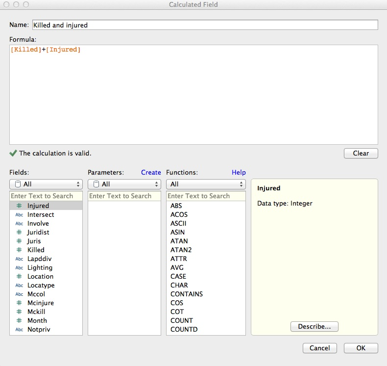

Now drag the new field to `Size`, and the map should look like this:

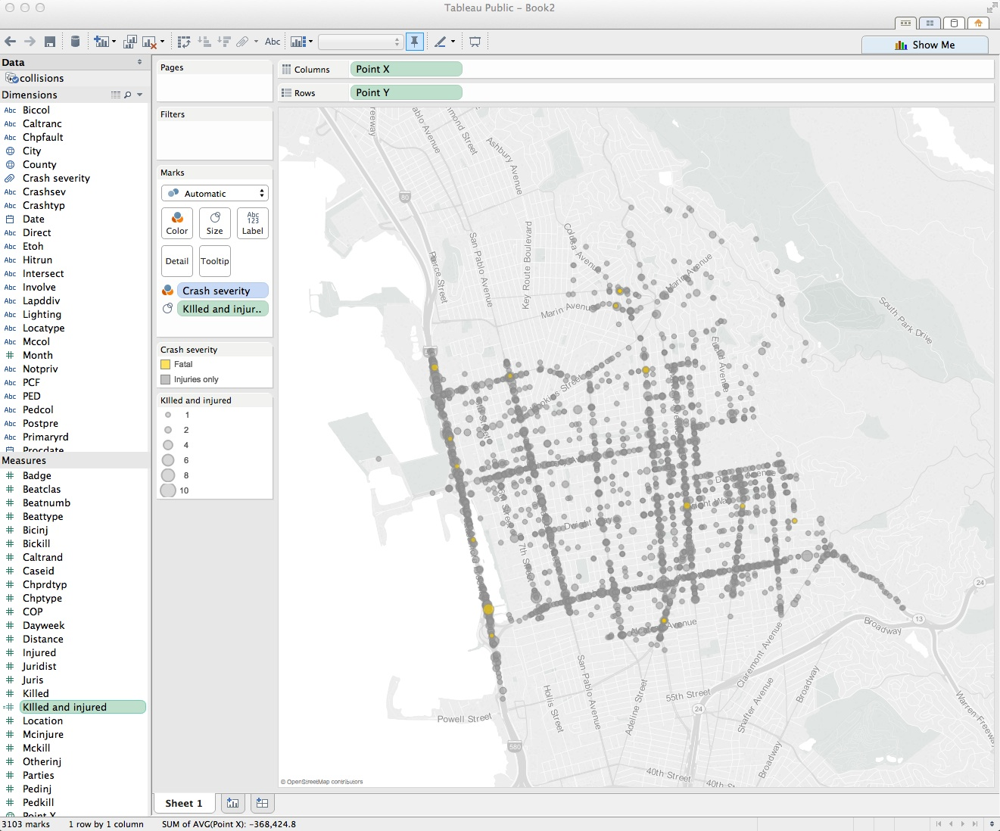

Now hover over the legend, click on the small downward-pointing triangle and select `Edit Sizes`. At the dialog box, check both `Start value in legend` and `End value for range`. This will ensure that the legend and sizes remain fixed when we later apply filters to the data.

### Edit the tooltips

Hover over one of the points on the map, and see that the tooltip displays values for each of the variables we have added to the map so far. The most useful *additional* information to provide in a tooltip, not evident at first glance, is the date of each collision, and a breakdown of the numbers killed and injured, so drag `Date`, `Injured` and `Killed` to `Tooltip`. Click on `Tooltip` and edit at the dialog box to remove the other variables. Also uncheck `Include command buttons`. This turns off some additional Tableau tooltip functionality, giving a plain tooltip:

We can change the format of the dates shown. Click on `Date` in the `Dimensions` panel, select `Default Properties>Date Format>Standard Long Date` and click `OK`. Hover over a point to view the new format in the tooltip.

### Save to the cloud

Right-click on `Sheet 1`, select `Rename Sheet`, and call it "Map".

Having finished the map, now is a good time to save our work. From the top menu, select `File>Save To Web`. At the logon dialog box enter your Tableau Public account details, give the Wookbook a suitable name and click `Save`. When the save is complete, you can close that window.

### Make a column chart showing collisions by year

From the top menu, select `Worksheet>New Worksheet`. Now we will create a column chart showing the number of collisions by year. `Year` is among the variables in the dataset, but we will instead put `Date` on the X axis by dragging it into `Columns`, to demonstrate Tableau's flexibility in working with dates and times.

As a default, Tableau should select `YEAR(date)`, which is what we require here. Click on the downward-pointing triangle to see the other available options.

The total number of collisions is given by a simple aggregation of the data: a count of the unique `CaseID` numbers. Drag `CaseID` to `Rows`. Tableau should default to a line graph, aggregating the data by adding up the `CaseID` numbers: `SUM(CaseID)`. To change the aggregation, click on the downward pointing triangle to the right and select `Measure>Count`.

Under `Marks`, change `Automatic` to `Bar` to switch from a line chart to a bar/column chart, which should look like this:

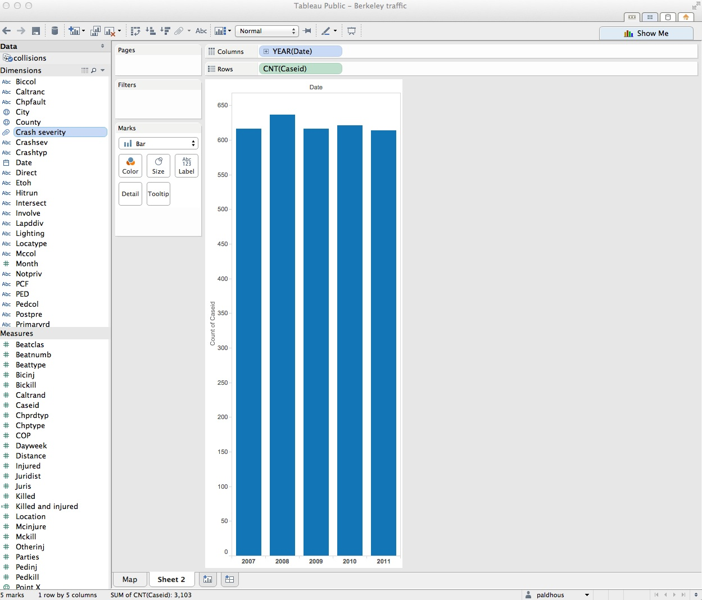

Drag `Crash severity` to `Color`, and notice how the color scheme we set on the map for this variable carries through to the new sheet. Select `Color>Edit Colors` and adjust the transparency and add a gray border to the bars, as we did for the circles on the map.

Right-click on the Y axis and select `Edit Axis`, and edit the dialog box as follows. Selecting a `Fixed` axis will prevent it from resizing when we later filter the data:

Disable tooltips for the column chart by clicking `Tooltip`, deleting everything, then clicking `OK`.

The label "Date" at the top of the chart adds little, so right-click on it and select `Hide Field Labels for Columns`.

Reviewing the column chart, there are possibilities to remove some chart junk and improve readability. We don't need the rectangle surrounding the chart, and some horizontal grid lines would help users estimate the data values.

From the top menu, select `Format>Borders`. In the `Sheet` tab in the `Format Borders` panel, select `Row Divider>Pane>None` and `Column Divider>Pane>None` to remove the borders.

Next, from the top menu, select `Format>Lines`. In the `Format Lines` panel, select the `Rows` tab and select a solid `Grid Line`. The tick marks are now redundant, so select `Axis Ticks>None`. Switch to the `Columns` tab and remove the tick marks from the X axis, as well.

Rename the sheet as `Column chart: Years` and save to the web as before.

The bar chart should look like this:

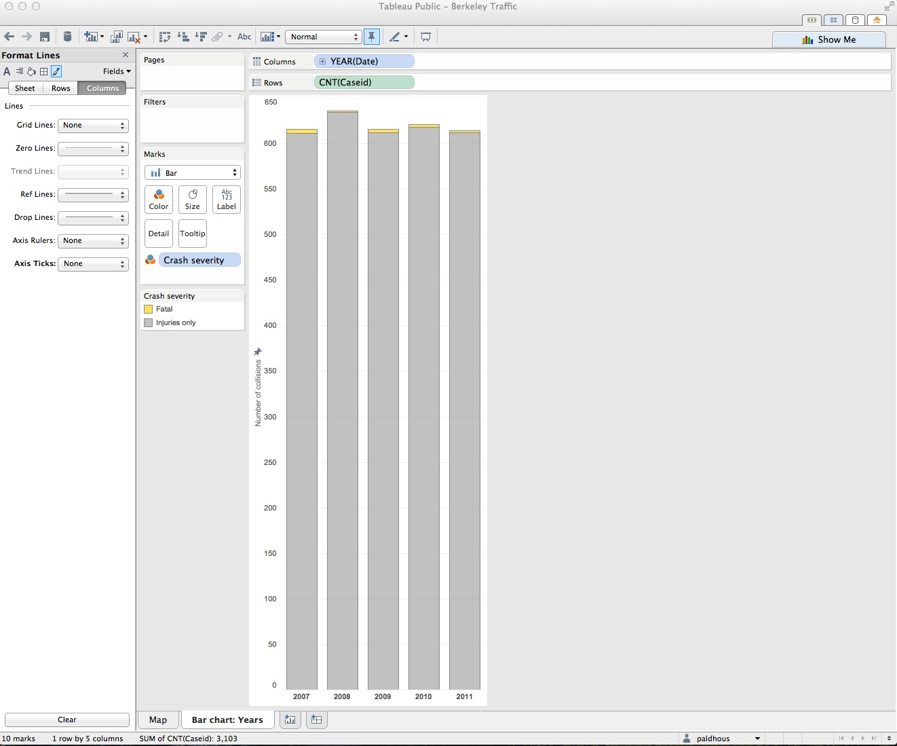

### Make a column chart showing collisions by day of the week

We don't need to draw this chart from scratch, because it can be made with just a simple edit from the previous chart. Click on the `Column chart: Years` tab and select `Duplicate Sheet`. In `Columns`, click on the downward-pointing triangle for `YEAR(Date)`, and select `More>Weekday`. Edit the axis so that the `Fixed` range ends at 550.

Giving the full name for each day is unneccesary. In the `Format Lines` panel (open it again if you have closed it), select `Fields>WEEKDAY(Date)`. Select the `Header` tab and select `Dates>Abbreviation`.

Close the `Format` panel, rename the sheet `Column chart: Weekday` and save to the web as before.

The chart should look like this:

### Create filters for the data

We will now filter the data to look at collisions in which pedestrians or bicyles were involved. Go back to the Map worksheet. `Pedcol` is the first relevant variable; to make it display intuitively, click on it and select `Create Group`. Edit the dialog box to look like this, and click `OK`:

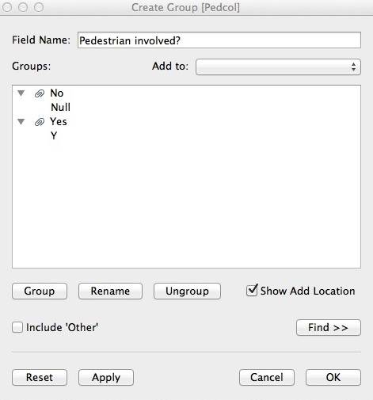

Repeat the process for `Biccol`, calling the new field "Cyclist involved?" Now drag each of the new fields to `Filters`. At the dialog box, select `All` and then `OK`:

This has created the filters; now we need to create the controls. Hover over each variable in `Filters`, click on the downward-pointing triangle, and select `Show Quick Filter`. A filter control should now appear to the right of the chart. The default is a series of check boxes, which isn't really suitable here, but we can change each control by hovering over its title and selecting `Single Value (Dropdown)`.

Now hover over each variable in `Filters` and select `Apply to Worksheets>All Using This Data Source`. This will allow the filters to control the map and both charts in unison. Set both filters to the starting state of `All`, and the map should look like this:

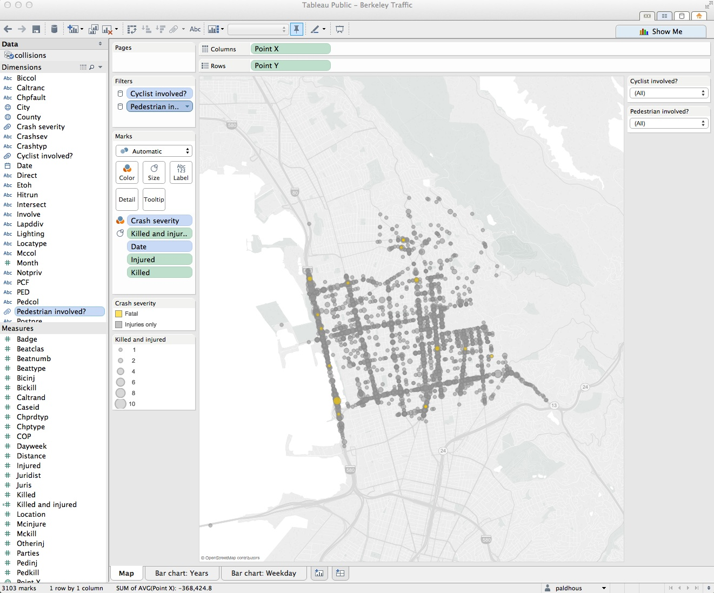

### Combine the worksheets into a dashboard

From the top menu, select `Dashboard>New Dashboard`. We can set the size of the dashboard to fit the web page on which we want to embed it, and this can be a `Range`, giving some basic responsive design. To see how this works, change the `Max` width (w) to 1000 pixels, allowing the dashboard to expand to fill most of a standard desktop computer screen.

Drag `Map` into the dashboard. The default title of "Map" isn't very informative, so right-click on that and select `Hide Title`.

When adding sheets to the dashboard, You can make them `Tiled` or `Floating`, which allows new items to be placed over one another. Here we will stick with the `Tiled` option. Drag the weekday bar chart to the lower half of the map. Drop it when you see a gray rectangle in this position. Drag the year bar chart to the right of the weekday bar chart

Notice that Tableau allows you to drop various other items into a dashboard: horizontal and vertical containers, text boxes, images, web pages and blank space. Drag a `Blank` between the two charts, and reduce its size to provide some modest padding between the two. This works like adjusting the size of normal windows on your computer.

Now is the time to adjust the sizes and tweak the formats of the items on the dashboard to give a pleasing display. You may need to rotate the X axis labels on the weekday bar chart: right-click on any of them to call up the `Rotate Label` option. You may also need to adjust the position of the X axes on the two bar charts so that they align. I also suggest going back to the sheet for the year bar chart, selecting `Size` and adjusting the slider to make the width of the bars on the dashboard match those of the other chart.

All of this will take some trial and error, and you may also need to pan and zoom the map to keep all the points nicely in view.

From the top menu select `Dashboard>Show Title`, replace `<Sheet Name>` with an appropriate title/subtitle and adjust the alignment, fonts and styles as desired.

Rename the dashboard as `Berkeley traffic accidents (2007-2011)`, save to the web, and note that the resulting window provides code to embed the interactive on your website.

The finished dashboard should look something like this:

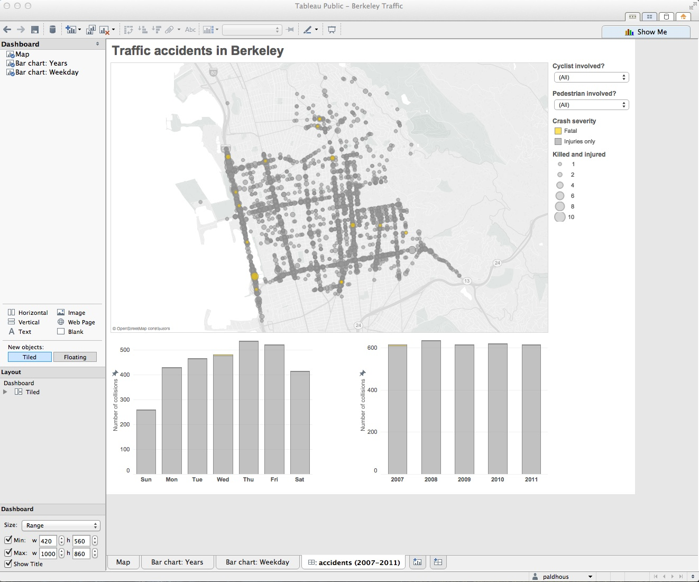

Take some time now to explore the data using the filters.

### From dashboards to stories

Tableau also allows you to create stories, which combine successive dashboards into a step-by-step narrative. Having already made a dashboard, you will find these simple and intuitive to create. Select `New Blank Point` to add a new scene to the narrative.

### Assignment

- Formulate some more questions about the Berkeley traffic accident data.
- Produce a second dashboard that addresses these questions.
- Combine the two dashboards into a Tableau story.
- Email your questions, and the url for the finished visualization on the Tableau website, to me. Also suggest any other data, not available in the dataset, that might improve the analysis.

### Further reading/viewing

[Tableau Public training videos](http://www.tableausoftware.com/public/training)

[Gallery of Tableau Public visualizations](http://www.tableausoftware.com/public/gallery/all): You can download any of these examples using the links at bottom right and open the files (which will have the extension `.twbx`) with Tableau Public to see how they were put together.

[Tableau Public Knowledge Base](http://www.tableausoftware.com/public/knowledgebase/all): Useful resource with the answers to many queries about how to use the software.

