# Polishing static graphics

As we've seen, it is possible to customize many aspects of graphics with code in R. However, to polish graphics to publication quality, to adjust to a particular publication's house style, and to add specific annotations, it usually makes sense to finish the work using a vector graphics editor.

### Vector graphics vs. raster images

Vector graphics are defined in terms of elements such as points, lines, curves and shapes that can be assigned stroke colors, fill colors, transparency and so on. All of this information is saved into the file, and the graphic will rescale without losing quality when enlarged.

This contrasts with raster images, which are saved as grids of pixels, with each pixel having defined color, transparency and so on. Common formats include [PNGs](http://www.libpng.org/pub/png/), or portable network graphics, and [JPEGs](http://en.wikipedia.org/wiki/JPEG). You will probably have encountered the latter in the context of digital photography, where they are used to compress [Raw](http://en.wikipedia.org/wiki/Raw_image_format) images, giving an acceptable trade-off between file size and image quality. When a raster image is enlarged, it becomes noticably "pixelated" and loses quality.

Because all of the elements of a vector graphic are represented quantitatively, or by descriptive labels such as HEX codes for color, they can be edited at will --  line thicknesses and stroke colors can be changed, for example, or the dimensions of a rectangle altered. So until you have finished working with a graphic, keep it in a vector format.

Digital [PDF](http://www.adobe.com/products/acrobat/adobepdf.html) documents [support vector graphics](http://en.wikipedia.org/wiki/Portable_Document_Format#Vector_graphics), which is why we exported our charts from R as PDFs, rather than as PNG or JPEG images.

The other main vector image format you are likely to encounter is [SVG](http://en.wikipedia.org/wiki/Scalable_Vector_Graphics), for scaleable vector graphics. This is an image format based on XML -- to see how SVG douments are structured, open an SVG file in a text editor.

Most modern web browsers [support SVG rendering](http://caniuse.com/#feat=svg). However, many digital publications, when displaying static charts online, convert to JPEGs or PNGs with appropiate resolution, as these can be displayed by any browser or device.

### Introducing Inkscape

**[Inkscape](http://www.inkscape.org/en/)** is a free and open-source vector graphics editor, which has similar capabilities to the commercial [Adobe Illustrator](http://www.adobe.com/products/illustrator.html). It can be used by graphic artists to draw sophisticated vector graphics from scratch. Those skills are beyond the scope of this class. Instead, we will explore how to use some of Inkscape's functions to edit, polish and annotate the graphics we earlier made in R.

Inkscape's native file format is SVG, however it can work happily with vector graphics saved in PDFs. On Mac OS X, Inkscape relies on [XQuartz](http://xquartz.macosforge.org/landing/) (also known as X11) for its graphical user interface.

When you launch Inkscape, XQuartz should also open, and you should see a window like this:


Notice the the main menu options appear within the app window, rather than on your main menu bar as for most Mac OS X applications.

Quit Inkscape and XQuartz.

### Install an Inkscape extension to replace fonts

[This repository](http://wiki.inkscape.org/wiki/index.php/Extension_repository) lists extensions to Inkscape's basic functions. Although they are nowhere near as numerous as the packages that extend R's functionality, if there is a particuar task you need to perform in Inkscape that the software seems not to accommodate, it is worth looking here.

Before starting to edit our graphics, we will install an extension to allow us to replace all of the fonts in a graphic at one go. Follow the [Replace Font](https://code.google.com/p/inkscape-replace-font/) link from the extensions repository:


Download the latest version from the `Download` tab, and unzip the folder. Notice that it contains two files, `repace_font.inx` and `replace_font.py`.

Open your `Applications` folder, right-click on the Inkscape icon and select `Show Package Contents>Contents>Resources>extensions`. Copy the two files from the downloaded folder into the `extensions` folder. Now launch Inkscape once more.

### Edit the stacked column chart of presidential approval ratings

First open the PDF file using `File>Open` from the top menu. Accept the default options and click Click `OK` at this dialog box:

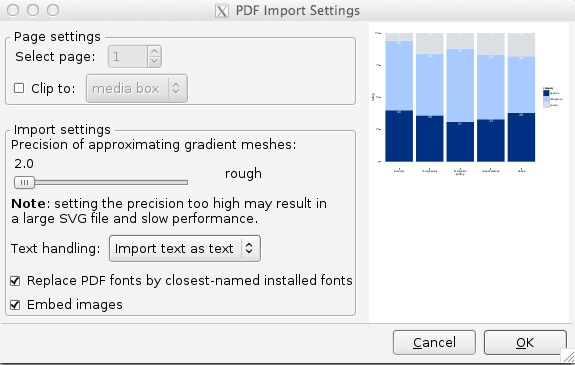

Before we start editing, save the file under a new name by selecting `File>Save As`. Then make you you are using the `Select and transform objects` tool by clicking its icon (you can also use the shortcut `F1`):


Click on any bar in the chart, and notice that the main chart area is selected, appearing as a rectangle with arrows around its perimeter. This is because all of the elements within the main chart area are grouped together as a single "object":


To make the individual chart elements available for editing, select `Object>Ungroup` from the top menu, until each object is selected individually, as shown belo. (You will often need to do this twice for ggplot2 charts saved from RStudio.)


At this point, click near the top of the chart to select the blank panel denoting the main chart area and delete it. Click again near the top of the chart and notice that this selects a blank panel covering the entire page. Delete this as well. Removing these blank chart elements will help with later editing, allowing us the select the objects we want more easily.

You may want to change from R's default font, which is `Helvetica`. Select the `Create and edit text objects` tool using the shortcut `F8` or by clicking its icon:

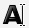

Look at the available fonts by opening the dropdown menu that should have appeared in the main toolbar:

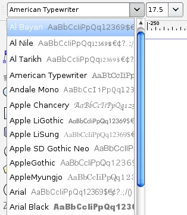

Now let's change to the `American Typewriter` font, using the extension we installed earlier. From the top menu, select `Extensions>Text>Replace font ...`. The following dialog box should appear:

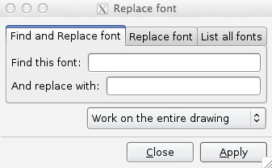

Find out what fonts are present in the document using the `List all fonts` tab, then in the `Find and Replace font` tab replace `Helvetica` with `American Typewriter`. Note that you can apply this operation to `Work on selected objects only` or `Work on the entire drawing`. We will do the latter.

In this case the legend title did not change, because its font is `Helvetica-Bold` rather than `Helvetica`. We will simply select and delete it, as it's not really necessary to understand the graphic.

(Note we could also have used the ```Replace Font``` tab to replace all of the fonts in the document or selected object.

Now use the `Create and edit text objects` tool to change the Y axis label from "Rating" to "Percent." Delete the "Policy" label from the X axis.

Then go back to the `Select and transform objects` tool, click on the legend label "approve", and select `Extensions>Text>Title Case` from the top menu. Repeat for the other labels on the legend.

The tick marks on the X and Y axes don't add much. Still using the `Select and transform objects` tool, click on one of them, and all the tick marks on that axis should be selected as a group. Delete and repeat for the tick marks on the other axis.

Now let's work on the number labels on the columns. Select and delete each of the "Unsure" values on the gray sections. Then select one of the "Disapprove" number labels and change its `Y` coordinate to 500:


Notice that in addition to `X` and `Y` coordinates, objects also have a height (`H`) and width (`W`). These can be changed to alter an object's dimensions. You can click on the padlock icon to keep the same aspect ratio and have both `H` and `W` change in proportion to one another.

Change all other "Disapprove" number labels' `Y` coordinates to 500 and all the "Approve" number labels `Y` coordinates to 200.

Next let's swap the positions of the "Foreign policy" and "Immigration", so that the former sits next to the two columns showing approval ratings for specific aspects of foreign policy. Using the `Select and transform objects` tool, draw a rectangle around the "Foreign policy" column and select `Object>Group` from the top menu:


Repeat for the "Immigration" column. Having grouped each column into a single object, now we can move them around. Note the `X` coordinates for both. Move the "Foreign policy" column over to the far right of the chart by selecting it changing its `X` coordinate to 700. Select the "Immigration" column and move it to the `X` coordinate formerly occupied by the "Foriegn policy" column. Then move the "Foreign policy" column to the `X` coordinate formerly occupied by the "Immigration" column.

Now we need to fix the labels for the columns. Select one of the labels, and you will see that they are grouped into a single object. So ungroup by selecting `Object>Ungroup` from the top menu. Then select each column label and move the label text boxes manually into the correct position, using your keyboard's arrow keys.

Both the X and Y axis labels are rather far from the chart. First group the X axis labels once more, then move them upwards. Select the X axis labels, which should still be grouped, and move them to the right.

The chart should now look like this:

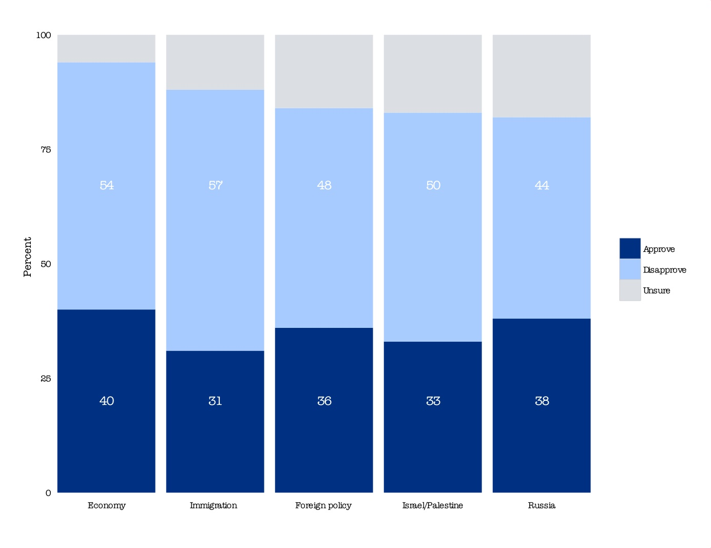

Here we've altered fonts and moved text labels around to demonstrate Inkscape's functionality. Often you may want to delete and re-enter text labels exported from R to get better formatting. Look, for example, at the letter spacing on all of the column labels, and the color legend, and compare to "Percent" on the Y axis, which we labelled manually.

Here is the chart relabelled, and with all of the text labels given a font size of 15, to match the Y axis label:

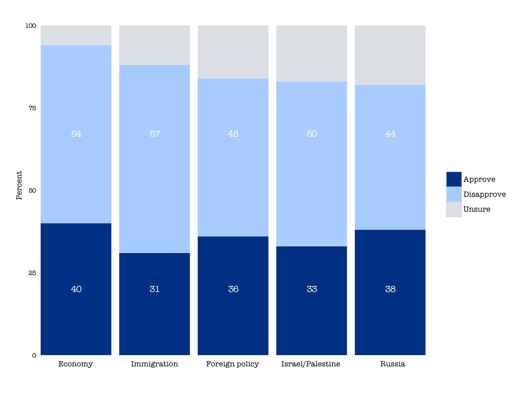

What if the color scheme needs to be changed at a late stage? We don't really want to go back to R and start again. So let's change the colors from blues to greens in the edited chart.

Although in this case it would be simple to pick a couple of greens from Inkscape's default palette, displayed at bottom, we will take this opportunity to demonstrate how to import a palette from ColorBrewer. Save the chart, and close Inkscape.

Now go to [ColorBrewer](http://colorbrewer2.org/), select 3 data classes (we'll only use two of these) and the `Single hue` greens palette. Then click `EXPORT` and follow the `GIMP color palette` link:

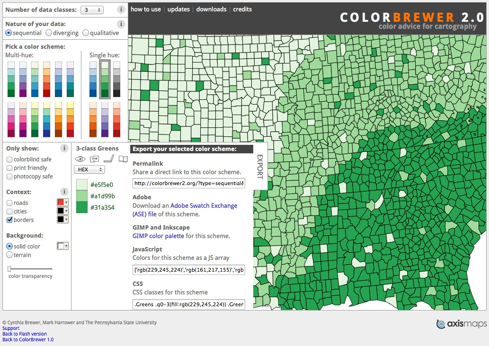

That should take you to a page with the following text:

```txt
GIMP Palette
Name: CB_seq_Greens_3
Columns: 3
# This color palette was developed by Cynthia Brewer (see http://colorbrewer2.org/).
229 245 224  seq_Greens_3_01
161 217 155  seq_Greens_3_02
 49 163  84  seq_Greens_3_03
```
Right click and save this code as a file with a `.gpl` extension

Open your `Applications` folder, then right-click on the Inkscape icon and select `Show Package Contents>Contents>Resources>palettes`. Copy the saved palette into the `palettes` folder.

Now relaunch Inkscape and reopen the edited stacked bar chart. The items may all be grouped; if so select `Object>Ungroup` to allow them to be selected individually.

Select one of the light blue sections, and notice how the same color appears next to `Fill` at bottom left. Click on this block of color, or select `Shift+Ctrl+F` to call up the `Fill and Stroke` panel:


(Note that when working with Inkscape, `Ctrl` is used instead of the Apple `Command` or `⌘` key. So paste, for example, becomes `Ctrl+V`.)

Notice that the fill tab contains several color picker tabs, with the default giving RGB colors. Notice also the HEX code in the `RGBA` box. We will need this code to replace the blue color, so make note of the first six digits: `aaccff`. (We can ignore the last two digits, because they refer to alpha, or transparency.)

Now let's call up our new color palette. Click the **`<`** icon to next to the available colors at bottom right, and then select the `CB_seq_Greens_3` palette. The three greens should now appear at bottom.


Again, select one of the light blue sections, then click in the middle of the three greens in the palette below. Note the HEX value for this green: `a1d99b`.

Now we will replace the blue with the green *en masse*. Select all of the items in the document by drawing a rectangle around everything with the `Select and transform objects` tool. Then select `Extensions>Color>Replace color...`, fill in the HEX values and click `Apply`.

Repeat the process to replace the darker blue and with the darker green.

(Although here we imported the palette, to demonstrate how to use Inkscape's palette options, we could have simply noted the HEX values of the desired colors from ColorBrewer and replaced the colors without the import.)

The final chart (minus a title, source information, and other annotation that would be needed for publication) looks like this:

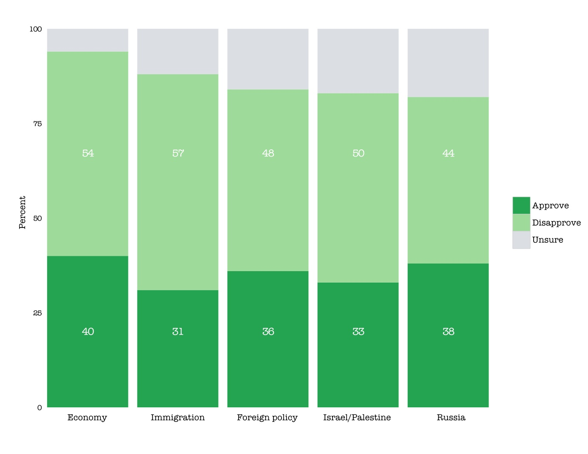

Save and close the PDF.

### Edit and annotate the scatter plot showing the gender pay gap

For this chart, we will explore `Layers` in Inkscape so we can edit and display different variants of a chart in the same document.

Open the PDF and save it under a new name in `Inkspace SVG` format. This is important, as layers created in a document will be lost if it saved as a PDF.

Using the `Select and transform objects` tool, click at the very top of the chart to highlight the large blank panel surrounding the chart:


Delete this panel, then click on the main chart area and select `Object>Ungroup` twice to fully ungroup the components of the chart.

Now select a blank area of the chart to highlight the blank panel denoting the main chart area, as shown:

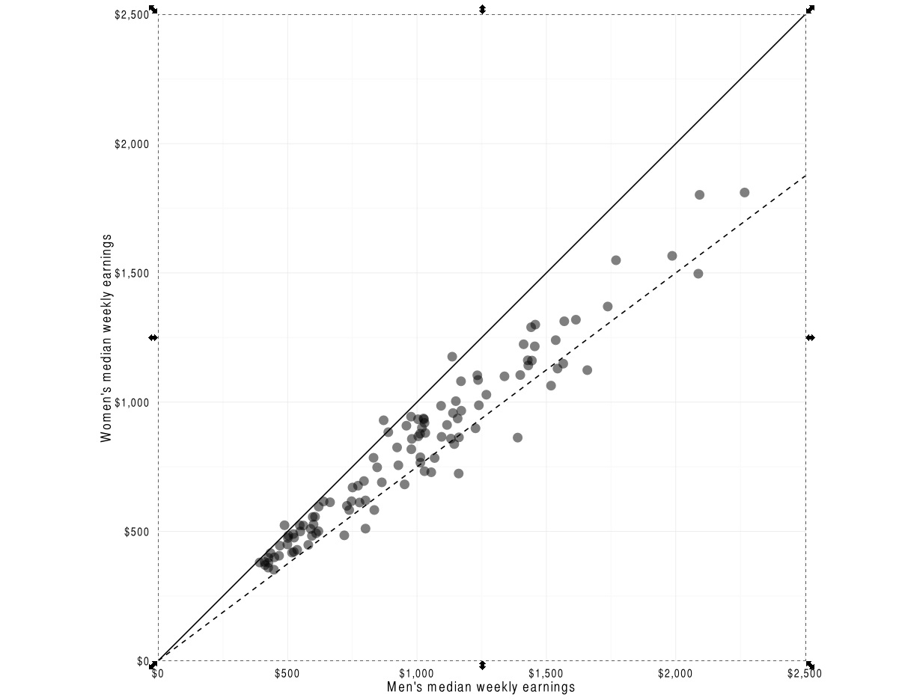

Delete this panel, then select the solid line of equal pay. The selected item should look much like the panel we deleted, as it occupies the same area. Select `Edit>Cut` from the top menu and the line should disappear.

Now select `Layer>Add Layer` from the top menu or use the shortcut `Shift+Ctrl+N` to create a new layer, filling in the dialog box as follows:


Open the `Layers` panel using the shortcut `Shift+Ctrl+L` and check that the new layer is selected:


Now select `Edit>Paste In Place` from the top menu and the line will appear in the new layer. Notice how clicking the eye symbol for this layer will turn its visibility on and off.

Repeat the process for the 25% pay gap line, giving that layer a suitable name.

Now, using the `Select and transform objects` tool, carefully draw a rectangle around the points until thay are all selected:


As before, move these points into a new layer, calling it `Equal pay points`.

Next edit the color of these points. Select them in the new layer, and make them lighter by clicking on an appropriate gray color from the default Inkscape palette.

Now select the layer and from the top menu select `Layer>Duplicate Current Layer`. Click on the new layer in the Layers panel and rename it as follows.


To complete our set of layers, create two more blank layers, calling them `Equal pay labels` and `25% pay gap labels`.

Rename the original layer as `Base chart` and organize the order of the layers as desired using the green arrow controls in the Layers panel. Layers nearer the top of this list will be drawn over the top of those lower down. I suggest the following arrangement for this chart:


Click on the eye icons for all of the layers except the `Base chart` so that only it is visible. Now select the currency labels for each axis, and ungroup both of them. Having done so, delete both `$0` labels and also delete the grid lines sitting on the X and Y axes.

We can now add annotations to each of the layers and color selected points, to mimic the three graphics drawn from this data seen in week 2:

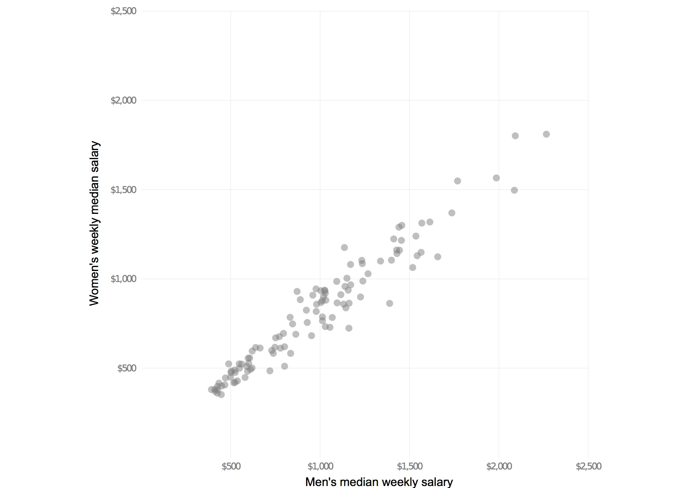


When doing this, add the labels for the lines in their respective line layers and all the other annotations in the two labels layers. The reasons for doing this will become obvious as you turn the visibility of the layers on and off to recreate the views above.

To align the line labels to the angle of the lines, select the text you have entered and click it again to display the following arrows, which can be used to adjust orientation:

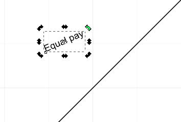

Save each view as a PDF with a new name and when you have finished save and close the document as an `Inkscape SVG`.

### Edit the bar chart showing Pfizer's payments to doctors

We will edit this chart to mimic aspects of the look of the chart of airline fatalities shown in week 2:


We will apply spot color to the bar for Gerald Michael Sachs, and use white lines over the bars rather than conventional grid lines beneath them.

Again, open the PDF and save it under a new name. And as before, click right at the top of the chart using the `Select and transform objects` tool to select and then delete the blank panel covering the entire page. Then ungroup the chart elements in the main chart area.

Select the first vertical grid line from the left and from the top menu select `Object>Raise To Top`. It should now move above the bars. Repeat for all the other vertical grid lines, so the chart looks like this:


Now let's edit these lines to give them all equal weight. Select one of the thicker grid lines and use the shortcut `Shift+Ctrl+F` to open the `Fill and Stroke` panel. Select the `Stroke Style` tab and see that the line's width is 1.325 pixels:


Notice also the other options for customizing lines, which can be used to make dashed lines, arrows and so on.

Now select each of the thinner grid lines and set their width to 1.325 pixels, also.

Having done that, select the gray background, by clicking anywhere within it, and delete it. You will then notice that some of the grid lines are actually a subtle shade of gray. To make them white, select each one, then in the `Fill and Stroke` panel select the `Stroke paint` tab and alter the color to white:

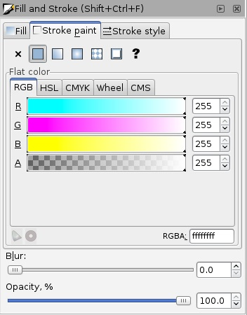

Delete the tick marks from both axes and the chart should look like this:

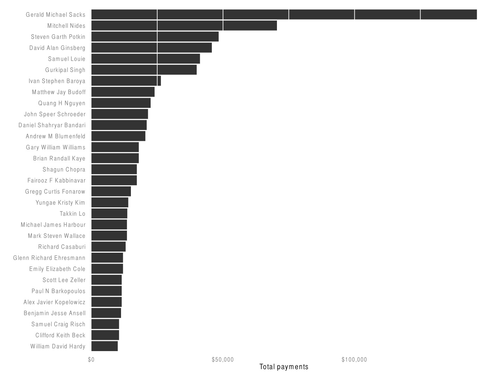

Now carefully draw a rectangle round all the bars with the `Select and transform objects` tool and change their color to a light gray:

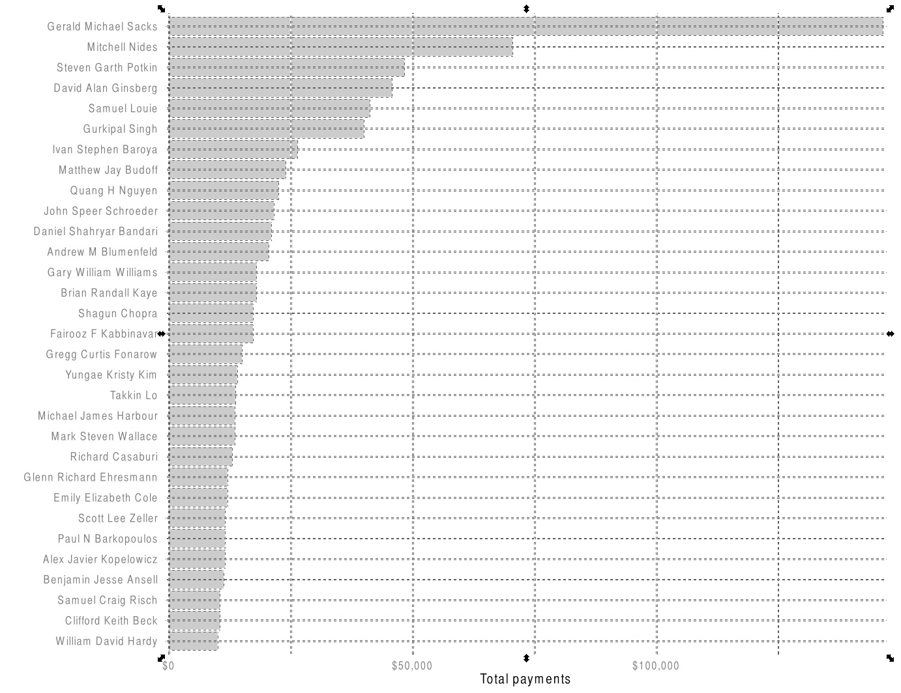

Select the bar for Gerald Michael Sachs and give it a distinctive spot color. Then move the currency and axis labels to the top of the chart. At this point, the axis label probably lies off the page. So select every element of the chart, group them all together, and use the shortcut `Shift+Ctrl+A` to open the `Align and Distribute` panel. Position the grouped object by clicking the `Center on horizontal axis` icon:


The finished chart should look like this:


Save and close the PDF.

### Edit the chart showing the different development trajectories of the BRICS nations

Open the PDF file and again save under a new name as an `Inkscape SVG`, as we are going to create a series of layers. As before, select and delete the blank panel covering the entire page, and then ungroup the main chart area.

Select `Layer>Duplicate Current Layer` from the top menu and call this new layer `Base chart`. Use the eye icon in the `Layers` panel to hide the original layer, and in the `Base chart` layer, select the gray background and `Edit>Cut` from the top menu to move it to the clipboard. Then using the `Select and transform objects` tool, carefully draw a rectangle round all of the five countries' trajectories:

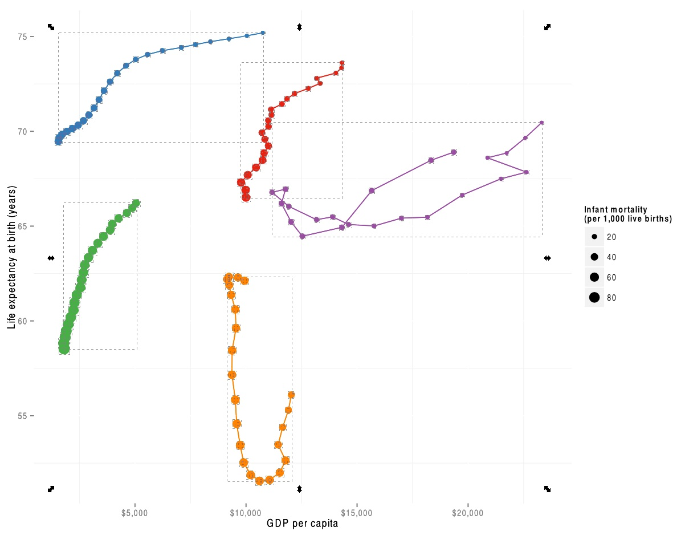

Delete these trajectories, then select `Edit>Paste in Place` to restore the gray background. Select `Object>Lower to Bottom` to move it back beneath the grid lines. Then delete the tick marks from both of the axes.

Now using the `Select and transform objects` tool draw a rectangle around the legend and its title and the panel in which they sit:


Select`Object>Group` to turn them into a single object, then move this over the chart, until the layer looks like this:


Turn off the visibility of the `Base chart` layer and make the original layer visible once more. Delete the gray chart background, then select the five countries' trajectories, as above, and select `Edit>Cut` to move them to the clipboard. Create a new layer, call it `Brazil` and select `Edit>Paste in Place` to paste the trajectories into that layer. Create a new layer called `China` and paste the trajectories into there as well. Repeat until to you have a layer for each country, for now containing all of the trajectories.

Having done this, delete the original layer by selecting it in the `Layers` panel and clicking the blue minus symbol.

Make all the layers invisible apart from one country layer and then select and delete all the trajectories apart from the one for country concerned. Repeat for each country until each country layer contains only one trajectory. As you select and delete the other trajectories, take care not to inadvertently delete any data for the country you need to retain!

Using the `Select and transform objects` tool, select all the objects across all the layers, and call up the `Align and Distribute` panel using the shortcut `Shift+Ctrl+A`. Making sure to check `Treat selection as group`, position everyting centrally on the page by clicking the `Center on vertical axis` icon:

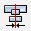

Notice how the visibility for each country's trajectory can now be toned down by selecting its layer, and adjusting the `Opacity` control. Here, for example, the opacity for Brazil, China and India have been set to 20%, highlighting South Africa and Russia:


Save the file as an `Inkscape SVG` and close.

### Assignment

Using the SVG from class showing the development trajectories of the BRICS nations, create a graphic with at least three scenes explaining their recent development. Some notes on how to approach this:

- Give each trajectory a country label, and label the first and last year for orientation. I would use the same colors for these labels as for the trajectories themselves, creating a separate layer for the labels for each country, so they can be turned on and off at will.
- Add a note at the foot of the `Base chart` layer sourcing the data to the World Bank.
- Create a graphic story with at least three scenes: an initial scene showing all the trajectories with equal weight, then at least two more comparing and contrasting particular nations. Use the layer opacity controls to tone down the display for the nations not highlighted in that scene, but don't remove them entirely
- In these scenes, I would group India and China together, possibly also with Brazil. I would consider South Africa and Russia in a separate scene. If you wish, you can have more scenes, perhaps putting each of the last countries into their own scene.
- Think about the annotations you will need for each scene, and labelling those years where a country's trajectory changes direction. Put the annotations/labels for each scene into a separate layer, so they can be turned on and off at will.
- Save each scene as a separate PDF.
- Come up with a headline that sells the entire story, and some brief text to introduce it. Look at the "Learn from the experts" examples from week 2 for inspiration.
- Include a very brief explanation of how to read the charts, explaining that a country's goal is to move towards the top right, with high wealth and long lives, while reducing infant mortality.
- Send me your headline and introductory text, plus the PDFs for each scene of the story.

### Further reading

[Inkscape Tutorials](http://www.inkscape.org/en/learn/tutorials/)

[Inkscape Wiki](http://wiki.inkscape.org/wiki/index.php/Inkscape)

Tavmjong Bah. *[Inkscape: Guide to a Vector Drawing Program](http://tavmjong.free.fr/INKSCAPE/MANUAL/html/)*


