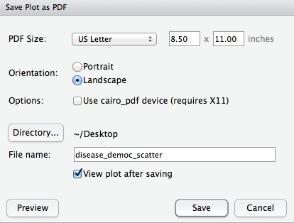
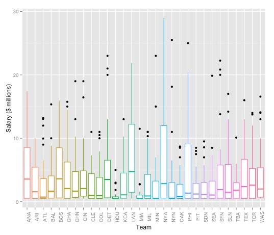
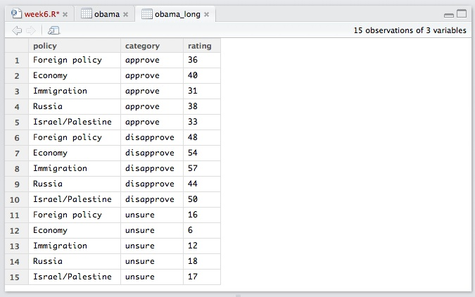
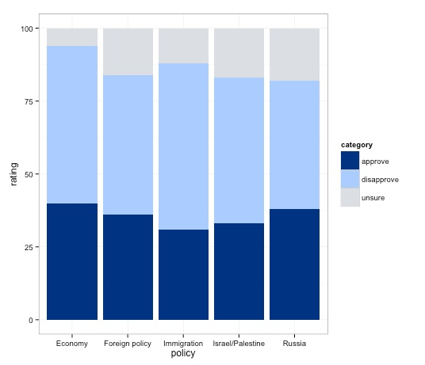
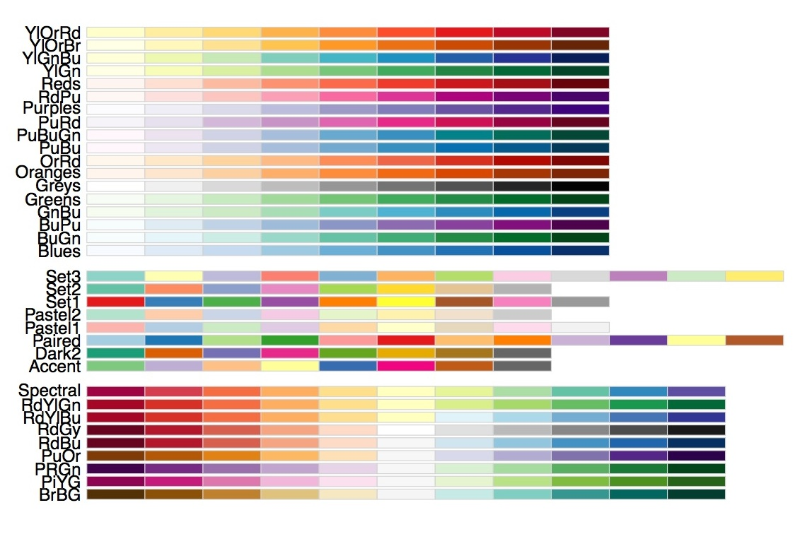
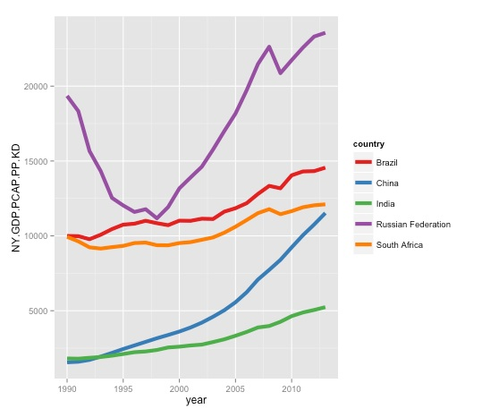

# Making static graphics (and processing data) in R

### Introducing R and R Studio

In today's class we will make graphics and process data using **[R](http://www.r-project.org/)**, which is a very powerful tool, designed by statisticians for data analysis. Described on its website as "free software environment for statistical computing and graphics," R is a programming language that opens a world of possibilities for making graphics and analyzing and processing data. Indeed, just about anything you may want to do with data can be done with R, from web scraping to making interactive graphics.

We will explore's R's potential for making interactive graphics in week 13. Our goal for this week's class is to get used to processing data in R, and start making some static graphics.

**[R Studio](http://www.rstudio.com/)** is an "integrated development environment," or IDE, for R that provides a more user-friendly interface than working in the standard R Console.

Launch R Studio, and the screen should look like this:


The main panel to the left is the R Console. Type valid R code into here, hit `return`, and it will be run. See what happens if you run:

```R
print("Hello World!")
```

### The data we will use today

Download the data for this session from [here](data/week11.zip), unzip the folder and place it on your desktop. It contains the following files:

- `disease_democ.csv`
- `food_stamps.csv`
- `pfizer.csv` `fda.csv`


### Set your working directory

When starting a new project in R, the first thing to do is set the directory/folder in which you are working. From the top menu, select `Session>Set Working Directory>Choose Directory ...

Notice how this code appears in the console:

```R
setwd("~/Desktop/week11")
```

### Reproducibility: save your scripts and your environment

As we have already discussed, we should aim for all of our data journalism to be fully documented and reprodicible. R makes this easy, as every operation performed can be saved in a script. Click on the  icon at top left and select `R Script`. A new panel should now open:


Any code we type in here can be run in the console. Hitting `Run` will run the line of code on which the cursor is sitting. To run multiple lines of code, highlight them and click `Run`.

Copy the code `setwd("~/Desktop/week6")` into the script then save it as `week11`. It should automatically save with an `R` extension. Now next time you run this script, the working directory will be set automatically.

The panel at top right has two tabs, the first showing the `Environment`, or all of the "objects" loaded into memory for this R session. We can save this as well, so we don't have to load and process data again if we return to return to the project later.

Click on the disk icon in the `Environment` panel to save and call the file `week11`. You should see code in the following format appear in the Console, as the environment is saved with an `RData` extension:

```r
save.image("week11.RData")
```

Copy this code into your script also, placing it at the end. By keeping this code at the end of your script, each tie you run the entire script the last action will be to save the environment.

The second tab in this panel shows the history of all the code run in the current R session.

### Install and load R packages

Much of the power of R comes from the thousands of "packages" written by its community of open source contributors. These are optimized for specific statistical, graphical or data-processing tasks. To see what packages are available in the basic distribution of R, select the `Packages` tab in the panel at bottom right. To find packages for particular tasks, try searching Google using appropriate keywords and the phrase "R package."

In this class, we will work with a series of useful packages, called **readr**, **ggplot2**, **dplyr**, **tidyr**, **scales**, and **WDI**. Click on `Install`, and enter these names, separated by commas, as follows:


Make sure that `Install dependencies` is checked, as some packages will only run correctly if other packages are also installed. Click `Install` and all of the required packages should install.

Having installed a package, you can load it into the current R session by checking its box in the `Packages` tab. However, we will enter the following code into our script, then highlight these lines of code and run them:

```r
# package to quickly read data into R
library(readr)

# package to draw charts
library(ggplot2)

# package to format axes on those charts as %, $ and so on
library(scales)

# package for manipulating data
library(dplyr)

# package to format axes as %, $ and so on
library(scales)

# package to import data from World Bank World Development Indicators API
library(WDI)
```

By saving this code in our script, the packages will load automatically when we run the script in future. Add comments explaining your code using `#`, which causes everything written subsequntly on that line to be ignored. It is good practice to comment your code extensively to remind you of what it does: Don't reply on your memory!

Each time you start R, it's a good idea to click on `Update` in the `Packages` panel to update all your installed packages to the latest versions.

### Load, view and export data

We can load data into the current R session by selecting `Import Dataset>From Text File...` in the `Environment` tab.

Import the food stamps data in this way. You should see the following dialog box:


Check that R Studio has recognized whether the data has a `Heading` row, and that it has picked the correct `Separator` and the correct `Quote` character designating for text fields. `na.strings` will replace any null values with `NA`, which is standard in R. `Strings as factors` treats any text fields as labels for categorical variables. If this is unchecked they will be imported simply as strings of text.

`Import` the data, and note that the following code should appear in the Console:

```r
food_stamps <- read.csv("~/Desktop/week11/food_stamps.csv")
	View(food_stamps)
```
The data should open for inspection in the upper left panel, as instructed by the second line of the above code, and an object called `food_stamps` will now be visible in the `Environment` tab:


The object we have created is a "data frame," the standard format for tables of data in R. Its `Value` details the number of variables, and the number of records, or observations, in the data.

We can `View` data at any time by clicking on its table icon in the `Environment` tab.

***

Data can also be imported by writing code:

```r
salaries_2013 <- read.delim("PathToFile/salaries_2013.txt")
```

If importing data in this way, you may need to set the options for Heading, Separator and so on in the code, as [explained here](http://stat.ethz.ch/R-manual/R-devel/library/utils/html/read.table.html).

Here are some useful commands for looking at data in R:

```r
str(disease_democ)
```
This should give the following output in the R Console:

```JSON

```

The `str` function shows the structure of a `data.frame`, telling us here that `country` and `income_group` are "Factors," which is what R calls categorical variables, `democ_score` is numeric, or a continuous variable, while `infect_rate` is a continuous variable that contains only integers.

The following code shows the first `n` lines from an object, where `n` is the number given after the comma. It can be useful for quickly examining how data is organized:

```r
head(food_stamps,10)
```
This is the output:

```JSON

```

Often you may want to export data as a delimited text file after processing in R. So let's do this now for the disease and democracy data:

```r
write.csv(food_stamps, "food_stamps_copy.csv", row.names = FALSE, na = "")
```

If `row.names = FALSE` is not included, R will automatically add a number label to each row; `na = ""` explains how to export any null values. Here they will be left blank, because there is nothing between the quote marks. If you do not specify this, they will be exported with the value `NA`, which is how R designates null values.

### Draw a scatter plot from the disease and democracy data

Now we will use the [ggplot2](http://ggplot2.org/) charting package to draw the scatter plot from week 1. Return to the [ggplot2 web app](http://rweb.stat.ucla.edu/ggplot2/) and create the chart again. Then select `View` from the top menu and and check `code panel`. This will open a panel at the base of the page illustrating the ggplot2 code that would be used to create the graphic. (You cannot manipulate this code to change a chart in the app, but this feature makes the app a good tool for learning how to code ggplot2 graphics.)

Copy that code, and insert into your R script, replacing `myData` with `disease_democ`, as follows:

```r
ggplot(disease_democ, aes(x=infect_rate, y=democ_score)) + geom_point(size=4) + geom_smooth(se=FALSE, method="lm")
```

Run that code, and the scatterplot will appear in the panel at bottom right, in the `Plots` tab:


We can also first save the chart as an R object, and then plot it:

```r
disease_democ_scatter <- ggplot(disease_democ, aes(x=infect_rate, y=democ_score)) + geom_point(size=4) + geom_smooth(se=FALSE, method="lm")
plot (disease_democ_scatter)
```
Notice that an object with the Type `gg` appears in the `Environment` tab.

Now we can customize the chart, taking that object and defining ranges for the axes, and adding more informative labels for each. (This will gave the same result as entering the original code with the additional code appended.)

This is the code:

```r
disease_democ_scatter + coord_cartesian(xlim=c(0,70), ylim=c(0,100)) + xlab("Infectious disease prevalence score") + ylab("Democratization score")
```
Notice the `c` or "combine" function. This takes a series of values, and combines them into a list. It crops up frequently in R code.

You may see ggplot2 examples in which the range for axes are set using simpler code, for example:

```r
disease_democ_scatter + xlim=(0,70) + ylim(0,100) + xlab("Infectious disease prevalence score") + ylab("Democratization score")
```

While it has the same result in this case, I do not suggest using this option. As well as setting the axis ranges, the simpler code discards any data that appears outside the range, so that it will not be taken into account when drawing a trend line, for instance. The more complex version is safer, as it retains all the data.

The chart should now look like this:


### Export your plots

R Studio makes it easy to export graphics from R. Select `Export>Save Plot as PDF...` from the menu in the `Plots` tab. At the dialog box, you can select the size and orientation for the export, choose where to save it, and give it an appropriate name:



R Studio also offers the option to export in various image formats. If you are intending to edit the graphic subsequently, however, save as a PDF. For all the graphics we export today, export at `US Letter` size and `Landscape` orientation.

Notice also the arrows at top left of the `Plots` tab. These allow us to browse back and forth through the charts drawn in the current R session.

### ggplot2 and the grammar of graphics

The "gg" in ggplot2 stands for ["grammar of graphics,"](http://www.amazon.com/The-Grammar-Graphics-Statistics-Computing/dp/0387245448) an approach to drawing charts devised by the statistician Leland Wilkinson. Rather than thinking in terms of finished charts like a scatter plot or a column chart, it starts by defining the coordinate system (usually the X and Y axes of a cartesian system), maps data onto those coordinates, and then adds layers such as points, bars and so on. This is the logic behind ggplot2 code.

The function `aes`, for aesthetic mapping, is used whenever we map data values onto a chart -- to an axis, to a color scale, and so on. So ggplot2 code starts by mapping variables to the X and Y axes. Layers are then added the the graphic using various `geom` functions. The brackets following each of these each functions may contain global operations to be applied to every item in the layer, and also further `aes` mappings so that the color of points, for example, can be mapped to values of a categorical variable.

To see this in action, let's color the points in our scatter plot according to each country's income group:

```r
ggplot(disease_democ, aes(x=infect_rate, y=democ_score)) + geom_point(size=4, aes(color=income_group)) + geom_smooth(se=FALSE,method="lm")
```


Note the difference between this plot, and the result we obtain by mapping color to income group in the initial aesthetic mapping, rather than specifically for the points:

```r
ggplot(disease_democ, aes(x=infect_rate, y=democ_score, color=income_group)) + geom_point(size=4) + geom_smooth(se=FALSE,method="lm")
```


### Draw box plots from the baseball salary data

Here is the code for the basic baseball salaries boxplot:

```r
ggplot(salaries_2013, aes(x=team, y=salary, color=team)) + geom_boxplot()
```


Let's customize this plot to remove the legend, which adds little, format the salary axis in $ millions, and turn the team labels through 90 degrees to make them legible.

First make a new variable giving salary in millions, by dividing `salary` by 1 million:

```r
salaries_2013$millions <- salaries_2013$salary/1000000
```
Notice how `$` is used to specify a variable within a `data.frame`.

We can also do this with the `mutate` function from the [dplyr](http://cran.rstudio.com/web/packages/dplyr/vignettes/introduction.html) package:

```r
salaries_2013 <- mutate(salaries_2013, millions2=salary/1000000)
```
Notice that here the object to the left of `<-` has the same name as the old object. This allows us to an edit an object with new code as we go along. We will do this later on with saved ggplot2 charts.

View the data, and see that the new variables `millions` and `millions2` are identical.

Now redraw the plot with the `millions` variable on y axis:

```r
ggplot(salaries_2013, aes(x=team, y=millions, color=team)) + geom_boxplot()
```

Again, let's save that chart:

```r
baseball_box <- ggplot(salaries_2013, aes(x=team, y=millions, colour=team)) + geom_boxplot()
```
Now customize the plot to remove the legend and change the axis labels:

```r
baseball_box + theme(legend.position="none", axis.text.x = element_text(angle=90)) + xlab("Team") + ylab("Salary ($ millions)")
```
This code introduces the `theme` function, which is used to custom various aspects of a chart's appearance.

The final chart should look like this:



### Draw column, line and other charts from food stamps data

Now we will draw the variety of charts used in week 2 to illustrate different ways of charting participation over time in the U.S. federal government's food stamps nutritional assistance program.

First import the food stamps data. The number of participants is in thousands. Again we can make a new column giving the number in millions:

```r
food_stamps <- mutate(food_stamps, mil_particip=particip/1000)
```

First create a basic plot area with no layers:
```r
food_stamps_chart <- ggplot(food_stamps, aes(x=year, y=mil_particip)) + coord_cartesian(xlim = c(1968, 2014), ylim = c(0, 50)) + xlab("Year") + ylab("Participants (millions)")
```
Notice how the ranges for the X and Y axes have been set after looking at the data to see the maximum values.

Now we can use this object as the base to draw charts of different types. Let's start with a column chart. To make the height of the columns correspond to data values we use `stat="identity"`. Other options for `geom_bar` are explained [here](http://docs.ggplot2.org/0.9.3.1/geom_bar.html).

```r
food_stamps_chart + geom_bar(stat="identity") + ggtitle("Column chart")
```

Notice the use of `ggtitle` to add a title to the chart.

And now a series of other chart types:

```r
# line chart, note use of "size" to draw thicker line
food_stamps_chart + geom_line(size=2) + ggtitle("Line chart")

# dot-and-line chart, note how more than one layer can be added to the chart
food_stamps_chart + geom_line() + geom_point(size=4) + ggtitle("Dot-and-line chart")

# dot-column chart, note the more complex code to draw the vertical lines
food_stamps_chart + geom_linerange(aes(ymax=0,ymin=mil_particip)) + geom_point(size=4) + ggtitle("Dot-column chart")
```
This will draw the series of charts we saw in week 2:


### Draw stacked bar chart and pie charts from presidential approval polling data

Next we will draw the charts from the presidential approval polling data we saw in week 2. Import and view the data, in the file `obama.txt`:


This data is in "wide" format -- much like the pivot table we made in week 4. We need to convert it to "long" format before we can use ggplot2 to chart the data. This is where the [tidyr](http://blog.rstudio.org/2014/07/22/introducing-tidyr/) package comes in. It has two main functions: `gather`, which converts from wide to long, and `spread`, which converts from long to wide.

The following code tells tidyr to gather data from the obama `data.frame`, putting  existing column labels into a new variable called `category`, and the values for each record into a new variable called `rating`. The hyphen before `policy` specificies that this variable is not to be gathered.

```r
obama_long <- gather(obama, category, rating, -policy)
```
The data should now look like this:



Now we will set a custom color palette, by creating a list of hex color values:

```r
palette <- c("#003380", "#aaccff", "#dbdee3")
```
This code saves and then plots the stacked column chart:

```r
poll_stacked_bar <- ggplot(obama_long, aes(x=policy, y=rating)) + geom_bar(stat="identity", aes(fill=category)) + scale_fill_manual(values=palette)
plot(poll_stacked_bar)
```


Mapping `category` to the `fill` for the columns is what makes this into a stacked column chart.

Notice how `fill` is used here rather than `color`, which would affect the outlines of the columns, not the color used to fill them. To see how this works, run this code:

```r
ggplot(obama_long, aes(x=policy, y=rating)) + geom_bar(stat="identity", aes(fill=category), color="black") + scale_fill_manual(values=palette)
```
Note that R understands some colors, like "black," [by name](http://www.stat.columbia.edu/~tzheng/files/Rcolor.pdf) -- but we could also have used its hex value.

The gray background does not work with this color palette. So let's customize the chart, switching to ggplot2's built-in alternate black-and-white theme:

```r
poll_stacked_bar + theme_bw()
```



As noted earlier, the `theme` function can be used to customize a basic R plot, see [here](http://docs.ggplot2.org/current/theme.html) for a complete reference. Here we will remove the panel border and grid lines, saving those changes:

```r
poll_stacked_bar <- poll_stacked_bar + theme_bw() + theme(panel.border=element_blank(), panel.grid=element_blank())
plot(poll_stacked_bar)
```


Now add labels to the chart showing data values:

```r
poll_stacked_bar + geom_text(aes(label = rating), size = 5, vjust = 1.2, color = "#ffffff", position = "stack")
```
Try altering the `vjust` value to see how this part of the code works to set the vertical position of each label.


This chart is still not finished, but from here is makes more sense to polish in a vector graphics editor such as Inkscape, as we will do next week. So export this chart as a PDF, so we can edit it later.

ggplot2 can also be tortured into drawing pie charts, but the code gets rather complex. For completeness, here it is:

```r
ggplot(obama_long, aes(x="1", y=rating)) + geom_bar(stat="identity", aes(fill=category)) + coord_polar(theta="y") + facet_grid(facets=. ~ policy) + scale_fill_manual(values=palette) + theme_bw()
```

### Draw a scatter plot from gender pay gap data and add fixed lines

Now we will draw the gender pay gap scatterplot shown in week 2, to illustrate adding fixed lines to a chart. Import the data, and notice that there are three years of data - so first we will need to filter to select just the data for 2013.

We can do this with R's built-in `subset` function:

```r
gender_pay_2013 <- subset(gender_pay, year==2013)
```

Or we can the use the `filter` function from dplyr:

```r
gender_pay_2013 <- filter(gender_pay, year==2013)
```

Now let's draw and customize the scatter plot, mapping the variables representating men's and women's median weekly earnings for each job to the X and Y axes, respectively:

```r
# save and draw basic scatterplot, note use of "alpha" to set transparency for the points
gender_pay_scatter <- ggplot(gender_pay_2013, aes(x=m_median_weekly_earnings, y=w_median_weekly_earnings)) + geom_point(size=4, alpha=0.5)
plot(gender_pay_scatter)

# set both axes to run from zero to 2500, and to have a size ratio of 1:1
gender_pay_scatter <- gender_pay_scatter + coord_fixed(ratio = 1, xlim = c(0,2500), ylim = c(0,2500))
plot(gender_pay_scatter)

# set axis labels and bw theme
gender_pay_scatter <- gender_pay_scatter + xlab("Men's median weekly earnings") + ylab("Women's median weekly earnings") + theme_bw()
plot(gender_pay_scatter)
```
The chart should now look like this:


You should now be getting sufficiently familiar with R and ggplot2 code that you can work out the logic of each step.

Next we will customize the chart further, using the `labels` function from the [scales](http://cran.r-project.org/web/packages/scales/scales.pdf) package to display dollar values, and the `geom_abline` function to add fixed reference lines to the chart.

```r
# remove panel and tick marks, set axes to display dollar values using scales package
gender_pay_scatter <- gender_pay_scatter + theme(panel.border=element_blank(), axis.ticks=element_blank()) + scale_x_continuous(labels = dollar) + scale_y_continuous(labels = dollar)
plot(gender_pay_scatter)

# add lines for equal pay and for women paid 75% of men's salaries; note use of "intercept" to define where line crosses Y axis
gender_pay_scatter <- gender_pay_scatter + geom_abline(intercept = 0, slope = 1) + geom_abline(intercept = 0, slope = 0.75, linetype="dashed")
plot(gender_pay_scatter)
```
The final chart should look like this:


Export the chart as PDF, so we can edit it further and annotate later.

### Use dplyr to filter Pfizer payments data, then draw bar chart

You may be wondering why we bothered loading the dplyr package, as so far everything we have done with it could be achieved with standard R code.

In this example we will see why dplyr is particularly useful for data processing by replicating one of the SQL queries we ran in Week 4, before drawing a chart from the data.

Load the Pfizer payments data.

We can use dplyr's SQL-like functions to repeat our task from Week 4 of filtering the data to select all doctors in California paid more than $10,000 to run Expert-led forums.

- `select` does much the same job as `SELECT` in SQL, picking which fields or variables to return.

- `filter` corresponds to `WHERE` and follows Boolean logic with `|` representing `OR` and `&` representing `AND`.

- `arrange` does the same job as `ORDER BY` in SQL, sorting the data. 

- dplyr also allows you to "chain" these functions together using `%>%`, or "then," making the output from one function the input for the next.

This is the dplyr version of our SQL query:

```r
ca_docs <- select(pfizer, first_plus, last_name, city, state, category, total) %>%
  filter(category=="Expert-Led Forums" & state=="CA" & total >= 10000) %>%
  arrange(desc(total))
```
View the data to see the results.

Next we want to draw a bar chart showing how much these doctors were paid. We want to label each bar with the doctor's full name, which means creating a new variable combining `first_plus` and `last_name`.

We can use dplyr's `mutate` function for this:

```r
ca_docs <- mutate(ca_docs, full_name=paste(first_plus, last_name, sep=" "))
```

In this code, `sep = " "` ensures that the given and family names are separated by a space.

Let's examine the structure of the data:

```r
str(ca_docs)
```
Which gives the output:

```
'data.frame':	31 obs. of  7 variables:
 $ first_plus: Factor w/ 4048 levels "","A MARK","AAKASH MOHAN",..: 1286 2611 3617 784 3368 1357 1516 2466 2974 1863 ...
 $ last_name : Factor w/ 3617 levels "---","ABBO","ABEBE",..: 2824 2324 2570 1145 1933 3068 202 432 2317 2944 ...
 $ city      : Factor w/ 1318 levels "A","ABERDEEN",..: 1058 673 867 673 1024 1303 122 701 612 1137 ...
 $ state     : Factor w/ 52 levels "AK","AL","AR",..: 5 5 5 5 5 5 5 5 5 5 ...
 $ category  : Factor w/ 9 levels "","Business Related Travel",..: 4 4 4 4 4 4 4 4 4 4 ...
 $ total     : int  146500 70500 48350 45750 41250 40000 26400 24000 22500 21500 ...
 $ full_name : chr  "GERALD MICHAEL SACKS" "MITCHELL NIDES" "STEVEN GARTH POTKIN" "DAVID ALAN GINSBERG" ...
```
Notice that the `full_name` isn't treated as a categorical variable, or `Factor`, but instead is a "character" variable, or `chr`, which is a simple string of text.

Now we can make a bar charts from the filtered data. The code is the same as for a column chart, except that `coord_flip` is used to switch from vertical bars to horizontal columns.

```r
ggplot(ca_docs, aes(x=full_name, y=total)) + geom_bar(stat="identity") + coord_flip()
```


It makes more sense to sort the bars according to how much each doctor was paid, which we can do in either ascending or descending order by using the `reorder` function:

```r
#descending order
ggplot(ca_docs, aes(x=reorder(full_name, total), y=total)) + geom_bar(stat="identity") + coord_flip()

#ascending order
ggplot(ca_docs, aes(x=reorder(full_name, -total), y=total)) + geom_bar(stat="identity") + coord_flip()
```
Here is the chart in descending order:


That's fine, except it would look nicer if the names were not capitalized, and instead were written with inital capitals only -- proper case. We can fix that with a custom R function. You don't need to understand the details of how it works, but it is worth saving for future use:

```r
# function to convert any text string into proper case
toproper <- function(x) {
  sapply(x, function(strn)
  { s <- strsplit(strn, "\\s")[[1]]
    paste0(toupper(substring(s, 1,1)), 
           tolower(substring(s, 2)),
           collapse=" ")}, USE.NAMES=FALSE)
}
```
Notice that when you run this code, the new function appears in the `Environment`.

Having defined this function, we can now use it with dplyr's `mutate` to make a new variable giving each doctor's name in proper case:

```r
ca_docs <- mutate(ca_docs, proper_name = toproper(full_name))
```

Now let's redraw the bar chart using these names, and improve the formatting:

```r
# with improved axis labels
pfizer_bars <- ggplot(ca_docs, aes(x=reorder(proper_name, total), y=total)) + geom_bar(stat="identity") + xlab("") + ylab("Total payments") + coord_flip()
plot(pfizer_bars)

# display dollar values, and move the names close to the start of the bars by expanding the grid just $500 from them
pfizer_bars + scale_y_continuous(label = dollar, expand=c(0,500))
```
This is the final bar chart:


Export the bar chart as a PDF so we can edit it later in Inkscape.

### Use dplyr to filter by date, and to join data

Now import the FDA warning letters data, so we can see how R handles dates.

Examine the structure of this data:

```r
str(fda)
```
This is the output:

```
'data.frame':	272 obs. of  5 variables:
 $ name_last  : Factor w/ 253 levels "ADELGLASS","ADKINSON",..: 1 2 3 4 5 6 7 8 9 10 ...
 $ name_first : Factor w/ 162 levels "A.","ABDOOL",..: 70 108 96 32 59 24 33 122 119 75 ...
 $ name_middle: Factor w/ 51 levels "","A","A.","AL",..: 32 18 44 1 8 28 50 1 35 13 ...
 $ issued     : Factor w/ 239 levels "1996-11-19","1997-01-10",..: 29 46 77 131 122 40 53 89 111 38 ...
 $ office     : Factor w/ 8 levels "Baltimore District Office",..: 4 2 3 2 3 3 2 3 3 3 ...
```
Note that `issued` is being treated as a categorical variable, rather than a date. That is easy to fix:

```r
fda$issued <- as.Date(fda$issued)
```

Look at the structure of the data again, and this should be the output:

```
'data.frame':	272 obs. of  5 variables:
 $ name_last  : Factor w/ 253 levels "ADELGLASS","ADKINSON",..: 1 2 3 4 5 6 7 8 9 10 ...
 $ name_first : Factor w/ 162 levels "A.","ABDOOL",..: 70 108 96 32 59 24 33 122 119 75 ...
 $ name_middle: Factor w/ 51 levels "","A","A.","AL",..: 32 18 44 1 8 28 50 1 35 13 ...
 $ issued     : Date, format: "1999-05-25" "2000-04-19" "2002-01-28" "2004-11-17" ...
 $ office     : Factor w/ 8 levels "Baltimore District Office",..: 4 2 3 2 3 3 2 3 3 3 ...
```
Other functions to convert variables from one format to another include:

- `as.character` converts to text string
- `as.numeric` converts to number
- `as.factor` converts to categorical variable
- `as.integer` converts to integer

Now we can use dplyr to repeat our SQL query of filtering for letters published since the start of 2005:

```r
post2005 <- filter(fda, issued >= "2005-01-01") %>%
  arrange(desc(issued))
```

The dplyr package can handle joins, too. This, for example, is how to run the query that identified the four doctors paid by Pfizer to run Expert-Led Forums who had also received a warning letter from the FDA:

```r
matches <- inner_join(pfizer, fda, by=c("first_name" = "name_first", "last_name" = "name_last")) %>%
  filter(category=="Expert-Led Forums")
```
dplyr actually supports a wider variety of join types than SQLite: [here is a useful reference](http://stat545-ubc.github.io/bit001_dplyr-cheatsheet.html).

### Import and process World Bank data

In week 5, we noted that some organizations make their available online via APIs. When working in R, it is worthwhile to run some Google searches to find out if the data you are interested in is provided via an API, and whether anyone has written an R package to import data from this API.

The [WDI](https://github.com/vincentarelbundock/WDI) package allows  a wealth of [data from the World Bank](Explain WDI package gives access to World Bank indicators. http://data.worldbank.org/indicator/all) to be imported into R from the World Bank [API](http://data.worldbank.org/node/9).

You can search for indicators containing key words, such as "gdp," using the following code:

```r
WDIsearch("gdp")
```

Having identified which indicators you want to import, create a list of them:

```r
indic_list <- c("NY.GDP.PCAP.PP.KD","SP.DYN.LE00.IN","SH.XPD.PCAP.PP.KD","SP.DYN.IMRT.IN","SP.DYN.TFRT.IN")
```

Now import the data for all countries and all available years (the data go back at most to 1960):

```r
indicators <- WDI(indicator=indic_list, country="all", start=1960, end=2014)
```

This code will take a little time to run. Once the data imports, you will see a column for each indicator, plus three columns giving the year, country (or group of countries), and a two-letter identifying code for each country.

The indicators are:

- `NY.GDP.PCAP.PP.KD` [GPD per capita, purchasing power parity (constant 2011 $)](http://data.worldbank.org/indicator/NY.GDP.PCAP.PP.KD)
- `SP.DYN.LE00.IN` [Life expectancy at birth (years)](http://data.worldbank.org/indicator/SP.DYN.LE00.IN)
- `SH.XPD.PCAP.PP.KD` [Health expenditure per capita. purchasing power parity (constant 2005 $)](http://data.worldbank.org/indicator/SH.XPD.PCAP.PP.KD)
- `SP.DYN.IMRT.IN` [Infant mortality rate (per 1,000 live births)](http://data.worldbank.org/indicator/SP.DYN.IMRT.IN)
- `SP.DYN.TFRT.IN` [Fertility rate (births per woman)](SP.DYN.TFRT.IN)

First we will filter this data to use later for maps showing GDP per capita by country for each year from 2009 to 2013.

Use dplyr to select the data we want:

```r
gdp_pc <- select(indicators, year, iso2c, country, NY.GDP.PCAP.PP.KD) %>%
  filter(year >= 2009)
```
Look at the data, which is in long format. To join to our map, we will need the data in a wide format, with each year's values in a separate column. So we need to use tidyr's `spread` function.

```r
gdp_pc_wide <- spread(gdp_pc, year, NY.GDP.PCAP.PP.KD)
```

Now export this data:

```r
write.table(gdp_pc_wide, "PathtoFile/gdp_pc.txt", row.names = FALSE, sep = "\t", na = "-99")
```
This is one of the files we used to demonstrate a SQL `LEFT JOIN` in Week 4. Note that we have set the null `na` values as -99.

Just for practice with tidyr's `gather` function, let's convert the data back to long format:

```r
gdp_pc_long <- gather(gdp_pc_wide, year, gdp_pc, -iso2c, -country)
```

### Draw charts illustrating development of the BRICS nations from World Bank data

Now let's draw some charts from the World Bank data. I selected these indicators to look at the wealth and well-being of the BRICS nations: Brazil, Russia, India, China and South Africa.

BRICs is a grouping of the world's five most important emerging economies. However, the  circumstances of their recent economic growth and development are rather different, so there should be interesting stories to tell about the differences between these countries by charting these indicators.

First, filter the imported data using dplyr to focus on the BRICS nations from 1990 onwards:

```r
brics <- filter(indicators, (iso2c=="BR" | iso2c=="CN" | iso2c=="IN" | iso2c=="RU" | iso2c=="ZA") & year >= 1990)
```

In making charts from this data, we will use palettes from ColorBrewer, so let's look at the possibilities allowed by RColorBrewer:

```r
display.brewer.all()
```



This image is worth exporting as PDF and saving for future reference.

First let's draw a line chart, showing how GDP per capita has changed over time for each of the five countries, using the ColorBrewer `Set1` qualitative color scheme:

```r
ggplot(brics, aes(x=year, y=NY.GDP.PCAP.PP.KD)) + geom_line(aes(color=country), size=2) + scale_color_brewer(palette = "Set1")
```


Already, this chart shows some interesting differences between the five nations. Notice, for instance, how Brazil, South Africa and particularly Russia were affected by the financial crisis of 2007-8, while growth of GDP per capita in India and China was apparently unaffected. China's rapidly growing wealth stands out clearly, while Russia's trajectory is especially interesting. Its economy initially slumped, but turned around sharply in the late 1990s.

To draw similar charts for the other variables, we could repeat this code, substituting in each of the variable names. But that is rather cumbersome. We already have a list of the variable names in the object `indic_list`. So we can write "for" loop to iterate over each variable in that list and draw a similar chart for each one:

```r
for (i in indic_list) {
  brics_line <- ggplot(brics, aes_string(x="year", y=i)) + geom_line(aes(color=country), size=2) + scale_color_brewer(palette = "Set1")
  plot(brics_line)
}
```
For loops allow repetitive tasks to be run efficiently with a minimum of code.

You may be wondering why we used `aes_string` rather than `aes` to map the data values to the axes. This is because items in `indic_list` are strings of text, which refer to the variables in the data, rather than the variables themselves. You can see that by typing `str(indic_list)`, which gives the following output:

```
chr [1:5] "NY.GDP.PCAP.PP.KD" "SP.DYN.LE00.IN" "SH.XPD.PCAP.PP.KD" "SP.DYN.IMRT.IN" ...
```

Using `aes_string`, we also need to specify `"year"` in quote marks, so that it is similarly cast as a text string referring to a variable in the data.

Note also that each chart in the for loop needs to saved as an object and then plotted; the code will not work if you just start with `ggplot`.

Use the arrows in the `Plots` tab to explore the charts drawn by the loop.

Now let's draw a Gapminder-style trajectory trajectory for each country over time showing how life expectancy has varied with GDP per capita:

```r
ggplot(brics, aes(x=NY.GDP.PCAP.PP.KD, y=SP.DYN.LE00.IN, color=country)) + geom_point() + geom_path() + scale_color_brewer(palette = "Set1") + geom_text(aes(label=year), size=4, hjust=-0.2)
```


The `geom_path` function draws a line through the points in the original order in which they appear in the data. In this case, the data was already in chronological order. If not, we could use dplyr's `arrange` fucntion to order the data before plotting.

The year labels make the chart look messy, but are worth including in the first instance so we know the direction of the trajectories over time. You can experiment with `hjust` to see how it affects the labels' horizontal position.

We have used the `Set1` qualitative palette to color the countries. This is not ideal, given that the red and green will create problems for colorblind people -- however, there is no fully colorblind-safe qualitative ColorBrewer palette for five categories. (Note also that ColorBrewer is actually baked into ggplot2, so that the package didn't actually need to be loaded, other than to review the available options.)

Again, we can write a for loop to draw similar plots to see how each of the variables have varied against GDP per capita over time:

```r
for (i in indic_list) {
  brics_path <- ggplot(brics, aes_string(x="NY.GDP.PCAP.PP.KD", y=i, color="country", label="year")) + geom_point() + geom_path() + scale_color_brewer(palette = "Set1") + geom_text(aes(label=year), size=4, hjust=-0.2)
  plot(brics_path)
}
```

Again, use the arrows in the `Plots` tab to look at the charts drawn by the loop. The GDP per capita versus life expectancy chart still seems the most interesting, so let's continue to work with that.

First save and draw the basic plot, omitting the "year" labels to remove clutter, and improving the formatting of the axes:

```r
brics_gdp_le <- ggplot(brics, aes(x=NY.GDP.PCAP.PP.KD, y=SP.DYN.LE00.IN, color=country)) + geom_point() + geom_path() + ylab("Life expectancy at birth (years)") + xlab("GDP per capita") + scale_x_continuous(labels = dollar) + scale_color_brewer(palette = "Set1")
plot(brics_gdp_le)
```


It can sometimes be useful to create "faceted" plots, drawing multiple versions of a chart for each value of a categorical variable. So let's do that, creating one chart for each country:

```r
brics_gdp_le + facet_wrap(~country)
```


In this case the single chart looks better, so we will stick with that.

Now let's add another variable, sizing the points according to the infant mortality rate:

```r
brics_gdp_le + geom_point(aes(size=SP.DYN.IMRT.IN))
```


There is a problem here: The bubbles aren't sized correctly by area. So let's fix that, remove the color legend, and also make the legend for infant mortality a little more informative (note that `\n` in the code for the legend name inserts a new line at that position.):

```r
brics_gdp_le + geom_point(aes(size=SP.DYN.IMRT.IN)) + scale_size_area(name="Infant mortality \n(per 1,000 live births)") + guides(color=FALSE)
```


We will edit and annotate this chart in Inkscape later, so save this as a PDF.

### Assignment

- Draw a line chart showing GDP per capita over time since 1990 for the [G8](http://en.wikipedia.org/wiki/G8) members. Customize as you see fit using R code to give a pleasing and informative display.
- Do some background research to allow you to annotate the final chart on the BRICS nations. In particular, what may explain the unusual trajectories of South Africa and Russia, respectively?
- Send me a PDF of your line chart, the R code you used to filter the data and draw the chart, and some brief notes for annotating the BRICS chart in next week’s class.

### Further reading

Winston Chang: [*R Graphics Cookbook*](http://www.amazon.com/R-Graphics-Cookbook-Winston-Chang/dp/1449316956)
(Chang also has [a helpful website](http://www.cookbook-r.com/) with much of the same information, available for free.)

Hadley Wickham: [*ggplot2: Elegant Graphics For Data Analysis*](http://www.amazon.com/gp/product/0387981403/)

[ggplot2 Documentation](http://docs.ggplot2.org/current/)

[Stack Overflow](http://stackoverflow.com/)
Search the site, or [browse R questions](http://stackoverflow.com/questions/tagged/r)


