# Acquiring, cleaning and formatting data

Not so many years ago, data was hard to obtain. Often data journalists would have to painstakingly compile their own datasets from paper records, or make specific requests for electronic databases using freedom of information laws.

The Internet has changed the game. While those methods may still be needed, many government databases can now be queried online, and the results of those searches downloaded. Other public datasets can be downloaded in their entirety.

For data journalists, the main problem today is usually not finding relevant data, but in working out whether it can be trusted, spotting and correcting errors and inconsistencies, and getting it in the right format for analysis and visualization.

In this class, we will cover some tips and tricks for finding the data you need online, getting it onto your computer, and how to recognize and clean “dirty” data. We will also review some common data formats, and how to convert from one to another.

### Data portals

Life is much easier if you can find everything you need in one place. The main effort to centralize access to data by the U.S. federal government is [Data.gov](http://www.data.gov/). You can search for data from the home page, or follow the [Data](http://catalog.data.gov/dataset) and Topics links from the top menu.

Be warned, however, that Data.gov is a work in progress, and so far contains just a proportion of the U.S. government’s data. Some of the most useful datasets are still only available on the websites of individual federal agencies. [FedStats](http://fedstats.sites.usa.gov/) is a good starting point for searching and browsing if you are unsure of which agency may hold the data you're looking for.

As a data journalist, it is worth familiarizing yourself with the main federal government agencies that have responsibility for the beats you are interested in, and the datasets they maintain. Here are some examples of agencies with useful data:

- **[U.S. Census Bureau](http://www.census.gov/)**: population, demographic, economic and other data, including trade and manufacturing statistics. The [American FactFinder](http://factfinder2.census.gov/faces/nav/jsf/pages/index.xhtml) is especially useful for summary data about specific geographical areas. As well as running the decadal national census, the bureau operates other surveys, which provide more detauled information from representative samples of the U.S. population, including the [Current Population Survey](http://www.census.gov/cps/) (run jointly with the Bureau of Labor Statistics, see below) and the [American Community Survey](http://www.census.gov/acs/www/).

- **[Bureau of Labor Statistics](http://www.bls.gov/)**: employment and unemployment, workplace injuries, time use, pay and consumer spending, including the [Consumer Price Index](http://www.bls.gov/cpi/), a key measure of inflation. Browse its datasets [here](http://www.bls.gov/data/).

- [**Bureau of Justice Statistics**](http://www.bjs.gov/): crime and law enforcement. [Here](http://www.bjs.gov/index.cfm?ty=dca) is its full list of data collections. The [National Crime Victimization Survey](http://www.bjs.gov/index.cfm?ty=dcdetail&iid=245) is an especially useful resource, which together with the Federal Bureau of Investigation's [Uniform Crime Reports](http://www.fbi.gov/stats-services/crimestats) provides the best national data on crime.

- **[Centers for Disease Control and Prevention](http://www.cdc.gov/)**: The [WONDER](http://wonder.cdc.gov/) online databases provide a wealth of information, including on causes of death. Other health datasets are available through the CDC's [National Center for Health Statistics](http://www.cdc.gov/nchs/).

- **[National Oceanic and Atmospheric Administration](http://www.noaa.gov/)**: [climate](http://www.climate.gov/maps-data) and [weather](http://www.weather.gov/), including [forecasts](http://www.nws.noaa.gov/ndfd/), and historical records of [hurricanes](http://www.aoml.noaa.gov/hrd/hurdat/Data_Storm.html) and other newsworthy [severe weather](http://www.spc.noaa.gov/gis/svrgis/) events.

Other data portals at various levels of government are emerging. The City and County of San Francisco, for example, was at the forefront of the Open Data movement, establishing [DataSF](https://data.sfgov.org/) in 2009.

If you need to make comparisons between nations, the [**World Bank**](http://data.worldbank.org/indicator/all) probably has what you need, its catalog containing data for more than 7,000 different measures, compiled by the bank and other UN agencies.

You can navigate the site using the “Find an indicator" search box or the [By Topic](http://data.worldbank.org/topic) link. When you click on a particular indicator, you are sent to a page that gives options to download the dataset from a link near the top right of the page. The data in some cases goes back as far as 1960, and is listed both by individual country and summarized by regions and income groups. We will work with some of this data in a later class.

Other useful sources of data for international comparisons are [**Gapminder**](http://www.gapminder.org/data/) and the **[UN Statistical Division](http://unstats.un.org/unsd/default.htm)**. For health data in particular, try the **[Organisation for Economic Co-operation and Development](http://www.oecd.org/els/health-systems/health-data.htm)** and the **[World Health Organization](http://who.int/research/en/)**.

### Search for data on the web

Often, however, your starting point in searching for data will be Google. Often simply combining a few keywords in a Google search with “data” or “database” is enough to find what you need, but it can be worth focusing your queries using Google’s [advanced search](http://www.google.com/advanced_search):

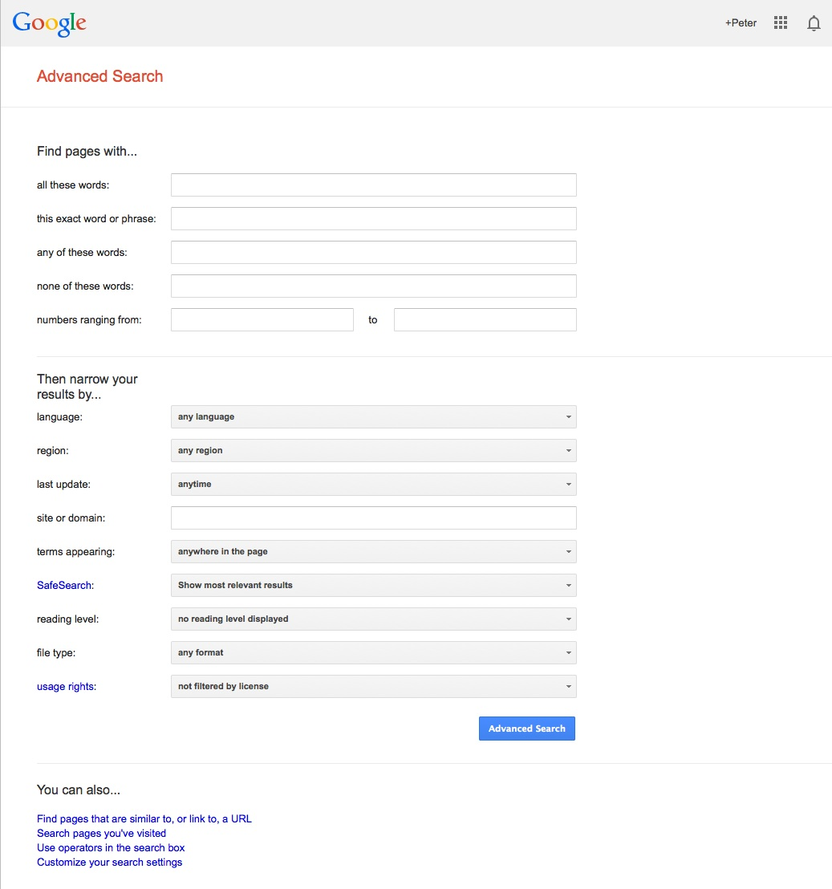

(Source: [Google](http://www.google.com/advanced_search))

The options to search by `site or domain` and `file type` are can be very useful when looking for data. For example, the [U.S. Geological Survey](http://www.usgs.gov/) is the best source of data on earthquakes and seismic risk, so when searching for this information, specifying the domain `usgs.gov` would be a good idea. You can make the domains as narrow or broad as you like: `.gov`, for instance, would search a wide range of US government sites, while `.edu` would search the sites of all academic institutions using that top-level domain; `journalism.berkeley.edu` would search the web pages of the Berkeley J-School only.

The file type search offers a drop-down menu, with the options including Excel spreadsheets, and Google Earth `KML` and `KMZ` files. These are common data formats, but you are not limited to those on the menu. In a regular Google search, type a space after your search terms followed by `filetype:xxx`, where `xxx` is the suffix for the file type in question. For example, `dbf` will look for database tables in this format. Combining file type and domain searches can be a good way to find data an agency has posted online -- some of which may not otherwise be readily accessible.

One common data format doesn’t show up file type searches. Geographical data is often made available as “shapefiles,” a format we will explore in our later mapping classes. Because they consist of multiple files that are usually stored in compressed folders, shapefiles can’t readily be searched using a file type suffix, but they can usually be found by adding the terms “shapefile” or “GIS data” to a regular Google search.

### Search online databases

Many important public databases can be searched online, and some offer options to download the results of your queries. Most of these databases give a simple search box, but it’s always worth looking for the advanced search page, which will offer more options to customize your search. Here, for example, is the [advanced search](http://clinicaltrials.gov/ct2/search/advanced) page for [ClinicalTrials.gov](http://clinicaltrials.gov/), a database of tests of experimental drugs and other medical treatments taking place in the U.S. and beyond:


(Source: [ClinicalTrials.gov](http://clinicaltrials.gov/ct2/search/advanced))

When you start working with a new online database, take some time to familiarize yourself with how its searches work: Read the Help or FAQs, and then run test searches to see what results you obtain. [Here](http://clinicaltrials.gov/ct2/help/how-find/index), for example, is the "How To" section of ClinicalTrials.gov.

Many online databases can be searched using Boolean logic, which we touched upon in our database class, using the operators `AND`, `OR` and `NOT` to link search terms together. So find out how a particular database uses Boolean logic -- and the default settings that it will use if you list search terms without any Boolean operators.

Putting search terms in quote marks often searches for a specific phrase. For example, searching for “heart attack” on ClinicalTrials.gov will give only give results in which those two words appear together; leaving out the quote marks will include any trial in which both words appear.

Also find out whether the database allows “wildcards,” symbols such as `*` or `%` that can be dropped into your search to obtain results with variations on a word or number. For example, in a database that may contain entries in both American and British English, you might use a wildcard to be sure you obtain results with both spelling variants, such as `colo*r`.

### Look for download options -- and know when you are hitting the wall

Having run a search on an online database, you will usually want to download the results, so look for the download links or buttons.

A common problem with online databases, however, is that they may impose limits on the number of results that are returned on each search. And even when a search returns everything, there may be a limit on how many of those results can be downloaded to your own computer.

If broad searches on a database keep returning the same number of results, that is a sign that you are probably running up against a search limit, and any download will not contain the complete set of data that you are interested in. However, you may be able to work out ways of searching to obtain all of the data in chunks.

### Download the entire database

Downloading an entire database, where this is allowed, frees you from the often-limited options given on an online advanced search form: You can then upload the data into your own database, and query it in any way that you want.

So always look for ways to grab all of the data. One trick is to run a search on just the database’s wildcard character, or with the query boxes left blank. If you do the latter at ClinicalTrials.gov, for instance, your search will return all of the trials in the database, which can then be downloaded using the options at the bottom of the results page.

Other databases have an online search form, but also have a separate link from where data to be downloaded in its entirety, usually as a text file or series of text files. One example is the U.S. Food and Drug Administration’s Bioresearch Monitoring Information System (BMIS), which lists doctors and other researchers involved in testing experimental drugs. It can be searched online [here](http://www.accessdata.fda.gov/scripts/cder/BMIS/index.cfm?fuseaction=Search.ShowAdvancedSearchForm), but can also be downloaded in full from [here](http://www.fda.gov/Drugs/InformationOnDrugs/ucm135162.htm).

Note that large text files are again often stored in compressed folders, so may be invisible to a Google search by file type.

### Where there's a government form, there's usually a database

The BMIS database also illustrates another useful tip when looking for data. It is compiled from information supplied in [this government form](http://www.fda.gov/downloads/AboutFDA/ReportsManualsForms/Forms/UCM074728.pdf):

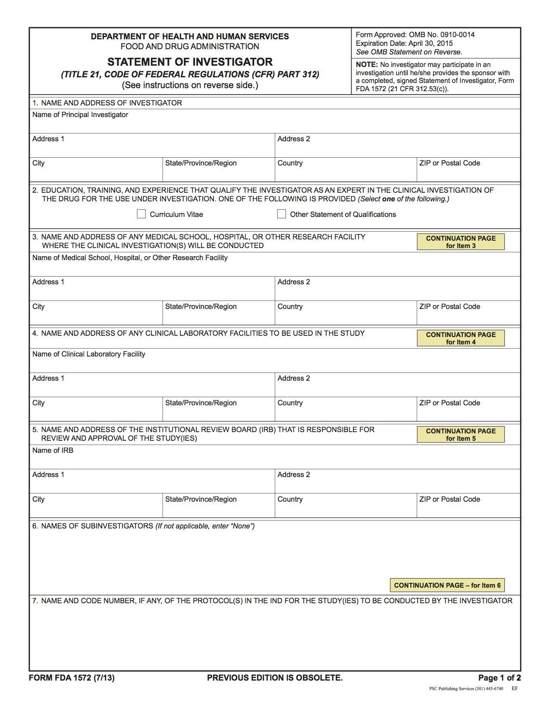

(Source: [Food and Drug Administration](http://www.fda.gov/downloads/AboutFDA/ReportsManualsForms/Forms/UCM074728.pdf))

Wherever a government agency collects information using paper or electronic forms, this information is likely to be entered into an electronic database. Even if it is not available online, you can often obtain the database in its entirety (minus any redactions that may be required by law) through a public records request.

### Ask for what you don't find

That leads to another general tip: If you don't find what you're looking for, speak to government officials, academic experts and other sources who should know about what data exists, and whether they can provide it for you. I have often obtained data, including for this [animated map of cicada swarms](http://newscientistapps.github.io/cicadas/), simply by asking for it (and, of course, promising proper attribution):

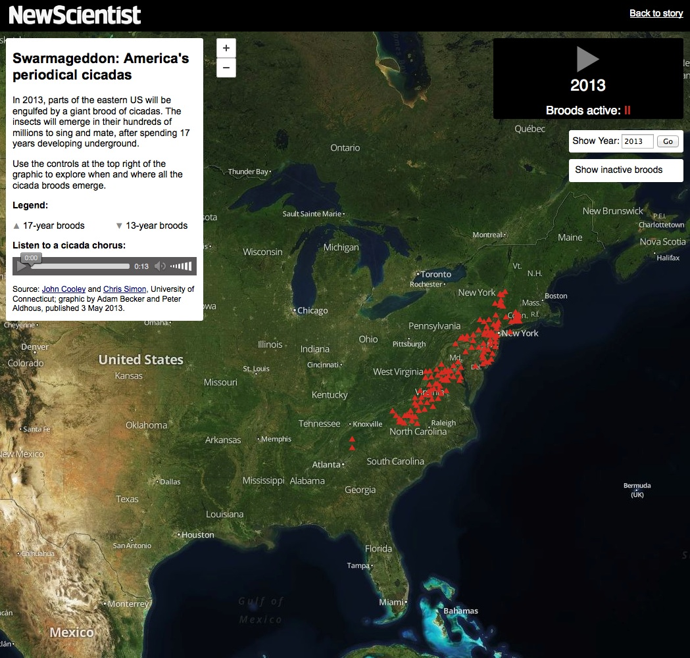

(Source: *[New Scientist](http://newscientistapps.github.io/cicadas/)*)

### Automate downloads of multiple data files

Often data doesn't reside in a single searchable database, but instead exists online as a series of separate files. In such cases, clicking on each link is tedious and time-consuming. But you can automate the process using the [DownThemAll!](https://addons.mozilla.org/en-US/firefox/addon/downthemall/) Firefox add-on.

To illustrate, go to [Gapminder's data catalog](http://www.gapminder.org/data/), and select `All` indicators. The webpage now includes links to more than 500 downloadable spreadsheets.

At the dialog box, you can choose where to save the files, and to filter the links to select just the files you want. In this case, unchecking all the boxes and `Fast Filtering` using the term `xls` will correctly identify the spreadsheet downloads:

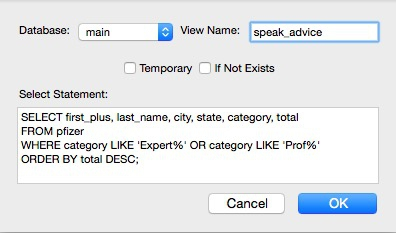


### Extract data from tables on the web

On other occasions, data may exist in tables on the web. Copying and pasting data from web tables can be tricky, but the [Table2Clipboard](https://addons.mozilla.org/en-US/firefox/addon/dafizilla-table2clipboard/) Firefox add-on can simplify the process.

Before using the add-on, select `Tools>Table2Clipboard` and choose the following options under the `CSV` tab:

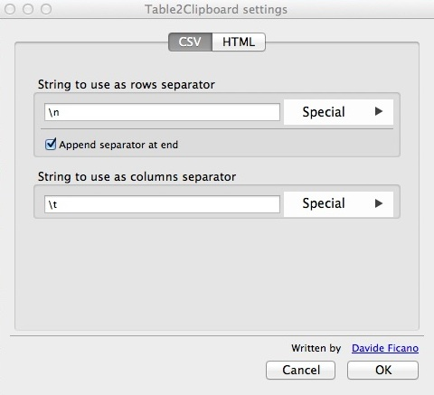

This will ensure that each row in the extracted data is put on a `new line`, and each column is separated by a `tab`.

To illustrate what Table2Clipboard does, go to [The International Disaster Database](http://www.emdat.be/database) and select `Disaster List`. Select `United States` under `Country`, `2010-2014` under `Period` and `Storm` under `Type`. Then click `Search`.

When the table of data appears, right-click anywhere within it and select `Table2Clipboard>Copy whole table`:

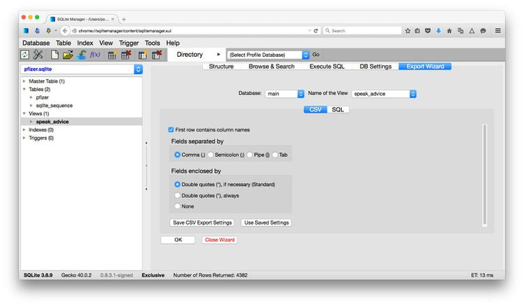

You can now paste the data into an empty text file, or into a spreadsheet.

### Manipulate urls to expose the data you need

As you search for data using web query forms, make a habit of looking at what happens to the url. Often the urls will contain patterns detailing the search you have run, and it will be possible to alter the data provided by manipulating the url. This can be quicker than filling in search forms. In some cases it may even reveal more data than the search form alone would provide, overriding controls on the number of records displayed.

To illustrate how this works, go to [USASpending.gov](http://www.usaspending.gov/), a database of federal government spending, and navigate to the `Prime Award Advanced Search`. At the search form, enter `124726725` for `Recipient DUNS Number`, which is a unique identifying number for each government contractor. This one is for the University of California, Berkeley.

Check `Grants` for `Spending Type` and `2013` for `Fiscal Year` and click `SEARCH`.

When the data is returned, note the url:

```
http://www.usaspending.gov/search?form_fields={"recipient_duns"%3A["124726725"]%2C"spending_cat"%3A["g"]%2C"fyear"%3A["2013"]}
```
Notice how the url changes if you select `100` under `Transactions/page` and hit `Go`.

Now change the year in the url to `2012` and see how the data displayed changes.

Change the year back to `2013` and after the data has loaded click the `Export` link and save as a `CSV` file. We will use this data later.


### Use application programming interfaces (APIs)

Websites like USASpending.gov are not expressly designed to be searched by manipulating their urls, but some organizations make their data available through APIs that can be queried by constructing a url in a similar way. This allows websites and apps to call in specific chunks of data as required, and work with it "on the fly."

To see how this works, go to the U.S. Geological Survey's [Earthquake Archive Search & URL Builder](http://earthquake.usgs.gov/earthquakes/search/), where we will search for all earthquakes with a [magnitude](http://www.geo.mtu.edu/UPSeis/magnitude.html) of 5 or greater that occured witin 6,000 kilometres of the geographic center of the contiguous United States, which [this site](http://tools.wmflabs.org/geohack/geohack.php?pagename=Geographic_center_of_the_contiguous_United_States&params=39.828175_N_98.579500_W_region:US_type:landmark) tells us lies at a latitude of `39.828175` degrees and a longitude of `-98.5795` degrees. We will initially ask for the data in a format called [GeoJSON](http://geojson.org/) (a variant of JSON, a common format used to trasmit data over the web, which we will consider later). Enter `1900-01-01T00:00:00` under `Start` for `Date & Time` boxes so that we obtain all recorded earthquakes from the beginning of 1900 onward. The search form should look like this:


(Source: [U.S. Geological Survey](http://earthquake.usgs.gov/earthquakes/search/))

You should recieve a quantity of data at the following url:

```
http://comcat.cr.usgs.gov/fdsnws/event/1/query?starttime=1900-01-01T00:00:00&latitude=39.828175&longitude=-98.5795&maxradiuskm=6000&minmagnitude=5&format=geojson&orderby=time
```
See what happens if you append `-asc` to the end of that url: This should sort the the earthquakes from oldest to newest, rather than the default of newest to oldest. [Here](http://comcat.cr.usgs.gov/fdsnws/event/1/) is the full documentation for querying the earthquake API by manipulating these urls,

Now remove the `-asc` and replace `geojson` in the url with `csv`. The data should now download in 	`CSV` format. Save this data, which we will use in a later mapping class.


### Scrape data from the web

Sometimes you will need to compile your own dataset from information that is not available for download, but is instead spread across a series of webpages, or in a database that imposes strict limits on the amount of data that can be downloaded from any search. This is where web scraping comes in.

Using programming languages such as [Python](https://www.python.org/) or [Ruby](https://www.ruby-lang.org/en/), it is possible to write scripts that will pull data down from many webpages, or query web search forms to download an entire database piece by piece. The idea behind web scraping is to identify the patterns you would need to follow if collecting the data manually, then write a program to automate the process and write the results to a data file.

Teaching the programming skills needed for webscraping is beyond the scope of this class -- see the Further Reading links for resources, if you are interested in learning to scrape.

However, software is starting to emerge that allows non-programmers to scrape data from the web. In this class, we will use [**Import.io**](https://import.io/) to scrape data from the [Internet Movie Database](http://www.imdb.com/), or IMDb. (Other scraping tools include [OutWit Hub](https://www.outwit.com/) and the Windows-only [Helium Scraper](http://www.heliumscraper.com/en/index.php?p=home).)

Launch Import.io, enter your account details, and then select `New>Crawler`. You should see a screen like this:

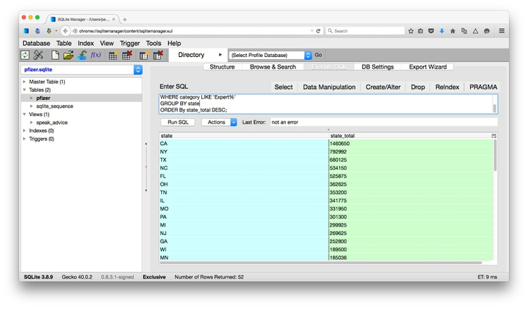

Enter `www.imdb.com` into the address bar, and when the web page loads search for a well-known movie, such as `Avatar`.

Then click `✓ I'm there!` followed by `Detect optimal settings`. This should highlight part of the webpage in green. Hit `Yes`, and at the next dialog box select the `Single` option (the other two are for extracting all of the items from a page with multiple entries, such as a set of search returns, or a web table):

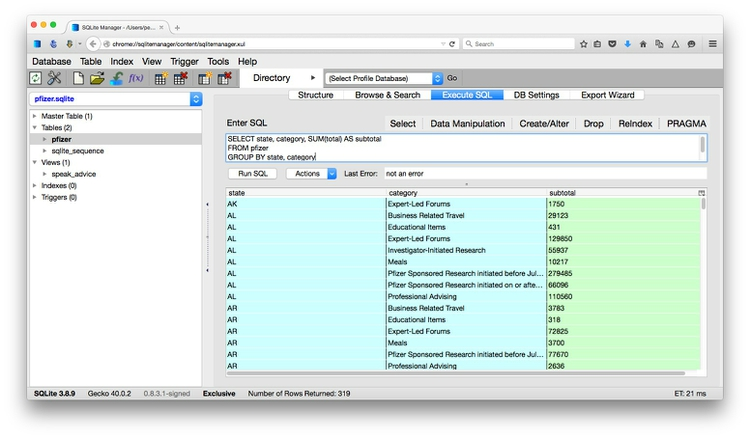

Now we can select the data we want to extract from each movie page, organizing it into columns.

Click `+ Add column`, call it title, make sure it is treated as `Text` and click `✓ Done`. Now highlight the moview title on the webpage and click `Train`. The movie title should appear in the table at bottom left:


Repeat the process for the movie release date, making the data type `Date/Time` and choosing the data format code to match the screen display:

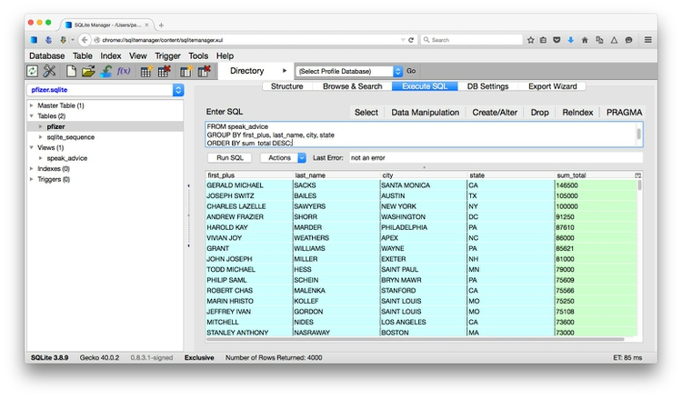

The release date, in standard `YYYY-MM-DD` format, should now appear in the table.

Repeat for other data as desired, taking care to select the correct data format for each column. Here I have selected title, release date, IMDb rating, mpaa certificate and genres:

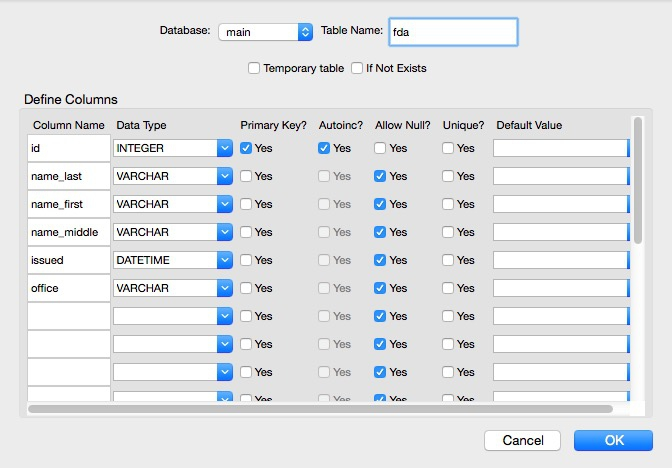

Having selected the data you want from the page, click `✓ I've got what I need!`.

Now click `Add another page`, navigate to another movie, and click `✓ I'm there!`. You may need to click on some of the columns and train to make the data appear.

Repeat the process for at least five webpages: more should give better results. Once you are satisfied that you are obtaining consistent results, click `✓ I'm done training` and then `Upload to import.io`. Enter a name for the crawler and click `✓ OK`, and when you receive the `Success!` message, `Run crawler`.

The next dialog box allows you to select the starting pages for the scrape/crawl, the number of links to follow to find similar pages (`Page depth`) and the format for the data (`CSV` or `JSON`):


In this case we can simply keep the default options, and click `► Go`. The scrape will now proceed, and you can view its progress in the information bar at the top of the screen:

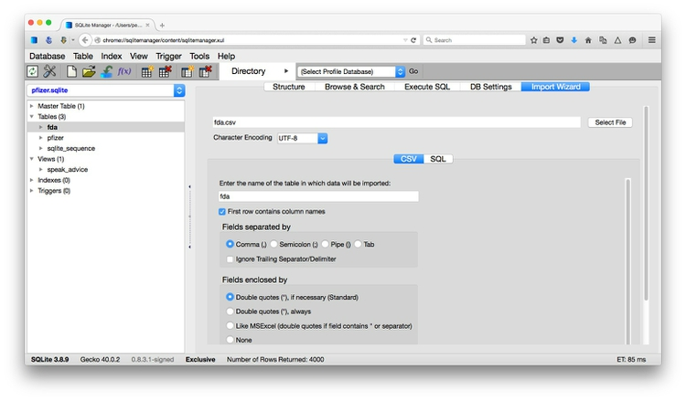

Once your scrape is complete (and be warned that scraping the whole of IMDb would take a long time), click `Upload data`. The data will appear in a table, from which you can `Download` in formats including `CSV` and `JSON`:


### PDFs: the bane of data journalism

Some organizations persist in making data available as PDFs, rather than text files, spreadsheets or databases. This makes the data hard to extract. While you should always ask for data in a more friendly format -- ideally a simple text file -- as a data journalist you are at some point likely to find yourself needing to pull data out of a PDF.

For digital PDFs, **[Tabula](http://tabula.nerdpower.org/)** is a useful data extraction tool -- however it will not work with PDFs created by scanning the original document, which have to be interpreted using Optical Character Recognition (OCR) software.

Also useful is the online service **[Cometdocs](http://www.cometdocs.com/)**. While it is a commercial tool, members of Investigative Reporters and Editors can [obtain a free account](http://ire.org/blog/ire-news/2013/05/22/ire-announces-partnership-cometdocs/). Cometdocs can read scanned PDFs, however its accuracy will vary depending on how well the OCR works on the document in question.

### Can I trust this data?

Having identified a possible source of data for your project, you need to ask: Is it reliable, accurate and useful? If you rush into analysis or visualization without considering this question, your hard work may be undermined by the maxim: “Garbage In, Garbage Out.”

The best rule of thumb in determining the reliability of a dataset is find out whether it has been used for analysis before, and by whom. If a dataset was put together for an academic study, or is actively curated so it can be made available for experts to analyze, you can be reasonably confident that it is as complete and accurate as it can be -- the U.S. Geological Survey's earthquake data is a good example.

While in general you might be more trusting of data downloaded from a `.gov` or `.edu` domain than something found elsewhere on the web, don’t simply assume that it is reliable and accurate. Be especially wary of databases that are compiled from forms submitted to government agencies, such as the Bioresearch Monitoring Information System (BMIS) database mentioned earlier.

Government agencies may be required by law to maintain databases such as BMIS, but that doesn’t mean that the information contained in them is wholly reliable. First, forms may not always be submitted, making the data incomplete. Second, information may be entered by hand from the forms into the database – and not surprisingly, mistakes are made.

So before using any dataset, do some background research to find out how it was put together, and whether it has been rigorously checked for errors. If possible, try to speak to the people responsible for managing the database, and any academics or other analysts who have used the data. They will be your best guide to a dataset’s strengths and weaknesses.

Even for well-curated data, make a point of speaking with experts who compile it or use it, and ask them about the data's quirks and limitations. From talking with experts on hurricanes, for example, I know not to place too much trust in data on North Atlantic storms prior to about 1990, before satellite monitoring was well developed -- even though the data available from NOAA goes back to 1851.

Always ask probing questions of a dataset before putting your trust in it. Is this data complete? Is it up-to-date? If it comes from a survey, was it based on a representative sample of people who are relevant to your project? Remember that the first dataset you find online may not be the most relevant or reliable.

### Recognize dirty data

In an ideal world, every dataset we find would have been lovingly curated, allowing us to start analyzing and visualizing without worrying about its accuracy.

In practice, however, often the best available data has some flaws, which may need to be corrected as far as is possible. So before starting to work with a new dataset, load it into a spreadsheet or database and take a look for common errors. Here, for example, is a sample of records from the BMIS database, with names including non-alphabetical characters -- which are clearly errors:

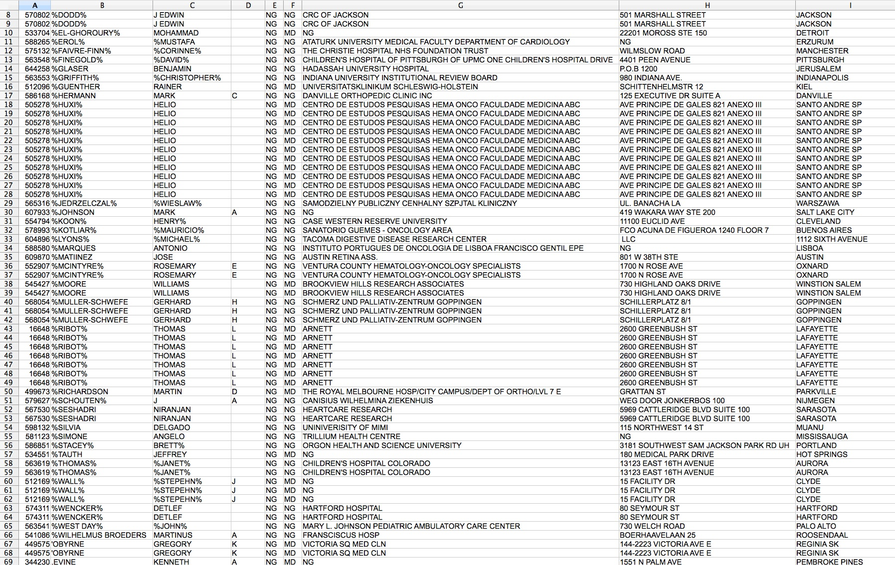

(Source: Peter Aldhous, from [Bioresearch Information Monitoring System](http://www.fda.gov/Drugs/InformationOnDrugs/ucm135162.htm) data)

Look for glitches in the alignment of columns, which may cause data to appear in the wrong field.

For people’s names, look for variations in spelling, format, initials and accents, which may cause the same person to appear in multiple guises. Similar glitches may affect addresses, and any other information entered as text.

Some fields offer some obvious checks: if you see a zip code with less than 5 digits, for instance, you know it must be wrong.

Dates can also be entered incorrectly, so it’s worth scanning for those that fall outside the timeframe that should be covered by the data.

Also scan numbers in fields that represent continuous variables for any obvious outliers. These values are worth checking out. Are they correct, or did someone misplace a decimal point or enter a number in the wrong units?

Other common problems are white spaces before and after some entries, which may need to be stripped out.

At all stages of your work, pay attention to zeros. Is each one actually supposed to represent zero, or should the cell in fact be empty? Take particular care exporting data from one software tool and importing to another, and check how nulls have been handled.

### Clean and process data with Open Refine

Checking and cleaning "dirty" data can be the most labor intensive part of  many data journalism projects, but **[Open Refine](http://http://openrefine.org/)** (formerly Google Refine) can streamline the task -- and also create a reproducible script to quickly repeat the process on data that must be cleaned and processed in the same way.

When you launch Open Refine, it opens in your web browser. However, any data you load into the program will remain on your computer -- it does not get posted online.

The opening screen should look like this:


Click the `Browse` button and navigate to the UC Berkeley 2013 grants file you downloaded from USASpending.gov. Click `Next>>`, check that the first few rows of data look correct, then click `Create Project`.

The screen should now look something like this:

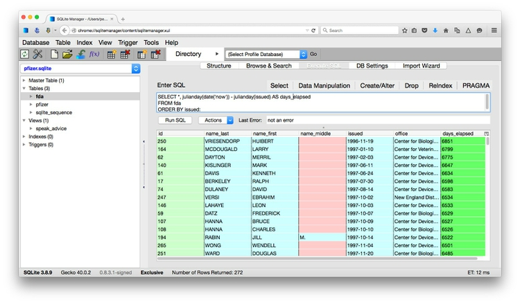

Entries recognized as numbers or dates will be green, those treated as text strings will be black.

Notice that each field/column has a button with a downward-pointing triangle. Click on this button and you get the option to create “facets” for the column, which provide a powerful way to edit and clean data.

Click on the button for the field `recipient_city_name`, and select `Facet>Text facet`. A summary of the various entries now appears in the panel to the left:


We can edit entries individually: Select `Berkley`, click on the `Edit` link, and correct the spelling. Notice that the number of entries under the correct spelling increases by one.

One problem is that we have a mixture of cases, with some entried in Title or Proper Case, some in UPPERCASE. We can fix this back in the field itself. Click its button again and select `Edit cells>common transforms>To titlecase`. Notice that `common transforms` also includes options to remove unwanted whitespace.

Go back to the text facet. From here we could edit manually, but to illustrate Open Refine's editing functions click on the `Cluster` button. Here you can experiment with different clustering algorithms to edit entries that may be variants of the same thing. To merge the suggested matches, check `Merge?`, enter the `New Cell Value` then click one of the `Merge Selected` buttons:


Open Refine's facets can also be used to inspect columns containing numbers. Click on the button for the field `fed_funding_amount` and select `Facet>numeric facet`. This will create a histogram showing the distribution of numbers in the field:

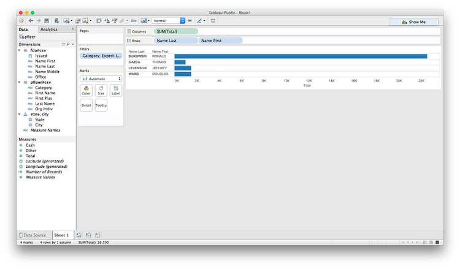

We can then use the slider controls to filter the data, which is good for examining possible outliers at the top of bottom of the range. Notice that here a small number of grants have negative values. The minus signs might be errors, so those grants would need to be checked out.

If the data is spread over a very wide range, we can switch to a logarithmic scale for the histogram by selecting `change`, entering `log(value)` for the expression and clicking `OK`.

Often we may need to convert fields to text, numbers or dates. For example, click on the button for `starting_date` and select `Edit cells>common transforms>To date` and see that it changes from a string of text to a date in standard format.

We can also split or merge columns. For example, the column `agency_code` consists of a number, followed by a colon and some text. To put the numbers and text into different fields, click on the column's button, and select `Edit column>Split into several columns` and fill in the dialog box as follows:

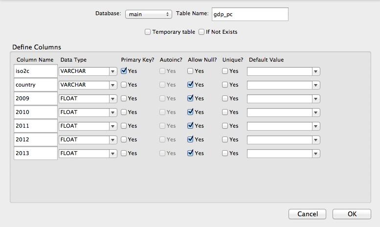

Click the `OK` button, and the columns will split.

Now we will merge the columns `receip_addr1` and `receip_addr2` into a single `address`	field. Click on the button for the first of these columns and select `Edit column>Add column based on this column` and fill in the dialog box as follows:

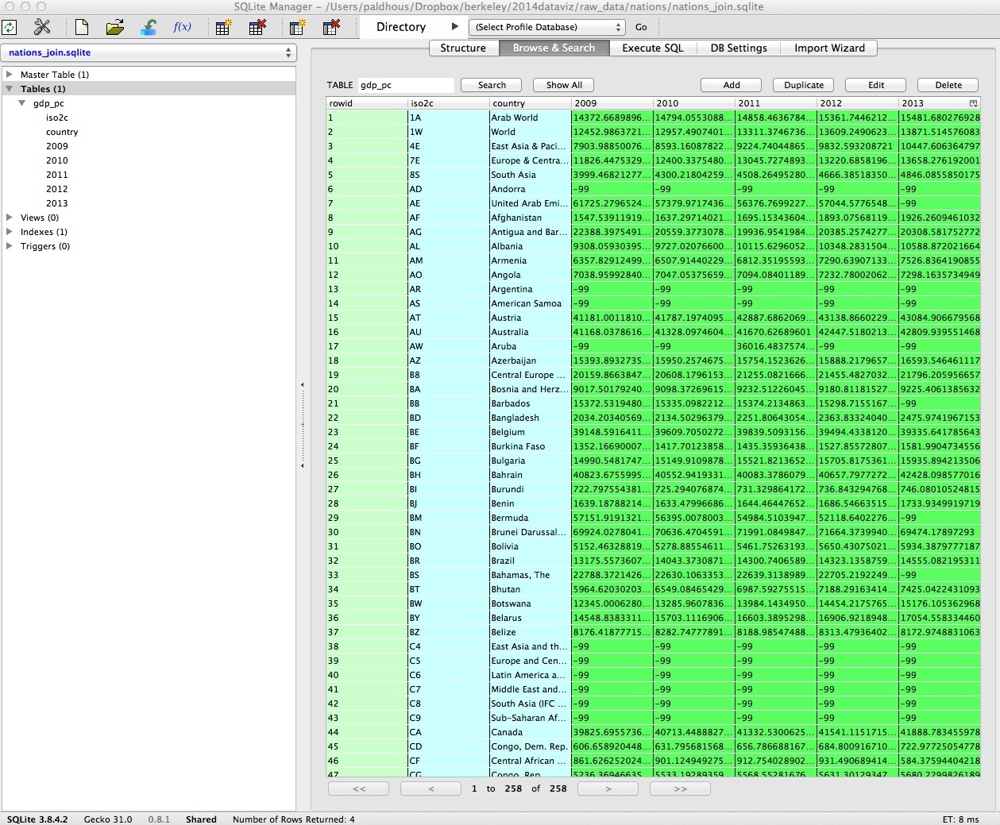

Study the expression used:

```cells["receip_addr1"].value + ", " + cells["receip_addr2"].value```

This is some simple code in Open Refine's expression language to `concatenate` the two text strings into a single string, including a comma followed by a space to separate them. Selecting the option `On error: copy value from original column` ensures that where the second column is blank, the new field will contain the value from the first.

Click `OK` and the new address column will be created.

We can also create new fields using specified text extracted from an existing field. Click on the button for the `recipient_name` field, select `Edit column>Add column based on this column` and enter the expression `substring(value, 1)`. This should extract all the letters apart from the first. Now try `substring(value, 0, 1)`, which should extract just the first letter.

Experiment with the below, to work out the logic of the `substring` function:

```
substring(value, -1)
substring(value, -2)
substring(value, -4, -1)
substring(value, 1)
substring(value, 1, 8)
```
Here we are "slicing" strings of text based on an index which defines the position of individual characters. The first character is 0, followed by 1, 2, and so on. We can also index from the end of the string: the last character is -1, the second last is -2, and so on.

If you feed the `substring` function just one number after `value`, it will start at that position, and give you that character and everything else to the end of the string. If you use two numbers, it will start at the first position and give you that character everything up to (but not including) the character at the second position.

While many of the options we have explored could also be done a spreadsheet, the big advantage of Open Refine is that we can extract a "pipeline" for processing data to use when we obtain data in the same format in future.

Select `Undo / Redo` then click `Extract`. At the dialog box, check only those operations that you will want to perform in future (typically generic transformations on fields/columns, and not correcting errors for individual entries):

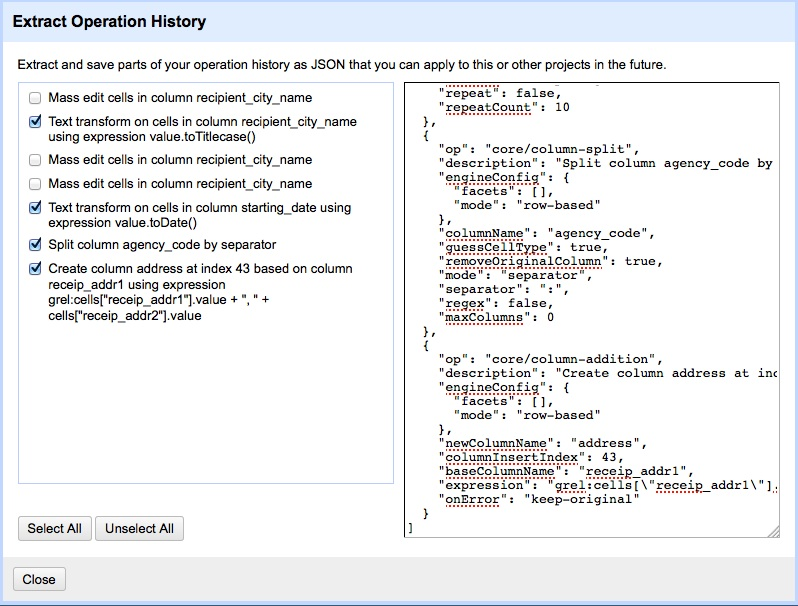

This will generate JSON in the right hand panel that can be copied into a blank text file and saved with the extension `json`.

To process similar data in future. Click the `Apply` button on the `Undo / Redo` tab, paste in the text from this file, and click `Perform Operations`. The data will then be processed automatically.

When you are finished cleaning and processing your data, click the `Export` button at top right to export as a `CSV` file or in other formats.

Open Refine is a very powerful tool that will reward efforts to explore its wide range of its functions for manipulating data. See the Further Reading for more.

### Standardize names with Mr People

For processing names from a string of text into a standardized format with multiple fields, you may wish to experiment with **[Mr People](http://people.ericson.net/)**, a web app made by Matt Ericson, a member of the graphics team at *The New York Times*.


(Source: [Mr People](http://people.ericson.net/))

It takes a simple list of names and turns them into separate fields for title, first name, last name, middle name and suffix.

Mr People can save you time, but it is not infallible -- it may give errors with Spanish family names, for instance, or if people have multiple titles or suffixes, such as “MD, PhD.” So always check the results before moving on to further analysis and visualization.

### Correct for inflation (and cost of living)

A common task in data journalism and visualization is to compare currency values over time. When doing so, it usually makes sense to show the values after correcting for inflation -- for example in constant 2013 dollars for a time series ending in 2013. Some data sources, such as the World Bank, provide some data both in raw form or in a given year's constant dollars.

So pay attention to whether currency values have already been corrected for inflation, or whether you will need to do so yourself. When correcting for inflation in the United States, the most widely-used method is the [Consumer Price Index](http://www.bls.gov/cpi/), or CPI, which is based on prices paid by urban consumers for a representative basket of goods and services. Use this [online calculator](http://www.bls.gov/data/inflation_calculator.htm) for correcting a small number of values. If you need to correct for inflation in bulk, I can show you later how to do this in R.

For comparing currency values across nations, regions or cities, you may also need to correct for the cost of living -- or differences in what a dollar can buy in different places. For World Bank indicators, look for the phrase "purchasing power parity," or PPP, for data that includes this correction. PPP conversion factors for nations over time are given [here](http://data.worldbank.org/indicator/PA.NUS.PPPC.RF).


### Understand common data formats, and convert between them

Up until now, we have used data in text files, either tab-delimited or in `CSV` format. You may encounter text files with other delimiter characters, and also "fixed width" text files, which line the fields up with each located a specified number of characters across each row. Libre Office Calc can import fixed-width files, which you can then export in a delimited format for use in other software.

Text files are great for transferring data from one spoftware application to another during analysis and visualization, but other formats that are easier for machines to read are typically used when transferring data between computers online. If you are involved in web development or designing online interactive graphics, you are likely to encounter these formats.

**[JSON](http://json.org/)**, or JavaScript Object Notation, which we have already encountered today, is a data format often used by APIs. JSON treats data as a series of “objects,” which begin and end with curly brackets. Each object in turn contains a series of name-value pairs. There is a colon between the name and value in each pair, and the pairs separated by commas.

Here, for example, are the first few rows of the infectious disease and democracy data from week 1, converted to JSON:

```json
[{"country":"Bahrain","income_group":"High income: non-OECD","democ_score":45.6,"infect_rate":23},
{"country":"Bahamas, The","income_group":"High income: non-OECD","democ_score":48.4,"infect_rate":24},
{"country":"Qatar","income_group":"High income: non-OECD","democ_score":50.4,"infect_rate":24},
{"country":"Latvia","income_group":"High income: non-OECD","democ_score":52.8,"infect_rate":25},
{"country":"Barbados","income_group":"High income: non-OECD","democ_score":46,"infect_rate":26}]
```

**[XML](http://www.w3.org/XML/)**, or Extensible Markup Language, is another format often used to move data around online. For example, the RSS feeds through which you can subscribe to content from blogs and websites using a reader such as [Feedly](https://feedly.com/) are formatted in XML.

In XML data is structured by enclosing values within “tags,” similar to those used to code different elements on a web page in HTML. Here is that same data in XML format:

```xml
<?xml version="1.0" encoding="UTF-8"?>
<rows>
  <row country="Bahrain" income_group="High income: non-OECD" democ_score="45.6" infect_rate="23" ></row>
  <row country="Bahamas, The" income_group="High income: non-OECD" democ_score="48.4" infect_rate="24" ></row>
  <row country="Qatar" income_group="High income: non-OECD" democ_score="50.4" infect_rate="24" ></row>
  <row country="Latvia" income_group="High income: non-OECD" democ_score="52.8" infect_rate="25" ></row>
  <row country="Barbados" income_group="High income: non-OECD" democ_score="46" infect_rate="26" ></row>
</rows>
```

**[Mr Data Converter](http://shancarter.github.io/mr-data-converter/)** is a web app made by Shan Carter of the graphics team at *The New York Times* that makes it easy to convert data from a spreadsheet or delimited text file to JSON or XML.

Copy the data from a `CSV` or tab-delimited text file and paste it into the top box, select the output you want, and it will appear at the bottom. You will generally want to select the `Properties` variants of JSON or XML.

You can then copy and paste this output into a text editor, and save the file with the appropriate suffix (`xml`, `json`).


(Source: [Mr Data Converter](http://shancarter.github.io/mr-data-converter/))

To convert data from JSON or XML into text files, use Open Refine. First create a new project and import your JSON or XML file. Then use the `Export` button and select `Tab-separated value` or `Comma-separated value` to export as a text file.

### Assignment

One of the suggested final project data collections includes the baseball salaries data from [Baseball Prospectus](http://www.baseballprospectus.com/compensation/?cyear=2013&team=&pos=) we looked at in week 1, plus data on 2013 player performance statistics from [MLB.com](http://mlb.com/home) -- for [hitting](http://mlb.mlb.com/stats/sortable.jsp#elem=[object+Object]&tab_level=child&click_text=Sortable+Player+hitting&game_type=%27R%27&season=2013&season_type=ANY&league_code=%27MLB%27&sectionType=sp&statType=hitting&page=1&ts=1411250613351&playerType=ALL&sportCode=%27mlb%27&split=&team_id=113&active_sw=&position=&page_type=SortablePlayer&sortOrder=%27desc%27&sortColumn=avg&results=&perPage=2000&timeframe=&last_x_days=&extended=0), [pitching](http://mlb.mlb.com/stats/sortable.jsp#elem=[object+Object]&tab_level=child&click_text=Sortable+Player+pitching&game_type=%27R%27&season=2013&season_type=ANY&league_code=%27MLB%27&sectionType=sp&statType=pitching&page=1&ts=1411251900682&playerType=ALL&sportCode=%27mlb%27&split=&team_id=113&active_sw=&position=&page_type=SortablePlayer&sortOrder=%27desc%27&sortColumn=avg&results=&perPage=2000&timeframe=&last_x_days=&extended=0) and [fielding](http://mlb.mlb.com/stats/sortable.jsp#elem=[object+Object]&tab_level=child&click_text=Sortable+Player+fielding&game_type=%27R%27&season=2013&season_type=ANY&league_code=%27MLB%27&sectionType=sp&statType=fielding&page=1&ts=1411251916789&playerType=ALL&sportCode=%27mlb%27&split=&team_id=113&active_sw=&position=&page_type=SortablePlayer&sortOrder=%27desc%27&sortColumn=avg&results=&perPage=2000&timeframe=&last_x_days=&extended=0).

To join the data reliably in a database, you would need to use the players' names and teams, but there are several obstacles:

- Names in the Baseball Prospectus data are in the format `John Smith`, while those the the MLB.com data are in the format `Smith, J`.
- The Baseball Prospectus names do not include the suffix `Jr.`, but a small number of names in the MLB.com data have this suffix, giving the format `Smith Jr., J`
- The team abbreviations used have some differences.

So your assignment is:

 - Download all of the baseball data from [here](./data/baseball.zip).
 - Use Open Refine to process the salaries data from Baseball Prospectus to allow it to be joined reliably to the MLB.com player statistics data.
 - Extract the JSON summarizing your steps in processing the data.
 - Export the processed data in CSV format.
 - Send me the processed data, and the JSON file detailing the steps used to process it.

### Further reading

Paul Bradshaw. *[Scraping For Journalists](https://leanpub.com/scrapingforjournalists)*

Dan Nguyen. *[The Bastards Book of Ruby](http://ruby.bastardsbook.com/)*
I use Python rather than Ruby, but this book provides a [good introduction](http://ruby.bastardsbook.com/chapters/web-scraping/) to the practice of web scraping using code, and [using your browser's web inspector](http://ruby.bastardsbook.com/chapters/web-inspecting-html/) to plan your scraping approach.

[Open Refine Wiki](https://github.com/OpenRefine/OpenRefine/wiki)

[Open Refine Documentation](https://github.com/OpenRefine/OpenRefine/wiki/Documentation-For-Users)

[Open Refine Recipes](https://github.com/OpenRefine/OpenRefine/wiki/Recipes)

