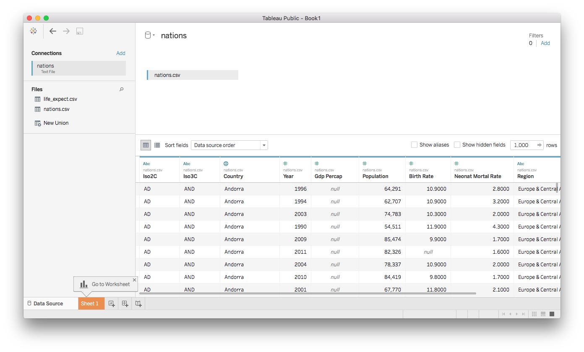

#Let's apply what we've learned so far

Your task for this week's class is to create a Tableau version of the visualization in [this Gapminder video](http://www.gapminder.org/videos/200-years-that-changed-the-world-bbc/), using data from the World Bank's [World Development Indicators](http://data.worldbank.org/indicator/all) (WDI).

How to proceed:

- Download data in CSV format for life expectancy at birth by nation over time from [here](http://data.worldbank.org/indicator/all).

- Clean and process this data using Open Refine. Hints: when importing the data you will need to ignore the first few lines, and will have to tell Open Refine that the separators are commas. You will also need to convert the data from wide to long format.

- Export the data in CSV format, and save the JSON that will enable you to process WDI data in the same way in future (you will need this for the assignment).

- Using SQLite, join this data to the `nations.csv` file we used in week 3. Export the joined data as a CSV file.

- Use this file to create a version of the Gapminder visualization, covering the period from 1990 to 2013.

### Assignment

- Download data on carbon dioxide emissions in metric tonnes per capita, from [here](http://data.worldbank.org/indicator/EN.ATM.CO2E.PC).

- Process this data in Open Refine using the JSON you saved from the class exercise above, and export as a CSV file.
-  Join the exported data to the file `nations.csv` in Tableau, then create the simple dashboard shown below, recording total carbon dioxide emissions by region and nation, from 2000 to 2011. Hint: You will need to create a calculated variable for total emissions.

 

