# Making static maps and processing geodata with GIS

### Introducing QGIS

[**GQIS**](http://qgis.org/en/site/) is the leading free, open source Geographic Information Systems (GIS) application. It is capable of sophisticated geodata processing and analysis, and also can be used to design publication-quality data-driven maps.

The possibilities are almost endless, but you don't need to be a GIS expert to put it to effective use for both displaying and processing geographic data, whether for online or print maps.

Launch QGIS, and you should see a screen like this:

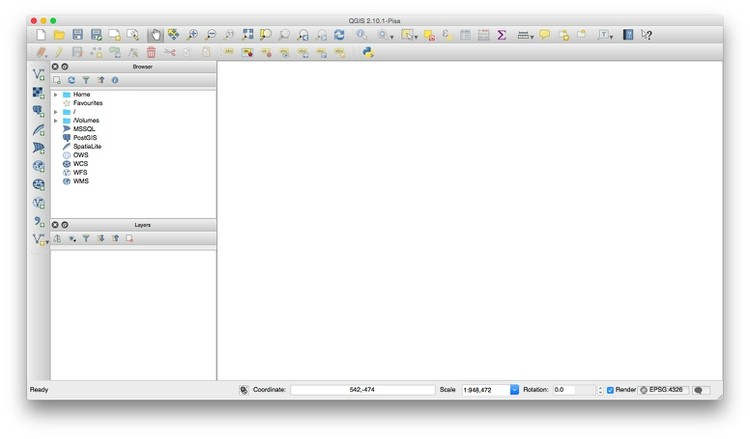

### The data we will use today

Download the data from this session from [here](data/week8.zip), unzip the folder and place it on your desktop. It contains the following folders and files:

- `ca_healthcare`
 - `ca_counties_medicare` Shapefile with data on Medicare reimbursement per enrollee by California county in 2012, from the [Dartmouth Atlas of Healthcare](http://www.dartmouthatlas.org). 
 - `healthcare_facilities.csv` Locations and other data for hospitals and other healthcare facilities in California, from the [California Department of Public Health](https://cdph.data.ca.gov/Facilities-and-Services/Healthcare-Facility-Locations/n8ju-ifrh). I have geocoded those facilities that lacked latitude and longitude coordinates in the raw data.
- `gdp_pc`
 - `gpd_pc.csv` `gdp_pc.csvt` CSV file with [World Bank data](http://data.worldbank.org/indicator/NY.GDP.PCAP.PP.CD) on GDP per capita for the world's nations in 2014, plus ancillary file for QGIS to understand the data types for each field.
- `ne_50m_admin_0_countries` [Natural Earth shapefile](http://www.naturalearthdata.com/downloads/50m-cultural-vectors/50m-admin-0-countries-2/) with boundary data for the world's nations.
- `seismic_risk` [U.S. Geological Survey shapefile](http://earthquake.usgs.gov/hazards/products/conterminous/index.php#2014) detailing the risk of experiencing a major earthquake across the continental United States.
- `sf_test_addresses` Shapefile derived from the addresses we geocoded in week 7.
- `syria`
 - `2013_Q1` Shapefile with data on [violent events](http://paldhous.github.io/Syria/about.html) in Syria in the first quarter of 2013, derived from the [Global Data on Events, Location and Tone](http://gdeltproject.org/) dataset.


### Map Medicare reimbursements and hospital locations and capacities in California

#### Make a choropleth map showing Medicare reimbursements by county

As we discussed in week 7, choropleth maps fill areas with color, according to values in the data.

We will first import the shapefile in the `ca_counties_medicare` folder.

Select `Layer>Add vector layer` or click on this icon:

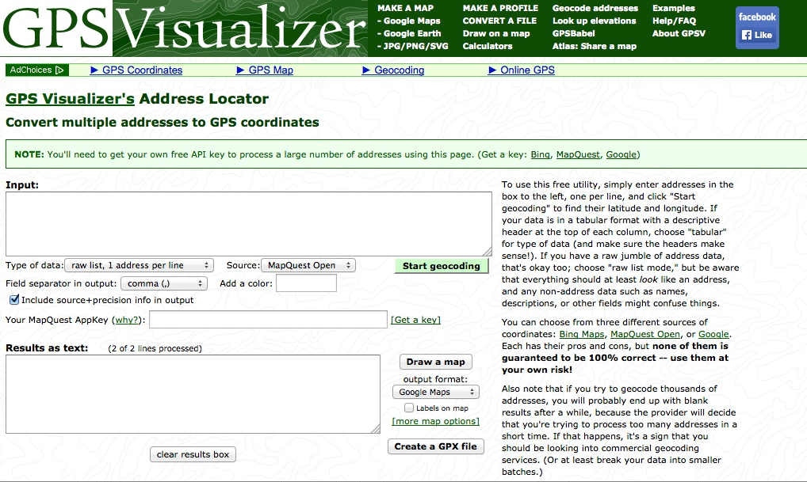

At the dialog box, click `Browse` and navigate to the file `ca_counties_medicare`. It is important that you select the file with the `.shp` extension. Then click open, and the following map of California should appear, filled with a random color:

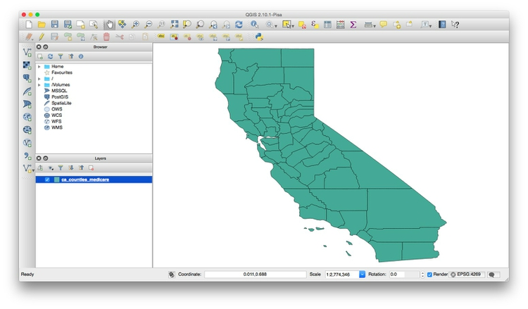

You can turn off the visibility of any layer by unchecking its box in the `Layers` panel. This can be useful to see the status of layers that would otherwise be obscured.

These controls allow you to pan and zoom the display:


You can focus the display on the full extent of any layer by right-clicking it in the `Layers` panel and selecting `Zoom to layer`.

Notice `EPSG:4269` at the bottom right. This is defines the map projection and datum for the layer.

Right-click on `ca_counties_medicare` in the `Layers` panel at left and select `Properties>General`. You should see the following under `Coordinate reference system`:

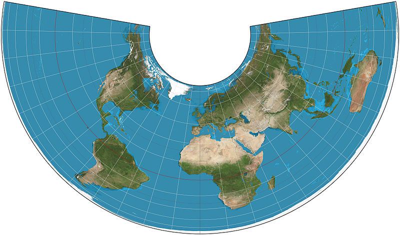

 `EPSG:4269` and `NAD83` mean that this shapefile is in an [equirectangular projection](http://en.wikipedia.org/wiki/Equirectangular_projection), and the [NAD83](http://en.wikipedia.org/wiki/North_American_Datum) datum.

(The default for QGIS if no projection is specified is `EPSG:4326`, which is an equirectangular projection, and the [WGS84](https://en.wikipedia.org/wiki/World_Geodetic_System) datum)

We will select another projection for our map later. Click `Cancel` or `OK` to close `Properties` for this layer.

Now we need to color the areas for the `ca_counties_medicare` layer by values in the data. Right-click on it in the `Layers` panel and select `Open Attribute Table`, which corresponds to the `.dbf` of the shapefile:

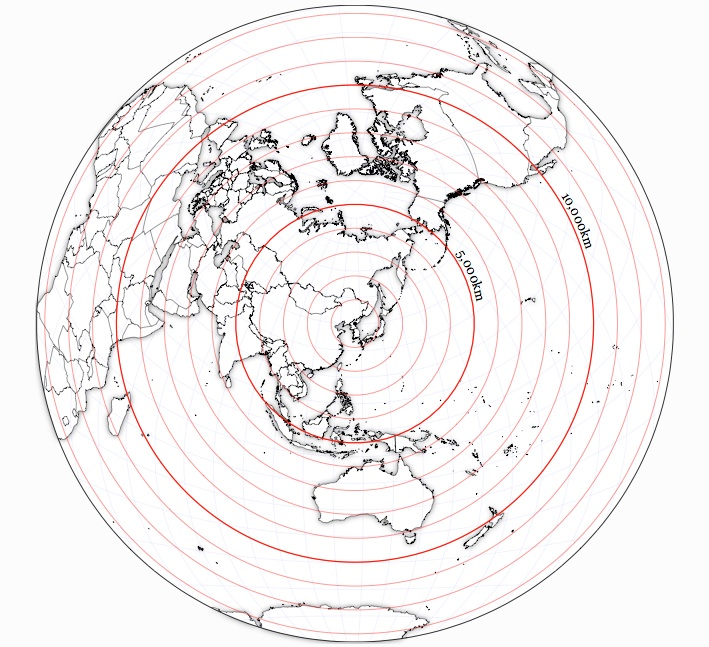

Scroll to the right of the table to see the fields detailing various categories of Medicare reimbursement:


We are going to make a choropleth map of reimbursements per enrollee for hospitals and skilled nursing facilities, in the `HOSPITAL` field.

To do this, close the attribute table and call up `Properties>Style` for the `ca_counties_medicare` layer. Select `Graduated` from the dropdown menu at top, which is the option to color data according to values of a continuous variable. Select `5` under `Classes`, and then `New color ramp...` under `Color ramp`. While QGIS has many available color ramps, we will use this opportunity to call in a [ColorBrewer](http://colorbrewer2.org/) sequential color scheme. At the dialog box select `ColorBrewer` and then `Reds`, and then click `OK`:

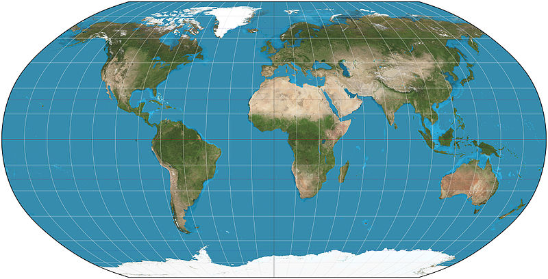

You will need to give the color ramp a name -- the default `Reds5` is fine. Select `HOSPITAL` under `Column`, and select `Quantile (Equal Count)` for `Mode`. This menu gives various options for automatically setting the boundaries between the five classes or bins. Then click the `Classify` button to produce the following display:


Now let's edit the breaks manually to use values guided by the quantiles, but which will be easier for users to process when reading the map legend.

Double-click on the first symbol and select `3250` for the `Upper value` and click `OK`. Then double-click on the `Label` for this symbol and edit the text to `< $3,250`. Carry on editing the values and labels until the display looks like this:


Click `OK` and the map should look like this:

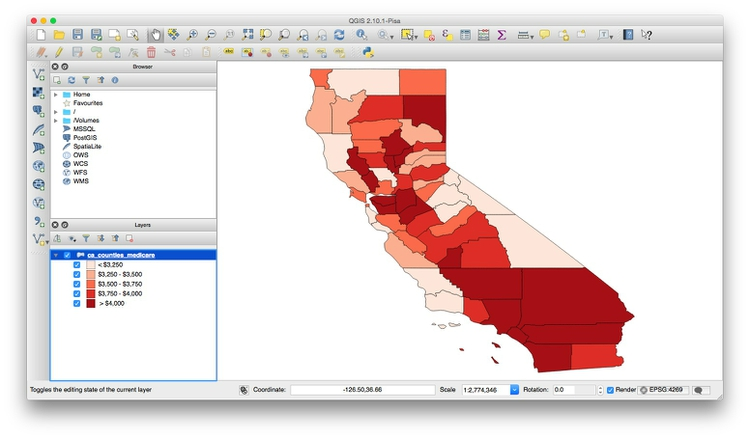

I often prefer white boundaries on a choropleth map. So open up the `Style` tab under `Properties` once more and click on `Symbol>Change...`. Then select `Simple fill`, click on the color for `Border` and in the color wheel tab of the color picker, change the color to white, by moving each of the RGB sliders to `255`:

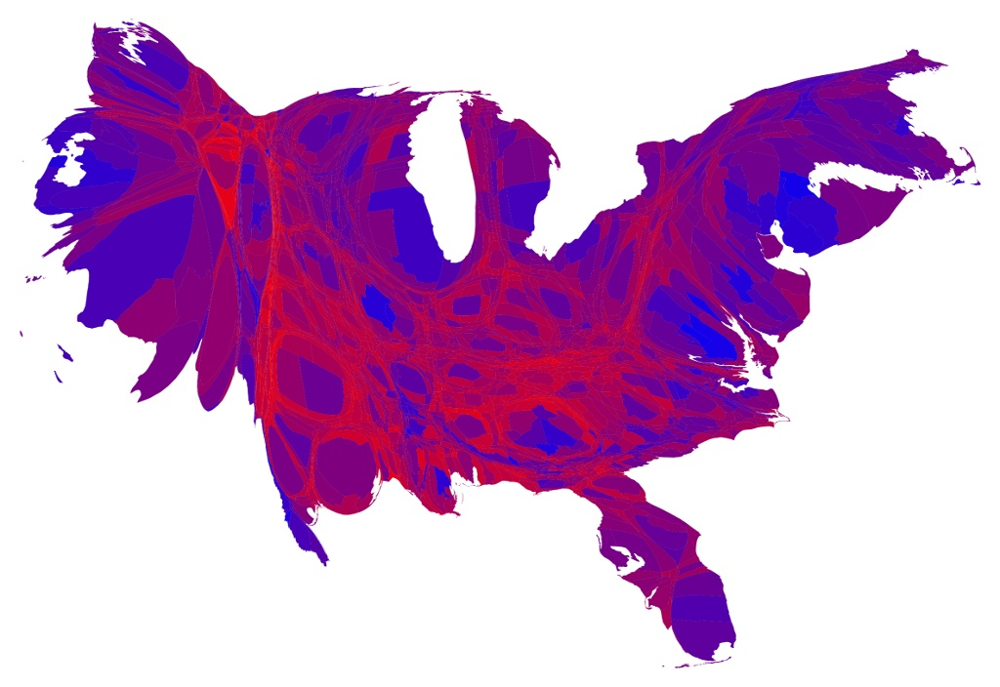

Click on `Symbol>Change` once more, and and set the `Transparency` to 50%. This will keep the relative distinctions between the colors, but tone them down a little so they don't dominate the layer we will later plot on top.

If you are likely to want to style data in the same format in the same way in future, it is a good idea to click the `Save Style` button at bottom right and save as a `QGIS Layer Style File`, which is a variant of [XML](http://www.w3.org/XML/). When loaded using the `Load Style ...` button at bottom left, it will automatically apply the saved styling to future maps.

The map should now look like this:

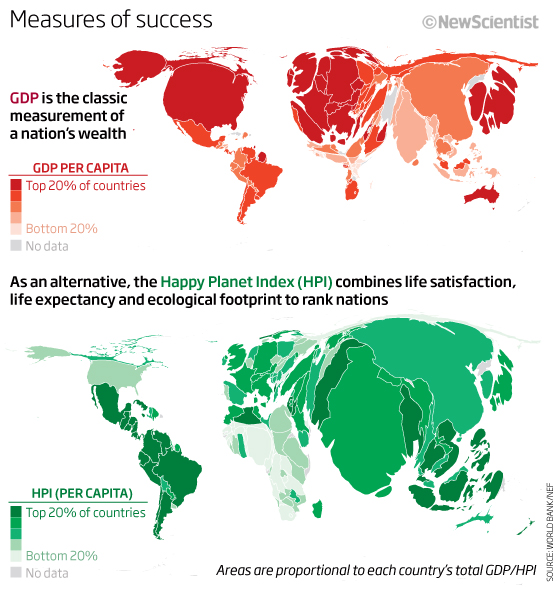

To add labels to the map, select `Properties>Labels` and fill in the dialog box. Here I am adding a `NAME` label to each county, using `Arial` font, `Italic` style at a size of `11` points and with the color set to a HEX value of `#4c4c4c` for a dark gray:

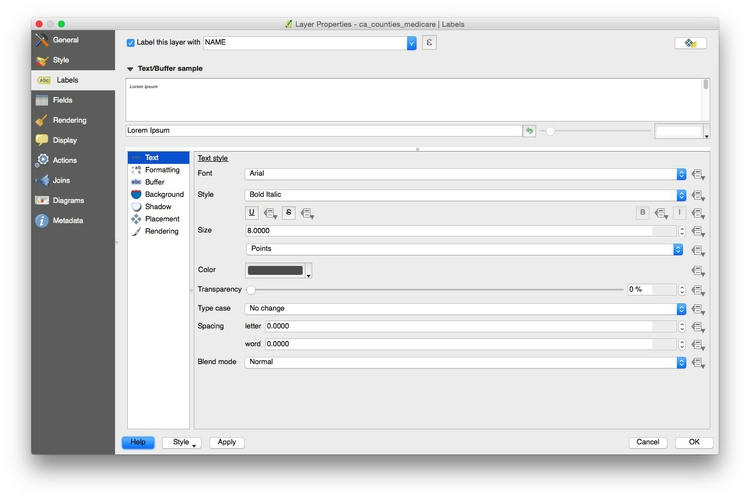

Click `OK` and the map should now look like this:

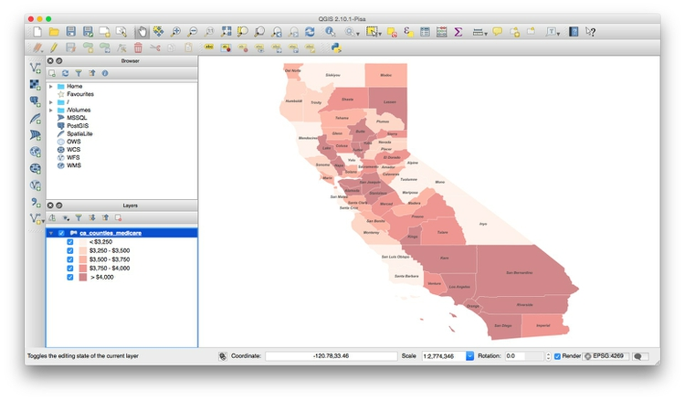

Save the project, by selecting `Project>Save` from the top menu.

Now is a good time to give the project a projection: We will use variant of the [Albers Equal Area Conic projection](http://en.wikipedia.org/wiki/Albers_projection), optimized for maps of California.

Select `Project>Project Properties>CRS` (for Coordinate Reference System) from the top menu, and check `Enable 'on the fly' CRS transformation`. This will convert any subsequent layers we import into the Albers projection, also.

Type `Albers `into the `Filter` box and select `NAD83(HARN)/ California Albers`, which has the code `EPSG:3311`:


Click `OK` and the map should reproject. Notice how `EPSG:3311` now appears at bottom right:


#### Add a layer showing locations and capacities hospitals/skilled nursing facilities

To import a CSV or other delimited text file with points described by latitude and longitude coordinates, select `Layer>Add Delimited Text Layer` from the top menu or click this icon:


`Browse` to the file `healthcare_facilities.csv`, and ensure that the dialog box is filled in like this:


If your text file is not a CSV you will have to select the correct delimiter, and if your latitude and longitude fields have other names, you may have to select the `X field` (longitude) and `Y field` (latitude) manually.

When you click `OK` you will be asked to select a projection, or CRS, for the data. You may be tempted to select the same Albers projection we have set for the project, but this will cause an error. QGIS will handle the conversion to that projection: Because the data in the CSV file is not yet projected, instead select a datum with a default equirectangular projection, either `WGS 84 EPSG:4326` or `NAD83 EPSG:4297`.

Click `OK` and a large number of points will be added to the map:


Now we will style these points, using color to distinguish hospitals from skilled nursing facilities, removing other facilities from the map, and scaling the circles according to the capacity of each facility.

Select `Properties>Style` for the `healthcare_facilities` layer, and accept `Categorized` from the top dropdown menu. Select `TYPE` under `Column` and then hit the `Classify` button. (Keeping `Random colors` for the `Color ramp` is fine, as we will later edit the colors manually). Select and then `Delete` facilities other than `General Acute Care Hospital` and `Skilled Nursing Facility`, as follows (This will remove them from the map, but not from the underlying data):


You should be left with the following:


Now click the `Advanced` button to the right and select `Size scaled field`, making sure `Scale area` is checked (this will ensure that the circles we are about to draw scale correctly, by area). Check `CAPACITY` to select that as the field to scale the size of the circles. Click `OK` and the map should look like this:


The relative sizes of the circles are fine, but they are too big.

To fix this, return to `Properties>Style>Advanced`, then select
`- expression -` and fill in the dialog box as follows:


Here we are simply dividing the numbers in the `CAPACITY` field by 30, which I have found through trial-and-error gives a reasonable display.

In the main `Style` tab, click on each point symbol and select `Simple marker` to edit its color. Also set transparency for the symbols to 50%, as we did for the choropleth map.

The final map should look like this:


#### Export the finished map in raster image or vector graphic formats

We will export our finished map with a legend explaining the colors, so let's change the name of the fields so they display nicely. Right-click on each layer and rename them `Facility type` and `Medicare reimbursement per enrollee` respectively.

To export the map, select `Project>New Print Composer`, give the composer an appropriate name and click `OK`. In the print composer window, select the following options in the `Composition` tab (I have chosen a `Portrait` orientation to best fit the shape of California):


Now click the `Add new map` icon:


Draw a rectangle over the page area, and the map should appear. At this point, you may need to alter the zoom level and position of your map in the main QGIS display to get a pleasing display in the print composer. (In this case, it is also worth changing the size/shape of the main QGIS window to match the portrait orientation.)

Your print composer should end up looking something like this:


Once you are statisfied with the appearance of your map in the print composer, click the `Add legend` icon:


Draw a rectangle on the page where you want the legend to appear:


In the `Item properties` tab, edit `Fonts` and other options as desired. Here I have simply deleted the default `Title` of `Legend`:

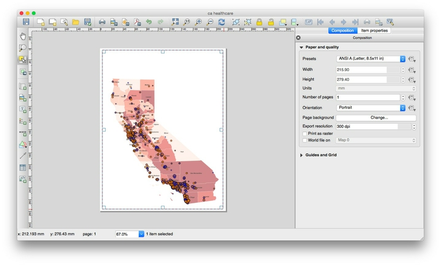

You can save your maps in raster image formats (JPG, PNG etc) from the Print Composer by clicking the `Save Image` icon:


The map can be exported in SVG and PDF vector formats by clicking these export icons:


Note that the SVG export may not clip the map to the page exactly. However, this can be fixed in a vector graphics editor such as [Adobe Illustrator](http://www.adobe.com/products/illustrator.html) or [Inkscape](https://inkscape.org/en/), and then saved as a PDF. This may provide a better rendering of the map than through a direct PDF export.

You can also save as an image from the main map display (so without any legend and annotation added in the Print Composer) by selecting `Project>Save as Image` from the top menu.

Save the QGIS project, and then select `Project>Close` to close.

#### Join external data to a shapefile

Open a new project by selecting `Project>New` from the top menu.

In this new project, import the `ne_50m_admin_0_countries` shapefile. Right-click on it in the `Layers` panel and `Save As ...` an `ESRI shapefile`, keeping the default `WGS 84` CRS. `Browse` to the `gdp_pc` folder, call the new file `gdp_pc` and check the option to `Add saved file to map`.

Open the attribute table of the new shapefile and notice that it contains a field called `iso_a3`, which is a [three-letter code](http://unstats.un.org/unsd/tradekb/Knowledgebase/Country-Code) for each country, assigned by the [International Organization for Standardization](hhttp://www.iso.org/iso/home/store/catalogue_tc/catalogue_detail.htm?csnumber=63545).

Now use `Add Vector Layer` to import the file `gdp_pc.csv`. (Note that when joining external data in a CSV file to a shapefile, you do *not* import the file as a delimited text file, as we did previously to display data on a map.)

After import, this file will appear as an isolated table in the `Layers` panel. Select it and open the attribute table to view the data, which contains country names, the three-letter country codes, and data on GDP per capita in 2014:


Notice that some cells contain the value `-99`, which is here being used to designate `null` values, where there is no data.

The same subfolder with the file also contains the file `gdp_pc.csvt`. This contains information about the type of data in each field of the CSV file, in this case:

```
"String","String","Real"
```

When we make the join, this will tell QGIS what sort of data is in each field of the CSV file. `String` indicates a string of text, `Real` indicates numbers that can include decimals, while `Integer` indicates whole numbers. Without this information, QGIS will treat all of the fields in the file as text.

Close the attribute table once more, right-click on the `gdp_pc` shapefile and select `Properties>Joins`. Click the green plus sign and fill in the dialog box as follows to join the CSV file to the shapefile by the `iso_a3` three-letter country codes:


After completing the join, open the shapefile's attribute table once more to confirm that the data from the CSV file has appeared.

#### Save the joined data in another geodata format

Right-click on the joined shapefile, select `Save As ...` and notice the `Format` options include ESRI shapefile, GeoJSON and KML. You are also able to choose a projection (CRS) for the new shapefile and restrict its extent by latitude and longitude coordinates.

Save this file as GeoJSON with an appropriate name, keeping the default `WGS 84` CRS.

#### Simplify the joined data, and save again

When displaying geodata online, it is sometimes necessary to simplify boundary data to give a smaller file size, allowing faster loading in a web browser.

Select the joined shapefile, then select `Vector>Geometry Tools>Simplify geometries`, and fill in the dialog box as follows, saving as a shapefile with a new name:


In practice, you will want to experiment with different values for `Simplify tolerance` to give an acceptable trade-off between file size and appearance at high zoom levels.

Save the simplified file as GeoJSON, and compare the file size with the previously saved version.

Alternatively, you can also simplify geodata outside of QGIS using the [**mapshaper**](http://www.mapshaper.org/) web app. This has the advantage that you can move a slider to control the amount of simplification, and see the effect that this will have before exporting the simplified file.

#### Use QGIS's vector geoprocessing tools

Start a new project, and import both the `ne_50m_admin_0_countries` shapefile, and the `seismic_risk` shapefile, which describes the risk of experiencing a damaging earthquake across the continental United States. Note that it extends beyond the boundaries and coastline of the U.S.:


Open the attribute table for the `ne_50m_admin_0_countries` shapefile, and select the United States:


Close the attribute table once more, and turn off the visibility of the seismic risk layer briefly to confirm that the United States is now highlighted.

Select `Vector>Geoprocessing Tools>Clip` and fill in the dialog box as follows, making sure that `Use only selected features` is checked for the `Clip layer`:


Click `OK` and a new shapefile will be created, clipped to the borders and coastline of the United States.

Sometimes you may need to draw your own shape to clip to, rather than using existing geodata. When drawing shapes based on city streets, [this web app](http://www.birdtheme.org/useful/v3tool.html) can be a useful tool. Select the `Polygon` and `KML` options from the dropdown menu and draw your shape over the basemap.


Paste the resulting code into a text file and save with the extension `.kml`. You can then use this KML file as a clip layer in QGIS.

Look at the other options in the `Vector>Geoprocessing Tools` menu. Their icons give a good idea of what they do; see [here](http://docs.qgis.org/2.2/en/docs/user_manual/plugins/plugins_ftools.html) for a full explanation. (`Intersect` is similar to `Clip`, except that it includes data from both layers in the new attribute table.)

Now open a new project, and import the shapefile `sf_test_addresses`. I made this shapefile from the addresses we geocoded in week 7. I saved it in a `Google Mercator` projection, also known as `EPSG:900913`, used for Google and other online maps.

This is important, because we are going to create a "buffer" defining areas within 1,000 feet of the nearest point. For this we need a projection with units defined in distance, rather than degrees, which is the unit for the `WGS 84` datum.

To confirm the units for the `Google Mercator` projection, click on the globe symbol at bottom-right:


You should see that the CRS/projection information that appears near the bottom of the dialog box contains `+units=m`, which tells us that distances in this projection are measure in meters:


Creating a buffer shapefile is a task you might perform if, for example, working out which areas are off-limits for sex offenders under [residency restrictions](http://www.atsa.com/sexual-offender-residence-restrictions).

Select `Vector>Geoprocessing Tools>Buffer(s)...` and fill in the dialog box as follows:

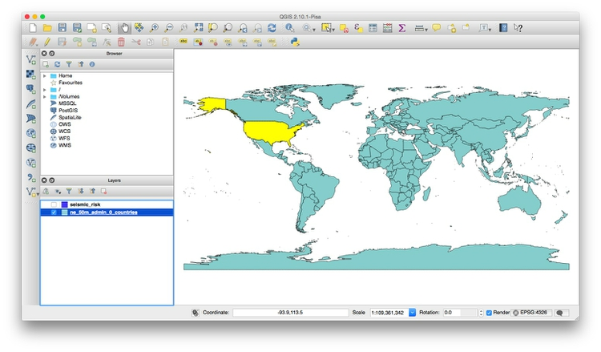

Selecting the maximum value of `99` under `Segments to approximate` ensures that the resulting shapes are as smooth as possible. `Buffer distance` is set to `304.8` because the projection's units are meters; this value gives the 1,000 feet we require. Checking `Dissolve buffer results` merges overlapping buffers into the same polygon.

Click `OK`, and this should be the result:

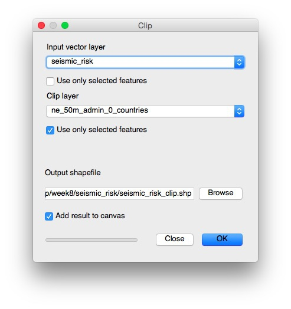

#### Install QGIS plugins

QGIS has an active community of open-source developers who have developed many plugins that perform specific tasks. If you have a particular geoprocessing task to perform, it is worth searching for plugins that may be able to help.

We are going to install a plugin that will allow us to perform hexagonal binning of points.

From the top menu select `Plugins>Manage and Install Plugins...` and search for `MMQGIS`. Select the plugin, and click the `Install plugin` button.

You should now have an `MMQGIS` menu at top:


#### Use hexagonal binning to summarize data on the Syrian conflict

Open a new project and import the `2013_Q1` shapefile from the `syria` subfolder. This displays violent events in Syria's civil war from the first quarter of 2013, as displayed on [this interactive](http://paldhous.github.io/Syria/), and again is in a `Google Mercator` projection.

If you open the attribute table for this shapefile, you will see it contains more than 10,000 entries -- so clearly many of the points are lying over the top of one another.

We will use the `MMQGIS` plugin to create a hexagonal grid over the map, and then count the number of points in each grid cell, to get a better picture of the intensity of the conflict by location.

First use the zoom and pan controls to ensure that there is a little space around the points in the displayed area, giving a view something like this:


Select `MMQGIS>Create>Create Grid Layer` and fill in the dialog box as follows:


`Center X `and `Middle Y` will by default be the longitude and latitutude for the center of the displayed area. Make sure to select `Hexagon (polygon)`, and then set the `H Spacing`; `V Spacing` will adjust automatically. Because we are working with a shapefile in `Google Mercator` projection, the units will be in meters, so here we have set a horizonatal spacing for the hexagons of 20 kilometers.

Click `OK` to create the grid layer, giving it the same `Google Mercator` projection. Drag the new grid layer under the points in the `Layers` panel and the map should look like this:


Now select `Vector>Analysis Tools>Points in Polygon` and fill in the dialog box as follows:


This will create a new shapefile with a field `PNTCNT`, giving the number of points in each cell in the grid. Again, give this a `Google Mercator` projection. Save this file in GeoJSON format.

### Assignment

Use your GeoJSON file of 2014 GDP per capita for the world's nations to replicate this map:


Some hints:

- You will need to change to a `World_Robinson EPSG:54030` projection. When you do so, you may find the map transforms to a strange series of geometric shapes. If this happens, right-click on the layer, select `Properties>Rendering` and uncheck `Simplify geometry`.

- When styling the map, use a ColorBrewer sequential color scheme with 5 classes. Then use the `Add class` button to add a class/bin for the countries with no data. Remember that these will have the value `-99`, so you can then set the values and labels for each bin in the data manually. Use a neutral gray for the countries with no data.

### Further reading

[QGIS Training Manual](http://docs.qgis.org/2.2/en/docs/training_manual/)

[QGIS User Guide](http://docs.qgis.org/2.2/en/docs/user_manual/)

[A Gentle Introduction to GIS](http://docs.qgis.org/2.2/en/docs/gentle_gis_introduction/)
