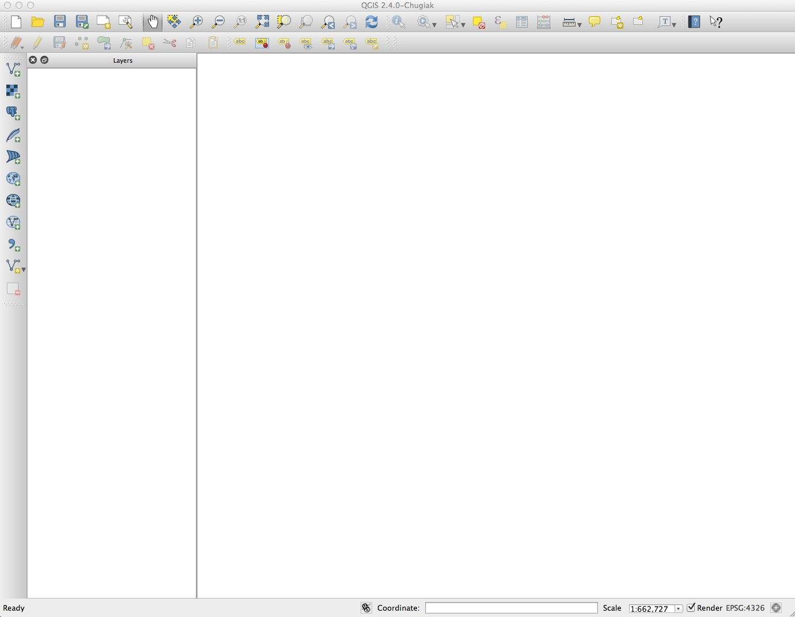
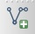
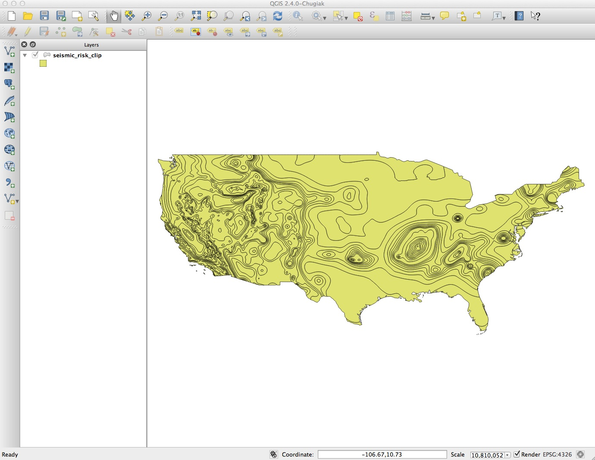
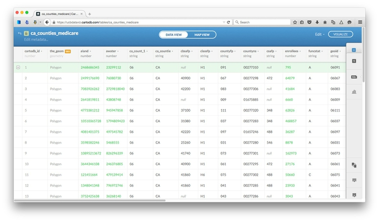
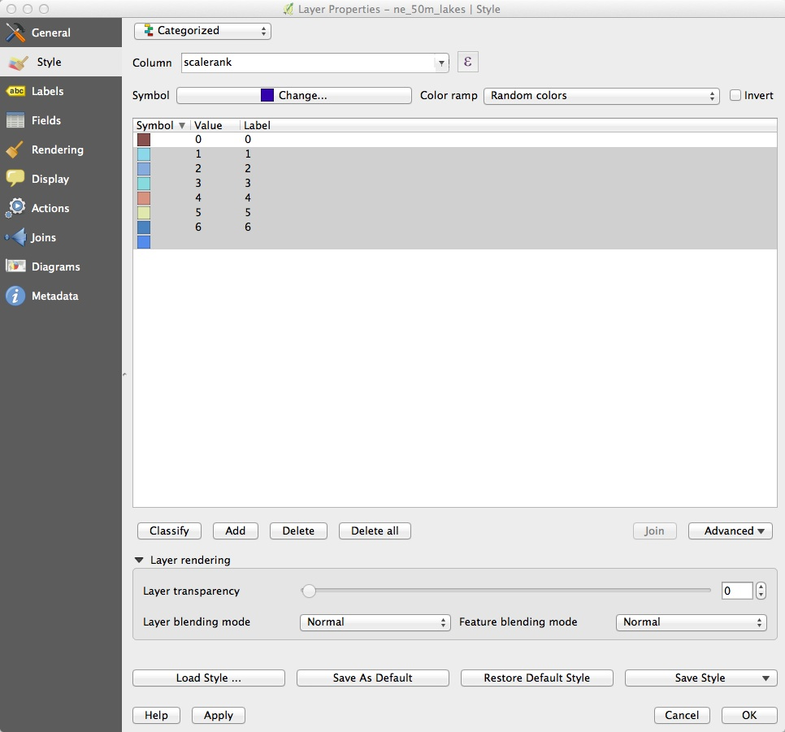
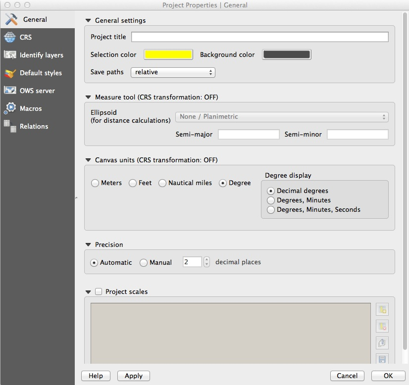
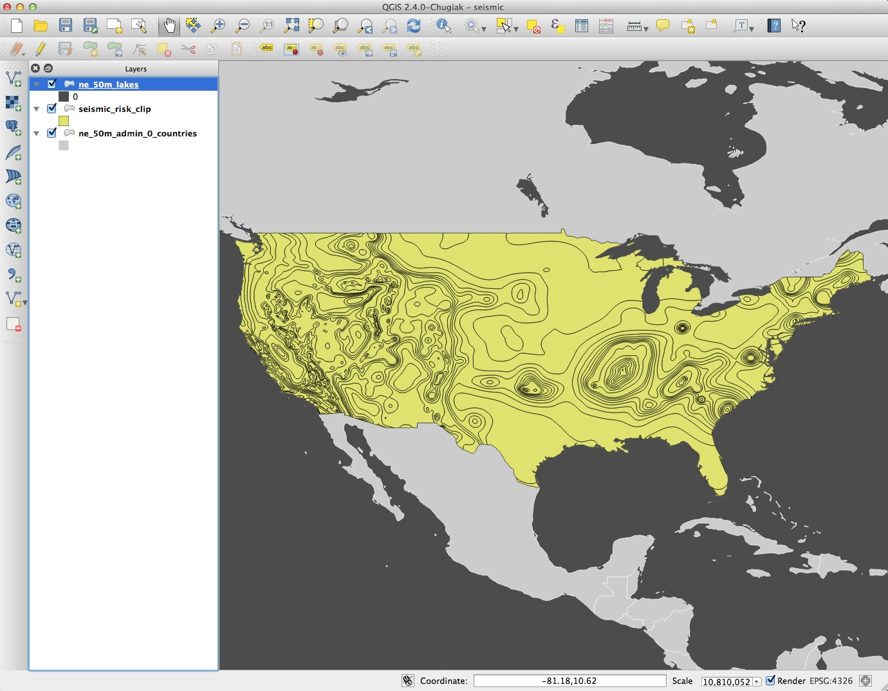
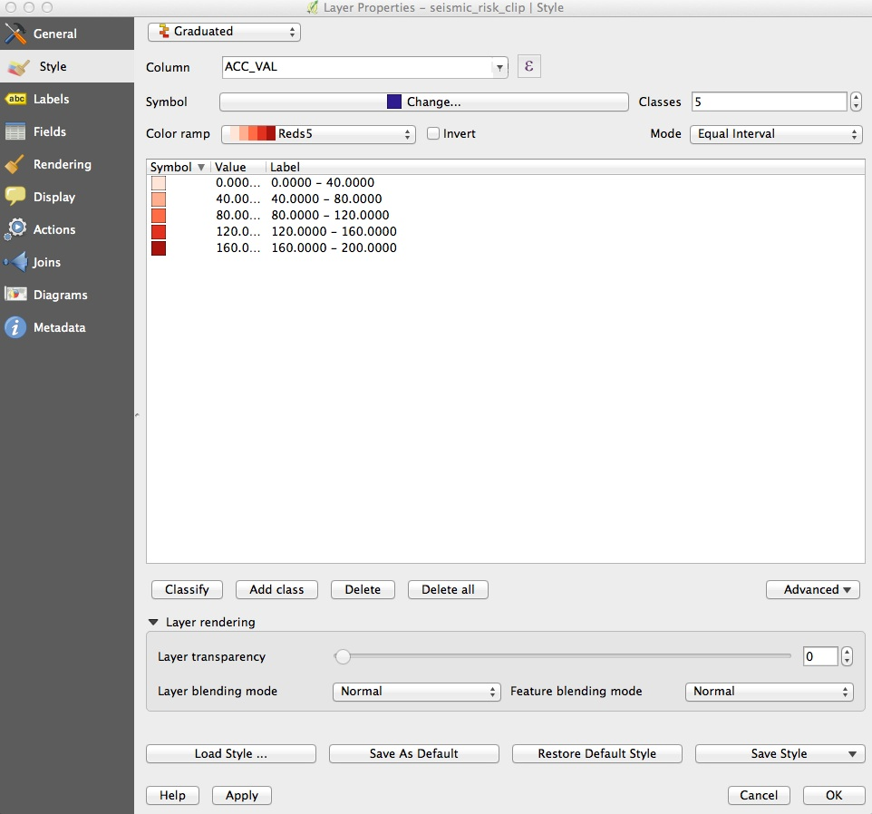
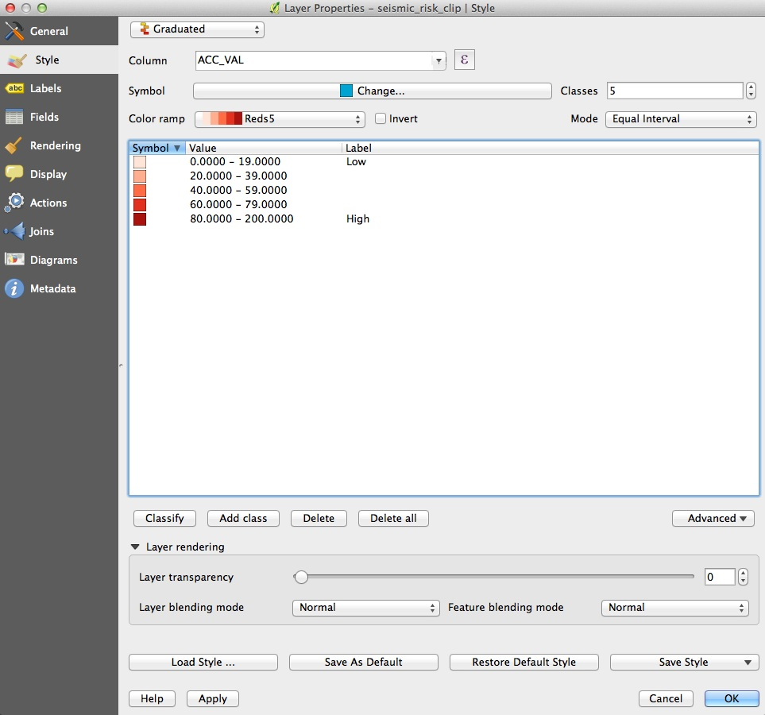
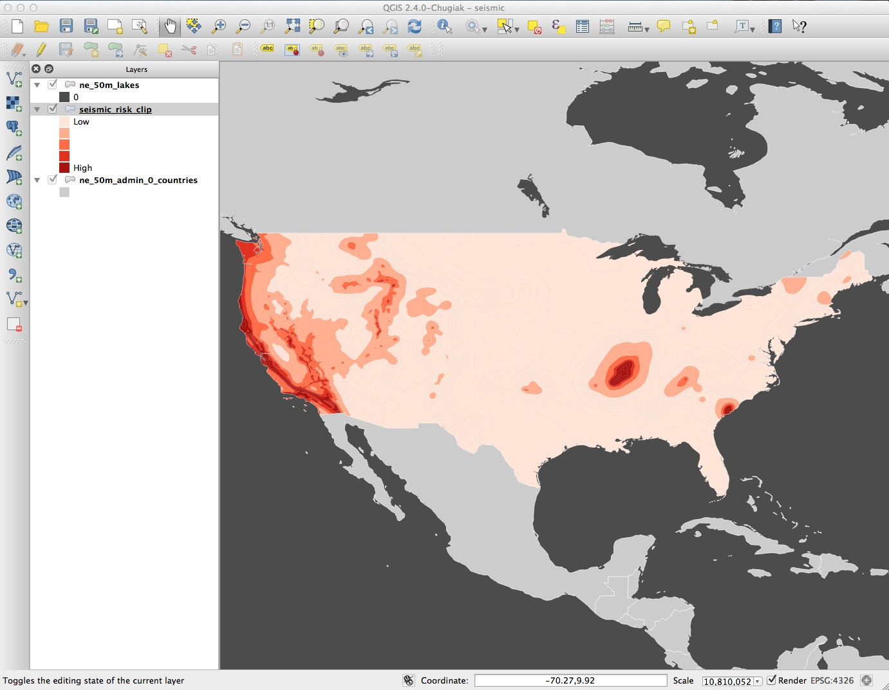

# Making online maps and processing geodata with SQL

### Introducing CartoDB

[**CartoDB**](http://qgis.org/en/site/) is a cloud-based mapping application that makes it easy to produce interactive, online maps. These maps can include [animations of data over time](http://docs.cartodb.com/tutorials/introduction_torque.html).

It is also a geospatial database, allowing you to perform GIS analyses and process geodata using [Structured Query Language](http://en.wikipedia.org/wiki/SQL). If you are comfortable with working with databases, you may find CartoDB a good alternative to the point-and-click interface of QGIS for these tasks.

### The data we will use today

Download the data from this session from [here](data/week9.zip), unzip the folder and place it on your desktop. It contains the same data we used in week 8, plus the following file:

- `hospitals_grid.geojson` The grid we made in week 8, detailing the number of California hospitals and skilled nursing facilities, and their total capacity in beds, in each cell.

In addition, all of the shapefiles have been compressed/zipped, as this is required to load them into cartoDB.

### Map Medicare reimbursements and hospital locations and capacities in California

#### Import the data

To demonstrate CartoDB's core map-making functionality, we will first make an interactive online version of the static map we made in week 8.

Login to a new CartoDB account, and you should see a screen like this:



Open the drop-down menu under `Maps` at top left and switch to `Your datasets`. The click the green `NEW DATASET` button at top right:



You should now see the following screen:



With the `Data file` tab selected, click the `Browse` button, navigate to the zipped `ca_counties_medicare.zip` shapefile and click `Open`. The click the green `Connect dataset` button.

CartoDB can import data in a variety of formats, including CSV, KML, GeoJSON and zipped shapefiles. See [here](http://docs.cartodb.com/cartodb-editor.html) for more on imports and supported data formats.

Once the data has imported, you will see the uploaded data table in `DATA VIEW`:



Notice that, in addition to the fields from the original data, each row has been given a `cartodb_id`, which is a unique identifier for each. The table also has a field called `the_geom` which has the tag `GEO`. This field is central to how CartoDB works, defining the geometry of any map you make. As in QGIS, these geometries can be points, lines or polygons -- which is what we have here.

You can rename fields, sort the table by the data in them, or change their data type (for example from numbers to strings of text), by clicking the downward-pointing triangle next to the header of each.

Switch to `MAP VIEW` to see the basic, unstyled map:


Click the small return arrow at top left to go back to the overview of your datasets.

Notice that the top menu has a link to `DOCUMENTATION`, which has links to CartoDB's technical manuals. The `Data library` link contains useful datasets that you can import into your own account. Take a few minutes to explore what's there, before returning to your `Datasets`.

Now click the `New datasets` button again and import the file `healthcare_facilities.csv`, which should look like this in the `DATA VIEW`:


Notice that `the_geom` for points is given by their longitude and latitude co-ordinates.

Click on the `MAP VIEW` to see the locations of all of the facilities:


#### Create a visualization combining both datasets

Exit the `healthcare_facilities` map and reopen the `ca_counties_medicare` dataset. Then click the `Visualize` button at top right.

You will then see a prompt to create a new map. Click the green `OK, CREATE MAP` button:


Rename this map `California healthcare` by clicking on its name at top left:


Now add the `healthcare_facilities` to the map, by clicking on the blue `+` button to the right. At the dialog box, click the `ADD LAYER` button:


Now select `MAP VIEW` to see both layers on the same map:



#### Select a basemap

Close the panel at bottom left suggesting interesting maps.

Now choose a basemap for your visualization, by clicking `Select basemap` at bottom left. Take a few minutes to explore the built-in basemap options. You are not limited to these basemaps, however.

To import another tiled basemap from elsewhere on the web, click the blue plus sign next to `Yours` to call up the following dialog box:


The `XYZ` tab allows you to call in publicly available basemaps using URLs in the following format:

```SQL
https://{s}.tiles.mapbox.com/v3/mapbox.world-bright/{z}/{x}/{y}.png
```

We will use this basemap, provided by MapBox (see the other basemaps from MapBox [here](http://a.tiles.mapbox.com/v3/mapbox/maps.html)). The [Leaflet Providers preview](http://leaflet-extras.github.io/leaflet-providers/preview/) is a good place to look for available basemaps from other providers. It previews the maps and also exposes their `XYZ` URLs:


Back in CartoDB, enter the `XYZ` URL for the MapBox world bright map and click `Add basemap`. The map should now look like this:



#### Style the maps using the CartoDB wizard

Notice that the toolbar at right has tabs numbered `1` and `2`. It you hover over them, you will see that they correspond to the `ca_counties_medicare` and `healthcare_facilities` layers respectively.

Click on `1` to expose the `Visualization wizard` for the `ca_counties_medicare` layer, which can also be reached by clicking the paintbrush icon:



Notice that this has also exposed blue toggle controls for each layer which can be used to turn the visibility for each on and off. Hide the `healthcare_facilities` layer so we can see what we are doing.

Scroll from left to right through the visualization options, and select `CHOROPLETH` to make a choropleth map.

Set `hospital` as the data `Column`, select `5 Buckets`, set them by `Quantile` and set the `Polygon Stroke` to zero to remove the lines from the map layer. The map should now look like this:


Now click `2` to switch to the `healthcare_facilities` layer and notice that there are different visualization possibilities for point layers.

Select `CATEGORY` and color the circles by the type of facility, by selecting `type` as the data `Column`. The map should now look like this:



Now we need to filter for just the types of facility we are interested in. To do this click the SQL icon at left and replace the default query with the following:

```SQL
SELECT *
FROM healthcare_facilities
WHERE type LIKE 'GENERAL%' OR type LIKE 'SKILLED%'
```

You should be able to recognize that is happening here from our week 5 class. Note, however, that [PostgreSQL](http://www.postgresql.org/), the database that underpins CartoDB, uses `%` as a wildcard for multiple characters, rather than the `*` used by SQLite.

The map should now look like this:



To remove the facility types we have filtered from view from the legend, click on the legends icon:



Then select the HTML view by clicking `</>`, remove the superfluous HTML, and click `Apply`:


Turn on the visibility of the `ca_counties_medicare` layer and the map should look like this:


We now have a rough approximation of the map we made in week 8 using QGIS, but there are important differences: We do not have the custom bins we used for the choropleth map, the circles are not scaled by area according to capacity of the healthcare facilities, and the colors haven't been fully customized.

#### Style the map using CartoCSS

To exert finer control over the map styling, we can use CartoCSS, which styles maps in much the same way that conventional CSS styles web pages. See [here](https://github.com/mapbox/carto/blob/master/docs/latest.md) for a good CartoCSS reference.

Switch back to the `ca_counties_medicare` layer, click on the `CSS` icon, where you will see the following code:

```CSS
/** choropleth visualization */

#ca_counties_medicare {
  polygon-fill: #FFFFB2;
  polygon-opacity: 0.8;
  line-color: #FFF;
  line-width: 0;
  line-opacity: 0;
}
#ca_counties_medicare [ hospital <= 5627.16] {
   polygon-fill: #BD0026;
}
#ca_counties_medicare [ hospital <= 4197.21] {
   polygon-fill: #F03B20;
}
#ca_counties_medicare [ hospital <= 3801.62] {
   polygon-fill: #FD8D3C;
}
#ca_counties_medicare [ hospital <= 3581.08] {
   polygon-fill: #FECC5C;
}
#ca_counties_medicare [ hospital <= 3249] {
   polygon-fill: #FFFFB2;
}
```
Edit this to the following, to reset the breaks between the bins, and to use the same color scheme we used yesterday, using HEX values taken from [ColorBrewer](http://colorbrewer2.org/)


```CSS
/** choropleth visualization */

#ca_counties_medicare {
  polygon-fill: #FFFFB2;
  polygon-opacity: 0.5;
  line-color: #FFF;
  line-width: 0;
  line-opacity: 0;
}
#ca_counties_medicare [ hospital <= 5627.16] {
   polygon-fill: #a50f15;
}
#ca_counties_medicare [ hospital < 4000] {
   polygon-fill: #de2d26;
}
#ca_counties_medicare [ hospital < 3750] {
   polygon-fill: #fb6a4a;
}
#ca_counties_medicare [ hospital < 3500] {
   polygon-fill: #fcae91;
}
#ca_counties_medicare [ hospital < 3250] {
   polygon-fill: #fee5d9;
}
```
Note that that I have also edited the operators for all but one of the formulas for the breaks from `<=` (less than or equal to) to `<` (less then). This will create the same breaks as we used in the QGIS map. Click the `Apply style` button at bottom right.

Now switch to the CartoCSS editor for the `healthcare_facilities` layer, where you will find the following code:
_______________________

```CSS
/** bubble visualization */

#quakes{
  marker-fill-opacity: 0.5;
  marker-line-color: #000000;
  marker-line-width: 0.1;
  marker-line-opacity: 1;
  marker-placement: point;
  marker-multi-policy: largest;
  marker-type: ellipse;
  marker-fill: #FFFFFF;
  marker-allow-overlap: true;
  marker-clip: false;
}
#quakes [ amplit <= 39810.7170553497] {
   marker-width: 50.0;
}
#quakes [ amplit <= 10000] {
   marker-width: 44.6;
}
#quakes [ amplit <= 6309.57344480193] {
   marker-width: 39.1;
}
#quakes [ amplit <= 4466.83592150963] {
   marker-width: 33.7;
}
#quakes [ amplit <= 3162.27766016838] {
   marker-width: 28.2;
}
#quakes [ amplit <= 2238.72113856834] {
   marker-width: 22.8;
}
#quakes [ amplit <= 1412.53754462275] {
   marker-width: 17.3;
}
#quakes [ amplit <= 1000] {
   marker-width: 11.9;
}
#quakes [ amplit <= 707.945784384138] {
   marker-width: 6.4;
}
#quakes [ amplit <= 446.683592150963] {
   marker-width: 1.0;
}
```
We can greatly simplify this CartoCSS, and also make it size the circles accurately by area according to the amount of shaking, by editing to the following:

```CSS
/** bubble visualization */

#quakes {
  marker-width: [amplit]/120;
  marker-fill: #ffffff;
  marker-line-color: #000000;
  marker-line-width: 0.2;
  marker-allow-overlap: true;
  marker-opacity: 0.5;
  marker-line-opacity: 1;
}

```
Notice that instead of the conditional code setting a total of 10 different `marker-width` sizes according to bins in the `amplit` field, data values from that field are now used directly to set `marker-width` by putting the field name in square brackets. Those values are then divided by 120 to give the circles a reasonable size on the map -- a value I settled on through trial and error.

When styling maps in CartoDB, I recommend setting the visualization type and data columns in the wizard, accepting default options, and then switching to CartoCSS.

#### Configure the legend and tooltips for the quakes

The map should now look like this:


Notice that it still carries legends referring to the styling created by the wizard. So now we need to edit these.

For the `seismic_risk` later, click on the legend icon, immediately underneath the CartoCSS editor. Change the `Left label` to `Low` and the `Right label` to `High`; then change the colors to those that are now displayed on the map:


Next click the link marked `</>` to expose the HTML used to create the legend. Insert a new second line and add the following, to explain what the colors are showing:

```HTML
<h4>Seismic risk:</h4><br>
```

The quakes are best explained using text, rather than a symbol legend. Switch to `legends` for the `quakes` layer, select a `custom` template and again click `</>`, where you will find the following HTML:

```HTML
<div class='cartodb-legend custom'>	<div class="warning">The legend is empty</div></div>
```
Edit this to the following:

```HTML
<div class='cartodb-legend custom' style='width:200px'>
<p>Circles show significant quakes, from 1964 to 2013, scaled by the amount of shaking. Click/tap for details.</p>
</div>
```

Now we will set a tooltip/information window to appear when each quake is clicked. In the `quakes` layer, select the `infowindow` icon, which looks like a speech bubble. Notice that there are options to set information to appear on both `Click` and `Hover`. In the `Click` tab, toggle the controls for `date`, `depth` and `mag`, then click on one of the quakes to see the following:


This needs editing, to spell out `MAG` in full as `MAGNITUDE`, and to give the units for depth, which are kilometers.

Back in the` infowindow` editor, select the link showing a `A` with a pencil. Change `mag` to `Magnitude` to edit the title that appears.

Then select the `</>` link and edit the HTML to add the units for depth, and click `Apply`:

```HTML
<p>{{depth}} kilometers</p>
```

The information window should now look like this:


#### Configure the map options, and publish

We are almost ready to publish the visualization, but before doing so, click `Options` at the bottom left of the map to select the controls and other items you want to include. Here I have disabled the `Search box`, which geocodes locations entered by the user and zooms to them; I have enabled both the `Layer selector` option, which allows users to turn the layers on and off, and an option to switch to a `Fullscreen` view of the map:


Also explore the `Add Element` button at top left, which allows you to add a title and other annotations to your map.

Having finished working on the visualization, click the `SHARE` button at top right. This will call up options to publish your visualization:


Copy the code from `Embed it` to obtain an [iframe](http://www.w3schools.com/tags/tag_iframe.asp) which will allow you to embed the map on any web page, in the following format:

```HTML
<iframe width='100%' height='520' frameborder='0' src='http://aldhouskdmc.cartodb.com/viz/e7640620-935f-11e4-a70d-0e4fddd5de28/embed_map' allowfullscreen webkitallowfullscreen mozallowfullscreen oallowfullscreen msallowfullscreen></iframe>

```
(Note that you can edit the dimensions of the iframe -- here set at `100%` of the width of the div in which it appears -- and `520` pixels high) as required.)

Open the file `test.html` in your text editor, paste the iframe code between the `<body> </body>` tags and save the file. Then open in a web browser to see the completed map:


### Map hurricanes and other North Atlantic tropical storms

#### Make an animated map of storm observations

To explore CartoDB's ability to animate maps over time, and to start applying SQL queries to our maps, we will now work with the North Atlantic storms data, producing a visualization of the 2005 hurricane season -- the busiest and most destructive on record.

In CartoDB, navigate to your tables and import the file `storms_points.csv`. In the `DATA VIEW`, notice the fields `timestamp`, giving the data and time of each observation, and the `year`. We will use these fields shortly.

Now click on the `VISUALIZE` button at top right to create a visualization from this table, calling it `Animated storms`.

In the visualization, switch to the `MAP VIEW` to see alll of NOAA's observations of North Atlantic storms from 1990 to 2013 plotted on the map:


Open the visualization wizard, and select the `TORQUE` option. Notice that the map immediately becomes animated, with circles rushing across the screen leaving ghosts of themselves behind:


In the `Visualization wizard` set the Torque options to the following:


Here is what these options do:

- `Cumulative` Toggling this on means that circles stay on the screen once they appear.
- `Time Column` This selects the data used to animate the map. Setting it to `timestamp` causes that field to be used, and the corresponding dates to appear in the play/slider control at the bottom of the map.
- `Marker type` Choose `ellipse` (for circles) or `rectangle`.
- `Marker fill` The left value defines the size of each marker, the right its opacity; you can also select a color.
- `Marker stroke` Similar controls for the border round each marker; set the left value to zero for no border.
- `Duration` The total duration of the animation.
- `Steps` The total number of frames in the animation.
- `Blend Mode` This controls rendering of markers that appear over the top of one another. Experiment with the options to see their effects.
- `Trails` These control the ghostly shadows left behind by the moving markers. We will see how they work when we edit the CartoCSS for this visualization.
- `Resolution` The precision with which markers are mapped to their co-ordinates; `1` gives the highest precision.

Now switch to the CartoCSS editor, where you will see the following code:

```CSS
/** torque visualization */

Map {
-torque-frame-count:1024;
-torque-animation-duration:30;
-torque-time-attribute:"timestamp";
-torque-aggregation-function:"count(cartodb_id)";
-torque-resolution:1;
-torque-data-aggregation:cumulative;
}

#storms_points{
  comp-op: source-over;
  marker-fill-opacity: 0.2;
  marker-line-color: #FFF;
  marker-line-width: 0;
  marker-line-opacity: 1;
  marker-type: ellipse;
  marker-width: 3;
  marker-fill: #FF2900;
}
#storms_points[frame-offset=1] {
 marker-width:5;
 marker-fill-opacity:0.1; 
}
#storms_points[frame-offset=2] {
 marker-width:7;
 marker-fill-opacity:0.05; 
}
#storms_points[frame-offset=3] {
 marker-width:9;
 marker-fill-opacity:0.03333333333333333; 
}
#storms_points[frame-offset=4] {
 marker-width:11;
 marker-fill-opacity:0.025; 
}
#storms_points[frame-offset=5] {
 marker-width:13;
 marker-fill-opacity:0.02; 
}
```
The conditional styles for `frame-offset=1` and so on were created by the `Trails` option in the wizard. For the five animation frames after the marker was at given position, the marker draws new circles at that location which become progressively larger and less opaque. Edit the CartoCSS to the following, so that the circles drawn as trails are a little smaller, then click `Apply style`:

```CSS
/** torque visualization */

Map {
-torque-frame-count:1024;
-torque-animation-duration:30;
-torque-time-attribute:"timestamp";
-torque-aggregation-function:"count(cartodb_id)";
-torque-resolution:1;
-torque-data-aggregation:cumulative;
}

#storms_points{
  comp-op: source-over;
  marker-fill-opacity: 0.2;
  marker-line-color: #FFF;
  marker-line-width: 0;
  marker-line-opacity: 1;
  marker-type: ellipse;
  marker-width: 3;
  marker-fill: #FF2900;
}
#storms_points[frame-offset=1] {
 marker-width:4;
 marker-fill-opacity:0.1; 
}
#storms_points[frame-offset=2] {
 marker-width:5;
 marker-fill-opacity:0.05; 
}
#storms_points[frame-offset=3] {
 marker-width:6;
 marker-fill-opacity:0.03333333333333333; 
}
#storms_points[frame-offset=4] {
 marker-width:7;
 marker-fill-opacity:0.025; 
}
#storms_points[frame-offset=5] {
 marker-width:8;
 marker-fill-opacity:0.02; 
}
```
The map should now look like this:


#### Filter the map to show only storms from 2005

CartoDB has a `filters` control, which looks like a column chart and appears beneath the `legends` control. However, we will use the `SQL` control to filter the data by writing a database query.

If you have worked peviously with Structured Query Language, you will recognize queries to filter data in the following format:

```SQL
SELECT field1, field2
FROM tablename
WHERE field1 = 'example'
ORDER BY field2 DESC
```
If `field1` in a table called `tablename` contains text and `field2` contains numbers, this query would only return records from these two fields for which the text in `field1` is `example`, and put those records in descending order of the values in `field2`, i.e. from largest to smallest.

The next query would select records from the table where the values in `field2` are greater or equal to `100`, and then put them in alphabetical order for the text values in `field1`.

```SQL
SELECT field1, field2
FROM tablename
WHERE field2 >= 100
ORDER BY field1
```
Switch the the `SQL` control, where you will find the following default query:

```SQL
SELECT * FROM storms_points
```

`*` is a wildcard character that returns all of the fields from a table -- so this query is selecting all of the data from the `storms_points` table

Edit the query to the following, which will select data for the storms that occurred in 2005 only, then `Apply query`:

```SQL
SELECT * FROM storms_points WHERE year = 2005
```

Notice that the map is now displaying only storms from 2005, and the dates on the play/slide control have narrowed accordingly:


#### Make a map of complete storm tracks

In this afternoon's session, we will make a map combining this animation with a map of complete storm tracks, which we will set up for users to filter dynamically in their web browser, to see all storm tracks from 1990 to 2013, or just those in 2005.

To make this map, go to your tables and import the `storms_tracks` zipped shapefile. In the `DATA VIEW` notice that `Line` appears for each entry in `the_geom` field.

Click the `VISUALIZE` button to make a visualization from this table, calling it `storms_tracks_viz`. Switch to the `MAP VIEW` to see all of the tracks on the map:


The map we will later make with this visualization will use a dark basemap, so click `Select basemap` at bottom left and select `CartoDB>Dark Matter` so we can style the tracks accordingly.

In the visualization wizard, select the `SIMPLE` option. `Set LineStroke` size to `0.5`, color to white and opacity to `0.4`, so the map looks like this:


### Process geodata and perform geospatial analysis using SQL

CartoDB isn't just a database -- it is a "spatially aware" database that you can query to process geotdata, calculate distances or areas, and  perform other geospatial analyses. This is achieved using [PostGIS](http://postgis.net/), an extension to the open-source [PostgreSQL](http://www.postgresql.org/) database that drives CartoDB.

#### Create buffers around geocoded addresses

For the rest of this session, we will get a taste of working with PostGIS, firstly by repeating our QGIS task of creating a buffer around the sample of San Francisco addresses.

Go to your tables and import the table `sf_test_addresses.csv`, which we geocoded yesterday. It will initially import with `the_geom` field containing `null` values, because there are no fields unambiguously labelled `longitude` and `latitude`:


Click on the downward-pointing triangle on the header for the `bing_latitude` or `bing_longitude`, then select those field as geographic co-ordinates and click `Continue`:


After checking that `the_geom` has been populated with those co-ordinates for the points, select `options` at top right, `Duplicate table...` and call it `buffer`.

Click the `VISUALIZE` button, name the visualization `SF PostGIS`. 

Then switch to `MAP VIEW` and zoom to San Francisco:


From now on were are going to work with queries that use PostGIS spatial functions, which all have the prefix `ST_`. Open the `SQL` editor and replace the default query with the following:

```SQL
UPDATE buffer SET the_geom = ST_Buffer(the_geom::geography, 304.8)::geometry
```
This changes the map so that instead of points, we now have circles drawn around each of the points with a radius of 1,000 feet, or 304.8 meters:


Let's break this query down to understand how it works. First, note that it is an `UPDATE` query, so rather than selecting records from a table, it is actually changing the table. The change being made is to `SET` the field `the_geom` using the PostGIS function `ST_Buffer`, which draws a buffer around an object using the value specified in meters.

That's all fairly easy to understand, but why does the query contain `::geography` and `::geometry`? These are data conversions that are necessary for the buffers to be drawn. CartoDB stores `the_geom` in an unprojected `WGS84` datum, for which the units are degrees. The conversion from this `geometry` to `geography` is necessary for calculations to be made in meters. Once the buffer has been calculated, the data must be converted back to `geometry` to update the table in the database.

This query reverses the process, turning each circle into a point at its center:

```
UPDATE buffer SET the_geom = ST_Centroid(the_geom)
```

Try it out, then use the first query again to return to the buffered points. If you switch to the `DATA VIEW`, you will see that the values in `the_geom` are now `Polygon` rather than point coordinates.

Now we will dissolve all of these separate circles into a single buffer layer. Open the `SQL` editor once more and replace the default query with this:

```SQL
SELECT ST_Union(the_geom_webmercator) AS the_geom_webmercator
FROM buffer
```
`ST_Union` is a function that dissolves multiple geometries into one, but why does this query use `the_geom_webmercator` rather than `the_geom`? This is a quirk of CartoDB, which stores a projected version of the table's geometry in a "hidden" field of this name, as explained [here](http://docs.cartodb.com/tutorials/projections.html). Some PostGIS functions will only work on this version of the geometry, but CartoDB should warn you when this is necessary -- try running the same query using `the_geom` and you should be prompted to use `the_geom_webmercator`.

In the data view, you will notice that there is now just a single field, called `the_geom_webmercator`, containing one `Polygon`. If you switch to the map view, you will see that the separate circles have now dissolved together:


Now select `Add layer` from the top of the right toolbar and add the original `sf_test_addresses` table to the map using the `Select layer` tab:


Select `Add layer` again and import the zipped shapefile `sfpd_stations` using the `Data file` tab. Then use the `Simple` option in the `Visualization wizard` to color the points denoting the locations of San Francisco police stations black. The visualization, with its three layers, whould now look like this:


Next we are going to run a query to calculate the distance from each of the geocoded addresses to the nearest police stations. But first we need to create a new field called `distance` in the `sf_test_addresses` field to hold the results of this query.

Select this layer in from the right toolbar, switch to `DATA VIEW` then click on the downward-pointing trangle in any of the field headers and select `Add new column...`. Fill in the dialog box as follows and click `Create column`:


The new column will appear in the table, but all its values will be `null`.

Now select the `SQL` editor and apply this query:

```SQL
UPDATE sf_test_addresses SET distance = (
  SELECT ST_Distance(
            sf_test_addresses.the_geom::geography, 
            sfpd_stations.the_geom::geography
          )
  FROM sfpd_stations
  ORDER BY sf_test_addresses.the_geom <-> sfpd_stations.the_geom 
  LIMIT 1
)
```
The `distance` field should now have been populated with numbers, representing the distance in meters from that address to the nearest police station.

`ST_Distance` is fairly straightfoward, and you will recognize why `the_geom` fields must be converted to geography so that distances can be calculated in meters. This time they do not need to be converted back to geometry because neither of the `the_geom` fields is being updated by the query.

The really clever part is this:

```SQL
ORDER BY sf_test_addresses.the_geom <-> sfpd_stations.the_geom 
LIMIT 1
```

This is performs an [indexed nearest neighbor search](http://boundlessgeo.com/2011/09/indexed-nearest-neighbour-search-in-postgis/). `<->` measures the distance to each police station from each address, and then `ORDER BY` sorts these distances in ascending order, nearest first. Finally, `LIMIT 1` returns only the first value, which is the distance to the nearest police station from each address.

What if you want those distances in miles, rather than meters? One meter is 0.000621371 miles, so simply edit the query to include this conversion:

```SQL
UPDATE sf_test_addresses SET distance = (
  SELECT (ST_Distance(
            sf_test_addresses.the_geom::geography, 
            sfpd_stations.the_geom::geography
          ))*0.000621371
  FROM sfpd_stations
  ORDER BY sf_test_addresses.the_geom <-> sfpd_stations.the_geom 
  LIMIT 1
)

```
Now switch to the `MAP VIEW` and toggle `distance` to appear in a  tooltip on `Hover` using the `infowindow` editor. Hover over a few points to read the values, and confirm to your statisfaction that the query has worked correctly.

#### Next steps with PostGIS

I hope these queries have whetted your appetite to learn more about PostGIS. I suggest continuing with the NICAR workshop, which provides some more examples of queries, and how they have been used by news media to generate stories and visualizations.

### Assignment

Import the file `syria_all.csv` into CartoDB and create a visualization from it to produce a hexagonal binned map. Then run a query to filter the data to show only violent events in the first quarter of 2013. Having got this query to work, clear it once again to show all of the data.

Hint:

- your `WHERE` clause should include dates, given in single quotes, in `YYYY-MM-DD` format. When filtering by dates, you can ask for records `BETWEEN` one date `AND` another.

When you have finished processing geodata in CartoDB to your satisfaction, you can export that data in various formats by selecting `options>Export...` from top right.

### Further reading/resources

[CartoDB tutorials](http://docs.cartodb.com/tutorials.html)
CartoDB maintains a good set of tutorials, organized by level of difficulty.

[CartoDB/PostGIS workshop from NICAR 2014 meeting](https://github.com/csvsoundsystem/nicar-cartodb-postgis)
Introduction to PostGIS and CartoDB from Andrew Hill of Vizzuality, the company behind CartoDB, and data journalist Michael Keller. From the annual meeting of the National Institute for Computer-Assisted Reporting.

[Introduction to PostGIS](http://workshops.boundlessgeo.com/postgis-intro/index.html#)
Detailed series of tutorials, from Boundless. While this uses the [OpenGeo Suite](http://boundlessgeo.com/solutions/opengeo-suite/download/), rather than CartoDB, the lessons should be transferrable -- but note that the OpenGeo Suite uses the field name `geom` rather than cartoDB's `the_geom`.


# Making interactive maps using Leaflet and related JavaScript libraries

In this session we will use the Leaflet JavaScript code library and its plugins/extensions to make web pages featuring interactive online maps. This can enable more precise control of a map's features than is possible using a simple iframe embed.

Leaflet can work with locally-hosted GeoJSON data, plus GeoJSON obtained in real time from an API. This means that you can make maps without external hosting of your map data layers, and maps that will automatically update to reflect changes to the underlying data.

(Note that if you are making many online maps with CartoDB, you will fairly soon exceed the storage limits for a free account. Also, while CartoDB does allow you to create [synced tables](http://blog.cartodb.com/synced-tables-create-real-time-maps-from-data-anywhere/) that will update to reflect changes in the data, this option is available only with [a paid account](http://cartodb.com/pricing-features).)

We will start by creating versions of the seismic risk and historical quakes maps we made this morning in CartoDB using locally hosted GeoJSON and data returned from the [U.S. Geological Survey's earthquakes API](http://earthquake.usgs.gov/earthquakes/search/).

Then we will use [CartoDB.js](http://docs.cartodb.com/cartodb-platform/cartodb-js.html), which is very similar to Leaflet, to make a web page including both of the storm maps we made in this morning's CartoDB session. We will use code that will let the user filter the storm tracks to view either all storm tracks from 1990 to 2013, or just those from the tumultuous 2005 hurricane season.

As we will be writing and editing the code for web pages, you should work with a text editor optimized for authoring HTML and JavaScript. I recommend [TextWrangler](http://www.barebones.com/products/textwrangler/) for those of you working on a Mac, and [Notepad++](http://notepad-plus-plus.org/) for those on Windows machines.

### Introducing Leaflet

[**Leaflet**](http://leafletjs.com/) is the most widely-used open source JavaScript code library for making interactive online maps. The core library has most of the features that you need to make basic maps.

Leaflet can also be extended with a host of [plugins](http://leafletjs.com/plugins.html) that extend its functionality to display and process geodata in a variety of ways. If you cannot find the function you are looking for in the basic Leaflet [documentation](http://leafletjs.com/reference.html), search the plugins!

To enable Leaflet for any web page, include the following links between its `<head> </head>` tags:

```HTML
<link rel='stylesheet' href='http://cdn.leafletjs.com/leaflet-0.7.3/leaflet.css' />
<script src='http://cdn.leafletjs.com/leaflet-0.7.3/leaflet.js'></script>
```
You can also download the latest stable version [from here](http://leafletjs.com/download.html) and host the files yourself, again linking to them from the head of your web page.

To add CartoDB.js to a web page, include these two links in its head:

```HTML
<link rel='stylesheet' href='http://libs.cartocdn.com/cartodb.js/v3/3.11/themes/css/cartodb.css' />
<script src='http://libs.cartocdn.com/cartodb.js/v3/3.11/cartodb.js'></script>
```
(CartoDB.js also automatically loads [jQuery](http://jquery.com/), a JavaScript code library widely used for manipulating elements on web pages.)

### The data we will use

Download the data from this session from [here](data/leaflet.zip), unzip the folder and place it on your desktop. It contains the following:

##### Earthquakes

This in turn contains:

- `data` Folder with a single file, `seismic_risk.js`. This is the seismic risk GeoJSON data we earlier imported into CartoDB, declared as a JavaScript variable by pasting it into the following code:
- ```Javascript 
var seismic_risk =
//GeoJSON pasted here
;
```
When we link to this file from our web page, we can refer to the variable `seismic_risk`, which will be the GeoJSON data needed to make the seismic risk map.

- `src` Folder with two JavaScript files, `date-format.js` and `leaflet.ajax.min.js`. The first is a [script by web developer Steven Levithan](http://blog.stevenlevithan.com/archives/date-time-format), which we will use to format dates. The second is a [Leaflet plugin](https://github.com/calvinmetcalf/leaflet-ajax), which we will use to turn GeoJSON returned by an API into a Leaflet map layer.

### Make an online map of seismic risk in the continental United States

First we need to set up a web page for our map. In your text editor, paste the following into a new document, saving it as `index.html` in the main `earthquakes` folder:

```HTML
<!DOCTYPE html>
<html>

</html>
```
Now paste the following code, for the head of the web page, between the `<html> </html>` tags:

```HTML
<head>

	<meta charset=utf-8 />
	<title>Seismic hazards in the continental U.S.</title>
	<meta name='viewport' content='initial-scale=1,maximum-scale=1,user-scalable=no' />
	<link rel='stylesheet' href='http://cdn.leafletjs.com/leaflet-0.7.3/leaflet.css' />
	<script src='http://cdn.leafletjs.com/leaflet-0.7.3/leaflet.js'></script>
	<script src='data/seismic_risk.js'></script>

	<style>
		body {margin:0; padding:0;}
		#map {position:absolute; top:0; bottom:0; width:100%;}
		#legend {
			background: #ffffff;
			position: absolute;
			bottom: 30px;
			left: 10px;
			padding: 0px 10px;
			width: 200px;
			font-family: arial;
			font-size: small;
			-webkit-border-radius:4px 4px 4px 4px;
			border-radius:4px 4px 4px 4px;
			-webkit-box-shadow: 0px 1px 5px rgba(153,153,153,1);
			-moz-box-shadow: 0px 1px 5px rgba(153,153,153,1);
			box-shadow: 0px 1px 5px rgba(153,153,153,1);
		}
	</style>

</head>
```

This loads the resources we will need to make the seismic risk map, including Leaflet and its associated CSS stylesheet, plus the GeoJSON data.

The CSS between the `<style> </style>` tags will make the map display over the entire web page, and also contains style for a legend, which will make it look consistent with Leaflet's map controls. (All of this CSS could be placed into an external stylesheet, if you wished.)

Now, beneath the head, but above the closing `</html>` tag, paste the following HTML for the body of the web page:

```HTML
<body>

	<div id='map'>

		<script src='src/maps.js'></script>

	</div>

	<div id='legend'>
		<p><strong>Seismic risk:</strong></p>
		<p>Low
		<span style='color:#fee5d9'>▉</span>
		<span style='color:#fcae91'>▉</span>
		<span style='color:#fb6a4A'>▉</span>
		<span style='color:#de2d26'>▉</span>
		<span style='color:#a50f15'>▉</span>
		High</p>
	</div>

</body>
```

Note that there are two main divs on the page, which have `id`s of `map` and `legend` respectively.


The HTML code in the `legend` div uses [UTF-8 black square](http://www.fileformat.info/info/unicode/char/25a0/index.htm) characters to create colored boxes for the legend, with the same [ColorBrewer](http://colorbrewer2.org/) reds sequential color scheme that we used to make the CartoDB map.

There is a div called `map` to contain the map, which links to a file that we now need to create, called `maps.js`. So open a new document in your text editor, and save it under this name in the `src` subfolder.

Now paste the following into the `maps.js` file:

```Javascript
var map = L.map('map').setView([40, -100], 4);
```

This Leaflet code creates a map object in the `map` div of the web page. It sets its zoom level to `4`, which will give a good view of the entire continental United States, and it centers the map at a latitude of 40 degrees and a longitude of -100 degrees. 

Now add the MapBox [World Bright](http://a.tiles.mapbox.com/v3/mapbox.world-bright/page.html#5/0.000/0.000) tiled basemap, and a link for its attribution, by pasting the following Leaflet code into `maps.js`:

```Javascript
L.tileLayer('https://{s}.tiles.mapbox.com/v3/mapbox.world-bright/{z}/{x}/{y}.png', {
    attribution: '<a href="http://www.mapbox.com/about/maps/" target"_blank">Terms &amp; Feedback</a>'
    }).addTo(map);
```

Save both `index.html` and `maps.js` files and open the former in a web browser. The map should now look like this:


Next we will add a GeoJSON layer with the seismic risk data by pasting the following code at the bottom of the `maps.js` file.

```JavaScript
L.geoJson(seismic_risk).addTo(map);
```

Note that this is using the variable `seismic_risk`, declared in the `seismic_risk.js` file.

Save the `maps.js` file the refresh `index.html` in your browser, and the map should look like this:


This is how unstyled GeoJSON appears on a Leaflet map, so now we need to style it. To do that, remove the single line of code creating the GeoJSON layer, and replace it with this:

```Javascript
// functions to style the seismic risk layer
function getColor(a) {
			return a > 79 ? '#a50f15':
				   a > 59 ? '#de2d26' :
				   a > 39  ? '#fb6a4A' :
				   a > 19 ? '#fcae91' :
				   '#fee5d9';
			}

function getStyle(feature) {
				return {
					fillColor: getColor(feature.properties.ACC_VAL),
					color: getColor(feature.properties.ACC_VAL),
					weight: 1,
					opacity: 0.4,
					fillOpacity: 0.7
				};
			}


// the seismic risks layer, styled using functions above
L.geoJson(seismic_risk, {style:getStyle}).addTo(map);
```

The `getColor` function is fairly easy to understand: it gets the HEX values for the same ColorBrewer color scheme we used previously, according to the values listed.

The `getStyle` function applies `getColor` to values for `ACC_VAL` in the data, so that these colors are assigned to both the lines and the fill for the polygons. Here is the GeoJSON for one of the polygons in the seismic risk data, which should make the logic of `feature.properties.ACC_VAL` easy to follow:

```JSON
{ "type": "Feature", "properties": { "ACC_VAL": 18, "VALLEY": 0 }, "geometry": { "type": "Polygon", "coordinates": [ [ [ -78.0, 37.365031051635675 ], [ -78.017343139648474, 37.367344284057566 ], [ -78.03101501464846, 37.368985366821327 ], [ -78.1, 37.378542709350597 ], [ -78.116345214843804, 37.383655929565464 ], [ -78.143249511718778, 37.393249893188475 ], [ -78.153375244140662, 37.396623611450167 ], [ -78.162326049804719, 37.400000381469681 ], [ -78.189303588867219, 37.410696029663058 ], [ -78.2, 37.415526199340775 ], [ -78.221560668945358, 37.428441238403309 ], [ -78.251376342773483, 37.448622512817352 ], [ -78.28023071289067, 37.469771194458019 ], [ -78.3, 37.486327743530268 ], [ -78.307220458984403, 37.492779159545904 ], [ -78.31434020996096, 37.500000381469711 ], [ -78.328512573242222, 37.52148780822754 ], [ -78.338735961914111, 37.538737106323218 ], [ -78.347268676757835, 37.552730941772467 ], [ -78.365298461914108, 37.584701156616219 ], [ -78.373092651367216, 37.600000381469691 ], [ -78.384274291992242, 37.700000381469692 ], [ -78.376583862304742, 37.726585769653305 ], [ -78.364724731445349, 37.764723587036102 ], [ -78.352359008789094, 37.800000381469708 ], [ -78.330413818359403, 37.830413436889629 ], [ -78.307797241210977, 37.857796096801799 ], [ -78.3, 37.866172409057668 ], [ -78.282803344726617, 37.882802963256815 ], [ -78.262322998046912, 37.900000381469667 ], [ -78.255227661132849, 37.905229568481374 ], [ -78.225012207031298, 37.925011825561469 ], [ -78.2, 37.939875411987288 ], [ -78.192904663085983, 37.942905044555616 ], [ -78.156692504882855, 37.956692123413085 ], [ -78.136401367187545, 37.963599014282224 ], [ -78.119662475585969, 37.969662094116181 ], [ -78.1, 37.975945663452194 ], [ -78.034487915039108, 37.984489059448194 ], [ -78.0, 37.988642501831045 ], [ -77.9, 37.981746292114266 ], [ -77.87483520507817, 37.975164413452106 ], [ -77.835671997070349, 37.964329910278302 ], [ -77.8, 37.95324516296386 ], [ -77.797760009765668, 37.952238845825171 ], [ -77.764578247070361, 37.935423660278325 ], [ -77.732861328125054, 37.917139053344741 ], [ -77.706625366210972, 37.900000381469667 ], [ -77.702761840820344, 37.897238540649404 ], [ -77.7, 37.894968795776357 ], [ -77.677008056640673, 37.872991561889677 ], [ -77.653109741210969, 37.846889114379856 ], [ -77.630596923828179, 37.819403457641613 ], [ -77.616723632812537, 37.800000381469708 ], [ -77.611972045898469, 37.788029098510783 ], [ -77.59919433593754, 37.750805282592765 ], [ -77.586868286132841, 37.713131332397516 ], [ -77.583099365234418, 37.700000381469692 ], [ -77.593188476562545, 37.600000381469691 ], [ -77.595449829101597, 37.595450210571244 ], [ -77.612869262695341, 37.56286964416509 ], [ -77.631304931640656, 37.53130607604983 ], [ -77.651373291015673, 37.500000381469711 ], [ -77.676461791992224, 37.476461410522433 ], [ -77.7, 37.456859207153336 ], [ -77.703982543945358, 37.453983688354448 ], [ -77.73429870605473, 37.434299087524423 ], [ -77.765908813476599, 37.415910720825217 ], [ -77.796795654296929, 37.40000038146971 ], [ -77.8, 37.3985080718994 ], [ -77.837515258789097, 37.387516403198234 ], [ -77.876998901367216, 37.376997756957984 ], [ -77.9, 37.371197891235305 ], [ -78.0, 37.365031051635675 ] ], [ [ -78.0, 37.425953292846657 ], [ -77.9, 37.433411788940397 ], [ -77.887353515625023, 37.437353134155259 ], [ -77.85, 37.449983596801772 ], [ -77.813735961914105, 37.46373786926268 ], [ -77.8, 37.469122695922827 ], [ -77.78084106445317, 37.480842971801749 ], [ -77.751492309570352, 37.500000381469697 ], [ -77.727679443359406, 37.5276798248291 ], [ -77.70921325683598, 37.550000381469644 ], [ -77.7, 37.561656570434536 ], [ -77.684979248046929, 37.584979629516589 ], [ -77.675885009765665, 37.600000381469691 ], [ -77.666900634765668, 37.700000381469692 ], [ -77.676461791992224, 37.723538589477528 ], [ -77.687655639648483, 37.75000038146969 ], [ -77.691400146484412, 37.758599472045923 ], [ -77.7, 37.776056289672859 ], [ -77.708975219726597, 37.791025924682565 ], [ -77.714547729492224, 37.800000381469708 ], [ -77.733038330078159, 37.816961288452141 ], [ -77.75, 37.831132888793981 ], [ -77.760403442382852, 37.839598464965789 ], [ -77.773834228515668, 37.850000381469719 ], [ -77.788818359375028, 37.861182022094717 ], [ -77.8, 37.868613815307633 ], [ -77.822052001953153, 37.877946853637681 ], [ -77.857522583007849, 37.892478561401362 ], [ -77.876547241210972, 37.900000381469667 ], [ -77.89393920898442, 37.906061935424759 ], [ -77.9, 37.907944107055656 ], [ -77.938540649414094, 37.91146049499514 ], [ -78.0, 37.916647720336911 ], [ -78.057867431640673, 37.907867813110393 ], [ -78.1, 37.900716781616204 ], [ -78.101760864257841, 37.900000381469667 ], [ -78.134426879882867, 37.884426498413127 ], [ -78.167617797851591, 37.867616653442333 ], [ -78.2, 37.849556350707999 ], [ -78.226348876953168, 37.826350021362302 ], [ -78.25, 37.804281234741175 ], [ -78.254208374023477, 37.800000381469708 ], [ -78.269543457031304, 37.769543838501008 ], [ -78.278686523437528, 37.75000038146969 ], [ -78.285430908203168, 37.735432052612317 ], [ -78.3, 37.702294540405298 ], [ -78.300872802734403, 37.700000381469692 ], [ -78.288168334960986, 37.600000381469691 ], [ -78.272650146484423, 37.577350234985381 ], [ -78.251855468750037, 37.54814491271965 ], [ -78.229464721679733, 37.520535659789999 ], [ -78.212561035156298, 37.500000381469711 ], [ -78.205477905273469, 37.494522476196252 ], [ -78.2, 37.490776443481408 ], [ -78.17280273437504, 37.477198410034219 ], [ -78.139053344726605, 37.460947799682621 ], [ -78.115493774414105, 37.450000381469707 ], [ -78.104769897460983, 37.445229721069339 ], [ -78.1, 37.443348312377921 ], [ -78.06331176757817, 37.436689376831055 ], [ -78.0, 37.425953292846657 ] ] ] } }
```

When writing JavaScript code for custom functions, you can call the functions what you like. I chose `getColor` and `getStyle` to make it obvious what they do.

In addition, `weight` sets the width of the lines, `opacity` sets their transparency, and `fillOpacity` sets the transparency for the polygon fills. I settled on these values through trial and error, seeking the most attractive display.

The last line creates the seismic risk layer as before, but this time applies the `getStyle` function to style the GeoJSON. Save the `maps.js` file, refresh `index.html` in your browser, and the map should look like this:


This is the complete code you need to display a tiled basemap with a styled GeoJSON data overlay using Leaflet:

```JavaScript
var map = L.map('map').setView([40, -100], 4);

L.tileLayer('https://{s}.tiles.mapbox.com/v3/mapbox.world-bright/{z}/{x}/{y}.png', {
    attribution: '<a href="http://www.mapbox.com/about/maps/" target"_blank">Terms &amp; Feedback</a>'
    }).addTo(map);
    
function getColor(a) {
			return a > 79 ? '#a50f15':
				   a > 59 ? '#de2d26' :
				   a > 39  ? '#fb6a4A' :
				   a > 19 ? '#fcae91' :
				   '#fee5d9';
			}

function getStyle(feature) {
				return {
					fillColor: getColor(feature.properties.ACC_VAL),
					color: getColor(feature.properties.ACC_VAL),
					weight: 1,
					opacity: 0.4,
					fillOpacity: 0.7
				};
			}

L.geoJson(seismic_risk, {style:getStyle}).addTo(map);
```

Now we will make a more complex map, incorporating the same layers as before, but including an alternate basemap and historical earthquakes, called from the USGS API.

The code we will use to do this is subtly different, so delete the contents of `maps.js` and start with a blank file. Instead of creating the map, and then adding layers, we are going to first declare the layers as variables, so that we can then create the map and add the layers using a control that allows them to be turned on and off. (For this to work, they have to be given names that we can refer to.)

First, paste the following into the `maps.js` file:

```JavaScript
// creates two basemap layers
var bright = L.tileLayer("https://{s}.tiles.mapbox.com/v3/mapbox.world-bright/{z}/{x}/{y}.png", {
    attribution: '<a href="http://www.mapbox.com/about/maps/" target="_blank">Terms &amp; Feedback</a>'
});
var satellite = L.tileLayer("https://{s}.tiles.mapbox.com/v3/mapbox.blue-marble-topo-jul-bw/{z}/{x}/{y}.png", {
    attribution: '<a href="http://www.mapbox.com/about/maps/" target="_blank">Terms &amp; Feedback</a>'
});
```

This declares two JavaScript variables, `bright` and `satellite`, which correspond to MapBox tiled basemaps, converted to Leaflet map layers. As we discussed in the cartoDB session this morning, you can add any public tiled basemap using its XYZ URL.

Now paste this code into the file:

```JavaScript
// creates the map and sets initial view, including layers to be displayed, plus limits for zoom and maximum extent
var map = L.map('map', {
    center: new L.LatLng(40, -100),
    zoom: 4,
    maxZoom: 6,
    minZoom: 3,
    maxBounds: ([
    [-10, -160],
    [70, -40]
    ]),
    layers: [bright]
});
```
This creates the map, setting its initial zoom level to 4, and the minimum and maximum zoom levels to 3 and 6 respectively. It centers the initial view at a latitude of 40 degrees and a longitude of -100 degrees.

`maxBounds` sets southwest and northeast co-ordinates for the maximum extent of the map view: If a user tries to pan the map beyond these limits, it will spring back to the allowed view. `layers` loads the `bright` layer we created above.

Save `maps.js` and refresh `index.html` in your browser. Experiment with panning and zooming the map to see the effect of the code you have just added.

Next, paste this code at the bottom of the `maps.js` file:

```Javascript
// Defines the two basemaps
var baseMaps = {
    'Satellite': satellite,
    'Map': bright
};

// Defines the overlay maps. For now this variable is empty, because we haven't created any overlay layers
var overlayMaps = {

};

// Adds a Leaflet layer control, using basemaps and overlay maps defined above
var layersControl = new L.Control.Layers(baseMaps, overlayMaps, {collapsed: false});
map.addControl(layersControl);
```

This code sets up a Leaflet layer-switching control, and tells it that `bright` and `satellite` should be used as the basemaps. Save `maps.js`, refresh `index.html` in your browser and notice that you can now switch between the two basemaps using the control at top right:


See what happens if you replace `{collapsed: false}` with `{collapsed: true}` in the `layersControl` code.

Now, immediately below the code that declared the `bright` and `satellite` variables used for the basemaps, add the code to create and style the seismic risk layer:

```JavaScript
// functions to style the seismic risk layer
function getColor(a) {
            return a > 79 ? '#a50f15':
                   a > 59 ? '#de2d26' :
                   a > 39  ? '#fb6a4A' :
                   a > 19 ? '#fcae91' :
                   '#fee5d9';
            }

function getStyle(feature) {
                return {
                    fillColor: getColor(feature.properties.ACC_VAL),
                    color: getColor(feature.properties.ACC_VAL),
                    weight: 1,
                    opacity: 0.4,
                    fillOpacity: 0.7
                };
            }


// the seismic risks layer, styled using functions above
var seismic = L.geoJson(seismic_risk, {style:getStyle});
```

This is the same as the code we used previously, except that it declares the geoJSON layer as a variable called `seismic`, rather than adding it directly to the map.

So now we need to add it to the map, both on initial view, and in the layers control.

First edit the code that creates the initial map to the following:

```Javascript
var map = L.map('map', {
    center: new L.LatLng(40, -100),
    zoom: 4,
    maxZoom: 6,
    minZoom: 3,
    maxBounds: ([
    [-10, -160],
    [70, -40]
    ]),
    layers: [bright, seismic] 
});
```

Then edit the code defining the overlay maps:

```Javascript
var overlayMaps = {
     'Seismic risk': seismic
};
```

Save `maps.js`, refresh `index.html` in your browser, and the map should look like this:


Notice that the seismic risk layer can now be turned on and off using the layers control.

Now we need to to add the layer for the quakes, which is achieved with this code. Paste it immediately beneath the code declaring the `seismic` variable:

```Javascript
// the url to send to the USGS API
var quakedataUrl = "http://comcat.cr.usgs.gov/fdsnws/event/1/query?starttime=1965-01-01T00:00:00&minmagnitude=6&format=geojson&latitude=39.828175&longitude=-98.5795&maxradiuskm=6000&orderby=magnitude&callback="


// the quakes layer, uses leaflet.ajax to make API call
var quakes = L.geoJson.ajax(quakedataUrl, {

			dataType:'jsonp',

			// makes points into circle markers and styles them, scaling using JavaScript Math; magnitude value for each quake from parsed JSON
			pointToLayer: function (feature, latlng) {
				return L.circleMarker(latlng, {
					radius: Math.sqrt(Math.pow(10, feature.properties.mag)/50000),
					fillColor: '#fff',
					color: '#000',
					weight: 1,
					opacity: 0.2,
					fillOpacity: 0.5
				});
			}
			});

```

This code starts by declaring the variable `quakedataUrl`, which will return from the U.S. Geological Survey earthquakes API GeoJSON for quakes over the same area as we considered previously. This time I have asked for quakes of magnitude 6 and above, to limit the amount of data returned, which will help the map load more quickly -- you can experiment with different values. I have set the start date as the beginning of 1965 with no end date, which means the map will always include the most recent quakes in the USGS data each time it loads.

The second section of code uses the [Leaflet Ajax](https://github.com/calvinmetcalf/leaflet-ajax) plugin, in the file `leaflet.ajax.min.js`, to call the USGS API and convert the data returned into a Leaflet GeoJSON layer. The `pointToLayer` function turns each feature into a circle marker, styled as defined in the code.

Here is the GeoJSON for one of the quakes, which should make the code easier to follow:

```JSON
{"type":"Feature","properties":{"mag":6.5,"place":"Seattle-Tacoma urban area, Washington","time":-147515475000,"updated":1408399017684,"tz":null,"url":"http://comcat.cr.usgs.gov/earthquakes/eventpage/centennial19650429152845","detail":"http://comcat.cr.usgs.gov/fdsnws/event/1/query?eventid=centennial19650429152845&format=geojson","felt":175,"cdi":8.6,"mmi":7.19,"alert":null,"status":"reviewed","tsunami":null,"sig":800,"net":"centennial","code":"19650429152845","ids":",uutacoma65,atlas19650429152845,centennial19650429152845,","sources":",uu,atlas,centennial,","types":",dyfi,origin,shakemap,trump,","nst":203,"dmin":null,"rms":null,"gap":null,"magType":"mb","type":"earthquake","title":"M 6.5 - Seattle-Tacoma urban area, Washington"},"geometry":{"type":"Point","coordinates":[-122.333,47.317,65.7]},"id":"centennial19650429152845"}
```

Scroll to the right of this code, and notice that the quake has three `coordinates`: The first two are its longitude and latitude; the third is its depth in kilometers. `latlng` centers each circle on the latitude and longitude `coordinates`.

`fillColor`, `color`, `weight`, `opacity` and `fillOpacity` are doing the same jobs as in the code that styled the seismic risk layer.

The size of the circles is set by this line of code:

```Javascript
radius: Math.sqrt(Math.pow(10, feature.properties.mag)/50000),
```

This uses [JavaScript Math](http://www.w3schools.com/jsref/jsref_obj_math.asp) to scale the circles according to their magnitude, or `mag`, so that their area corresponds to the amount of ground shaking. Leaflet sets the size of a circle by its radius, so to do this we need to raise ten to the power of each quake's magnitude, and then take the square root of this number. I also divided by 50,000 to give the circles a reasonable size when added to the map. I settled on this value by trial and error.

For this code to work, we need to link to the `leaflet.ajax.min.js` file, so add this code to the head of `index.html`, immediately beneath the link to the `siesmic_risk.js` file:

```HTML
	<script src='src/leaflet.ajax.min.js'></script>
```

Again, add the new quakes layer to the layers that will display when the map loads:

```Javascript
var map = L.map('map', {
	center: new L.LatLng(40, -100),
	zoom: 4, 
	maxZoom: 6,
	minZoom: 3,
	maxBounds: ([
	[-10, -160],
	[70, -40]
	]),
	layers: [bright, seismic, quakes]
});
```

Also add it to the code defining the overlay maps:

```Javascript
var overlayMaps = {
	'Seismic risk': seismic,
	'Earthquakes': quakes
};
```

Save your files and refresh `index.htm` in your browser, and the map should now look like this:


Next we will add a pop-up to appear when each quake is clicked, giving information on its date, depth and magnitude.

Immediately beneath the code you just added, paste the following:

```Javascript
// function to write html for pop-ups; date, magnitude and depth values for each quake from parsed JSON
function popupText (feature, layer) {
	 var date = new Date(feature.properties.time)
	 // uses date-format to format the date
	 var dateString = date.format('mmm d, yyyy')
	 layer.bindPopup('<strong>Date: </strong>' + dateString + '<br />'
					+ '<strong>Magnitude: </strong>' + feature.properties.mag + '<br />'
					+ '<strong>Depth: </strong>' + feature.geometry.coordinates[2] + ' kilometers')
}
```

The `popupText` function writes some HTML pop-ups that will appear when each quake is clicked. 

JavaScript starts from zero when counting through items in an object, so `feature.geometry.coordinates[2]` returns the third item from the `coordinates` for each quake, which is the depth, as required.

Look again at the GeoJSON above, and you will see no date, but instead a `time`, given as `-147515475000`. JavaScript calculates dates and time in milliseconds, relative to the start of 1970. Here is how to convert a JavaScript time to a date, demonstrated at [JSFiddle](http://jsfiddle.net/):


Notice that the `popupText` function similarly uses `new Date` to convert the JavaScript times into dates, and then formats these using the `date.format` function, from the script in the `date.format.js` file. So we also need to include a link to this file, by pasting this code into the head of the `index.html`, immediately beneath the link to the Leaflet Ajax plugin:

```HTML
	<script src='src/date.format.js'></script>
```	

See [here](http://blog.stevenlevithan.com/archives/date-time-format) for a complete reference on formatting dates and times with `date.format`.

To apply the `popupText` function to all of the quakes, paste the following into the code that processes the GeoJSON from the API, immediately beneath `dataType:'jsonp'`:

```Javascript
			// calls the function below to create a pop-up for each quake when clicked
			onEachFeature: popupText,
```

Save the files, refresh your browser and the quakes should now display a pop-up window when clicked:


Now we need to edit the legend to describe the new quakes layer. Edit its code at `index.html` to the following:

```HTML
    <div id='legend'>
        <p><strong>Seismic risk:</strong></p>
        <p>Low
        <span style='color:#fee5d9'>▉</span>
        <span style='color:#fcae91'>▉</span>
        <span style='color:#fb6a4A'>▉</span>
        <span style='color:#de2d26'>▉</span>
        <span style='color:#a50f15'>▉</span>
        High</p>
        <div id='legend-text'>
            <p>Circles show significant quakes, from 1965 to present, scaled by the amount of ground shaking. Click/tap for details.</p>
        </div>
        <div id='legend-text-alt'>
            <p>Tap quakes for details.</p>
        </div>
        <p style="font-size: 11px">Source: U.S. Geological Survey<p>
    </div>
```
As well as adding source information for the data, notice that the revised legend includes two versions of the div containing the text describing the quakes, the second much condensed. This is intended for small screens. We can control which legend appears based on screen size by adding the following code in the head of the page, above the closing `</style>` tag:

```CSS
		@media (max-width:767px) {
		#legend-text {display:none;}
		#legend {width: 140px;}
		}
		@media (min-width:768px) {
		#legend-text-alt {display:none;}
		}
```

Finally, paste this code at the end of the `maps.js` file, to give the map some basic responsive design, altering zoom level depending on the size of the user's screen/browser windows:

```Javascript
// Uses jQuery to add some responsive design, resetting zoom levels for small and very large screens
function responsive() {
     width = $(window).width();
     height = $(window).height();
    if (width < 768) {
        // set the zoom level to 3
        map.setZoom(3);
    } else if (width > 1500) {
        // set the zoom level to 5
        map.setZoom(5);
    } else {
    	map.setZoom(4);
    }
 }

  // applies the function above both on initial load and window resize
   $(window).ready(responsive).resize(responsive);
```

This code uses jQuery, so for it to work we will also need to add a link to the library in the head of the page, immediately beneath the link to `date.format`:

```HTML
	<script src='http://code.jquery.com/jquery.min.js'></script>
```

Save the `maps.js` file and refresh `index.html` in your web browser. The finished map should look like this:


### Make a similar map from your CartoDB visualization

CartoDB.js is very similar to Leaflet, as you can see from the HTML code below, which will load the CartoDB visualization of seismic hazards and quakes we made this morning, and displat it on an entire web page. You will need to replace `http://aldhouskdmc.cartodb.com/api/v2/viz/e7640620-935f-11e4-a70d-0e4fddd5de28/viz.json` with the corresponding URL for your map. To retreive this, go to you CartoDB account, navigate to the visualization, then click the `SHARE` button and copy the `CartoDB.js` link.

Paste all of the code below, including the URL for your visualization, into a blank text file, save with an `.html` extension, then open in your web browser to view the map. Note that here the script to load and control the map is written between `<script> </script>` tags in the web page, rather than being called in from a separate file, like we did with the Leaflet map. Both work equally well -- I tend to use a separate file if there is a larger amount of JavaScript code, to keep the HTML uncluttered.

```HTML
<!DOCTYPE html>
<html>

<head>

	<meta charset=utf-8 />
	<title>Seismic hazards in the continental U.S.</title>
	<meta name='viewport' content='initial-scale=1,maximum-scale=1,user-scalable=no' />
    <link rel='stylesheet' href='http://libs.cartocdn.com/cartodb.js/v3/themes/css/cartodb.css' />
    <script src='http://libs.cartocdn.com/cartodb.js/v3/cartodb.js'></script>
   
   	<style>
		body {margin:0; padding:0;}
		#map {position:absolute; top:0; bottom:0; width:100%;}
	</style>

</head>
  
<body>
  
    <div id='map'></div>
    

    <script>
        
        var map = new L.map('map').setView([40, -100], 4);  
        
		L.tileLayer('https://{s}.tiles.mapbox.com/v3/mapbox.world-bright/{z}/{x}/{y}.png', {
    	attribution: '<a href="http://www.mapbox.com/about/maps/" target="_blank">Terms &amp; Feedback</a>'
		}).addTo(map);

        cartodb.createLayer(map, 'http://aldhouskdmc.cartodb.com/api/v2/viz/e7640620-935f-11e4-a70d-0e4fddd5de28/viz.json')
         .addTo(map)
         .on('done', function(layer) {

          layer.setInteraction(true);

          layer.on('featureOver', function(e, pos, latlng, data) {
            cartodb.log.log(e, pos, latlng, data);
          });

          layer.on('error', function(err) {
            cartodb.log.log('error: ' + err);
          });
        }).on('error', function() {
          cartodb.log.log('some error occurred');
        });


    </script>

</body>

</html>
```

### Combine the CartoDB storm visualizations into a single map

Now we will use CartoDB.js to combine both storm maps we made in this morning's session. Start by pasting the following code into a blank text file and saving with an `.html` extension. This will load the animated storms over a dark CartoDB basemap. 

The code is a little simpler than the example above, because we do not need to set up any pop-up interactivity. (Note that in the CSS I have given the map div a black background to prevent a momentary distracting flash of a blank white web page before the dark basemap loads.) 

Use the CartoDB.JS URL for your animated map in place of `http://aldhouskdmc.cartodb.com/api/v2/viz/1c2a6644-9390-11e4-ab08-0e4fddd5de28/viz.json`.

```HTML
<!DOCTYPE html>
<html>
<head>
	<meta http-equiv='Content-Type' content='text/html; charset=UTF-8' />
	<title>CartoDB storms</title>
	<meta name='viewport' content='width=device-width, initial-scale=1.0'>
	<link rel='stylesheet' href='http://libs.cartocdn.com/cartodb.js/v3/themes/css/cartodb.css' />
	<script src='http://libs.cartocdn.com/cartodb.js/v3/cartodb.js'></script>   
	
	<style>
		html, body {width:100%; height:100%; padding: 0; margin: 0;}
		#map { width: 100%; height:100%; background: black;}
	</style>

</head>

<body>

	<div id='map'></div>

	<script>

		var map = new L.Map('map', { 
			  center: [40,-50],
			  zoom: 3,
			  zoomControl: false,
              scrollWheelZoom: false
		});

		L.tileLayer('http://{s}.basemaps.cartocdn.com/dark_all/{z}/{x}/{y}.png',{
		  attribution: '&copy; <a href="http://www.openstreetmap.org/copyright">OpenStreetMap</a> contributors, &copy; <a href="http://cartodb.com/attributions">CartoDB</a>'
		}).addTo(map);

		cartodb.createLayer(map, 'http://aldhouskdmc.cartodb.com/api/v2/viz/1c2a6644-9390-11e4-ab08-0e4fddd5de28/viz.json')
			.addTo(map);

	</script>

</body>
</html>
```

The initial map should look like this:


Next add the following code, immediately beneath the section that adds the basemap, to add the static storm tracks. Again, replace `http://aldhouskdmc.cartodb.com/api/v2/viz/3d2e2e48-93a4-11e4-88e2-0e018d66dc29/viz.json` with the CartoDB.js URL for your own storm tracks visualization.

```Javascript
		var layerUrl = 'http://aldhouskdmc.cartodb.com/api/v2/viz/3d2e2e48-93a4-11e4-88e2-0e018d66dc29/viz.json';

		var sublayers = [];

		cartodb.createLayer(map, layerUrl)
			.addTo(map)
			.on('done', function(layer) {
			// change the query for the first layer
			var subLayerOptions = {
			  sql: 'SELECT * FROM storms_tracks',
			}

		var sublayer = layer.getSubLayer(0);

		sublayer.set(subLayerOptions);

		sublayers.push(sublayer);
		}).on('error', function() {
		//log the error
		});

		var LayerActions = {
			all: function(){
				sublayers[0].setSQL('SELECT * FROM storms_tracks');
				return true;
			},
			y2005: function(){
				sublayers[0].setSQL('SELECT * FROM storms_tracks WHERE year = 2005');
				return true;
			}
		}
```
You will notice that this code is a little more complex, and contains some SQL. When the layer is first added to the map, the SQL used is `SELECT * FROM storms_tracks`, which loads all of the storm tracks. But further down, in the variable `LayerActions`, notice the query `SELECT * FROM storms_tracks WHERE year = 2005`, which will select just the storm tracks from 2005.

We need to set up controls to allow this query to be run. But before doing so, save the file and refresh your browser to confirm that the storm tracks have been added to the map:


Now create a control, by adding the following HTML after the `map` div:

```HTML
    <div id='control'>
		<p>Show storm tracks:    
			<select>
				<option value='all'>1990-2013</option>
				<option value='y2005'>2005 only</option>
			</select> 
		 </p>
     </div>
```

Also add this CSS immediately above the closing `</style>` tag to define its position and appearance:

```CSS
        #control {position: absolute; top: 5px; right:10px; color:#ccc; font-family:arial; font-size:small;}
```

Finally, add the following code to the script, immediately beneath the `LayerActions` variable, and above the code loading the animated map:

```Javascript
		$('select').change(function() {
		$('select').removeClass('selected');
		$(this).addClass('selected');
		LayerActions[$(this).attr('value')]();
		});
```
This is jQuery code, which listens for the `value` of the selection from the control, then feeds that to the functions in the `LayerActions` variable to run the corresponding SQL and change the map accordingly. Save the file, refresh your browser, and select `2005 only`. The storm tracks should filter to show only those from that year:


### Assignment

Make a web page, using CartoDB.js, that will load your hexagonal binned Syria violent event visualization, allowing you to switch between a view of all the data, and just events from the first quarter of 2013.


### Further reading/resources

[Leaflet tutorials](http://leafletjs.com/examples.html)

[Documentation for Leaflet code](http://leafletjs.com/reference.html)

[Leaflet plugins](http://leafletjs.com/plugins.html)

[Documentation for CartoDB.js](http://docs.cartodb.com/cartodb-platform/cartodb-js.html)


