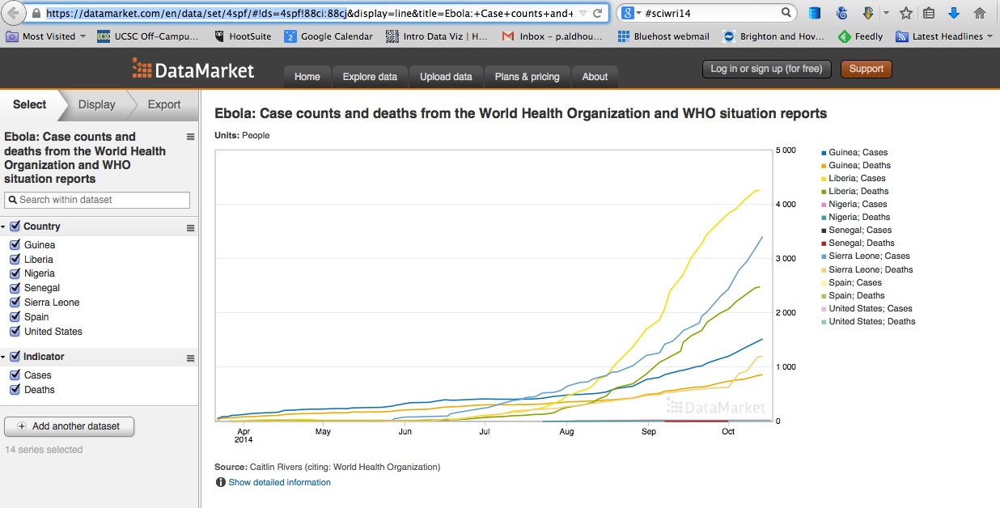

# Datasets

Click on the title links to download the data. Please [contact me](mailto:peter@peteraldhous.com) **before the class** in which data will be used if you have any problems downloading!

## Class exercises

#### [Week 1](./data/week1.zip)

- `mlb_salaries_2013.csv` Salaries of players in Major League Baseball at the start of the 2013 season, from the [Lahman Baseball Database](http://www.seanlahman.com/baseball-archive/statistics/).

- `disease_democ.csv` Data illustrating a [controversial theory](http://www.newscientist.com/article/mg21028133.300-genes-germs-and-the-origins-of-politics.html) suggesting that the emergence of democratic political systems has depended largely on nations having low rates of infectious disease, from the [Global Infectious Diseases and Epidemiology Network](http://www.gideononline.com/) and *[Democratization: A Comparative Analysis of 170 Countries](http://www.amazon.com/Democratization-Comparative-Analysis-Countries-Routledge/dp/0415318602)*.

- `gdp_pc.csv` [World Bank data](http://data.worldbank.org/indicator/NY.GDP.PCAP.PP.CD) on 2014 Gross Domestic Product (GDP) per capita for the world's nations, in current international dollars, corrected for purchasing power in different territories.

#### [Week 3](./data/week3.zip)

- `nations.csv` Data from the [World Bank Indicators](http://data.worldbank.org/indicator/all) portal, which is an incredibly rich resource. Contains the following fields:
 -  `iso_a3` [Three-letter code](http://unstats.un.org/unsd/tradekb/Knowledgebase/Country-Code) for each country, assigned by the [International Organization for Standardization](http://www.iso.org/iso/home/store/catalogue_tc/catalogue_detail.htm?csnumber=63545).
 - `country` Country name.
 - `year`
 - `region` `income_group` World Bank [regions and current income groups](http://siteresources.worldbank.org/DATASTATISTICS/Resources/CLASS.XLS), explained [here](http://data.worldbank.org/about/country-and-lending-groups).
 - `population` Estimated [total population](http://data.worldbank.org/indicator/SP.POP.TOTL) at mid-year, including all residents apart from refugees.
 - `gdp_percap` [Gross Domestic Product per capita](http://data.worldbank.org/indicator/NY.GDP.PCAP.PP.CD) in current international dollars, corrected for purchasing power in different territories.
 - `population` Estimated [total population](http://data.worldbank.org/indicator/SP.POP.TOTL) at mid-year, including all residents apart from refugees.
 - `birth_rate` Number of [live births during the year per 1,000 people](http://data.worldbank.org/indicator/SP.DYN.CBRT.IN), based on mid-year population estimate.
 - `neonat_mortal` [Neonatal mortality rate](http://data.worldbank.org/indicator/SH.DYN.NMRT): number of babies dying before reaching 28 days of age, per 1,000 live births in a given year.


## Final projects

These datasets are suggestions, in which there are definitely stories to be found and visualized. But you are encouraged to work on other datasets, with my agreement. You are also urged to explore other relevant data, as appropriate, to complement the datasets suggested below.

#### [Baseball statistics](http://www.seanlahman.com/baseball-archive/statistics/?wpmp_switcher=mobile)

[Lahman's Baseball Database](http://www.seanlahman.com/baseball-archive/statistics/?wpmp_switcher=mobile) contains a wealth of data on players, managers and teams from 1871 to 2014. Download the data in a series of CSV files from [here](http://seanlahman.com/files/database/lahman-csv_2015-01-24.zip).

[This file](http://seanlahman.com/files/database/readme2014.txt) documents the tables and fields, and how the tables should be joined together. For the player tables ```playerID``` is the unique code for each player that can be used to make joins. When loading this data into SQLite, this field can be used as a primary key for the tables in which it appears. For tables relating to teams or managers, you should create a new primary key, as we did in week 5 for the FDA data.

The Lahman database is also available as an [R package](https://cran.r-project.org/web/packages/Lahman/Lahman.pdf). However, note that this package has not yet been updated for the 2014 season. After installation in R Studio, the package can be loaded and the tables viewed with this code:

```R
# load the database
library(Lahman)

# view, for example, the Master table
View(Master)
```

Although you will not see them as objects in your `Environment` tab in R Studio, each of the tables in the database is now available as a data frame. If you wish, you can convert them into objects in your local environment with something like the following code:

```R
master <- Master
```
You can use the [dplyr](https://cran.r-project.org/web/packages/dplyr/dplyr.pdf) package to join, filter and aggregate the data as required.

#### [North Atlantic storms](./data/storms.zip)

The file `storms.csv` contains [data on tropical storms and hurricanes](http://www.aoml.noaa.gov/hrd/hurdat/Data_Storm.html) compiled by the Hurricane Research Division of the U.S. National Oceanic and Atmospheric Administration. I have processed the [raw data](http://www.aoml.noaa.gov/hrd/hurdat/hurdat2.html) to give the following fields:
- `name` Official name for each storm; unnamed storms are listed as `Unnamed` and also numbered.
- `year` `month` `day` `hour` `minute` Date and time fields for each observation. For recent storms, observations are recorded every six hours.
- `timestamp` Date and time fields combined into a full timestamp for each observation in standard `YYYY-MM-DD HH:MM` format.
- `record_ident` The entry `L` indicates the time at which a storm made landfall, defined as the center of the system crossing a coastline, recorded from 1991 onwards. Other entries are explained in the file `newhurdat-format.pdf`.
- `status` Options include `HU` for hurricane, `TS` for tropical storm and `TD` for tropical depression. Other entries are explained in `newhurdat-format.pdf`.
- `latitude` `longitude` Geographic coordinates for the center of the system at each observation.
-  `max_wind_kts` `max_wind_kph` `max_wind_mph` Maximum sustained wind for each observation.
- `min_press` Minimum air pressure at the center of the system for each observation.

This file contains data on storms from 1851 to 2014. However, you may wish to restrict your visualizations to storms from 1990 and later, as data on storms before the modern satellite era is less reliable.

This collection of data is good for mapping. If you need shapefiles for context and basemaps, try [Natural Earth](http://www.naturalearthdata.com/downloads/). These shapefiles each come with a `README.html` file that can be opened in a web browser for more information.


#### [Wealth and well-being of nations](./data/nations.zip)

In its [World Development Indicators](http://data.worldbank.org/indicator/all), the World Bank has a trove of data on many aspects of countries' wealth and well-being: There are many stories to be told from this data.

You can download data for individual indicators, or read data directly into R using the [WDI](https://cran.r-project.org/web/packages/WDI/WDI.pdf) package. (Remember that you will need to convert data you download from the World Bank site from wide to long format; the R package will give you data in the correct long format.)

You may also wish to use the [Human Development Index](http://hdr.undp.org/en/content/human-development-index-hdi) (HDI), a measure derived by the United Nations Development Programme (UNDP) which, in that agency's words, summarizes nations' achievement "in key dimensions of human development: a long and healthy life, being knowledgeable and have a decent standard of living." The health component is measured by life expectancy at birth; the knowledge component by mean years of schooling; the standard-of-living component by gross national income, corrected for purchasing power in different nations. The composite measure is converted to an index ranging from 0 to 1, using methods described [here](http://hdr.undp.org/en/content/human-development-index-hdi). Download HDI and related UNDP data from [here](http://hdr.undp.org/en/content/exporting-data-and-understanding-api).

In week 4, we saw how to download Gapminder data in bulk. Its data library includes some measures not available from the World Bank, so if you cannot find the data you want among the World Bank Indicators, try searching for it at [Gapminder's data download](http://www.gapminder.org/data/) page.

I would advise saving Gapminder spreadsheets as CSV files for use in other applications. Again, Gapminder data is in wide format, and will need to be converted to long format for visualization in Tableau Public or R.

Alternatively, you can access a sample of Gapminder data in R using the [datamart](https://cran.r-project.org/web/packages/datamart/datamart.pdf) package. After installing the package:

```R
# load the package
library(datamart)

# access Gapminder data and view available variables
gm <- gapminder()
queries(gm)

# load one of those variables as a data frame
sulfur <- query(gm, "SulfurEmissions")
```

You will notice that neither the UNDP nor the Gapminder data contain ISO country code fields; also the country names used differ from those used by the World Bank. This is where the file `nations_join.csv`, comes in. It can be used in SQLite or using the R dplyr package to join data from the different sources.

If you want to make maps from this data, I have included a world countries shapefile from Natural Earth in the subfolder `ne_50m_admin_0_countries`.

#### [Global Terrorism Database](http://www.start.umd.edu/gtd/)

Maintained by the National Consortium for the Study of Terrorism and Responses to Terrorism (START) at the University of Maryland in College Park, the [Global Terrorism Database](http://www.start.umd.edu/gtd/) contains information on more than 140,000 terrorist attacks from 1970 to 2014. It is a rich source of information on terrorist groups across the globe, and the attacks they are responsible for.

You can download the data [from here](http://www.start.umd.edu/gtd/contact/), selecting the `Download full GTD dataset` option. An [extensive codebook](http://www.start.umd.edu/gtd/downloads/Codebook.pdf) details all of the fields in the data.

The data is provided as a series of spreadsheets in `.xlsx` format. The file `globalterrorismdb_0615dist.xlsx` contains the entire database. I suggest that you import this data into Open Refine before processing any further, and create a new field giving the date of each event in standard `YYYY-MM-DD` format. This can be done from the `eventid` field. I can help with this.

You can then export as a CSV or tab-delimited text file for analysis, visualization and mapping; you can use the field `eventid` as a primary database key, so make sure to retain this column when processing the data in Open Refine. Because there is no need to create a new primary key field, you do not need to create the table first if importing into SQLite. Simply use the import icon in the SQLite Manager:



When prompted, modify the table to give each field the correct data type as detailed in the codebook.

Do take care to read the [Terms of Use](http://www.start.umd.edu/gtd/terms-of-use/) and [instructions for citing the source](http://www.start.umd.edu/gtd/terms-of-use/CitingGTD.aspx) of the GTD data.


#### [California traffic accidents](./data/traffic.zip)

Data from the [Transportation Injury Mapping System](http://tims.berkeley.edu/page.php?page=about), detailing injury and fatal traffic accidents for the whole of California from 2003 to 2012. The data comes from the California Highway Patrol's [Statewide Integrated Traffic Records System](http://iswitrs.chp.ca.gov/Reports/jsp/userLogin.jsp) and was then geocoded for mapping by UC Berkeley's Safe Transportation Research & Education Center.

There are three CSV files: `collisions_2003to2012.csv` contains details on each collision; `party_2003to2012.csv` and `victim_2003to2012.csv` have more information about the people involved in each accident. The codebook `SWITRS_codebook.pdf` explains the fields in these tables, and how they should be joined.


