# Making interactive maps and processing geodata with SQL

### Introducing Carto

[**Carto**](https://carto.com/) is a cloud-based mapping application that makes it easy to produce interactive, online maps. These maps can include [animations of data over time](https://carto.com/docs/faqs/torque/).

It is also a geospatial database, allowing you to perform GIS analyses and process geodata using [Structured Query Language](http://en.wikipedia.org/wiki/SQL). If you are comfortable working with databases, you may find Carto a good alternative to the point-and-click interface of QGIS for these tasks.

### The data we will use today

Download the data from this session from [here](data/week11.zip), unzip the folder and place it on your desktop. It contains the following folders and files:

- `ca_healthcare`
 - `ca_counties_medicare.zip` Zipped shapefile with data on Medicare reimbursement per enrollee by California county in 2012, as used in week 10.
 - `healthcare_facilities.csv` Locations and other data for hospitals and other healthcare facilities in California, as used in week 10.
- `seismic_risk.zip` Zipped shapefile detailing the risk of experiencing a major earthquake across the continental United States, as used in week 10.
- `sf`
 - `sf_test_addresses.csv` Sample of 100 addresses in San Francisco, geocoded in week 9.
 - `sfpd_stations.zip` Zipped shapefile with locations of San Francisco police stations.

All of the shapefiles have been compressed/zipped, as this is required to load them into Carto.

### Map Medicare reimbursements and hospitals in California

#### Import the data

To demonstrate Carto's core map-making functionality, we will first make an interactive online version of the static map we made in week 10.

Login to your Carto account, open the drop-down menu under `Maps` at top left and switch to `Your datasets`. Then click the blue `NEW DATASET` button at top right.

You should now see the following screen:

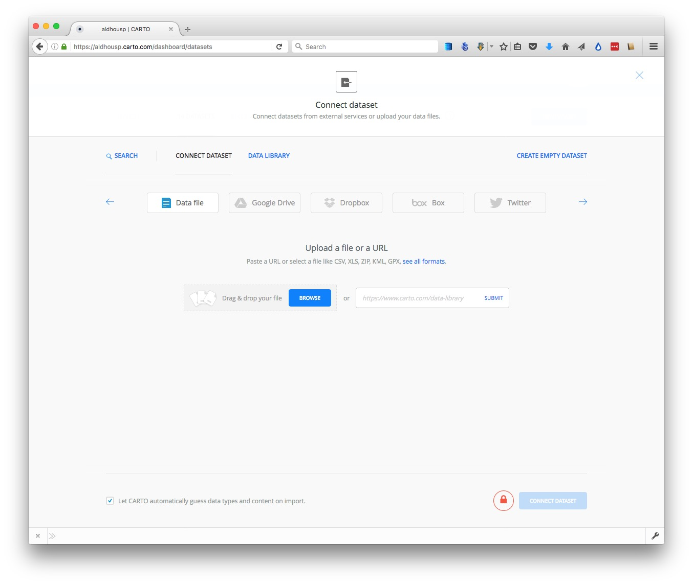

With the `Data file` tab selected, click the `Browse` button, navigate to the zipped `ca_counties_medicare.zip` shapefile and click `Open`. Then click the green `Connect dataset` button.

Cartocan import data in a variety of formats, including CSV, KML, GeoJSON and zipped shapefiles. See [here](https://carto.com/docs/carto-engine/import-api/importing-geospatial-data/#supported-geospatial-data-formats) for more on supported data formats.

Once the data has imported, you will see the uploaded data table in `DATA VIEW`:

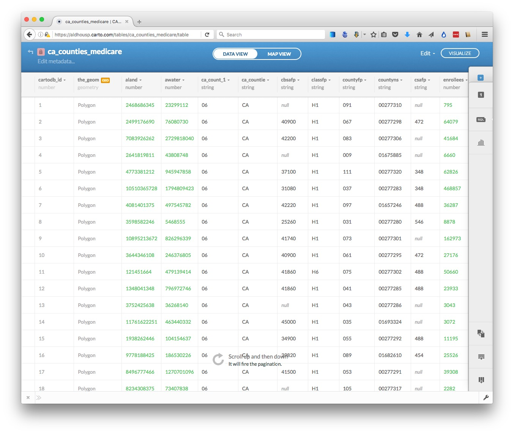

Notice that, in addition to the fields from the original data, each row has been given a `cartodb_id`, which is a unique identifier for each. The table also has a field called `the_geom` which has the tag `GEO`. This field is central to how Carto works, defining the geometry of any map you make. As in QGIS, these geometries can be points, lines or polygons -- which is what we have here.

You can rename fields, sort the table by the data in them, or change their data type (for example from numbers to strings of text), by clicking the downward-pointing triangle next to the header of each.

Switch to `MAP VIEW` to see the basic, unstyled map:


Click the small return arrow at top left to go back to the overview of your datasets.

Notice that the top menu has a link to `DOCUMENTATION`, which has links to Carto's technical manuals. The `DATA LIBRARY` link contains useful datasets that you can import into your own account. Take a few minutes to explore what's there, before returning to your `DATASETS`.

Now click the `NEW DATASER` button again and import the file `healthcare_facilities.csv`, which should look like this in the `DATA VIEW`:


Notice that `the_geom` for points is given by their longitude and latitude co-ordinates.

Click on the `MAP VIEW` to see the locations of all of the facilities:


#### Create a visualization combining both datasets

Exit the `healthcare_facilities` map and reopen the `ca_counties_medicare` dataset by clicking on its name in your `DATASETS`. Then click the `VISUALIZE` button at top right.

You will then see a prompt to create a new map. Click the green `OK, CREATE MAP` button:

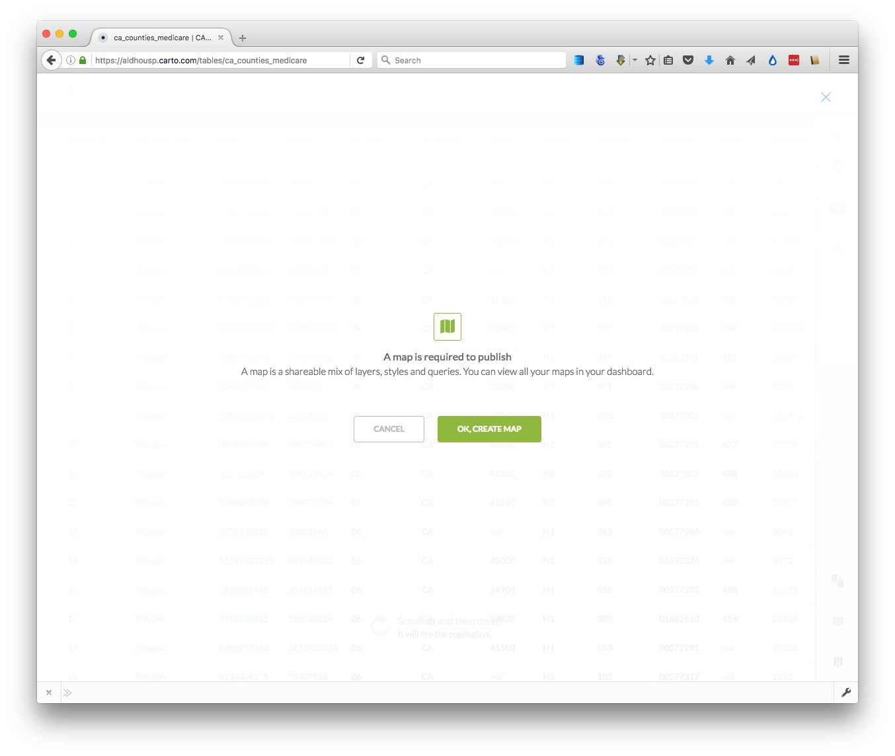

Rename this map `California hospitals` by clicking on its name at top left:


Now add the `healthcare_facilities` to the map, by clicking on the blue `+` button to the right. Select the `healthcare_facilities` layer so that its icon is highlihgted in blue, then click the `ADD LAYER` button at bottom right.

Now select `MAP VIEW` to see both layers on the same map:

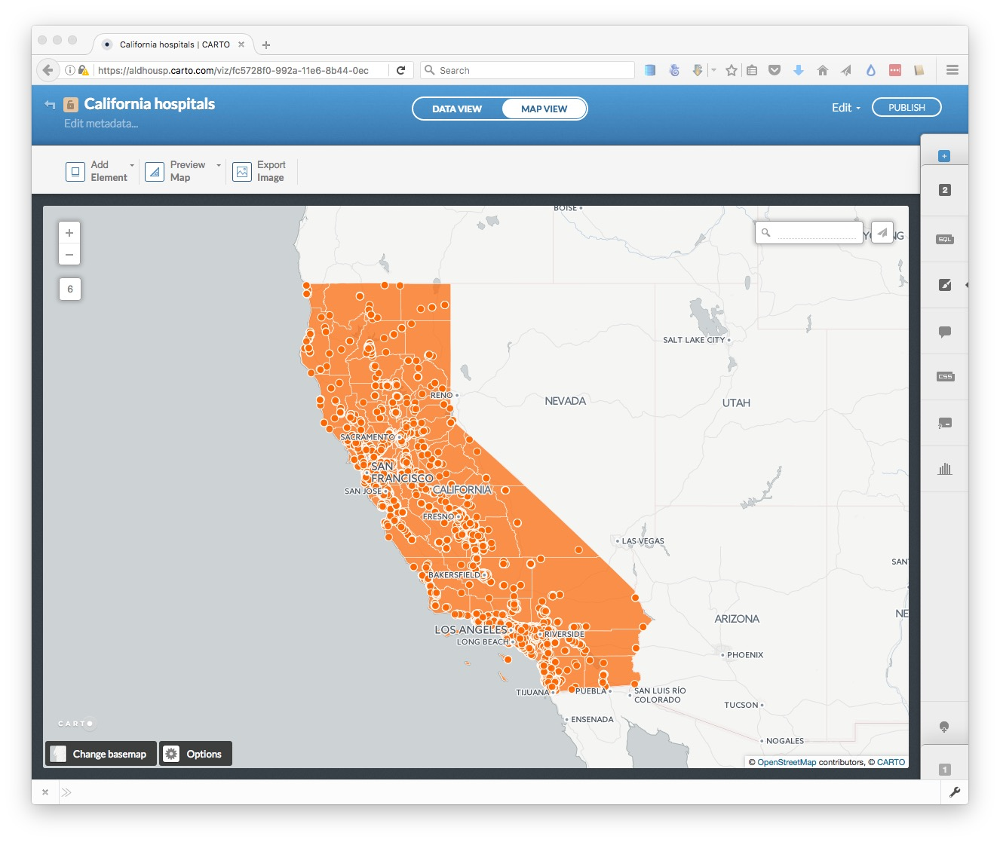

You can tell when you're in a map visualization, rather than a single dataset, because the `MAP VIEW` has a black border.

#### Select a basemap

Now choose a basemap for your visualization, by clicking `Change basemap` at bottom left. Take a few minutes to explore the built-in basemap options. You are not limited to these basemaps, however.

To import another tiled basemap from elsewhere on the web, click the blue plus sign next to `Yours` to call up the following dialog box:


The `XYZ` tab allows you to call in publicly available basemaps using URLs in the following format:

```SQL
https://{s}.tiles.mapbox.com/v3/mapbox.world-bright/{z}/{x}/{y}.png
```

We will use this "world bright" basemap, provided by MapBox (see the other basemaps from MapBox [here](http://a.tiles.mapbox.com/v3/mapbox/maps.html)). The [Leaflet Providers preview](http://leaflet-extras.github.io/leaflet-providers/preview/) is a good place to look for available basemaps from other providers. It previews the maps and also exposes their `XYZ` URLs:


Back in Carto, enter the `XYZ` URL for the MapBox world bright map and click `Add basemap`. The map should now look like this:


#### Style the maps using the Carto wizard

Notice that the toolbar at right has tabs numbered `1` and `2`. It you hover over them, you will see that they correspond to the `ca_counties_medicare` and `healthcare_facilities` layers respectively.

Click on `1` to expose the `Visualization wizard` for the `ca_counties_medicare` layer, which can also be reached by clicking the paintbrush icon:

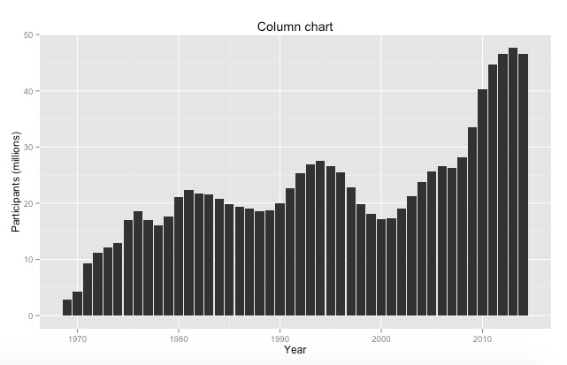

(You can collapse the wizards at any time by clicking to the left of any of the icons.)

Notice that opening the wizard has also exposed blue toggle controls for each layer, which can be used to turn the visibility for each on and off. Hide the `healthcare_facilities` layer so we can see what we are doing.

Scroll from left to right through the visualization options, and select `CHOROPLETH` to make a choropleth map.

Set `hospital` as the data `Column`, select `5 Buckets`, set them by `Quantile` and set the `Polygon Stroke` to zero to remove the lines from the map layer. The map should now look like this:

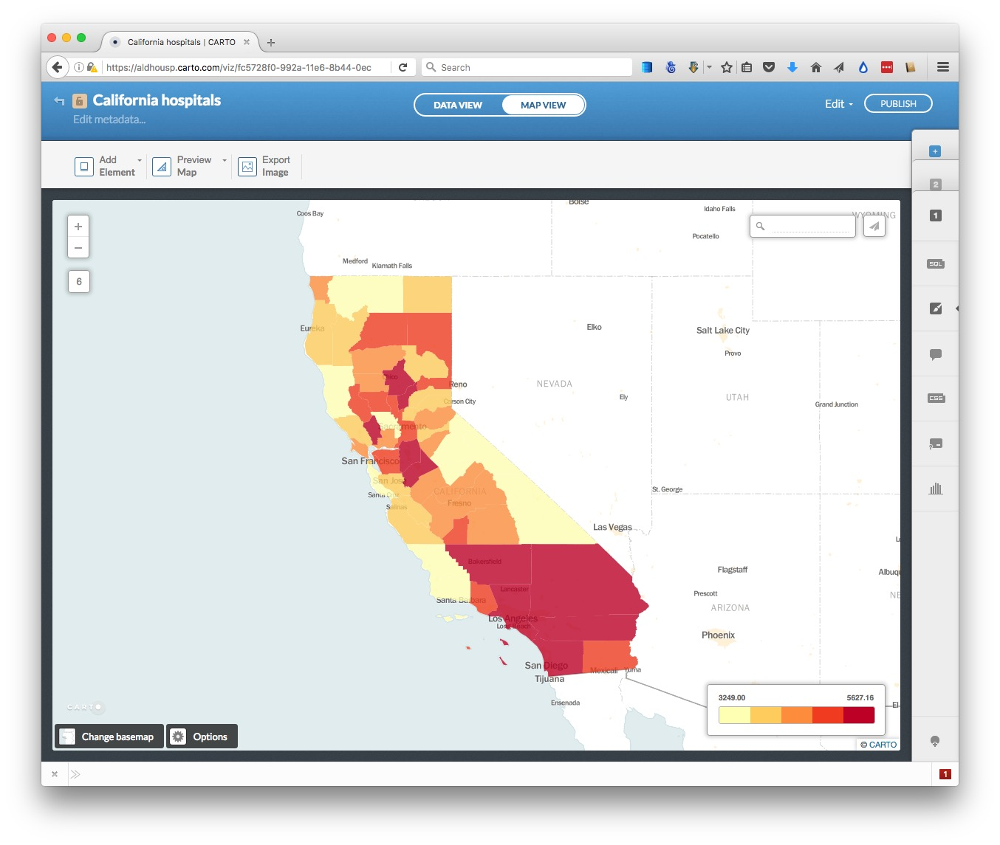

Now click `2` to switch to the `healthcare_facilities` layer and turn on its visibility.

In the `Visualization wizard` select `CATEGORY` and color the circles by the type of facility, by selecting `type` as the data `Column`. The map should look like this:


We now have a rough approximation of the map we made in week 10 using QGIS, but there are important differences: We do not have the custom bins we used for the choropleth map; the circles are not scaled by area according to capacity of the healthcare facilities; we have not yet filtered the healthcare facilities for the two types we are interested in; and the colors haven't been fully customized.

#### Create a new column in the healthcare facilities data to scale the circles accurately by area, according to their capacity in beds

The Carto `Visualization wizard` does have a `BUBBLE` option, which sizes circles according to values in the data. However, it does not accurately and continuously vary the area of circles according to values in the data. To achieve that, we need to create a new column in the data, containing the square root of the values in the `capacity` column.

This is because web-based applications like Carto set the size of circles by their width, or twice their radius. From week 2, you should remember that we need to scale by the square root of the radius to size circles so that their area is proportional to values in the data.

Switch to the `DATA VIEW` for the `healthcare_facilities` layer. Open up the dropdown menu for the `capacity` field and select `Add new column...` Rename it as `scale` and then change its type from `string` to `number`:


Now open the `SQL` tab, then enter and apply the following query:

```SQL
UPDATE healthcare_facilities SET scale=sqrt(capacity)
```

`UPDATE` queries change the data in the table, in this case updating the `healthcare_facilities` table to set the values for `scale`as the square root of the values in `capacity`.

Click `Apply query` and see that the `scale` column has now been populated with values:

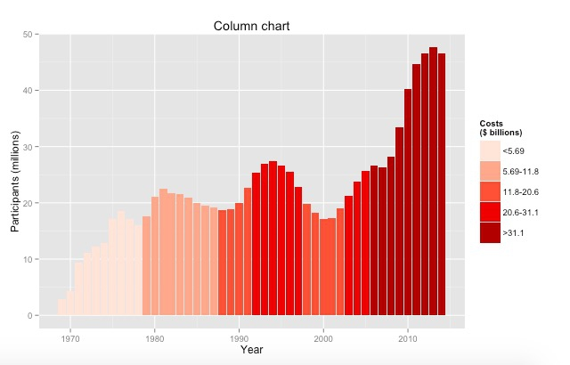

#### Filter the healthcare facilities data

To filter the data, we can use another simple SQL query. In the `SQL` tab, enter and apply the following query:

```SQL
SELECT *
FROM healthcare_facilities
WHERE type = 'GENERAL ACUTE CARE HOSPITAL' OR type = 'SKILLED NURSING FACILITY'
```
In this query, `*` is a wildcard that selects every column from the `healthcare_facilities` dataset. The `WHERE` clause applies the filter for the specific types we want to retain on the map.

The map should now look like this in the `MAP VIEW`:


#### Style the map using CartoCSS

To exert finer control over the map styling, we can use CartoCSS, which styles maps in much the same way that conventional CSS styles web pages. See [here](https://github.com/mapbox/carto/blob/master/docs/latest.md) for a CartoCSS reference.

In the `MAP VIEW`, select the `ca_counties_medicare` layer by clicking on `1`. Then click on the `CSS` icon, where you will see the following code:

```CSS
/** choropleth visualization */

#ca_counties_medicare {
  polygon-fill: #FFFFB2;
  polygon-opacity: 0.8;
  line-color: #FFF;
  line-width: 0;
  line-opacity: 0;
}
#ca_counties_medicare [ hospital <= 5627.16] {
   polygon-fill: #BD0026;
}
#ca_counties_medicare [ hospital <= 4197.21] {
   polygon-fill: #F03B20;
}
#ca_counties_medicare [ hospital <= 3801.62] {
   polygon-fill: #FD8D3C;
}
#ca_counties_medicare [ hospital <= 3581.08] {
   polygon-fill: #FECC5C;
}
#ca_counties_medicare [ hospital <= 3249] {
   polygon-fill: #FFFFB2;
}
```
Edit this to the following, to reset the breaks between the bins, and to use the same color scheme we used in week 10, using HEX values taken from [ColorBrewer](http://colorbrewer2.org/)


```CSS
/** choropleth visualization */

#ca_counties_medicare {
  polygon-fill: #FFFFB2;
  polygon-opacity: 0.5;
  line-color: #FFF;
  line-width: 0;
  line-opacity: 0;
}
#ca_counties_medicare [ hospital <= 5627.16] {
   polygon-fill: #a50f15;
}
#ca_counties_medicare [ hospital < 4000] {
   polygon-fill: #de2d26;
}
#ca_counties_medicare [ hospital < 3750] {
   polygon-fill: #fb6a4a;
}
#ca_counties_medicare [ hospital < 3500] {
   polygon-fill: #fcae91;
}
#ca_counties_medicare [ hospital < 3250] {
   polygon-fill: #fee5d9;
}
```
Note that that we have also edited the operators for all but one of the formulas for the breaks from `<=` (less than or equal to) to `<` (less then). This will create the same breaks as we used in the QGIS map. Click the `Apply style` button at bottom right.

Now switch to the CartoCSS editor for the `healthcare_facilities` layer, where you will find the following code:

```CSS

/** category visualization */

#healthcare_facilities {
   marker-fill-opacity: 0.9;
   marker-line-color: #FFF;
   marker-line-width: 1;
   marker-line-opacity: 1;
   marker-placement: point;
   marker-type: ellipse;
   marker-width: 10;
   marker-allow-overlap: true;
}

#healthcare_facilities[type="ADULT DAY HEALTH CARE		"] {
   marker-fill: #A6CEE3;
}
#healthcare_facilities[type="CHRONIC DIALYSIS CLINIC	"] {
   marker-fill: #1F78B4;
}
#healthcare_facilities[type="COMMUNITY CLINIC 	"] {
   marker-fill: #B2DF8A;
}
#healthcare_facilities[type="GENERAL ACUTE CARE HOSPITAL"] {
   marker-fill: #33A02C;
}
#healthcare_facilities[type="HOME HEALTH AGENCY		"] {
   marker-fill: #FB9A99;
}
#healthcare_facilities[type="HOSPICE	"] {
   marker-fill: #E31A1C;
}
#healthcare_facilities[type="INTERMEDIATE CARE FACILITY-DD/H/N"] {
   marker-fill: #FDBF6F;
}
#healthcare_facilities[type="SKILLED NURSING FACILITY"] {
   marker-fill: #FF7F00;
}
#healthcare_facilities[type="SURGICAL CLINIC 	"] {
   marker-fill: #CAB2D6;
}
#healthcare_facilities[type="UNLICENSED/OTHER/MISSING"] {
   marker-fill: #6A3D9A;
}
#healthcare_facilities {
   marker-fill: #DDDDDD;
}

```

Edit this to the following:

```CSS
#healthcare_facilities {
   marker-fill-opacity: 0.5;
   marker-line-color: #FFF;
   marker-line-width: 1;
   marker-line-opacity: 1;
   marker-placement: point;
   marker-type: ellipse;
   marker-width: [scale];
   marker-allow-overlap: true;
}

#healthcare_facilities[type="GENERAL ACUTE CARE HOSPITAL"] {
   marker-fill: #0000FF;
}
#healthcare_facilities[type="SKILLED NURSING FACILITY"] {
   marker-fill: #FF8000;
}
```
Setting the `marker-width` to `[scale]`, with the name of the field in square brackets, accurately scales the area of the circles according the capacity of the facilities. If necessary, when scaling circles in this way, you can use multiplication (`marker-width: [scale]*2;`) or division (`marker-width: [scale]/2;`) to increase or decrease the size of all the circles.

The CartoCSS above also makes the circles semi-transparent using `marker-fill-opacity: 0.5;`. It makes the hospitals blue using `marker-fill: #0000FF;`, and skilled nursing facilities orange using `marker-fill: #ff8000;`.

The map should now look like this:


#### Edit the legend

Notice that the legend still refers to the styling created by the wizard.

For the `ca_counties_medicare` layer, click on the legends icon:


Edit the title to `Medicare reimbursement per enrollee` and check `show`, change the `Left label` to `<$3,250` and the `Right label` to `>$4,000`; then change the colors to those that are now displayed on the map:

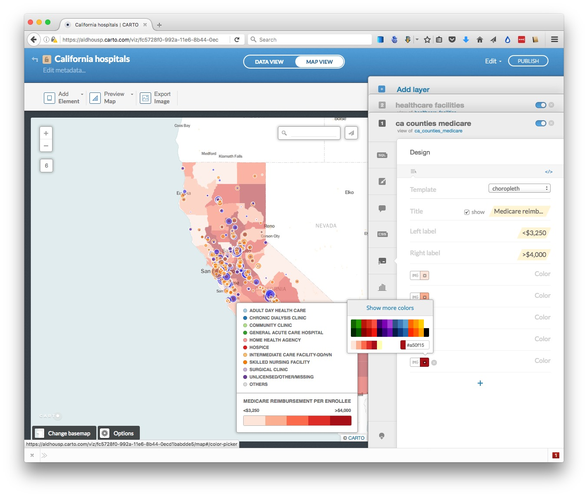

Select the `</>` link to edit the HTML to the following:

```CSS
<div class='cartodb-legend choropleth'>   
<div class="legend-title">Medicare reimbursement per enrollee</div>
<ul>
    <li class="min">
        &lt;$3,250
    </li>
    <li class="max">
        &gt;$4,000
    </li>
    <li class="graph count_315">
    <div class="colors">
    <div class="quartile" style="background-color:#fee5d9; opacity:0.5"></div>
    <div class="quartile" style="background-color:#fcae91; opacity:0.5"></div>
    <div class="quartile" style="background-color:#fb6a4a; opacity:0.5"></div>
    <div class="quartile" style="background-color:#de2d26; opacity:0.5"></div>
    <div class="quartile" style="background-color:#a50f15; opacity:0.5"></div>
    </div>
    </li>
</ul>
</div>
```

Adding `opacity: 0.5` to the styling for each of the legend items makes them match the semi-transparency of the map layer.

Edit the legend for the `healthcare_facilities` similarly, changing the HTML to the following:

```CSS
<div class='cartodb-legend custom'>   
<div class="legend-title">Healthcare facilities (scaled by capacity)</div>
<p>
  <ul>
    <li>
        <div class="bullet" style="background:#0000ff; opacity: 0.5"></div>
        General acute care hospital
    </li>
    <li>
        <div class="bullet" style="background:#ff7f00; opacity: 0.5"></div>
        Skilled nursing facility
    </li>
</ul>
</div>
```


### Configure tooltips

Select the `ca_counties_medicare` layer, and click on one of the counties and click the infowindow icon:


In the `Hover` tab, turn on the `hospital` toggle control, uncheck `title?`, then select the `</>` link to edit the HTML.

Insert a `$` symbol in front of `{{hospital}}`:

```CSS
<div class="cartodb-tooltip-content-wrapper">
  <div class="cartodb-tooltip-content">
    <p>${{hospital}}</p>
  </div>
</div>
```

Click `Apply` and a tooltip showing the medicare reimbursement should now appear when you hover over each county.

Now switch to the `healthcare_facilities` label, select the infowindow tab, and in the `Click` tab select the `capacity` and `name` toggle controls. This time keep `title?` checked for each.

The map should now look like this:


#### Configure the map options, and publish

We are almost ready to publish the visualization, but before doing so, click `Options` at the bottom left of the map to select the controls and other items you want to include. Here  the `Search box`, which geocodes locations entered by the user and zooms to them is disabled; the option to switch to a `Fullscreen` view of the map is enabled:


I strongly recommend disabling the `Scroll wheel zoom` which will otherwise cause the map to zoom unintentionally when someone scrolls down a web page in which the map is embedded.

Also explore the `Add Element` button at top left, which allows you to add a title and other annotations to your map.

You can also click `Preview Map` to see you map will look on Desktop and Mobile devices, or `Export Image` to download a static image.

Having finished working on the visualization, click the `PUBLISH` button at top right. This will call up the following options:

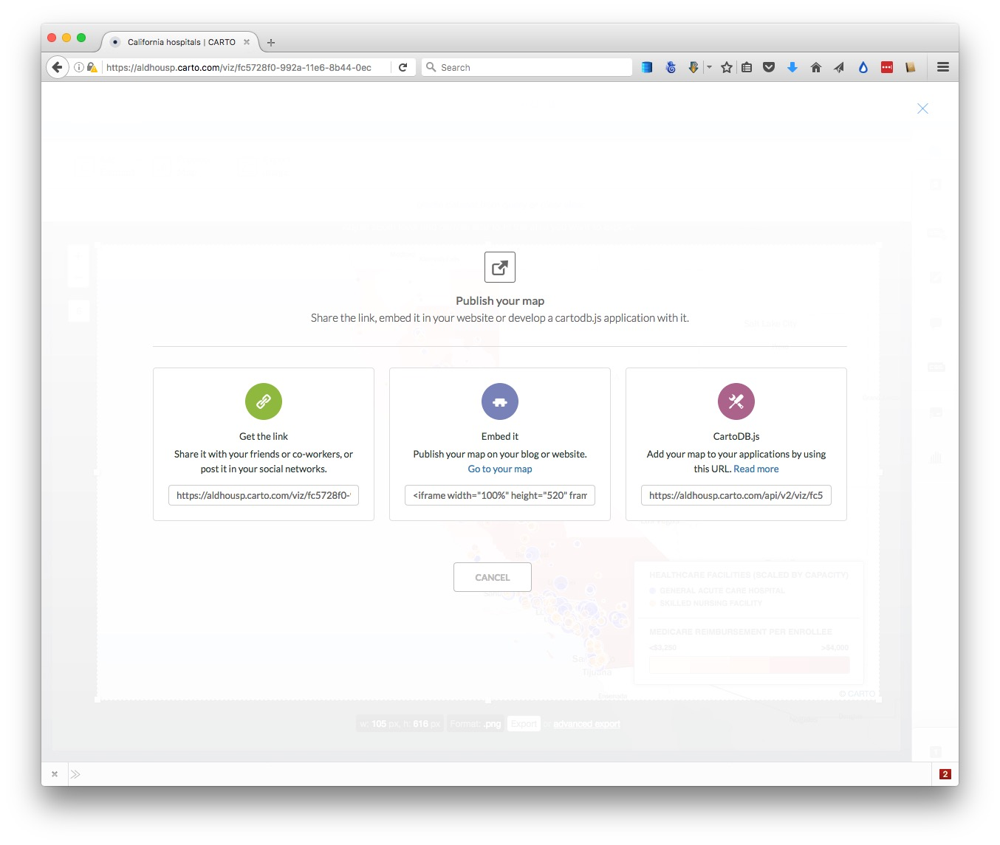

Copy the code from `Embed it` to obtain an [iframe](http://www.w3schools.com/tags/tag_iframe.asp) which will allow you to embed the map on any web page, in the following format:

```CSS
<iframe width="100%" height="520" frameborder="0" src="https://aldhousp.carto.com/viz/fc5728f0-992a-11e6-8b44-0ecd1babdde5/embed_map" allowfullscreen webkitallowfullscreen mozallowfullscreen oallowfullscreen msallowfullscreen></iframe>
```
(Note that you can edit the dimensions of the iframe -- here set at `100%` of the width of the div in which it appears -- and `520` pixels high) as required.)

Open the file `test.html` in your text editor, paste the iframe code between the `<body> </body>` tags and save the file. Then open in a web browser to see the completed map:

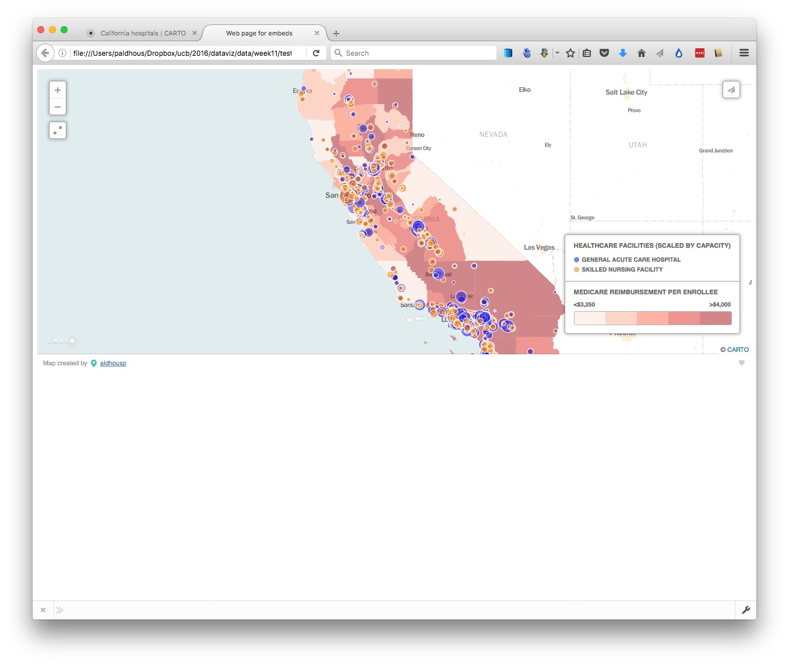

### Other visualization types with Carto

Carto has wizards to create other visualization types, which again can be customized using CartoCSS. These include `Torque` animations. See [here](http://paldhous.github.io/kdmc-workshops/2015/advanced-mapping/cartodb.html) for a tutorial that includes an animated map of North Atlantic storms.


### Process geodata and perform geospatial analysis using SQL

Carto isn't just a database -- it is a "spatially aware" database that you can query to process geotdata, calculate distances or areas, and  perform other geospatial analyses. This is achieved using [PostGIS](http://postgis.net/), an extension to the open-source [PostgreSQL](http://www.postgresql.org/) database that drives Carto.

#### Clip the seismic risk dataset to the borders of the United States

From now on were are going to work with queries that use PostGIS spatial functions, which all have the prefix `ST_`.

Navigate back to your datasets and import the zipped shapefile `seismic_risk`, which should look like this in the `MAP VIEW`:


In the `DATA VIEW`, notice that there are two fields containing data about the mapped polygons: `acc_val` and `valley`.

Navigate back to your datasets, click the `DATA LIBRARY` link, and `SEARCH` for the `World borders` dataset. Select and then click the `Connect dataset` link.

In the `DATA VIEW`, notice that it contains a field with `iso3` country codes:


Open the `SQL` tab, and run the following query to replicate the clip we ran in week 10 using QGIS:

```SQL
SELECT seismic_risk.acc_val, seismic_risk.valley, ST_Intersection(seismic_risk.the_geom, world_borders.the_geom) AS the_geom
FROM seismic_risk, world_borders
WHERE world_borders.iso3='USA'
```

Let's break this query down:

The `SELECT` clause selects the two data fields from the `seismic_risk` dataset, and creates a third column called `the_geom` using the PostGIS function `ST_Intersection`, which is the spatial overlap between the `seismic_risk` and `world_borders` maps.

The `FROM` clause needs to include both datasets mentioned in the `SELECT` clause, separated by commas.

Finally, the `WHERE` clause filters the results so that the data returned overlaps with the United States only.

Click on the `Create dataset from query` link, rename it as `seismic_risk_clip`, and switch to the `MAP VIEW`, which should look like this:

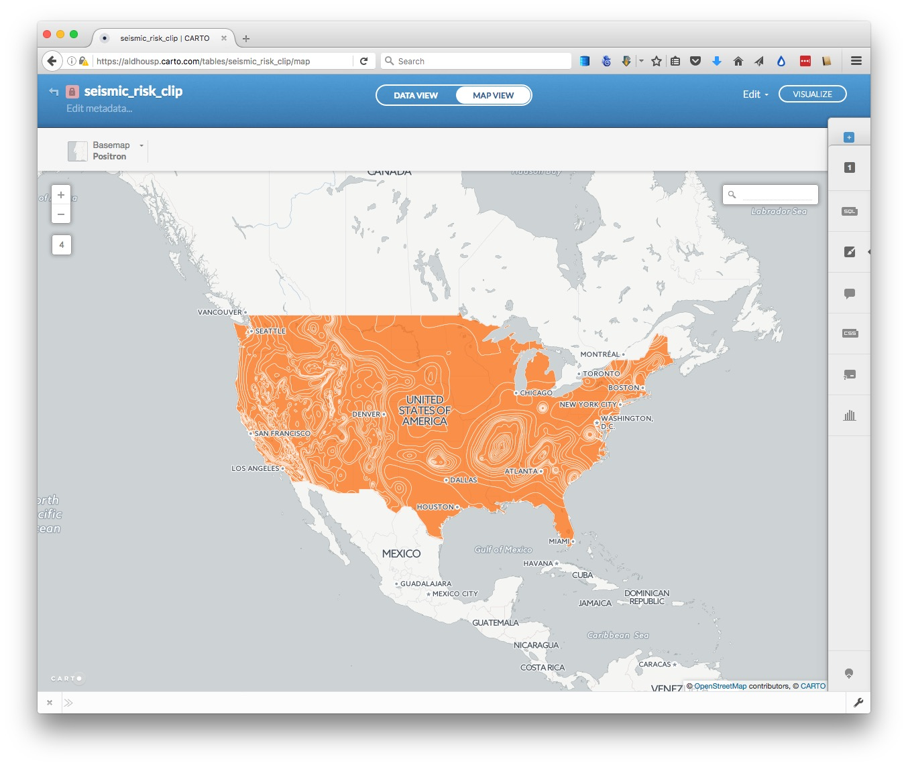

If you are processing data in Carto for use with other mapping tools, you would now want to export the data. To do this, click on the `Edit` link at top right, select `Export...` and choose the desired format:


#### Create buffers around geocoded San Francisco addresses

Import the file `sf_test_addresses.csv`. It will initially import with `the_geom` field containing `null` values, because there are no fields unambiguously labelled `longitude` and `latitude`:

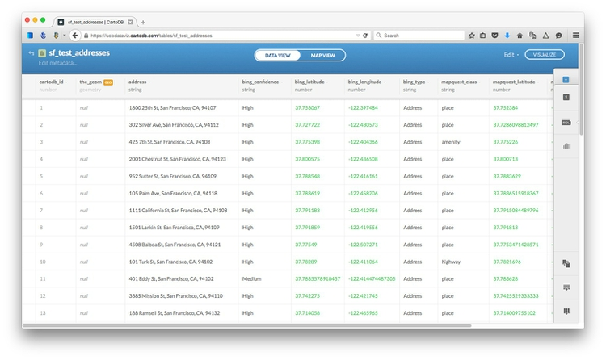

Click on the orange `geo` symbol, select `bing_longitude` and `bing_latitude` as geographic co-ordinates and click `CONTINUE`:

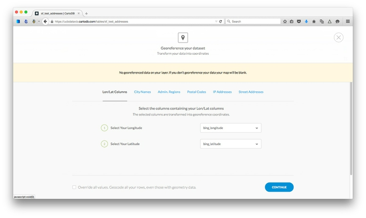

Switch to `MAP VIEW` to confirm that the points are displaying correctly in San Francisco. Then select `Edit` at top right, `Duplicate dataset...` and change its name to `buffer`.

In the `SQL` tab, run this query.

```SQL
UPDATE buffer SET the_geom = ST_Buffer(the_geom::geography, 304.8)::geometry
```
This changes the map so that instead of points, we now have circles drawn around each of the points with a radius of 1,000 feet, or 304.8 meters. Notice that the entries in `the_geom` field are now all `Polygon`. Switch to `MAP VIEW`:

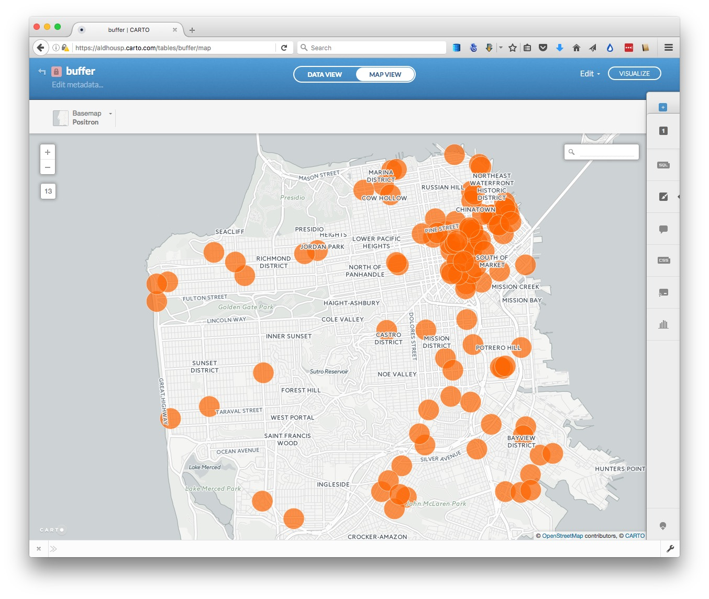

Let's break this query down to understand how it works. First, note that it is an `UPDATE` query, so rather than selecting records from a table, it is changing the table. The change being made is to `SET` the field `the_geom` using the PostGIS function `ST_Buffer`, which draws a buffer around an object using the value specified in meters.

That's all fairly easy to understand, but why does the query contain `::geography` and `::geometry`? These are data conversions that are necessary for the buffers to be drawn. Carto stores `the_geom` in a `WGS84` datum, for which the units are degrees. The conversion from this `geometry` to `geography` is necessary for calculations to be made in meters. Once the buffer has been calculated, the data must be converted back to `geometry` to update the table in the database.

This query reverses the process, turning each circle into a point at its center:

```SQL
UPDATE buffer SET the_geom = ST_Centroid(the_geom)
```

Try it out, then use the first query again to return to the buffered points. If you switch to the `DATA VIEW`, you will see that the values in `the_geom` are now `Polygon` rather than point coordinates.

Now we will dissolve all of these separate circles into a single buffer layer, by running this query:

```SQL
SELECT ST_Union(the_geom_webmercator) AS the_geom_webmercator
FROM buffer
```
`ST_Union` is a function that dissolves multiple geometries into one.

Why does this query use `the_geom_webmercator` rather than `the_geom`? This is a quirk of Carto, which stores a projected version of the table's geometry in a "hidden" field of this name, as explained [here](https://carto.com/docs/tutorials/projections/). Some PostGIS functions will only work on this version of the geometry, but Carto should warn you when this is necessary -- try running the same query using `the_geom` and you should be prompted to use `the_geom_webmercator`.

In the data view, you will notice that there is now just a single field, called `the_geom_webmercator`, containing one `Polygon`. If you switch to the map view, you will see that the separate circles have now dissolved together:


Select `create dataset from query` and rename the new dataset as `buffer_dissolved`.

#### An example of what is possible with PostGIS

Return to your datasets, open the original `sf_test_addresses` once more, and switch to the `MAP VIEW`.

Now click `VISUALIZE` at top right to create a map. Click the blue `+` symbol at top right, click on `CONNECT DATASET` and import the zipped shapefile `sfpd_stations.zip`. using the `Data file` tab. Then use the `Simple` option in the `Visualization wizard` to color the points denoting the locations of San Francisco police stations black. The visualization, with its two layers, should now look like this:


Next we are going to run a query to calculate the distance from each of the geocoded addresses to the nearest police stations. But first we need to create a new field called `distance` in the `sf_test_addresses` dataset to hold the results of this query.

Select this layer from the right toolbar, switch to `DATA VIEW` and then open the dropdown menu for any of the field headers. Select `Add new column...`, call it `distance` and make its type `number`.

Now select the `SQL` tab and apply this query:

```SQL
UPDATE sf_test_addresses SET distance = (
  SELECT ST_Distance(
            sf_test_addresses.the_geom::geography, 
            sfpd_stations.the_geom::geography
          )
  FROM sfpd_stations
  ORDER BY sf_test_addresses.the_geom <-> sfpd_stations.the_geom 
  LIMIT 1
)
```
The `distance` field should now have been populated with numbers, representing the distance in meters from that address to the nearest police station.

`ST_Distance` is fairly straightfoward, and you will recognize why `the_geom` fields must be converted to geography so that distances can be calculated in meters. This time they do not need to be converted back to geometry because neither of the `the_geom` fields is being updated by the query.

The really clever part is this:

```SQL
ORDER BY sf_test_addresses.the_geom <-> sfpd_stations.the_geom
LIMIT 1
```

This is performs an [indexed nearest neighbor search](http://boundlessgeo.com/2011/09/indexed-nearest-neighbour-search-in-postgis/). `<->` measures the distance to each police station from each address, and then `ORDER BY` sorts these distances in ascending order, nearest first. Finally, `LIMIT 1` returns only the first value, which is the distance to the nearest police station from each address.

What if you want those distances in miles, rather than meters? One meter is 0.000621371 miles, so simply edit the query to include this conversion:

```SQL
UPDATE sf_test_addresses SET distance = (
  SELECT (ST_Distance(
            sf_test_addresses.the_geom::geography, 
            sfpd_stations.the_geom::geography
          ))*0.000621371
  FROM sfpd_stations
  ORDER BY sf_test_addresses.the_geom <-> sfpd_stations.the_geom 
  LIMIT 1
)
```

#### Next steps with PostGIS

I hope these queries have whetted your appetite to learn more about PostGIS. I suggest continuing with the NICAR tutorial below, which provides some more examples of queries, and how they have been used by news media to generate stories and visualizations.


### Further reading/resources


[Carto tutorials](https://carto.com/docs/tutorials/)

[The Map Academy](https://carto.com/academy/)
A series of exercies in Carto, organized by difficulty.

[Carto/PostGIS workshop from NICAR 2014 meeting](https://github.com/csvsoundsystem/nicar-cartodb-postgis)
Introduction to PostGIS and Carto from Andrew Hill of Vizzuality, the company behind Carto, and data journalist Michael Keller. From the annual meeting of the National Institute for Computer-Assisted Reporting.

[Introduction to PostGIS](http://workshops.boundlessgeo.com/postgis-intro/index.html#)
Detailed series of tutorials, from Boundless. While this uses the [OpenGeo Suite](http://boundlessgeo.com/solutions/opengeo-suite/download/), rather than Carto, the lessons should be transferrable -- but note that the OpenGeo Suite uses the field name `geom` rather than cartoDB's `the_geom`.


