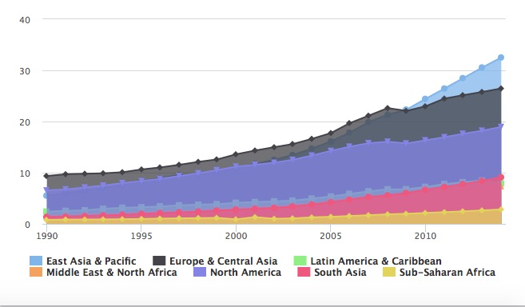
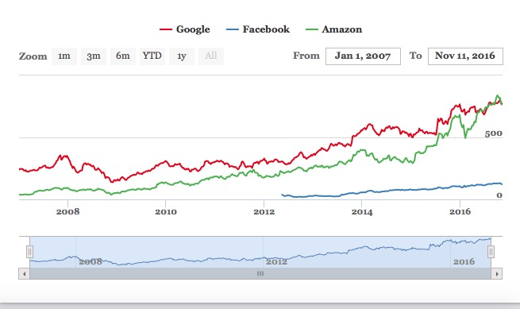
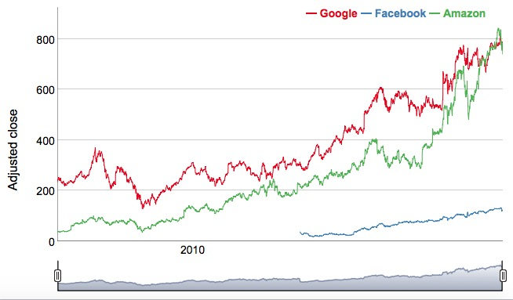
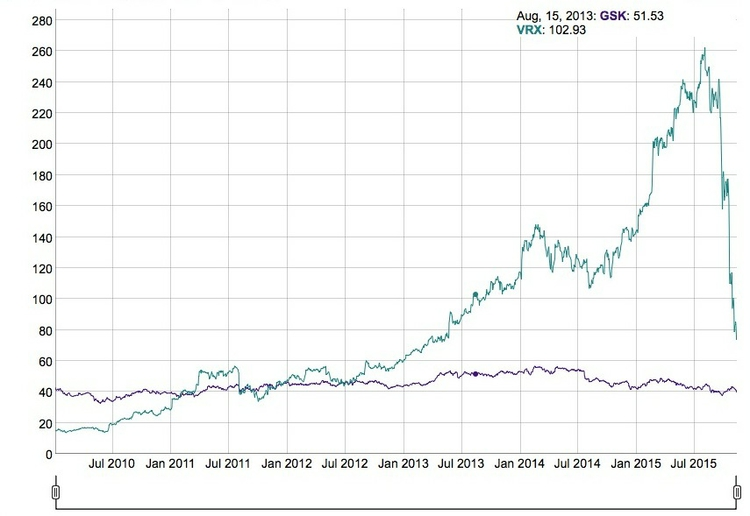
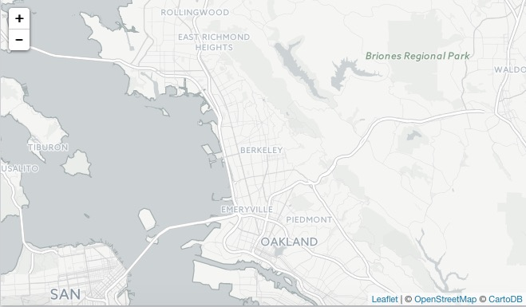
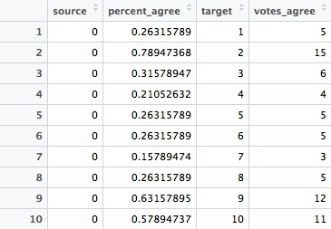
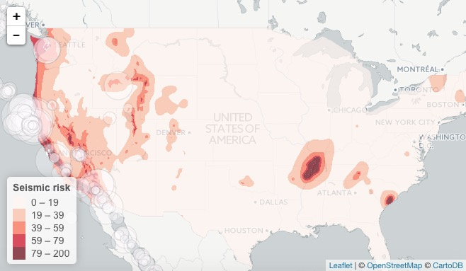
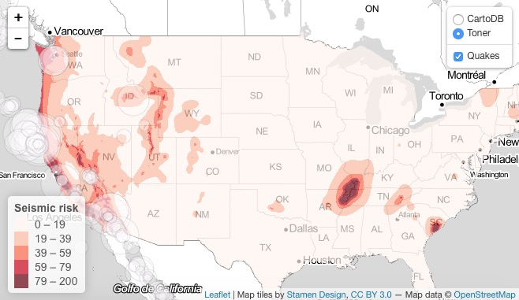

# From R to interactive charts and maps

### Let's make this easier

As we saw in last week's class, coding graphics from scratch using D3 is a laborious process. For standard chart types, as we discussed, you may wish to write D3 templates that can be modified for individual projects.

However, we will today explore another approach: Making JavaScript visualizations directly from R/RStudio. This has become possible recently thanks to an R package called [rCharts](http://rcharts.io/), which connects to multiple JavaScript charting libraries, and a group of packages collectively known as [htmlwidgets](http://www.htmlwidgets.org/).

These packages take instructions in R code, and write the JavaScript and HTML necessary to draw charts using JavaScript visualization libraries. They also allow you to easily export the charts you create in R as web pages.

I have used these in my own work to create simple interactive charts, in posts such as [this](http://www.buzzfeed.com/peteraldhous/why-katrina-was-the-storm-from-hell) and [this](http://www.buzzfeed.com/peteraldhous/american-terrorism-by-the-numbers).

One advantage of this approach is that I can work in a single environment both to process my data and to make my online charts. Maintaining a simple, streamlined workflow allows me to produce graphics quickly on news deadlines.

### The data we will use today

Download the data for this session from [here](data/week13.zip), unzip the folder and place it on your desktop. It contains the following folders and files:

- `src` Folder containing local copies of the following JavaScript libraries: [D3](http://d3js.org/), [NVD3](http://nvd3.org/), [Highcharts](http://www.highcharts.com/) and [jQuery](https://jquery.com/).
- `css` Folder with CSS style sheet for the NVD3 library.
- `seismic_risk_clip` Folder containing [U.S. Geological Survey shapefile](http://earthquake.usgs.gov/hazards/products/conterminous/index.php#2014),  detailing the risk of experiencing a major earthquake, clipped to the boundaries of the continental United States.
- `storms.csv` Data on North Atlantic [tropical storms and hurricanes](http://www.aoml.noaa.gov/hrd/hurdat/Data_Storm.html) compiled by by the Hurricane Research Division of the U.S. National Oceanic and Atmospheric Administration.
- `senate-113-2014.json` JSON data on voting patterns in the U.S. Senate in 2014, detailing the number and percentage of times pairs of Senators voted the same way in each year. Scraped from [GovTrack.US](https://www.govtrack.us/), as described [here](http://paldhous.github.io/NICAR/2015/gephi.html).

### Install rCharts and make some simple charts

Launch RStudio, create a new RScript, and set the working directory to the downloaded folder using the following code:

```R
# set working directory
setwd("~/Desktop/week13")
```
Save the script as `week13.R`.

We are going to install rCharts directly from its [GitHub repository](https://github.com/ramnathv/rCharts). To do this, we first need to install and load a package called [devtools](https://cran.r-project.org/web/packages/devtools/devtools.pdf), which you can do with the following code:

```R
# install and load devtools
install.packages("devtools")
library(devtools)
```
Now we can install and load rCharts:

```R
# install and load rCharts
install_github("rCharts", "ramnathv")
library(rCharts)
```

#### Make line charts from World Bank data

As in Week 11, we are going to download and process data from the World Bank's World Development Indicators. So again, we need the [WDI](https://cran.r-project.org/web/packages/WDI/WDI.pdf) and [dplyr](https://cran.rstudio.com/web/packages/dplyr/vignettes/introduction.html) packages. Load them now:

```R
# load WDI and dplyr
library(WDI)
library(dplyr)
```

Next run this block of code:

```R
# import World Bank data
# list of indicators to be imported
indic_list <- c("SP.DYN.LE00.IN", "SH.XPD.PCAP.PP.KD", "SL.UEM.TOTL.ZS")

# import indicators, rename variables, and round numbers
indicators <- WDI(indicator=indic_list, 
                  country="all", 
                  start=1990, 
                  end=2013) %>%
  rename(life_expect=SP.DYN.LE00.IN, 
         health_spend=SH.XPD.PCAP.PP.KD, 
         unemploy_rate=SL.UEM.TOTL.ZS) %>%
  mutate(life_expect=round(life_expect, digits=2),
         unemploy_rate=round(unemploy_rate, digits=2), 
         health_spend=round(health_spend, digits=0))

# filter for countries/region of interest
countries <- filter(indicators, iso2c=="GR"|iso2c=="DE"|iso2c=="EU"|iso2c=="RU")

# edit country/region names
countries$country <- gsub("Russian Federation", "Russia", countries$country)
countries$country <- gsub("European Union", "EU", countries$country)
```

This is similar to the code we ran in Week 11. In addition, we have used the dplyr function `mutate()` to apply some rounding to the data in the renamed variables `life_expect`, `health_spend` and `unemploy_rate`.

Then we have created a new data frame called `countries` by filtering the full dataset.

Finally, we have used R's `gsub()` function, which substitutes one string of text for another, to shorten the names for Russia and the EU, which will help keep the chart legend labels brief.

##### Line chart with NVD3

Now we will use rCharts with the [NVD3](http://nvd3.org/) JavaScript library to draw a line chart from this data. NVD3 sits on top of D3, and can produce a range of standard chart types (see the examples in the further reading/resources, below).

This code will approximately replicate the last chart in [this article](http://www.buzzfeed.com/peteraldhous/what-five-years-of-austerity-did-to-greeks-health):

```R
# make life expectancy line chart with NVD3
life_expect_n <- nPlot(life_expect ~ year, 
                          group = "country", 
                          data = countries, 
                          type = "lineChart")
```

`nPlot()` is an rCharts function that creates a plot using the NVD3 library. The first part of the code in this function puts the variable `life_expect` on the Y axis and `year` on the X axis; `data = countries` draws the chart from the `countries` data frame, `type = "lineChart"` selects the relevant NVD3 chart type (see the [examples](http://nvd3-community.github.io/nvd3/) for others that are available); `group = "country"` uses the categorical variable of `country` to draw a different line for each country in the data, in a different color. The chart type and grouping variable should be put inside quote marks.

Running this code creates an `Nvd3` object in your Environment that can then be plotted in RStudio's Viewer just by running its name:

```R
# plot chart
life_expect_n
```

Your RStudio window should now look like this:


By default, NVD3 uses the `d3.scale.category20()` color palette for categorical variables. However, having made the basic chart, we can customize it, here manually applying a ColorBrewer qualitative palette, and adding a label for the Y axis.

```R
# customize the chart
life_expect_n$yAxis(axisLabel=("Life expectancy at birth (years)"))
life_expect_n$chart(color = c("#e41a1c", "#377eb8", "#4daf4a", "#984ea3"))
```

Plot the chart again after running this code, and your RStudio window should look like this:


Don't worry if your chart extends beyond your Viewer panel: rCharts by default makes charts at 800px wide, but we will switch to a responsive width after we save the graphic to a web page.

So let's save the page now now, by running this code:

```R
# save chart as a web page
life_expect_n$save("life_expect_n.html", cdn = FALSE)
```

The saved web page should now be in your `week13` folder. So open it in a web browser and explore its interactivity. There will be a tooltip, and you can remove a line by clicking on the corresponding legend item.

Now open the file `life_expect_n.html` in your text editor. You will notice the following between the `<head> </head>` tags of the web page:

```CSS
    <link rel='stylesheet' href='/Library/Frameworks/R.framework/Versions/3.2/Resources/library/rCharts/libraries/nvd3/css/nv.d3.css'>
    <link rel='stylesheet' href='/Library/Frameworks/R.framework/Versions/3.2/Resources/library/rCharts/libraries/nvd3/css/rNVD3.css'>
    
    <script src='/Library/Frameworks/R.framework/Versions/3.2/Resources/library/rCharts/libraries/nvd3/js/jquery-1.8.2.min.js' type='text/javascript'></script>
    <script src='/Library/Frameworks/R.framework/Versions/3.2/Resources/library/rCharts/libraries/nvd3/js/d3.v3.min.js' type='text/javascript'></script>
    <script src='/Library/Frameworks/R.framework/Versions/3.2/Resources/library/rCharts/libraries/nvd3/js/nv.d3.min-new.js' type='text/javascript'></script>
    <script src='/Library/Frameworks/R.framework/Versions/3.2/Resources/library/rCharts/libraries/nvd3/js/fisheye.js' type='text/javascript'></script>
```
This shows that the page is loading the JavaScript libraries and CSS needed to make the graphic from within the rCharts package, so we need to switch to the local versions in the `week13` folder.

To do this, replace the block of code above with the following:

```CSS
  <link rel="stylesheet" href="css/nv.d3.css">
  <script src="src/d3.min.js"></script>
  <script src="src/nv.d3.1.7.js"></script>
  <script src="src/jquery-1.11.3.min.js"></script>
```

(Here we are loading the `1.7` release of NVD3, because the `1.8` release currently has a bug that can cause the colors of a line chart to render incorrectly when the chart is redrawn.)

Between the `<style> </style` tags immediately below, change `width: 800px;` to `width: 100%;`. Finally, scroll down the page and in the script that draws the chart, and delete or comment out this line:

```JavaScript
"width":    800,
```
These two changes will override the default width of 800px, allowing the chart to be responsive.

It is also possibile to customize the chart using some CSS. Paste the following code between the page's `<style> </style>` tags to remove the Y axis and increase the thickness of the lines on the chart:

```CSS
	/* remove y axis */
     .nv-axis path { display: none; }

    /* set stroke width */
    .nvd3 g.nv-groups path.nv-line {
      stroke-width: 4px;
    }
```

The chart should now look like this:


##### Line chart with Highcharts

Now we'll draw a similar chart using the [Highcharts](http://www.highcharts.com/). (Note that Highcharts requires a [paid license](http://shop.highsoft.com/highcharts.html) for use on commercial websites.)

The basic code is similar to before, except that it uses the rCharts function `hPlot()`:

```R
# make life expectancy line chart with HighCharts
life_expect_h <- hPlot(life_expect ~ year, 
                          group = "country", 
                          data = countries, 
                          type = "line")

# plot chart
life_expect_h
```
Note that Highcharts types have different names: See [here](http://www.highcharts.com/docs/chart-and-series-types/chart-types) for the available options.

This code should draw the following chart:


Again, we can customize the chart and replot:

```R
# customize chart
life_expect_h$yAxis(title = list(text = "Life expectancy at birth (years)"))
life_expect_h$xAxis(title = list(text = ""))
life_expect_h$colors("#e41a1c", "#377eb8", "#4daf4a", "#984ea3")
life_expect_h$plotOptions(line=list(marker=list(enabled=FALSE)))

# plot chart
life_expect_h
```

You will see that code to change the axis labels and colors is a little different than for NVD3, which reflects differences in the two libraries' syntax. [Ramnath Vaidyanathan](https://github.com/ramnathv), the author of rCharts, has a series of examples for [NVD3](https://github.com/ramnathv/rCharts/blob/master/inst/libraries/nvd3/examples.R) and [Highcharts](https://github.com/ramnathv/rCharts/blob/master/inst/libraries/highcharts/examples.R), which will help explain how to customize your charts using each library.

The last line of the code used to customize the chart removes the point markers, rendering a simple line chart, which should now look like this:


Save the chart as a web page:

```R
# save the chart as web page
life_expect_h$save("life_expect_h.html", cdn = FALSE)
```
Again, we need to swap out some code from the head of the page to use our local copies of Highcharts and jQuery. Between the `<head> </head>` tags of the web page, replace this:

```CSS
   <script src='/Library/Frameworks/R.framework/Versions/3.2/Resources/library/rCharts/libraries/highcharts/js/jquery-1.9.1.min.js' type='text/javascript'></script>
    <script src='/Library/Frameworks/R.framework/Versions/3.2/Resources/library/rCharts/libraries/highcharts/js/highcharts.js' type='text/javascript'></script>
    <script src='/Library/Frameworks/R.framework/Versions/3.2/Resources/library/rCharts/libraries/highcharts/js/highcharts-more.js' type='text/javascript'></script>
    <script src='/Library/Frameworks/R.framework/Versions/3.2/Resources/library/rCharts/libraries/highcharts/js/exporting.js' type='text/javascript'></script>
```

With this:

```CSS
  <script src='src/jquery-1.11.3.min.js' type='text/javascript'></script>
  <script src='src/highcharts.js' type='text/javascript'></script>
  <script src='src/highcharts-more.js' type='text/javascript'></script>

```

Finally, override the 800px width by making the same two changes as before.

Both of these charts are now ready to be uploaded to a web server -- remembering to also include the `src` folder, and for the NVD3 chart, the `css` folder.

#### Make column charts from North Atlantic storms data

First load the storms data:

```R
# import storms data
storms <- read.csv("storms.csv") 
```
This contains observations of storms recorded every 6 hours, so to count the number of storms and hurricanes per year we will have to process the data uysing dplyr. To do this, run the following block of code:

```R
# count storms and hurricanes per year
storms_year <- storms %>%
  filter(year >= 1980) %>%
  group_by(year,name) %>%
  summarize(max_wind = max(max_wind_mph, na.rm = TRUE)) %>%
  mutate(type = ifelse(max_wind >= 74, "Hurricanes", "Storms")) %>%
  ungroup() %>%
  group_by(year, type) %>%
  summarize(count = n())
```

This creates a new data frame called `storms_years`. First the storms data frame is filtered to retain only data from 1980 onwards. Then the data is grouped by year and name, which isolates individual storms, and then for each storm we calculate the maximum value of the recorded maximum wind speeds using dplyr's `summarize()` function.

If a storm's maximum wind speed exceeds 74 mph, it is classed as a hurricane, so this line of code creates a new column called `type`, labelling the storms as `Hurricanes` or `Storms` accordingly:

```R
  mutate(type=ifelse(max_wind >= 74, "Hurricanes", "Storms"))
```
Then we ungroup the data, and group again by year and type, to count the number of `Storms` and `Hurricanes` in each year.

##### Column chart with NVD3

Having processed the data, we can now make a column chart using NVD3, with the following code:

```R
# make column chart with NVD3
storms_n <- nPlot(count ~ year, 
                       group= "type", 
                       data = storms_year, 
                       type = "multiBarChart")

# plot chart
storms_n
```

This will draw the following chart:


Notice the control at top left, which allows users to switch between grouped and stacked columns. The latter is the best view for this data, so now we will customize the chart to force the stacked view, and remove the control:

```R
# customize chart
storms_n$chart(showControls = FALSE,
               stacked = TRUE)
storms_n$yAxis(axisLabel=("Number of storms"),
               tickFormat = "#! d3.format(',0f') !#")

# plot chart
storms_n
```

The second part of the Y axis customization sets the format for the tick labels on the chart, removing the decimal place to show whole numbers. This is done with D3 code, which is designated by appearing between `#!` and `!#`.

The following chart should now appear:


Again save the chart as a web page:

```R
# save the chart as web page
storms_n$save("storms_n.html", cdn = FALSE)
```

Open the file `storms_n.html` in your text editor, and replace the code that loads the JavaScript libraries and NVD3 CSS with the following:

```CSS
  <link rel="stylesheet" href="css/nv.d3.css">
  <script src="src/d3.min.js"></script>
  <script src="src/nv.d3.js"></script>
  <script src="src/jquery-1.11.3.min.js"></script>
```

Again we can apply some CSS to customize the chart between the `<style> </style>` tags, here removing the vertical grid lines and the Y axis:

```CSS
	/* remove x axis grid lines */
     .nv-x .tick line { display: none} 
	/* remove y axis */
     .nv-axis path { display: none; }
```

The chart should now look like this:


##### Column chart with Highcharts

Now we will make a similar chart with Highcharts:

```R
# make storms column chart with HighCharts
storms_h <- hPlot(count ~ year, 
                  group = "type", 
                  data = storms_year, 
                  type = "column")

# plot chart
storms_h
```

This will draw the following chart:



If we want to stack the columns, and emulate the color scheme of our earlier NVD3 chart, we again need some customization:

```R
# customize chart
storms_h$plotOptions(column = list(stacking = "normal"))
storms_h$yAxis(title = list(text = "Number of storms"),
               reversedStacks = FALSE)
storms_h$xAxis(title = list(text = ""))
storms_h$colors("#1f77b4", "#aec7e8")

# plot chart
storms_h

# save chart
storms_h$save("storms_h.html", cdn = FALSE)
```

The first line of this code switches to stacked columns. If we want the columns to stack in the same order as the NVD3 chart, we need also to include `reversedStacks = FALSE` in the Y axis customization.

Edit the file `storms_h.html` as before, to load local copes of Highcharts and jQuery, and to make the chart responsive, rather than 800px wide.

The final chart should look like this:


### Install htmlwidgets

Now we will explore the possibilities offered by htmlwidgets, so we need to install and load the htmlwidgets package:

```R
# install and load htmlwidgets
install.packages("htmlwidgets")
library(htmlwidgets)
```

### Make maps of seismic risks and earthquakes using Leaflet

[Leaflet](http://leafletjs.com/) is the most widely-used JavaScript code library for making interactive online maps. It can be accessed from R using the [leaflet](http://rstudio.github.io/leaflet/) htmlwidget. So we need to install and load that:

```R
# install and load leaflet
install.packages("leaflet")
library(leaflet)
```

Step by step, we are going to recreate a version of [this map](http://paldhous.github.io/earthquakes/), which I originally coded using Leaflet from scratch. After class, you may wish to download the code for that map from its [GitHub repository](https://github.com/paldhous/earthquakes), to compare with the R version.

First let's see how to make a basic Leaflet map, centered on Berkeley:

```R
# make leaflet map centered on Berkeley
map <- leaflet() %>% 
  setView(lng = -122.2705383, lat = 37.8698807, zoom = 11) %>%
  addTiles() 

# plot the map
map
```

The following map should appear in your RStudio Viewer:


The function `setView()` allows us to set the starting position of the map, centering it on the defined coordinates and with the defined zoom level; `addTiles()` adds [OpenStreetMap](https://www.openstreetmap.org/) tiles to the map, which would otherwise be blank. Notice that the map is interactive, and can be panned and zoomed just like a Google Map.


We aren't limited to using OpenStreetMap tiles:

```R
# make leaflet map centered on Berkeley with CartoDB tiles
map <- leaflet() %>% 
  setView(lng = -122.2705383, lat = 37.8698807, zoom = 11) %>%
  addProviderTiles("CartoDB.Positron") 

# plot the map
map
```

The map should now look like this:


The function `addProviderTiles()` uses the [Leaflet Providers](https://github.com/leaflet-extras/leaflet-providers) plugin to add various tiles to a map. You can see the available options [here](http://leaflet-extras.github.io/leaflet-providers/preview/).

Now let's load the data we need to make the earthquakes map. To load the `seismic_risk_clip` shapefile, we need another R package, called [rgdal](https://cran.r-project.org/web/packages/rgdal/rgdal.pdf).

So install and load that:

```R
# install and load rgdal
install.packages("rgdal")
library(rgdal)
```

Now we can load the shapefile with the following code:

```R
# load seismic risk shapefile
seismic_risk <- readOGR("seismic_risk_clip", "seismic_risk_clip")
```
The two mentions of `seismic_risk_clip` refer to the folder and the shapefile within it, respectively.

You should now have in your environment an object called `seismic_risk` which is a `SpatialPolygonsDataFrame`.

We can also load data on earthquakes, from the U.S. Geological Survey API we encountered in week 4:

```R
# load quakes data from USGS earthquakes API
quakes <- read.csv("http://earthquake.usgs.gov/fdsnws/event/1/query?starttime=1965-01-01T00:00:00&minmagnitude=6&format=csv&latitude=39.828175&longitude=-98.5795&maxradiuskm=6000&orderby=magnitude")
```

Using this url, we have loaded earthquakes since the start of 1965 that had a magnitude of 6 and above, within a 6,000 kilometer radius of the geographic center of the continental United States.

Let's look at a summary of the `seismic_risk` data by running:

```R
# view summary of seismic_risk data
summary(seismic_risk)
```

This is what should be returned in the R Console:

```R
Object of class SpatialPolygonsDataFrame
Coordinates:
      min       max
x -124.71 -66.98701
y   24.60  49.36968
Is projected: FALSE 
proj4string :
[+proj=longlat +datum=WGS84 +no_defs +ellps=WGS84 +towgs84=0,0,0]
Data attributes:
    ACC_VAL           VALLEY       
 Min.   :  0.00   Min.   :0.00000  
 1st Qu.: 18.00   1st Qu.:0.00000  
 Median : 40.00   Median :0.00000  
 Mean   : 44.57   Mean   :0.08264  
 3rd Qu.: 60.00   3rd Qu.:0.00000  
 Max.   :200.00   Max.   :1.00000  
```
The data defining the risk of a major earthquake is in the variable `ACC_VAL`, and has values that run from 0 to 200.

Now let's load this data into a Leaflet map:

```R
# load the seismic risk data into a leaflet map
seismic_map <- leaflet(data=seismic_risk)
```

For the time being this map will be blank, as we have not added any tiles, or styled the `seismic_risk` data in any way.

We are going to make a choropleth map, so we will first set breaks to divide the data in into bins:

```R
# set breaks for custom bins
breaks <- c(0,19,39,59,79,200)
```

Then set a color palette, using these breaks and a "Reds" sequential color scheme from ColorBrewer (which can be called by name in the leaflet htmlwidget):

```R
# set palette
binpal <- colorBin("Reds", seismic_map$ACC_VAL, breaks)
```

Now we are ready to make a choropleth map, using the following code:

```R
# make choropleth map of seismic risks
seismic <- seismic_map %>%
  setView(lng = -98.5795, lat = 39.828175, zoom = 4) %>%
  addProviderTiles("CartoDB.Positron") %>% 
  addPolygons(
    stroke = FALSE, 
	fillOpacity = 0.7, 
    smoothFactor = 0.1,
    color = ~binpal(ACC_VAL)
  )
  
# draw map
seismic
```

The function `addPolygons()` adds polygons to the map: `stroke = FALSE` gives them no outline; `fillOpacity = 0.7` makes them slightly transparent; `color = ~binpal(ACC_VAL)` uses the color palette and breaks we set up earlier to color the polygons according to values in the `ACC_VAL` data.

`smoothFactor` controls the extent to which the polygons are simplified. See what happens to the map if you replace `0.1` with `10`. Simplified polygons will load more quickly, but there's a tradeoff with the appearance of the map. Choose an appropriate value for your maps through trial and error.

Your RStudio Viewer should now contain the following map:


We can add circles for the quakes as a second data layer, by extending the code as follows:

```R
# make choropleth map of seismic hazards
seismic <- seismic_map %>%
  setView(lng = -98.5795, lat = 39.828175, zoom = 4) %>%
  addProviderTiles("CartoDB.Positron") %>% 
  addPolygons(
    stroke = FALSE, 
    fillOpacity = 0.7, 
    smoothFactor = 0.1,
    color = ~binpal(ACC_VAL)
  ) %>%
  # add historical earthquakes
  addCircles(
    data = quakes, 
    radius = sqrt(10^quakes$mag)*50, 
    color = "#000000",
    weight = 0.2,
    fillColor ="#ffffff",
    fillOpacity = 0.3,
    popup = paste0("<strong>Magnitude: </strong>", quakes$mag, "</br>",
                   "<strong>Date: </strong>", format(as.Date(quakes$time), "%b %d, %Y"))
  )

# draw map
seismic
```
The `addCircles()` function adds circles to the map; `color` sets the color for their outlines, while `weight` sets the thickness of these lines; `fillColor` and `fillOpacity` style the circles' interiors.

The size if the circles is set by `radius = sqrt(quakes$mag^10)*50`. Here `50` is simply a scaling factor for all of the circles, set by trial and error to give a reasonable appearance on the map. The size of the circles is set from the variable `mag` in the quakes data, which is their magnitude. We have raised 10 to the power of these magnitude values: This is a quirk of working with earthquake magnitudes, which are on a logarithmic scale, so that a magnitude difference of 1 corresponds to a 10-fold difference in earth movement, as recorded on a seismogram.

Usually, when scaling circles, you will simply use the values from the data, and then take their square roots, using the `sqrt()` function. This is important, to ensure that the circles are scaled correctly, by area, rather than by radius, as we discussed in Week 2.

`popup` is used to define the HTML code the appears in the popup that appears when any quake is clicked or tapped. here were are using the R function `paste0()` to paste together a series of elements, separated by commas, that will write the html. They include the `mag` and `time` values from the quakes data, the latter being formatted as an easy-to-read date using R's `format()` function for dates. See [here](http://www.statmethods.net/input/dates.html) for more on formatting dates in R.

The map should now look like this:



We can add a legend, by extending the code again:

```R
# make choropleth map of seismic hazards
seismic <- seismic_map %>%
  setView(lng = -98.5795, lat = 39.828175, zoom = 4) %>%
  addProviderTiles("CartoDB.Positron") %>% 
  addPolygons(
    stroke = FALSE, 
    fillOpacity = 0.7, 
    smoothFactor = 0.1,
    color = ~binpal(ACC_VAL)
  ) %>%
  # add historical earthquakes
  addCircles(
    data = quakes, 
    radius = sqrt(10^quakes$mag)*50, 
    color = "#000000",
    weight = 0.2,
    fillColor ="#ffffff",
    fillOpacity = 0.3,
    popup = paste0("<strong>Magnitude: </strong>", quakes$mag, "</br>",
                   "<strong>Date: </strong>", format(as.Date(quakes$time), "%b %d, %Y"))
  ) %>%
  # add legend
  addLegend (
    "bottomleft", pal = binpal, values = ~ACC_VAL,
    title = "Seismic risk",
    opacity = 0.7)

# draw map
seismic
```

The final version of the code, below, adds a second tileset, and sets up layer controls to allow users to switch between basemaps, and to turn the quakes layer on and off:


```R
# make multi-layered leaflet map with layer-switching control
# make choropleth map of seismic hazards
seismic <- seismic_map %>%
  setView(lng = -98.5795, lat = 39.828175, zoom = 4) %>%
  addProviderTiles("CartoDB.Positron", group = "CartoDB") %>% 
  addProviderTiles("Stamen.TonerLite", group = "Toner") %>%
  addPolygons(
    stroke = FALSE, fillOpacity = 0.7, 
    smoothFactor = 0.1,
    color = ~binpal(ACC_VAL)
  ) %>%
  # add historical earthquakes
  addCircles(
             data=quakes, 
             radius = sqrt(10^quakes$mag)*50, 
             weight = 0.2, 
             color = "#000000", 
             fillColor ="#ffffff",
             fillOpacity = 0.3,
             popup = paste0("<strong>Magnitude: </strong>", quakes$mag, "</br>",
                            "<strong>Date: </strong>", format(as.Date(quakes$time), "%b %d, %Y")),
             group = "Quakes"
  ) %>%
  # add legend
  addLegend(
            "bottomleft", pal = binpal, values = ~ACC_VAL,
            title = "Seismic risk",
            opacity = 0.7
  ) %>%
  # add layers control
  addLayersControl(
  baseGroups = c("CartoDB", "Toner"),
  overlayGroups = "Quakes",
  options = layersControlOptions(collapsed = FALSE)
  )

# draw map
seismic
```
Study the differences between this code and the preceding example to understand how the layers control works.

The final map should now look like this:



Having completed our map, we can save it as a web page using the following code:

```R
# save the map
saveWidget(seismic, "seismic.html", selfcontained = TRUE, libdir = NULL,
           background = "white")
```

The page will be saved with supporting JavaScript files in a folder called  `siesmic_files`. To put the map online, it must be uploaded to a webserver together with this folder.

### Draw line charts of company stock prices over time using dygraphs

Next we will use the [dygraphs](http://dygraphs.com/) Javascript charting library to draw a line graph of two companies' stock prices. While this is also possible with libraries like NVD3, dygraphs is better at handling large datasets with thousands of values in a time series.

So let's now install and load the [dygraphs](http://rstudio.github.io/dygraphs/) htmlwidget:

```R
# install and load dygraphs
install.packages("dygraphs")
library(dygraphs)
```
We will compare changes on the stock price of a drug company called Valeant, which has [become controversial](http://www.businessinsider.com/why-have-valeant-pharmaceuticals-shares-collapsed-2015-11) in recent months because of alleged "price gouging," with the pharmaceuticals giant GlaxoSmithKline.

First we need to load data on each company's stock market performance, which we can obtain from [Yahoo Finance](http://finance.yahoo.com/).

```R
# load and process data for Valeant
valeant <- read.csv("http://real-chart.finance.yahoo.com/table.csv?s=VRX") %>%
  mutate(Date=as.Date(Date)) %>%
  select(Date, Close) %>%
  rename(VRX = Close)

# and for GSK
gsk <- read.csv("http://real-chart.finance.yahoo.com/table.csv?s=GSK") %>%
  mutate(Date=as.Date(Date))  %>%
  select(Date, Close) %>%
  rename(GSK = Close)
```

The data for each company will initially load with seven columns of data. This code ensures that the dates in the `Date` column are treated as such, then selects just the `Date` and `Close` variables, containing the closing prices for each day. Finally it renames the `Close` column with each company's stock market ticker.

Dygraphs requires each time series to be plotted in a separate column, so now we need to create a data frame with a column for each companies' data. 

The following code does this using a dplyr join, and then filters the data from the start of 2010 onwards:

```R
# combine into a single data frame with separate column for each company 
# and filter for 2010 onwards
valeant_gsk <- inner_join(gsk, valeant, by="Date") %>%
  filter(Date >= "2010-01-01")
```
The dygraphs htmlwidget works with R objects called extensible time series, or xts, rather than standard data frames, so now we have to make that conversion.

To do this, we need to install and load the [xts](https://cran.rstudio.com/web/packages/xts/xts.pdf) package:

```R
# install and load xts
install.packages("xts")
library(xts)
```

And then convert the dataframe to an xts object:

```R
# convert to extensible time series (xts)
valeant_gsk <- xts(valeant_gsk, order.by = valeant_gsk$Date) 
```

We can then draw the time series chart with this code:

```R
# make dygraph line chart
drug_cos <- dygraph(valeant_gsk) %>%
  dyRangeSelector()

# plot chart
drug_cos
```

`dyRangeSelector()` adds a control to the bottom of the chart which can be used to focus on parts of the time series.

The chart should now look like this



It is possible to customize dygraph chart in various ways. For example, this version of the code will create an area chart with the areas filled with an opacity of 0.4:

```R
# make dygraph area chart
drug_cos <- dygraph(valeant_gsk) %>%
  dyOptions(fillGraph = TRUE, 
            fillAlpha = 0.4) %>%
  dyRangeSelector()

dygraph(valeant) %>%
  dyRangeSelector()

# plot chart
drug_cos
```

The resulting chart should look like this:



For more customization options, for example [adding shaded bands](http://rstudio.github.io/dygraphs/gallery-shaded-regions.html) to the chart area, see the dygraphs htmlwidget [documentation](http://rstudio.github.io/dygraphs).

Again, we can now save the chart as a web page:

```R
# save the chart
saveWidget(drug_cos, "drug_cos.html", selfcontained = TRUE, libdir = NULL,
           background = "white")
```

Notice that saved htmlwidgets are responsive by default, and will expand to fill the space available. This means they can be easily iframed into divs on a web page.

### Draw a network diagram of voting patterns in the U.S. Senate using networkD3

In Week 2, we discussed how network diagrams can be used to visualize connections between people or things. Now we will use the [networkD3](http://christophergandrud.github.io/networkD3/) htmlwidget to draw a D3 network graphic illustrating patterns of voting in the U.S. Senate in 2014.

See [here](http://paldhous.github.io/NICAR/2015/gephi.html) a more detailed tutorial on creating a similar network from Senate voting data, using [Gephi](https://gephi.github.io/) and the [Sigma.js](http://sigmajs.org/) JavaScript library, with notes on how the data was prepared.

First we need to install and load the networkD3 htmlwidget:

```R
# install and load networkD3
install.packages('networkD3')
library(networkD3)
```

The data is in the file `senate-113-2014.json`. To load this into R, install and load the [jsonlite](https://cran.r-project.org/web/packages/jsonlite/jsonlite.pdf) package:

```R
# install and load jsonlite
install.packages("jsonlite")
library(jsonlite)
```
Then load the data and view its structure:

```R
# load senate voting data and view its structure
senate <- fromJSON("senate-113-2014.json")
str(senate)
```

This is what should be returned in the R Console:

```R
List of 5
 $ directed  : logi FALSE
 $ graph     : list()
 $ nodes     :'data.frame':	100 obs. of  3 variables:
  ..$ color: chr [1:100] "red" "blue" "red" "blue" ...
  ..$ party: chr [1:100] "R" "D" "R" "D" ...
  ..$ id   : chr [1:100] "Alexander (R-TN)" "Klobuchar (D-MN)" "Graham (R-SC)" "Reid (D-NV)" ...
 $ links     :'data.frame':	4679 obs. of  4 variables:
  ..$ source       : int [1:4679] 0 0 0 0 0 0 0 0 0 0 ...
  ..$ percent_agree: num [1:4679] 0.263 0.789 0.316 0.211 0.263 ...
  ..$ target       : int [1:4679] 1 2 3 4 5 6 7 8 9 10 ...
  ..$ votes_agree  : int [1:4679] 5 15 6 4 5 5 3 5 12 11 ...
 $ multigraph: logi FALSE
```

This shows that `senate` is a list containing objects including two data frames, called `nodes` and `links`. 

Let's now view the contents of each data frame

```R
# view contents of nodes and links 
View(senate$nodes)
View(senate$links)
```
The `nodes` data frame contains three columns, including an `id` for each Senator, and their `party`:


The `links` data frame contains four columns, including `source` and `target`, which refer to the row numbers for the Senators in the `nodes` data frame. The `percent_agree` column shows how often, as a digital fraction of 1, that pair of senators voted the same way in 2014.



We are going to create a network diagram of these voting patterns, first filtering the data so that a link is drawn between a pair of Senators only if they voted the same way at least two-thirds of the time. We need a filter to reveal the partisan dynamics of the chamber, because almost all Senators voted the same way at least once. It's how *often* they did so that matters.

Now read the data frames from the list into the main R environment, and apply this filter to the links:

```R
# read nodes and links into the main R environment, and apply filter
nodes <- senate$nodes

links <- senate$links %>%
  filter(percent_agree > 0.67)
```

We can now draw the network with this code:

```R
# create D3 network
senate_network <- forceNetwork(
  Links = links, 
  Nodes = nodes, 
  Source = "source",
  Target = "target", 
  NodeID = "id",
  Group = "party", 
  opacity = 1, 
  bounded = TRUE, 
  linkColour = "#cccccc" 
)

# plot the network
senate_network
```

Notice that columns from the two data frames are referred to in quote marks. `linkColour = "#cccccc"` sets the color of the links to a light gray; note the British English spelling of `linkColour`: networkD3 was written by [Christopher Gandrud](http://christophergandrud.blogspot.com/p/biocontact.html), a political economist at City University in London.

The following network graph should appear in your RStudio Viewer:



Notice that networkD3 by default uses the `d3.scale.category20()` color palette. To use colors that reflect the Democratic and Republican parties, simply adjust the code to the following:

```R
# set color palette
colors <- JS("d3.scale.ordinal().range(['#ff0000','#0000ff','#d2691e'])")

# create D3 network
senate_network <- forceNetwork(
             Links = links, 
             Nodes = nodes, 
             Source = "source",
             Target = "target", 
             NodeID = "id",
             Group = "party", 
             opacity = 1, 
             bounded = TRUE, 
             linkColour = "#cccccc", 
             colourScale = colors
             )

# plot the network
senate_network
```

For more networkD3 customization options, see [these code examples](https://github.com/christophergandrud/networkD3/blob/master/inst/examples/examples.R).

The network graph should now look like this:



Again, we can save the graphic to a webpage with the following code:

```R
# save the network chart
saveWidget(senate_network, "senate.html", selfcontained = TRUE, libdir = NULL,
           background = "white")
```

### Further reading/resources

[rCharts Documentation](https://media.readthedocs.org/pdf/rcharts/latest/rcharts.pdf)

[rCharts Gallery](http://rcharts.io/gallery/#title=all)
Contains many examples with underlying code. Some use additional libraries that will need to be installed separately.

[NVD3 Examples](http://nvd3-community.github.io/nvd3/)

[Highcharts Demos](http://www.highcharts.com/demo/)

[Highcharts Documentation](http://www.highcharts.com/docs)

[htmlwidgets Showcase](http://www.htmlwidgets.org/showcase_leaflet.html)
Gives links tp documentation and code examples for the htmlwidgets developed so far.


