# Making static graphics with R

In today's class, we will begin to explore how R can be used to make graphics from data, making customized static graphics with the **[ggplot2](http://docs.ggplot2.org/current/)** package. This is part of Hadley Wickham's [tidyverse](https://blog.rstudio.org/2016/09/15/tidyverse-1-0-0/), so you already have it installed from last week.

### The data we will use today

Download the data for this session from [here](data/week8.zip), unzip the folder and place it on your desktop. It contains the following files:

- `disease_democ.csv` Data illustrating a controversial theory suggesting that the emergence of democratic political systems has depended largely on nations having low rates of infectious disease, from the [Global Infectious Diseases and Epidemiology Network](http://www.gideononline.com/) and *[Democratization: A Comparative Analysis of 170 Countries](http://www.amazon.com/Democratization-Comparative-Analysis-Countries-Routledge/dp/0415318602)*, as used in week 1.
- `food_stamps.csv` [U.S. Department of Agriculture data](http://www.fns.usda.gov/pd/supplemental-nutrition-assistance-program-snap) on the number of participants, in millions, and costs, in $ billions, of the federal Supplemental Nutrition Assistance Program.
- `nations.csv` Data from World Bank World Development Indicators portal, giving data on population, GDP per capita, life Expectancy, birth rate, neonatal mortality rate, region and income group for the world's nations, from 1990 onwards, as used in week 3.


### Introducing ggplot2 and the grammar of graphics

The "gg" in **ggplot2** stands for "[grammar of graphics](http://www.amazon.com/The-Grammar-Graphics-Statistics-Computing/dp/0387245448)," an approach to drawing charts devised by the statistician Leland Wilkinson. Rather than thinking in terms of finished charts like a scatter plot or a column chart, it starts by defining the coordinate system (usually the X and Y axes of a cartesian system), maps data onto those coordinates, and then adds layers such as points, bars and so on. This is the logic behind ggplot2 code.

Some key things to understand about **ggplot2**:

- `ggplot` This is the master function that creates a **ggplot2** chart.
- `aes` This function, named for "aesthetic mapping," is used whenever data values are mapped onto a chart. So it is used when you define which variables are plotted onto the X and Y axes, and also if you want to change the size or color of parts of the chart according to values for a variable.
- `geom` All of the functions that add layers to a chart start with `geom`, followed by an underscore, for example `geom_point()` or `geom_bar()`. The code in the brackets for any `geom` layer styles the items in that layer, and can include `aes` mappings of values from data.
- `+` is used each time you add a layer to a chart. After a `+` you can continue on the same line of code or move the next line. I usually  write a new line for each layer, which makes the code easier to follow.
- `theme` This function modifies the appearance of elements of a plot, used, for example, to set size and font face for text, the position of a legend, and so on.
- `scale` Functions that begin with `scale`, followed by an underscore, are used to modify the way an `aes` mapping of data appears on a chart. They can change the axis range, for example, or specify a color palette to be used to encode values in the data.

### Make scatter plot from disease and democracy data

We'll start by making and modifying a scatter plot from the disease and democracy data that we first encountered in week 1.

#### Load required packages and the data

Open a new R script in RStudio, save the blank script to the folder with the data for this week, and then set your working directory to this location by selecting from the top menu `Session>Set Working Directory>To Source File Location`.

Now copy the following code into your script to load **readr**, **ggplot2**, and the then load the disease and democracy data:

```r
# load required packages
library(ggplot2)
library(readr)

# load disease and democracy data
disease_democ <- read_csv("disease_democ.csv")
```

#### Map variables in the data onto the X and Y axes

Copy this code into your R script and run:

```r
# map values in data to X and Y axes
ggplot(disease_democ, aes(x = infect_rate, y = democ_score))
```

The brackets after the `ggplot` function define the data frame to be used, followed by the `aes` mapping of variables in the data to the chart's X and Y axes.

The following chart should appear in the `Plots` panel at bottom right:

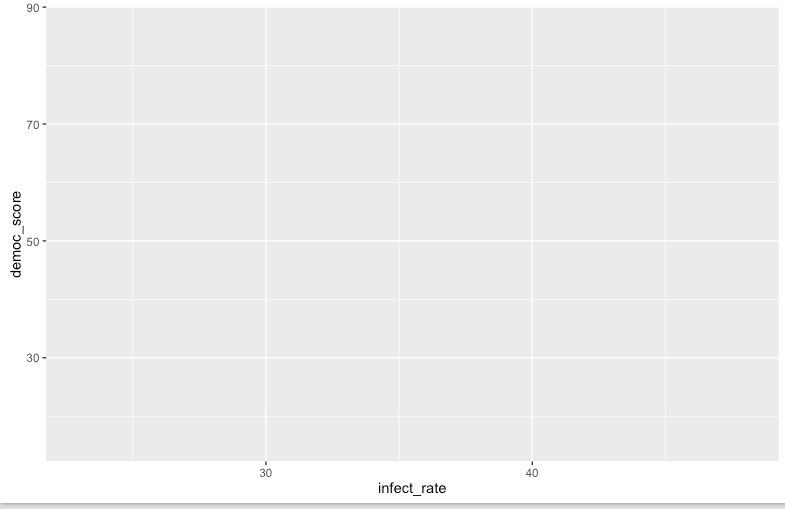

The axis ranges are automatically set to values in the data, but at this point there is just a black chart grid, because we haven't added any `geom` layers to the chart. 


#### Change the axis labels

By default, the axis labels will be the names of the variables of in the data. But it's easy to customize, using the following code:

```r
# customize axis labels
ggplot(disease_democ, aes(x = infect_rate, y = democ_score)) +
  xlab("Infectious disease prevalence score") +
  ylab("Democratization score")
```

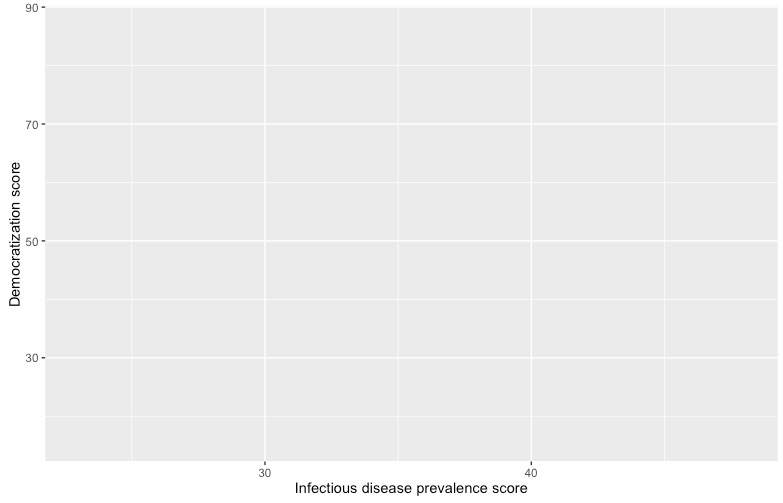

#### Change the theme

The default gray theme of **ggplot2** has a rather academic look. See [here](http://docs.ggplot2.org/current/theme.html) and [here](http://docs.ggplot2.org/dev/vignettes/themes.html) for how to use the `theme` option to customize individual elements of a chart. However, for my charts, I typically use one of the **ggplot2** [built-in themes](http://docs.ggplot2.org/current/ggtheme.html), and then customize the fonts.

```r
# Change the theme
ggplot(disease_democ, aes(x = infect_rate, y = democ_score)) +
  xlab("Infectious disease prevalence score") + 
  ylab("Democratization score") +
  theme_minimal(base_size = 16, base_family = "Georgia")
```

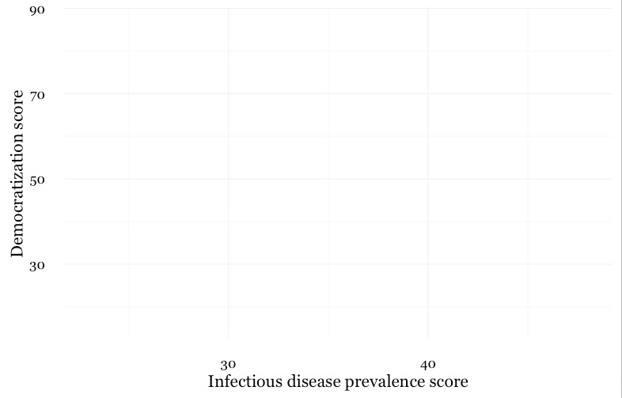

Notice how the `base_family` and `base_size` can be used with a built-in theme to change font face and size. R's basic fonts are fairly limited (run `names(postscriptFonts()))` to view those available). However, you can use the **[extrafonts](https://github.com/wch/extrafont)** package to make other fonts available.

However, I do not recommend coding your themes manually, certainly not on each chart you draw. Instead, use [this web app](https://bchartoff.shinyapps.io/ggShinyApp/) to set your theme options. When you are statisfied with the appearance of the chart in the app, click the `R script for theme (run every R session)` button to download your theme as an R script.

However, I do not recommend coding your themes manually, certainly not on each chart you draw. Instead, use this [ggplot2 Theme Builder](https://bchartoff.shinyapps.io/ggShinyApp/) web app to set your theme options. When you are statisfied with the appearance of the chart in the app, click the `R script for theme (run every R session)` button to download your theme as an R script.

If you then load and run run this script at the start of your R session, your **ggplot2** charts for that session will use the downloaded theme.

#### Save the basic chart template

You can save a **ggplot2** chart as an object in your environment using the `<-` assignment operator. So we'll do that here to save the basic template, with no `geom` layers.

```r
# save chart template, and plot
disease_democ_chart <- ggplot(disease_democ, aes(x = infect_rate, y = democ_score)) +
  xlab("Infectious disease prevalence score") + 
  ylab("Democratization score") +
  theme_minimal(base_size = 16, base_family = "Georgia")

plot(disease_democ_chart)
```

There should now be an object of type `gg` in your Environment called `disease_democ_chart`.

The `plot` function will plot a saved **ggplot2** object.

#### Add a layer with points

This code will add a `geom` layer with points to the template:

```r
# add a layer with points
disease_democ_chart +
  geom_point()
```

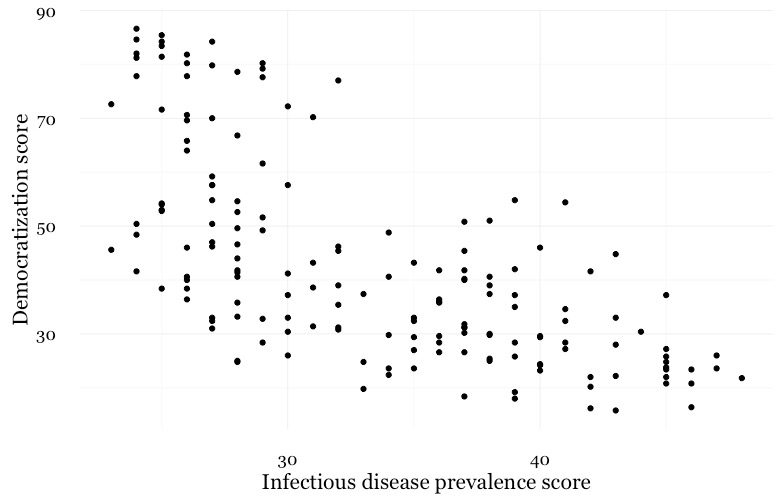

#### Add a layer with a smoothed trend line, fitted to the data

```r
# add a trend line
disease_democ_chart +
  geom_point() +
  geom_smooth()
```

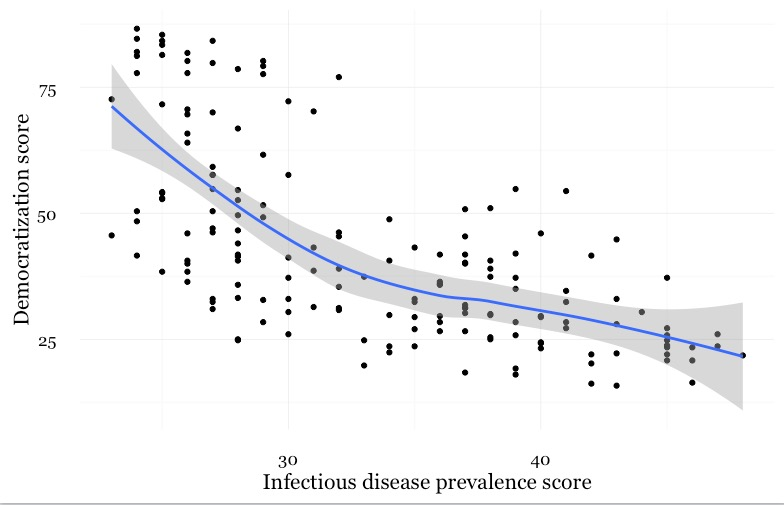

#### Customize the two layers we've added to the chart

The following code modifies the two `geom` layers to change their appearance.

```r
# customize the two geom layers
disease_democ_chart +
  geom_point(size = 3, alpha = 0.5) +
  geom_smooth(method = lm, se=FALSE, color = "red")
```
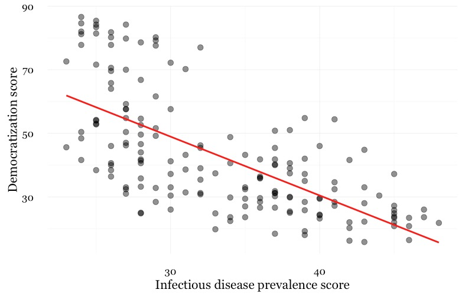

In the `geom_point` layer, we have increased set size of each point, and reduced its transparency using `alpha`.

In the `geom_smooth` function, we have changed the `color` of the line, removed the ribbon showing the `se` or "standard error," a measure of the uncertainty surrounding the fit to the data, and changed the `method` used to fit the data from a smoothed fit by a method called locally-weighted scatterplot smoothing to a linear regression, or linear model (`lm`).

When setting colors in **ggplot2** you can use their [R color names](http://www.stat.columbia.edu/~tzheng/files/Rcolor.pdf), or their HEX values. This code will produce the same result:

```r
# customize the two geom layers
disease_democ_chart +
  geom_point(size = 3, alpha = 0.5) +
  geom_smooth(method = lm, se=FALSE, color = "#FF0000")
```

Until you are familiar with the options for each `geom`, you will need to look up how to change the appearance of each layer: Follow the links for each `geom` form [here](http://docs.ggplot2.org/current/).

The following code customizes the trend line further, and includes an `aes` mapping in to set the color of the points to that they reflect the categorical variable of World Bank income group.

```r
# customize again, coloring the points by income group
disease_democ_chart + 
  geom_point(size = 3, alpha = 0.5, aes(color = income_group)) +
  geom_smooth(method = lm, se  =FALSE, color = "black", linetype = "dotdash", size = 0.3)
```


Notice how the `aes` function colors the points by values in the data, rather . **ggplot2** recognizes that`income_group` is a categorical variable, and uses its default qualitative color palette.

Now run this code, to see the different effect of setting the `aes` color mapping for the *entire chart*, rather than just one `geom` layer.

```r
# color the entire chart by income group
ggplot(disease_democ, aes(x = infect_rate, y = democ_score, color=income_group)) +
  xlab("Infectious disease prevalence score") + 
  ylab("Democratization score") +
  theme_minimal(base_size = 16, base_family = "Georgia") + 
  geom_point(size = 3, alpha = 0.5) +
  geom_smooth(method=lm, se=FALSE, linetype= "dotdash", size = 0.3)
```
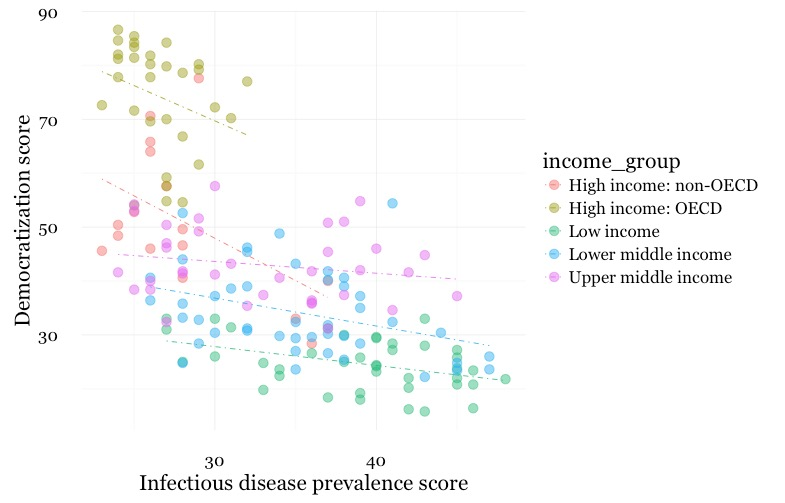

#### Set the axis ranges, and use a different color palette

```r
# set the axis ranges, change color palette
disease_democ_chart + 
  geom_point(size = 3, alpha = 0.5, aes(color = income_group)) +
  geom_smooth(method = lm, se = FALSE, color = "black", linetype = "dotdash", size = 0.3) + 
  scale_x_continuous(limits=c(0,70)) + 
  scale_y_continuous(limits=c(0,100)) +
  scale_color_brewer(name="Income group", palette = "Set1")
```

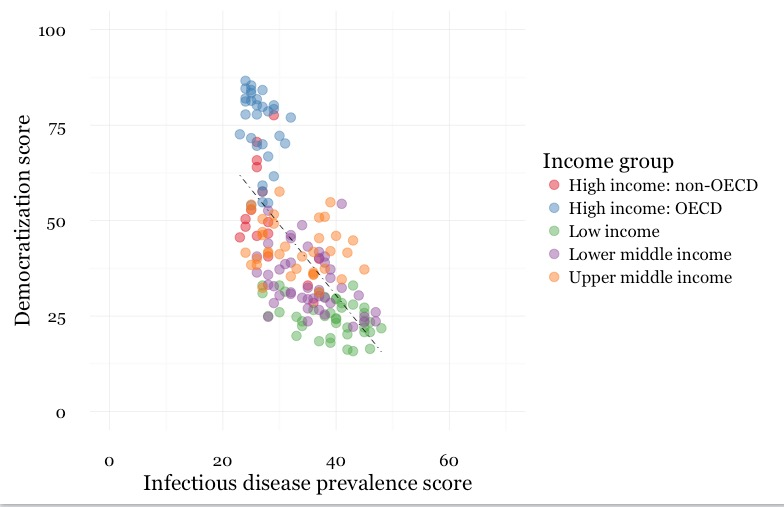

Notice how the first two `scale` functions are used to set the ranges for the axis, which are entered as a list, using the `c` function we saw last week.

You can use [ColorBrewer](http://colorbrewer2.org) qualitative palettes by using the `scale_color_brewer` function. Add the text you want to appear as a legend title using `name`.

### Save your charts

Having made a series of charts, you can browse through them using the blue arrows at the top of the `Plots` tab in the panel at bottom right. The broom icon will clear all of your charts; the icon to its immediate left remove the chart in the current view.

You can export any chart by selecting `Export>Save as Image...`. At the dialog box, you can select the desired image format, and size. If you wish to edit or annotate the chart in a vector graphics editor such as [Abode Illustrator](https://helpx.adobe.com/illustrator/how-to/what-is-illustrator.html), export as an SVG file.

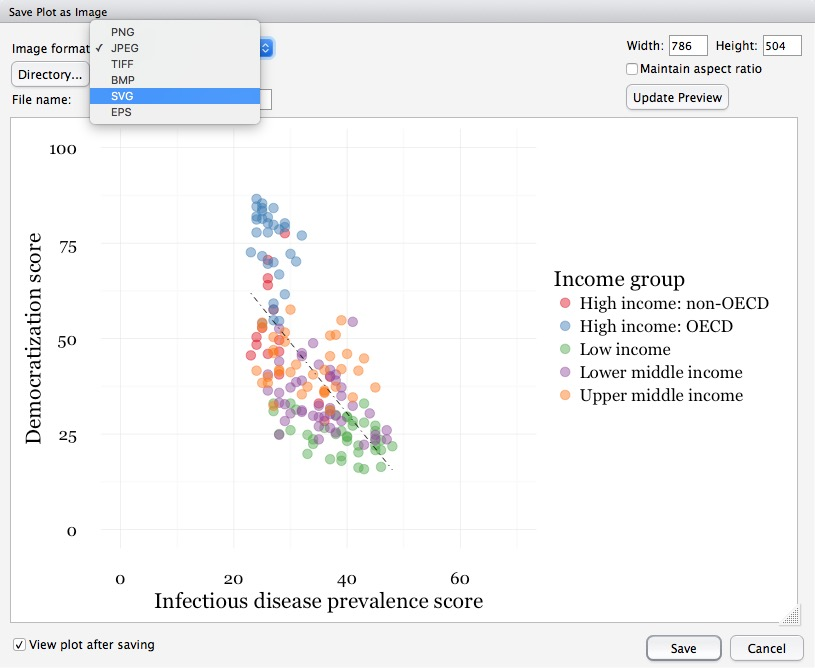

You can also save your final **ggplot2** chart as an object in your R environment:

```r
# save final disease and democracy chart
final_disease_democ_chart <- disease_democ_chart + 
  geom_point(size = 3, alpha = 0.5, aes(color = income_group)) +
  geom_smooth(method = lm, se = FALSE, color = "black", linetype =  "dotdash", size = 0.3) + 
  scale_x_continuous(limits = c(0,70)) + 
  scale_y_continuous(limits = c(0,100)) +
  scale_color_brewer(name = "Income group", palette = "Set1")
```

### Make a series of charts from food stamps data

Now we will explore a series of other `geom` functions using the food stamps data.

#### Load the data, map variables onto the X and Y axes, and save chart template

```r
# load data
food_stamps <- read_csv("food_stamps.csv")

# save basic chart template
food_stamps_chart <- ggplot(food_stamps, aes(x = year, y = participants)) + 
  xlab("Year") +
  ylab("Participants (millions)") +
  theme_minimal(base_size = 16, base_family = "Georgia")
```

#### Make a line chart

```r
# line chart
food_stamps_chart +  
  geom_line()
```

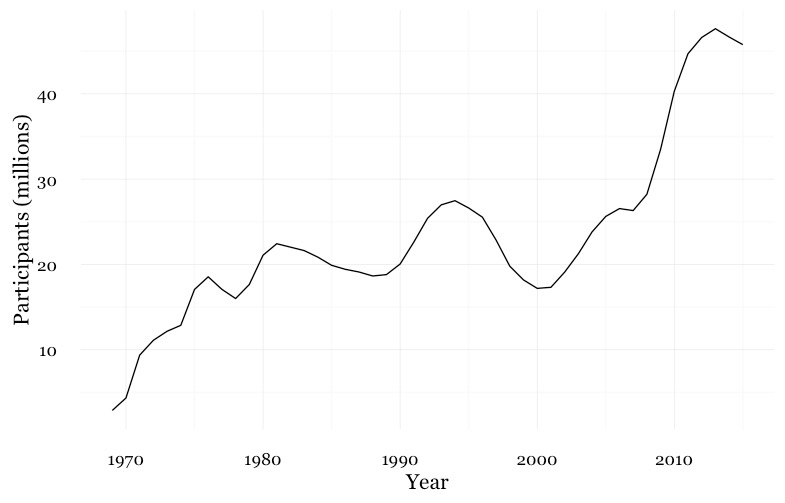

#### Customize the line, and add a title

```r
# customize the line, add a title
food_stamps_chart +
  geom_line(size = 1.5, color = "red") +
  ggtitle("Line chart")
```
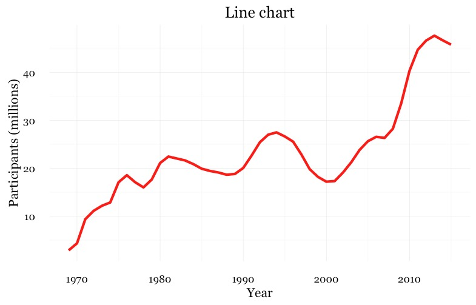

The function `ggtitle` adds a title to the chart.

#### Add a second layer to make a dot-and-line chart

```r
# Add a second layer to make a dot-and-line chart
food_stamps_chart +
  geom_line() +
  geom_point() +
  ggtitle("Dot-and-line chart")
```

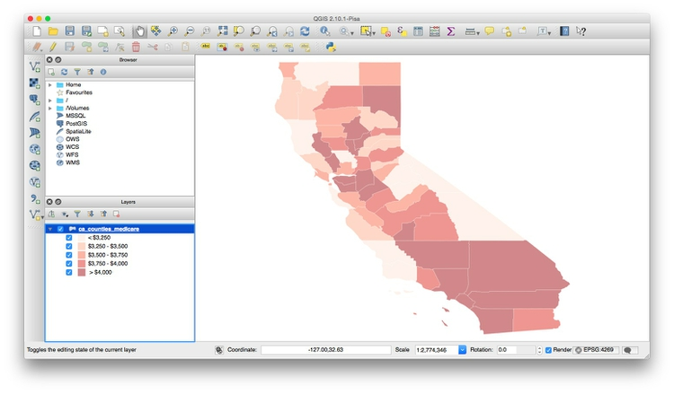

#### Make a column chart, then flip its coordinates to make a bar chart

```r
# Make a column chart
food_stamps_chart +
  geom_bar(stat = "identity") +
  ggtitle("Column chart")
``
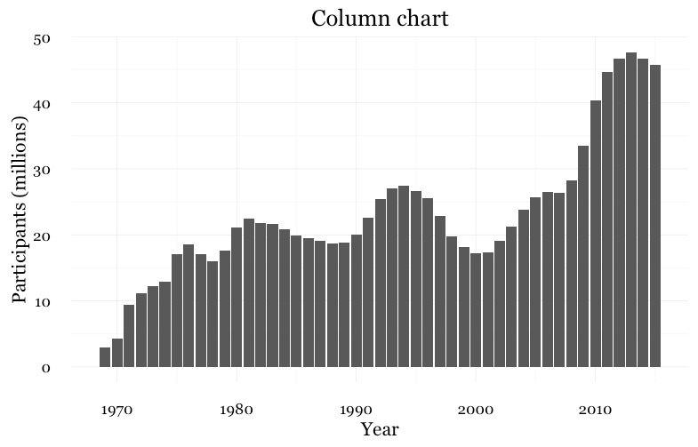

`geom_bar` works a little differently to the `geoms` we have considered previously. If you have not mapped data values to the Y axis with `aes`, its default behavior is to set the heights of the bars by counting the number of records for values along the X axis. If you have mapped a variable to the Y axis, and want the heights of the bars to represent values in the data, use you must use `stat="identity"`.


 ```r
# Make a bar chart
food_stamps_chart +
  geom_bar(stat = "identity") +
  ggtitle("Bar chart") +
  coord_flip()
```

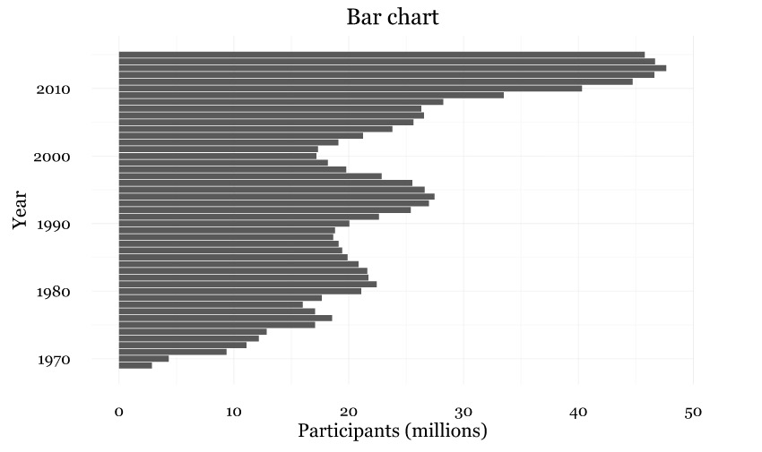

`coord_flip` switches the X and Y axes.

#### The difference between color and fill

For some `geoms`, notably `geom_bar`, you can set color for their outline as well as the color used to fill the shapes.

```r
# set color and fill
food_stamps_chart +
  geom_bar(stat = "identity", color = "#888888", fill = "#cccccc", alpha = 0.5) +
  ggtitle("Column chart")
```
When setting colors, `color` refers to the outline, `fill` to the interior of the shape.


#### Map color to the values of a continuous variable

```r
# fill the bars according to values for the cost of the program
food_stamps_chart +
  geom_bar(stat = "identity", aes(fill = costs))
```

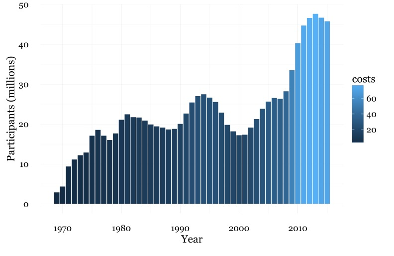

This code uses an `aes` mapping to color the bars according values for the costs of the program, in billions of dollars. *ggplot2* recognizes that `costs` is a continuous variable, but its default sequential scheme applies more intense blues to lower values, which is counterintuitive.

#### Use a ColorBrewer sequential color palette

```r
# use a colorbrewer sequential palette
food_stamps_chart +
  geom_bar(stat = "identity", color = "#888888", aes(fill = costs)) +
  scale_fill_distiller(name = "Cost\n($ billion)", palette = "Reds", direction = 1)
  ```
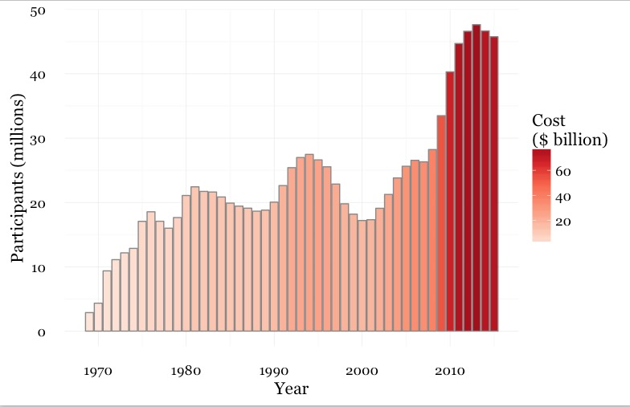

`scale_fill_distiller` (and `scale_color_distiller`) work like `scale_color_brewer`, but set color gradients for ColorBrewer's sequential and diverging color palettes; `direction = 1` ensures that larger numbers are mapped to more intense colors (`direction = -1` reverses the color mapping).

Notice also the `\n` in the title for the legend. This introduces a new line.

#### Control the position of the legend

This code uses the `theme` function to moves the legend from its default position to the right of the chart to use some empty space on the chart itself.

```r
food_stamps_chart +
  geom_bar(stat="identity", color = "#888888", aes(fill=costs)) +
  scale_fill_distiller(name = "Cost\n($ billion)", palette = "Reds", direction = 1) +
  theme(legend.position=c(0.15,0.8))
```

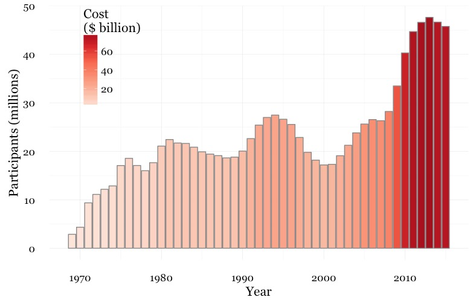

The coordinates for the legend are given as a list: The first number sets the horizontal position, from left to right, on a scale from 0 to 1; the second number sets the vertical position, from bottom to top, again on a scale form 0 to 1.


### Other useful packages to use with ggplot2

The [ggplot2 extensions](https://www.ggplot2-exts.org/) page documents a series of packges that extend the capabilities of ggplot2. See the [gallery](http://www.ggplot2-exts.org/gallery/).

### Putting it all together


### Assignment

 - t/k
 - t/k
 - t/k


### Further reading

Winston Chang: [*R Graphics Cookbook*](http://www.amazon.com/R-Graphics-Cookbook-Winston-Chang/dp/1449316956)
(Chang also has [a helpful website](http://www.cookbook-r.com/) with much of the same information, available for free.)

Hadley Wickham: [*ggplot2: Elegant Graphics For Data Analysis*](http://www.amazon.com/gp/product/0387981403/)

[ggplot2](https://www.rstudio.com/wp-content/uploads/2015/08/ggplot2-cheatsheet.pdf) cheat sheet from RStudio.

[ggplot2 documentation](http://docs.ggplot2.org/current/)

[ggplot2](http://stcorp.nl/R_course/tutorial_ggplot2.html) and [dplyr](http://stcorp.nl/R_course/tutorial_dplyr.html) tutorials from [Paul Hiemstra](http://www.numbertheory.nl/about/).

[Stack Overflow](http://stackoverflow.com/)
Search the site, or [browse R questions](http://stackoverflow.com/questions/tagged/r)


