# Acquiring, cleaning, and formatting data

Not so many years ago, data was hard to obtain. Often journalists would have to painstakingly compile their own datasets from paper records.

The Internet has changed the game. While those methods may still be needed on occasions, many government databases can now be queried online, and the results of those searches downloaded. Other public datasets can be downloaded in their entirety.

The main problem today is usually not finding relevant data, but in working out whether it can be trusted, spotting and correcting errors and inconsistencies, and getting it in the right format for analysis and visualization.

Today, we will cover some tips and tricks for finding the data you need online, getting it onto your computer, and how to recognize and clean “dirty” data.

### The data we will use today

Download the data for this session from [here](data/week2.zip), unzip the folder and place it on your desktop. It contains the following files:

- `techexports.xls` [High-technology exports](http://data.worldbank.org/indicator/TX.VAL.TECH.CD) from 1990 to 2015, in current U.S dollars, from the UN Comtrade database, supplied via the World Bank. High-technology exports include products in aerospace, computers, pharmaceuticals, scientific instruments, and electrical machinery.

- `richmond_collisions.csv` Data on injury and fatal traffic accidents in Richmond, California, from 2005 to 2013, from the [Transportation Injury Mapping System](http://tims.berkeley.edu/page.php?page=about). The data comes from the California Highway Patrol’s [Statewide Integrated Traffic Records System](http://iswitrs.chp.ca.gov/Reports/jsp/userLogin.jsp) and was then geocoded for mapping by UC Berkeley’s Safe Transportation Research & Education Center.

### Data portals

Life is much easier if you can find everything you need in one place. The main effort to centralize access to data by the U.S. federal government is [Data.gov](http://www.data.gov/). You can search for data from the home page, or follow the [Data](http://catalog.data.gov/dataset) and Topics links from the top menu.

Be warned, however, that Data.gov is a work in progress, and does not contain all of the U.S. government’s data. Some of the most useful datasets are still only available on the websites of individual federal agencies. [FedStats](http://fedstats.sites.usa.gov/) has [links to agencies](https://fedstats.sites.usa.gov/agencies/) with with data collections.

As a journalist, it is worth familiarizing yourself with the main federal government agencies that have responsibility for the beats you are interested in, and the datasets they maintain. Here are some examples of agencies with useful data:

- **[U.S. Census Bureau](http://www.census.gov/)**: population, demographic, economic and other data, including trade and manufacturing statistics. The [American FactFinder](http://factfinder2.census.gov/faces/nav/jsf/pages/index.xhtml) is especially useful for summary data about specific geographical areas. As well as running the decadal national census, the bureau operates other surveys, which provide more detailed information from representative samples of the U.S. population, including the [Current Population Survey](http://www.census.gov/programs-surveys/cps.html) (run jointly with the Bureau of Labor Statistics, see below) and the [American Community Survey](http://www.census.gov/programs-surveys/acs/).

- **[Bureau of Labor Statistics](http://www.bls.gov/)**: employment and unemployment, workplace injuries, time use, pay and consumer spending, including the [Consumer Price Index](http://www.bls.gov/cpi/), a key measure of inflation. Browse its datasets [here](http://www.bls.gov/data/).

- [**Bureau of Justice Statistics**](http://www.bjs.gov/): crime and law enforcement. [Here](http://www.bjs.gov/index.cfm?ty=dca) is its full list of data collections. The [National Crime Victimization Survey](http://www.bjs.gov/index.cfm?ty=dcdetail&iid=245) is an especially useful resource, which together with the Federal Bureau of Investigation's [Uniform Crime Reporting](https://ucr.fbi.gov/) program provides the best national data on crime.

- **[Centers for Disease Control and Prevention](http://www.cdc.gov/)**: The [WONDER](http://wonder.cdc.gov/) online databases provide a wealth of information, including on causes of death. Other health datasets are available through the CDC's [National Center for Health Statistics](http://www.cdc.gov/nchs/).

- **[National Oceanic and Atmospheric Administration](http://www.noaa.gov/)**: [climate](http://www.climate.gov/maps-data) and [weather](http://www.weather.gov/), including [forecasts](http://www.nws.noaa.gov/ndfd/), and historical records of [severe weather](http://www.spc.noaa.gov/gis/svrgis/) events.

#### Local data

Many large cities, including Oakland, maintain their own data portals. At [OakData](https://data.oaklandnet.com/), you can search for data using the box at top right, or navigate using the green topic area buttons at the bottom.


(Source: [OakData](https://data.oaklandnet.com/))

Click on the `Public Safety` button, and then the `CrimeWatch Maps Past 90-days` link to see the format of a typical dataset. Oakland uses a system called [Socrata](https://socrata.com/) to store its data, which is used by many state and local government agencies. Clicking on the blue `Export` button will bring up a series of options, including downloading as a CSV file:


(Source: [OakData](https://data.oaklandnet.com/))

Oakland also has an active volunteer open data community, which has obtained a variety of public datasets, and [made them available](http://data.openoakland.org/) for easy download. Again there are simple search and navigation options:


(Source: [OpenOakland](http://data.openoakland.org/))

#### Using the American Factfinder to obtain local data

Smaller cities, including Richmond, usually don't have dedicated data portals. However, the Census Bureau's American FactFinder is a key resource to obtain basic statistics about any geographic area in the United States, large or small.

Navigate to the [FactFinder](http://factfinder.census.gov/faces/nav/jsf/pages/index.xhtml). You can find basic demographic and other information on Richmond by typing `Richmond, California` into the search box and accepting the suggestion of `Richmond city, California`:


(Source: [American FactFinder](http://factfinder.census.gov/faces/nav/jsf/pages/index.xhtml))

Each of the topic area tabs at the left opens up links to specific data tables. Notice that if you click through to any of the data tables, you have the option to download as a CSV file or Excel spreadsheet.

Navigate back to the FactFinder home page, and we'll now use the `Guided Search` to ask a specific question: 

- How many households in Richmond receive food stamps or other public income assistance?

Select `Guided Search>GET ME STARTED` and then the default option to look for information about`People`. Under `Topics`, open the menu for `Poverty` and select `Food Stamps/SNAP`. Notice that this now moves into `Your Selections`:

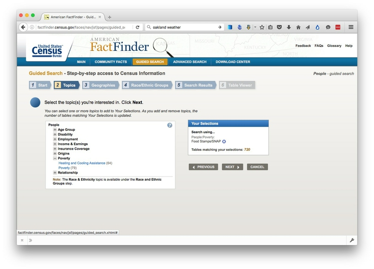

(Source: [American FactFinder](http://factfinder.census.gov/faces/nav/jsf/pages/index.xhtml))

Under `Geographies`, start typing `Richmond, California` and select the `Richmond city, California` option, so Richmond is added to `Your Selections`:


(Source: [American FactFinder](http://factfinder.census.gov/faces/nav/jsf/pages/index.xhtml)

We'll skip `Race/Ethnic Groups`, so select `Search Results` to show the tables that contain relevant data:


(Source: [American FactFinder](http://factfinder.census.gov/faces/nav/jsf/pages/index.xhtml))

This is where the FactFinder can get a little bewildering. Which table contains the data I need? Notice that all of the top search returns are from either the `2014 ACS 5-year estimates` or the `2014 ACS 1-year estimates`. ACS is the [American Community Survey](), which samples about 1 in 40 American households each year. The 1-year estimates are based on a single-year's survey, while the 5-year estimates are for the five years ending in that year, here 2010-2014. Because they are based on a larger sample, the 5-year estimates are more precise, but they gain that precision at the cost of losing information on changes over time. Which one you [choose to use](http://www.census.gov/programs-surveys/acs/guidance/estimates.html) will be a trade-off.

If you follow the first few links, you'll see that the two tables with the ID `B19058` contain the numbers we want.

**Here are the 5-year estimates:**

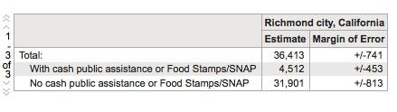

**And here are the 1-year estimates:**

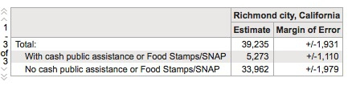

(Source: [American FactFinder](http://factfinder.census.gov/faces/nav/jsf/pages/index.xhtml))

Notice that you can look at earlier years' installments of the same data, and that each number has a margin of error. (These are just like the margins of errors for election and opinion polls, except that they are given as raw numbers, rather than percentage points, and the Census Bureau uses a 90% confidence interval, rather than the 95% typically used in polling.)

Given the large fluctuations from year to year in the 1-year estimates, and their large margins of error, I would use the 5-year estimates in this case and say that over the five years from 2010 to 2014, about 4,500 of the roughly 35,000 households in Richmond received food stamps or other public income assistance in each year.

#### International data

If you need to make comparisons between nations, the [**World Bank**](http://www.worldbank.org/) probably has what you need. Its [World Development Indicators catalog](http://data.worldbank.org/indicator/?tab=all) containing data for more than 7,000 different measures, compiled by the bank and other UN agencies.

You can navigate the site using the `Find an indicator` search box or the [By Topic](http://data.worldbank.org/topic) link. When you click on a particular indicator, you are sent to a page that gives options to download the dataset from a link near the top right of the page. The data in some cases goes back as far as 1960, and is listed both by individual country and summarized by regions and World Bank income groups.

Other useful sources of data for international comparisons are [**Gapminder**](http://www.gapminder.org/data/) and the **[UN Statistical Division](http://unstats.un.org/unsd/default.htm)**. For health data in particular, try the **[Organisation for Economic Co-operation and Development](http://www.oecd.org/els/health-systems/health-data.htm)** and the **[World Health Organization](http://who.int/research/en/)**.

### Search for data on the web

Often, however, your starting point in searching for data will be Google. Often simply combining a few keywords in a Google search with “data” or “database” is enough to find what you need, but it can be worth focusing your queries using Google’s [advanced search](http://www.google.com/advanced_search):


(Source: [Google](http://www.google.com/advanced_search))

The options to search by `site or domain` and `file type`can be very useful when looking for data. You can make the domains as narrow or broad as you like: `.gov`, for instance, would search a wide range of U.S. government sites, while `.edu` would search the sites of all academic institutions using that top-level domain; `journalism.berkeley.edu` would search the web pages of the Berkeley J-School only.

The `file type` search offers a drop-down menu, with the options including Excel spreadsheets, and Google Earth `KML` and `KMZ` files. These are common data formats, but you are not limited to those on the menu. In a regular Google search, type a space after your search terms followed by `filetype:xxx`, where `xxx` is the suffix for the file type in question. For example, `dbf` will look for database tables in this format. Combining file type and domain searches can be a good way to find data an agency has posted online -- some of which may not otherwise be readily accessible.

### Search online databases

Many important public databases can be searched online, and some offer options to download the results of your queries. Most of these databases give a simple search box, but it’s always worth looking for the advanced search page, which will offer more options to customize your search. Here, for example, is the [advanced search](http://clinicaltrials.gov/ct2/search/advanced) page for [ClinicalTrials.gov](http://clinicaltrials.gov/), a database of tests of experimental drugs and other medical treatments taking place in the United States and beyond:


(Source: [ClinicalTrials.gov](http://clinicaltrials.gov/ct2/search/advanced))

When you start working with a new online database, take some time to familiarize yourself with how its searches work: Read the Help or FAQs, and then run test searches to see what results you obtain. [Here](http://clinicaltrials.gov/ct2/help/how-find/index), for example, is the "How To" section of ClinicalTrials.gov.

Many online databases can be searched using **Boolean logic**, using the operators `AND`, `OR` and `NOT` to link search terms together. `AND` will return only data including both search terms; `OR` will return data containing either term; `NOT` will return data containing the first term but not the second.

So find out how a particular database uses Boolean logic -- and the default settings that it will use if you list search terms without any Boolean operators.

Putting search terms in quote marks often searches for a specific phrase. For example, searching for “heart attack” on ClinicalTrials.gov will give only give results in which those two words appear together; leaving out the quote marks will include any trial in which both words appear.

Also find out whether the database allows “wildcards,” symbols such as `*` or `%` that can be dropped into your search to obtain results with variations on a word or phrase.

### Look for download options -- and know when you are hitting the wall

Having run a search on an online database, you will usually want to download the results, so look for the download links or buttons.

A common problem with online databases, however, is that they may impose limits on the number of results that are returned on each search. And even when a search returns everything, there may be a limit on how many of those results can be downloaded to your own computer.

If broad searches on a database keep returning the same number of results, that is a sign that you are probably running up against a search limit, and any download will not contain the complete set of data that you are interested in. However, you may be able to work out ways of searching to obtain all of the data in chunks.

### Download the entire database

Downloading an entire database, where this is allowed, frees you from the often-limited options given on an online advanced search form: You can then analyze it in any way that you want.

So always look for ways to grab all of the data. One trick is to run a search on just the database’s wildcard character, or with the query boxes left blank. If you do the latter at ClinicalTrials.gov, for instance, your search will return all of the trials in the database, which can then be downloaded using the options at the bottom of the results page.

Other databases have an online search form, but also have a separate link from where data to be downloaded in its entirety, usually as a text file or series of text files.

Note that large text files are again often stored in compressed folders, so may be invisible to a Google search by file type.

### Ask for what you don't find

If you don't find what you're looking for, speak to government officials, academic experts, and other sources who should know about what data exists, and ask whether they can provide it for you. If necessary, you can use the federal [Freedom of Information Act](https://www.foia.gov/) or state equivalents (for example the [California Public Records Act](http://www.thefirstamendment.org/publicrecordsact.pdf)), to obtain entire datasets from public bodies. Open records laws are not restricted to documents: Datasets maintained by official bodies are often considered public records, so you are entitled to ask for them. As we discussed in the Week 1, ask for data to be provided as CSV or other delimited text files.

### Automate downloads of multiple data files

Often data doesn't reside in a single searchable database, but instead exists online as a series of separate files. In such cases, clicking on each link is tedious and time-consuming. But you can automate the process using the [DownThemAll!](https://addons.mozilla.org/en-US/firefox/addon/downthemall/) Firefox add-on.

To illustrate, go to [Gapminder's data catalog](http://www.gapminder.org/data/), and select `All` indicators. The webpage now includes links to more than 500 downloadable spreadsheets.

At the dialog box, you can choose where to save the files, and to filter the links to select just the files you want. In this case, unchecking all the boxes and `Fast Filtering` using the letters `xls`, which appear in each of the download links, will correctly identify the spreadsheet downloads:


### Extract data from tables on the web

On other occasions, data may exist in tables on the web. Copying and pasting data from web tables can be tricky, but the [Table2Clipboard](https://addons.mozilla.org/en-US/firefox/addon/dafizilla-table2clipboard/) Firefox add-on can simplify the process.

Before using the add-on, select `Tools>Table2Clipboard` and choose the following options under the `CSV` tab:


This will ensure that each row in the extracted data is put on a `new line`, and each column is separated by a `tab`.

To illustrate what Table2Clipboard does, go to [this page](http://www.realclearpolitics.com/epolls/2016/president/us/general_election_trump_vs_clinton-5491.html) at RealClearPolitics with recent presidential polling data, right-click anywhere in the table and select `Table2Clipboard>Copy whole table`:

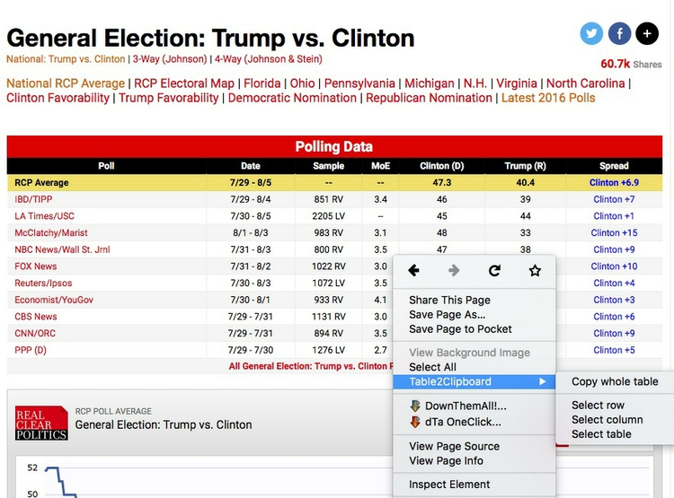

You can now paste the data into an empty text file, or into a spreadsheet.

### PDFs: the bane of data journalism

Some organizations persist in making data available as PDFs, rather than text files, spreadsheets or databases. This makes the data hard to extract. While you should always ask for data in a more friendly format -- ideally a CSV or other simple text file -- as a data journalist you are at some point likely to find yourself needing to pull data out of a PDF.

For digital PDFs, **[Tabula](http://tabula.technology/)** is a useful data extraction tool -- however it will not work with PDFs created by scanning the original document, which have to be interpreted using Optical Character Recognition (OCR) software.

Also useful is the online service **[Cometdocs](http://www.cometdocs.com/)**. While it is a commercial tool, members of Investigative Reporters and Editors can [obtain a free account](http://ire.org/blog/ire-news/2013/05/22/ire-announces-partnership-cometdocs/). Cometdocs can read scanned PDFs, however its accuracy will vary depending on how well the OCR works on the document in question.

### Can I trust this data?

Having identified a possible source of data for your project, you need to ask: Is it reliable, accurate and useful? If you rush into analysis without considering this question, your hard work may be undermined by the maxim: “Garbage In, Garbage Out.”

The best rule of thumb in determining the reliability of a dataset is find out whether it has been used for analysis before, and if so by whom. If a dataset was put together for an academic study, or is actively curated so it can be made available for experts to analyze, you can be reasonably confident that it is as complete and accurate as it can be.

While in general you might be more trusting of data downloaded from a `.gov` or `.edu` domain than something found elsewhere on the web, don’t simply assume that it is reliable and accurate.

Government agencies may be required by law to maintain a database, but that doesn’t mean that the information contained in them is wholly reliable. First, forms may not always be submitted, making the data incomplete. Second, information may be entered by hand from the forms into the database -- and not surprisingly, mistakes are made.

So before using any dataset, do some background research to find out how it was put together, and whether it has been rigorously checked for errors. If possible, try to speak to the people responsible for managing the database, and any academics or other analysts who have used the data. They will be your best guide to a dataset’s strengths and weaknesses.

Even for well-curated data, make a point of speaking with experts who compile it or use it, and ask them about the data's quirks and limitations.

Always ask probing questions of a dataset before putting your trust in it. Is this data complete? Is it up-to-date? If it comes from a survey, was it based on a representative sample of people who are relevant to your story? Remember that the first dataset you find online may not be the most relevant or reliable.

### Recognize dirty data

In an ideal world, every dataset we find would have been lovingly curated, allowing us to start analyzing without worrying about its accuracy.

In practice, however, often the best available data has some flaws, which may need to be corrected as far as is possible. So before starting to work with a new dataset, load it into a spreadsheet and take a look for common errors.

In text fields, look for obvious mispellings or non-text characters and symbols. For people’s names, look for variations in spelling, format, initials and accents, which may cause the same person to appear in multiple guises. Similar glitches may affect addresses, and any other information entered as text.

Look for glitches in the alignment of columns, which may cause data to appear in the wrong place.

Some data offers some obvious checks: If you see a zip code with less than 5 digits, for instance, you know it must be wrong.

Dates can also be entered incorrectly, so it’s worth scanning for those that fall outside the timeframe that should be covered by the data.

Also scan numbers in fields that represent continuous variables for any obvious outliers. These values are worth checking out. Are they correct, or did someone misplace a decimal point or enter a number in the wrong units?

Other common problems are white spaces before and after some entries, or multiple spaces where there should only be a single space. These may need to be stripped out.

At all stages of your work, pay attention to zeros. Is each one actually supposed to represent zero, or should the cell in fact be empty, or **null**? Take particular care when exporting data from one software tool and importing to another, and check how nulls have been handled.

### Clean and process data with Open Refine

Checking and cleaning "dirty" data, and processing data into the format you need, can be the most labor intensive part of many data journalism projects. However, **[Open Refine](http://openrefine.org/)** (formerly Google Refine) can streamline the task -- and also create a reproducible script to quickly repeat the process on data that must be cleaned and processed in the same way.

When you launch Open Refine, it opens in your web browser. If it does not not launch automatically, open your browser and paste this numeric url into the address bar: 

```SQL
http://127.0.0.1:3333/
```

This refers to a location on your own computer. Any data you load into the program will remain on your computer -- it does not get posted online.

The opening screen should look like this:


#### Reshape data from wide to long format

Click the `Browse` button and navigate to the file `techexports.xls`. Click `Next>>`, and check that data looks correct:

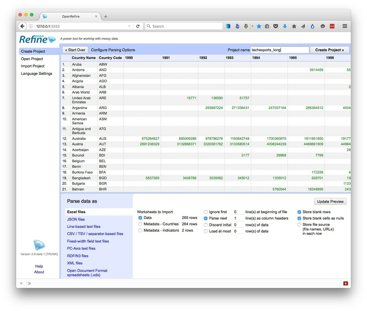

Open Refine displays numbers and dates in green, and entries treated as text in black.

It should recognize that the data is in a Excel file, but if not you can use the panel at bottom to specify the correct file type and format for the data.

Change the project name to `techexports_long`, so that will be the name of the file we export once we've reshaped the data. When you are satisfied that the data has been read correctly, click the `Create Project >>` button at top right. The screen should now look like this:


As you can see, the data is in wide format, with values for high technology exports by country and group of countries organized in columns, one for each year. To convert this to long format, click on the small downward-pointing triangle for the first of these year columns, and select `Transpose>Transpose cells across columns into rows`.

Fill in the dialog box as below, making sure that `From Column` and `To Column` are highlighted correctly, that the `Key column` and `Value column` have been given appropriate names (`Year` and `Tech exports`), and that `Fill down in other columns` is checked.

(Failing to check this box will mean that the country names and codes each will only appear once in the reshaped data, rather than being copied down to appear next to the corresponding data for year and the dollar value of high-technology exports.)

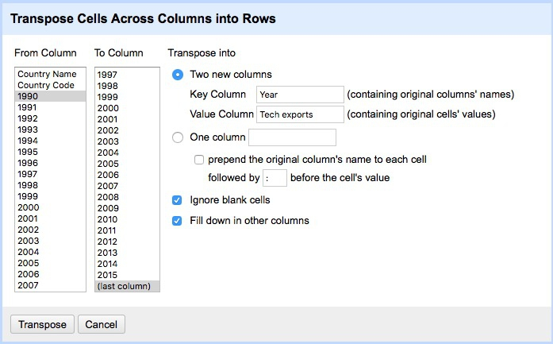

Click `Transpose` and then the `50` rows link, to see the first 50 rows of the reshaped data:

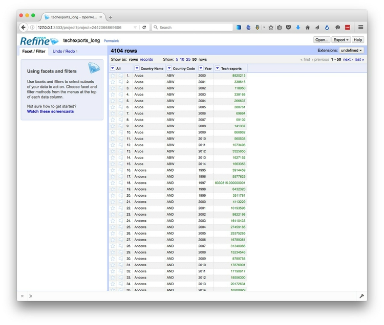

Click the `Export` button at top right and export as an `Excel` spreadsheet.

#### Save those steps, so you can repeat them with a future dataset at the click of a button

One huge advantage of Open Refine is that we can extract a "pipeline" for processing data to use when we obtain data in the same format in future.

Select `Undo / Redo` at top left, which opens a panel documenting what we did to the data:

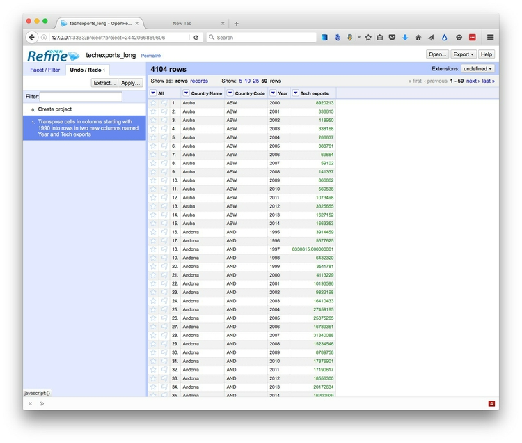

Notice that clicking on `Create project` transforms the data back to its original form, while clicking on the `Transpose cells ...` step returns to the reshaped data. This ability to jump to any step can be very useful in complex data cleaning, because it means you can return to any step in the process and pick up from there, if you make a mistake.

Now click the `Extract` button. This will generate instructions, in a format called JavaScript Object Notation, or JSON, in the right hand panel that can be copied into a blank text file and saved.


To process similar data in future. Click the `Apply` button on the `Undo / Redo` tab, paste in the text from this file, and click `Perform Operations`. The data will then be processed automatically.

For this simple operation, not much time is saved, but if you have a long and complex data processing pipeline that needs to be repeated, it will save you time, and guard against errors when you try to repeat your steps.


#### Clean and process dirty data

Click the Open Refine logo at top left to return to the opening screen.

Create a new project from the file `richmond_collisions.csv`. Open Refine should recognize that the file is in CSV format. However, you may need to check `Parse cell text into numbers, dates ...`:

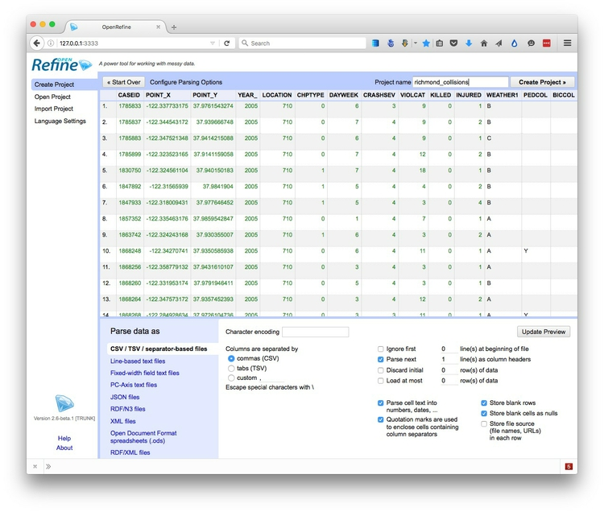

Edit the project name to `richmond_collisons` and click `Create Project >>`.

Again, each field/column has a button with a downward-pointing triangle. Click on these buttons and you get the option to create `Facets` for the column, which provide a powerful way to edit and clean data.

Click on the button for the field `PRIMARYRD`, and select `Facet>Text facet`. A summary of the various entries now appears in the panel to the left:


The numbers next to each entry show how many records there are for each value. Notice that there are 155 entries for `BARRETT AV`, and 5 for `BARRETT`. We can edit entries individually: Select `BARRETT`, click on the `Edit` link, change it to `BARRETT AV`, and click the `Apply` button. Now there should be 160 entries for `BARRETT AV`.

You can continue editing entires manually, but Open Refine also has a clustering function to help clean text fields. Click the `Cluster` button to see the following dialog box:


Open Refine allows you to experiment with different clustering algorithms, which match text entries based on their similarity. Which ones perform best will depend on the data, but here I suggest trying the `key collision` method with the `metaphone3` keying function.

This will match some entires that don't want to be clustered together, like the numbered streets:

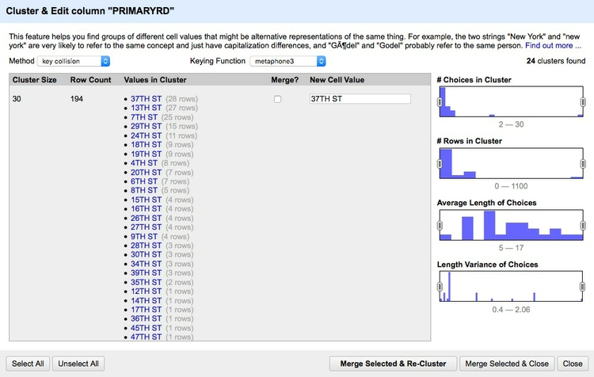

But as you scroll down, you will find entries that the algorithm has corrently grouped together. You can edit the text in the boxes at the right to choose the text that will be substituted, when you merge the clusters:

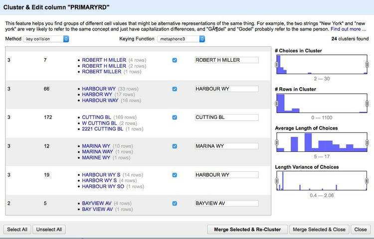

Only those clusters you that check will be merged. Once you are satisfied with your choices, click `Merge Selected & Re-Cluster` or `Merge Selected & Close` and the edits will be made.

Cleaning the `PRIMARYRD ` and `SECONDARYRD` variables will take some time -- but it will be much quicker in Open Refine than if you tried to do this in a spreadsheet.

Once you are finished with a facet, you can close it by clicking the small `x` at top left.

Notice that the variable `CASEID`, which is a unique ID code for each collision, is being treated as a number. It would be better to treat this as a string of text, so call up its dropdown menu and select `Edit cells>Common transforms>To text`. Notice that the entires change from green to black and justify to the left.

Now scroll across to `DATE_` and notice that it is being treated as text. Call up its dropdown menu and select `Edit cells>Common transforms>To date` to convert the values into a date and timestamp in international standard format: 

```SQL
YYYY-MM-DDTHH:MM:SSZ
```
Here `Y` refers to year values, `M` to months, `D` to days; `T` marks the transition from date to time, after which `H` refers to hours, `M` to minutes and `S` to seconds, which can include decimal fractions; `Z` marks the end of the date and timestamp.

Converting dates and times routinely into this format should ensure that they can be correctly read by any data analysis or visualization software.

Notice that the `Common transforms` include `Trim leading and trailing whitespace` and `Collapse consecutive whitespace`. Superfluous whitespace is a common with data entered as text, so it is often worth running these transforms as a precaution on all of your variables where it might cause a problem.

In our last class, we will visualize this data, so let's now give more intuitive names to the columns we will use:

Call up the dropdown menu for `POINT_X`, select `Edit column>Rename this column` and call it `LONGITUDE`. Rename other columns as follows:

- `POINT_Y` becomes `LATITUDE`
- `YEAR_` becomes `YEAR`
- `DATE_` becomes `DATE`
- `ETOH` becomes `ALCOHOL INVOLVED`

Finally, create a text facet for the `ALCOHOL INVOLVED` column and edit the blanks to `N`.

Again, we can `Extract` the steps for future use on similar data. In this case, it would be best to uncheck the steps for editing the text of the primary and secondary roads, as the exact editing and clustering steps would be different if we obtained an update of the data.

Click the `Export` button at top right and export as a Excel file.

Open Refine is a very powerful tool that will reward efforts to explore its wide range of its functions for manipulating data -- in this class we have barely scratched the surface of what it can do. See the **Further reading**, below, for more.

### Correct for inflation (and cost of living)

A common task in data journalism  is to compare currency values over time. When doing so, it usually makes sense to show the values after correcting for inflation -- for example in constant 2014 dollars for a time series ending in 2014. Some data sources, such as the World Bank, provide some data both in raw form or in a given year's constant dollars.

So pay attention to whether currency values have already been corrected for inflation, or whether you will need to do so yourself. When correcting for inflation in the United States, the most widely-used method is the [**Consumer Price Index**](http://www.bls.gov/cpi/), or CPI, which is based on prices paid by urban consumers for a representative basket of goods and services. Use this [online calculator](http://www.bls.gov/data/inflation_calculator.htm) to obtain conversions.

If, for example, you need to convert a column of data in a spreadsheet from 2010 dollars into today's values, fill in the calculator like this:

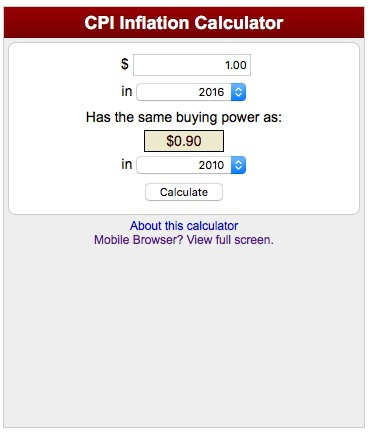

A dollar today is worth the same as 0.9 dollars in 2010.

So to convert today's values into 2010 dollars, use the following formula:

```SQL
2016 value * 0.9
```

And to convert the 2010 values to today's values, divide rather than multiply:

```SQL
2010 value / 0.9
```

Alternatively, fill in the calculator the other way round, and multiply as before.

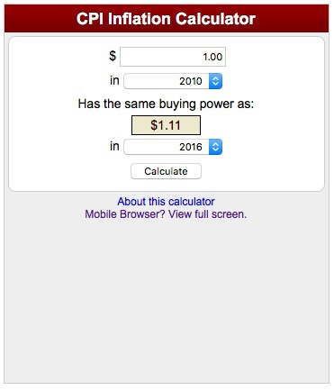

Convert 2010 to today's values:

```SQL
2010 value * 1.11
```

In a spreadsheet, you would need to insert `=` at the start of each formula.

For comparing currency values across nations, regions or cities, you may also need to correct for the cost of living -- or differences in what a dollar can buy in different places. For World Bank indicators, look for the phrase "purchasing power parity," or PPP, for data that includes this correction. PPP conversion factors for nations over time are given [here](http://data.worldbank.org/indicator/PA.NUS.PPPC.RF).


### Further reading

[Open Refine Wiki](https://github.com/OpenRefine/OpenRefine/wiki)

[Open Refine Documentation](https://github.com/OpenRefine/OpenRefine/wiki/Documentation-For-Users)

[Open Refine Recipes](https://github.com/OpenRefine/OpenRefine/wiki/Recipes)
