# Interviewing data: Journalism with spreadsheets

In this week's class we will use Google Sheets to answer specific questions about three datasets, to help shape future reporting.

==**Important warning:**== When performing any calculations in a spreadsheet, always perform frequent "reality checks" on the results.

- Check continually that spreadsheet formulas are referring the the correct cells, and are using the right formulas, correctly.

- Pull out some of the numbers and check them using a calculator. Do you get the same result? If not, you *must* work out what went wrong and reconcile the difference.

- Use your common sense to spot obvious errors. If a calculated mean or median value is larger than the maximum value in your data, for example, it must be wrong.

Editors do not expect to be handed work that is factually incorrect. If you gain a reputation for mistakes and sloppiness your career will be short and unsuccessful. Worse, you may mislead your audience. So always check your work!

### The data we will use today

Download the data for this session from [here](data/week3.zip), unzip the folder and place it on your desktop. It contains the following files:

- `techexports_gdp.csv` Data on [High-technology exports](http://data.worldbank.org/indicator/TX.VAL.TECH.CD) and [GDP](http://data.worldbank.org/indicator/NY.GDP.MKTP.CD) from 1990 to 2015, from the World Bank's World Development Indictors. High-technology exports include products in aerospace, computers, pharmaceuticals, scientific instruments, and electrical machinery. Both values are expressed in current U.S. dollars.

- `gender_pay.csv` Median weekly earnings for men and women across occupations, from 2011 to 2015. Data from the [Bureau of Labor Statistics](http://www.bls.gov/cps/cpsaat39.htm).

- `richmond_collisions.xls` Data on injury and fatal traffic accidents in Richmond, California, from 2005 to 2013, from the [Transportation Injury Mapping System](http://tims.berkeley.edu/page.php?page=about). The data comes from the California Highway Patrol’s [Statewide Integrated Traffic Records System](http://iswitrs.chp.ca.gov/Reports/jsp/userLogin.jsp) and was then geocoded for mapping by UC Berkeley’s Safe Transportation Research & Education Center. This is the data we cleaned with Open Refine in Week 2.

### Analyze data on high-technology exports

Load the file `techexports_gdp.csv` into Google Sheets, set up a header row as we did in Week 1. The data should look like this:

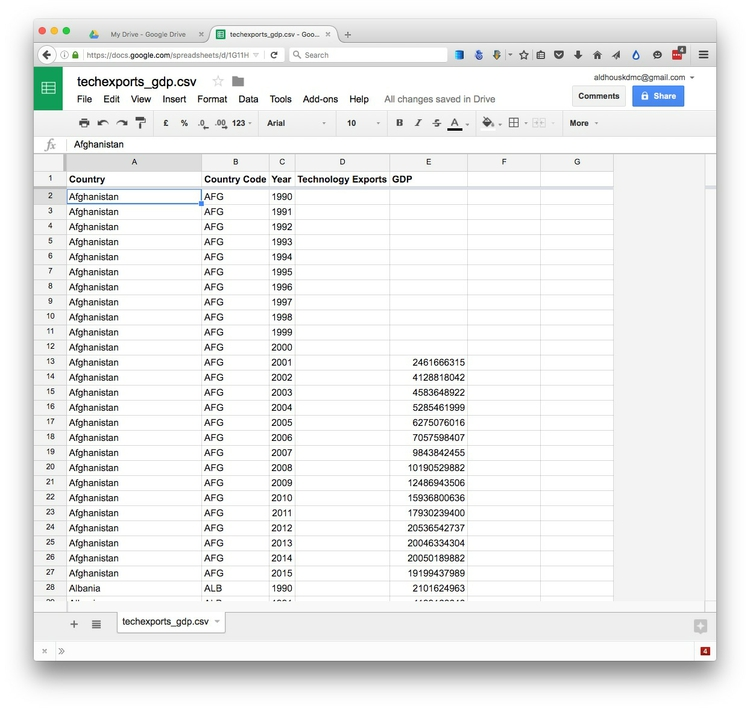

#### Questions to ask of this data

Here are the questions that we will ask:

- Which countries exported the most high-technology goods, in cash terms, in the most recent year for which we have reasonably complete data?

- Which countries exported the most high-technology goods, as a percentage of their GDP, in this year?

#### Remove cells with null values

This data contains a lot of cells with null values. So before we start, let's **filter** the data so we are considering only countries and years for which we have data for both GDP and technology and exports.

To **filter** a Google spreadsheet, select `Data>Filter` from the top menu. This will set up a downward-pointing triangle, which can open a dropdown menu, in each column in the data:


Call up the dropdown menu for the filter on column `D`, containing the data on technology exports, select `Filter by condition...>Cell is not empty`, and click `OK`:


(Alternatively, you could achieve the same result by unchecking the `(Blanks)` under `Filter by vaues...`.)

Repeat the **filter** for column `E`, containing the GDP data. The spreadsheet should now look like this:


Click on the empty cell at top left, left of column `A` and above row `1`, to highlight all of the data. Copy all of the **filtered** data by clicking `⌘-C`, then click the `+` symbol at bottom left to add a new sheet. In the new sheet, click `⌘-V` to copy the filtered data to that location.

Go back to the original sheet by clicking on its tab at the bottom, and select `Data>Turn off filter` from the top menu.

We will not do any more with this sheet, ensuring that we have a pristine copy of the data to go back and work from, if we make any mistakes. This is good practice in data journalism: Always keep a copy of the data that you have not edited in any way.

Go to the new sheet and create a header row as before. Call up the dropdown menu from the tab at the bottom, and call it `Working`. The data should now look like this:

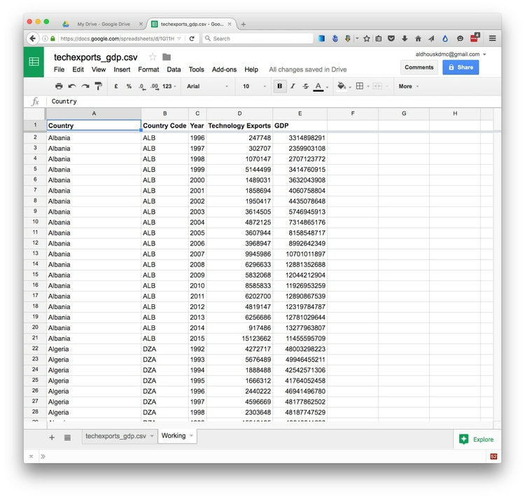

#### Format numbers in billions of dollars

As we discussed in Week 1, large numbers are hard to read, so let's create two new columns giving technology exports and GDP in billions of dollars.

Select the column with technology exports by clicking the `D`, then right-click and select `Insert 1 right`. Call this new column `Technology Exports ($ billion)`.

In the top cell of this column, beneath the header, type this formula to divide the dollar values by 1 billion:

```SQL
=D2/1000000000
```

Move the cursor to the bottom-right corner of this cell, until it becauses a `+` symbol, then double-click. This will activate `autofill`, copying the formula down the column and running the calculation for each cell.

Notice as you move down the column that the cell being referenced in the formula (*fx*) bar changes so that the correct calculation is performed:


**==Warning:==** `autofill` only continues down a column if there is data in adjacent columns. If there are nulls, it will stop at that point. So always check that the calcuation has been performed for the entire column. If necessary, you may need to manually copy and paste the formula to ensure that this occurs.


==**Note:**== If ever you need to perform a calculation down a column based on a number from a single cell, rather than moving through the cells in another column, you should "anchor" the calculation using dollar symbols: for example `$D$2`, rather than `D2`.

The number of figures after the decimal point is excessive and distracting. We don't want to calculate rounded values, as we discussed in Week 1, because we are going to perform further calculations on it. Instead, we can change the formatted display, without changing the underlying data.

Highlight the new column by clicking on the letter `E`, then select `Format>Number>Number` to show the number rounded to two decimal places. (`Format>More formats>Custom number format...` allows you to format the number exactly as you wish.)


To repeat the entire process for the GDP column, we can perform a shortcut, by copying and pasting the formula from cell `E2` into `G2`:


Notice that now the formula refers to cell `F2`, rather than `D2`, because it has shifted two columns to the right. (Notice also that the formatting to two decimal places has copied across, too.) The way in which formulas copy down and across spreadsheets, changing the cells to which they refer, is central to the way the spreadsheets work, and will save you lots of time -- as long as you keep a close watch on the the formulas and make sure at all times that the correct number is being calculated.

Again, use `autofill` to copy the formula down the spreadsheet. Resize the columns, and the data should look like this:

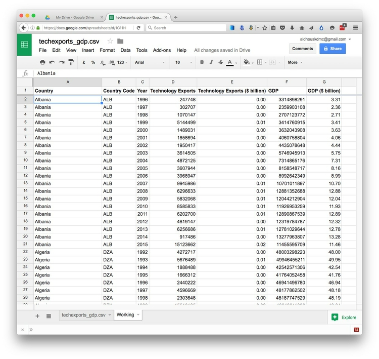

#### Calculate technology exports as a percentage of GDP

Now, in column `H`, calculate the percentage of GDP represented by each country's high-technology exports in each year. Call the column `Technology Exports (% GDP)` and then enter the following formula into the first cell:

```SQL
=D2/F2
```

You may remember from Week 1 that the formula for a percentage also involves multiplying by 100. However, in a spreadsheet we can simply reformat a decimal number into a percentage, without performing that step. To do this, hit the `%` symbol under the top menu. Now `autofill` the column, and the data should look like this:


==**Warning:**== Sometimes when working in a spreadsheet you may choose to delete columns or cells that you have finished working with. If these are being used to in formulas to calculate other values, those values will be lost. So you may sometimes choose to replace formulas with the actual calculated values, to prevent this happening.

To do this for our last column of calculated values, select the entire column by clicking on the letter `H`, then copy the entire column by clicking `⌘-C`. Now select `Edit>Paste special>Paste values only` from the top menu, and notice that the formulas have been replaced by numbers:


Only ever replace your formulas with values if you are 100% confident that the calculations were correct!


#### Filter for the most recent year with reasonably complete data

Working with international data, you will soon learn that countries report their data to UN agencies with differing time lags. So simply picking the most recent year in the data may result in a fragmentary dataset.

Fortunately, there is a handy spreadsheet function that can tell us how many countries we have represented for each year in the data.

Type the following formula into the first cell of column `I`:

```SQL
=COUNTIF(C:C, 2015)
```
This tells Google Sheets to look at the whole of column `C`, containing `Year`, and then **aggregate** the data by counting the number of cells for which the value is `2015`. This tells us that we have data for `63` countries in 2015.

In the cells below, run the calculation for other recent years:

```SQL
=COUNTIF(C:C, 2014)
=COUNTIF(C:C, 2013)
=COUNTIF(C:C, 2012)
```
This should be the result:

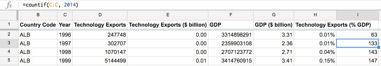

Clearly, 2015 is not a good choice if we want to see data for most countries. Which year you choose is a value judgement, but let's go with 2014, for which we have data for 133 countries, as a trade-off between recency and completeness.

Delete the formulas from column `I`, select the entire sheet by clicking on the empty cell at top left between column `A` and row `1`, then select `Data>Filter` to set up **filter** controls for the spreadsheet.

Open up the **filter** menu for column `C`, with the data for `Year`, click the `Clear` link to uncheck all the values, then scroll down and check `2014` only:


Click `OK` to see the filtered data. Select it all, then copy and paste into a new worksheet, calling the sheet `2014`. Set up a header row, and the **filtered** data should look like this:


#### Sort the sheet to answer our two questions

Our first question was:

- Which countries exported the most high-technology goods, in cash terms, in the most recent year for which we have reasonably complete data?

To answer this question, we need to **sort** the data in descending order by the values for `Technology Exports ($ billion)`. To do so, highlight all of the data in the sheet, and then select `Data>Sort range...` and fill in the dialog box as follows, making sure to select the correct column:

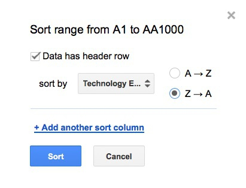

Google Sheets defines the direction of a **sort** in alphabetical terms. If you are sorting numbers or dates, remember that larger numbers, or later dates, are equivalent to letters nearer to the end of the alphabet. So to sort numbers in descending order, we need to sort from `Z → A`.

Click `Sort`, and this should be the result:


It is no big surprise to see major industrial powerhouses like China, Germany, the United States, South Korea, France, and Japan in the top ten. Remember that what we are looking at here is exports, not the total of high-tech goods manufactured in each country. High-tech goods manaufactred in the United States, for example, may be more likely to be consumed on the domestic market in the United States than in China. To verify this, you would need to seek data on high-tech industrial production, rather than exports.

This ranking, and the dollar values for 2014 techology exports, are interesting and informative. If you wish, you can copy this view of the data into a new sheet to save it for future use.

However, the raw numbers don't tell us much about how dependent each country's economy is on high-tech exports.

For that, we need to answer our second question:

- Which countries exported the most high-technology goods, as a percentage of their GDP, in this year?

That requires another **sort**, on the data in column `H`. This time we'll see how to perform a sort without highlighting the entire sheet. Click on the letter `H` to highlight that column, then select `Data>Sort sheet by column H, Z → A`.

This should be the result:


Singapore, the tiny city-state with almost no natural resources, which has for many years made high-tech industry the bedrock of its economy, heads the list. But notice that recently emerging "Asian tigers," in particular Malaysia and Vietnam, also rely heavily on high-tech exports.

If you were planning a story on high-tech international trade, these two **sorts** of the **filtered** data should provide a good springboard for further reporting.

#### Next steps

There is plently more that you can do with this data to help formulate a reporting plan.

- If you are interested in particular countries, for instance, you may want see how the data for those countries has changed from year to year.

- You may be interested in a patricular time period, such as the last decade, or since the turn of the century. Over these periods, which countries have seen the biggest percentage increase in their technology exports?

- And which countries have seen the biggest proportional growth in exports, expressed as a percentage of their GDP?

Think about how you would **filter**, **sort**, and **aggregate** the data to answer each of these these questions.


### Analyze data on the gender pay gap

Load the file `gender_pay.csv` into Google Sheets, set up a header row and resize the columns. The data should look like this:


For each `Occupation` and `Year` we have columns for the median weekly earnings for both men and women, and the esimated number of male and female workers. The occupations are also grouped by types, at three different levels (`Type1`,`Type2`,`Type3`).

#### Questions to ask of this data

Here are the questions that we will ask of this data:

- Which occupations had the highest earnings in 2015, for men and for women?

- Were there any occupations in which women earned more than men in 2015?

- For which occupations was the gender pay gap proportionately greatest?

#### Remove cells with null values

We can only calculate the gender pay gap where we have earnings data for both men and women. And as the Bureau of Labor Statistics [explains](http://www.bls.gov/cps/cpsaat39.htm) in a footnote to the data tables, nothing is shown if the estimated number of workers is less than 50,000.

So let's **filter** the data so we are considering only occupations and years for which we have data for both women and men. Select `Data>Filter` from the top menu, then use the **filter** controls to uncheck `(Blanks)` for both median weekly earnings columns: women and men.

Copy the **filtered** data into a new sheet, set up a header row and rename the sheet as `Working`. The data should look like this:

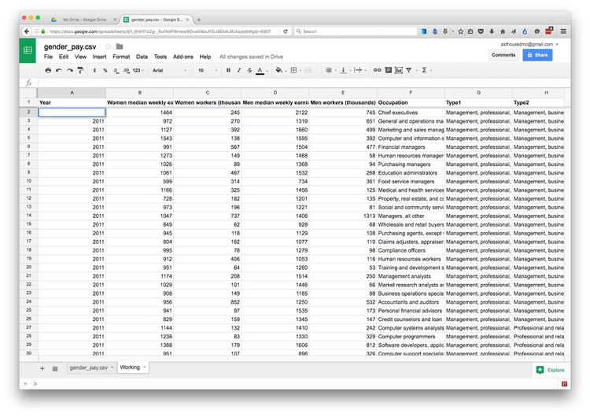


#### Calculate the gender pay gap

Give column `J` a header of `Gender pay gap (%)`, and in the first cell type this formula:

```SQL
=(D2-B2)/D2
```

This formula subtracts women's median weekly earnings from men's median weekly earnings, and then divides the result by men's median weekly earnings. That gives the gender pay gap, expressed as a decimal fraction of what men get paid.

Format this value as a percentage and `autofill` down the column. If women are paid *more* than men, the percentage will be a negative number.

The data should now look like this:

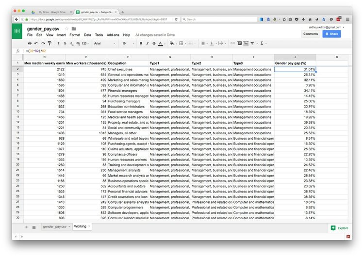


#### Filter the data to show 2015 only

Set up **filters** for this sheet and use the **filter** control for the `Year` column to select the data for `2015`: Click the `Clear` link and then check `2015` only:


Copy the **filtered** data into a new sheet, set up a header row and rename the sheet as `2015`. The data should look like this:

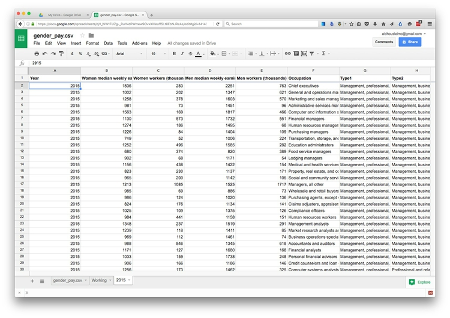

#### Sort the sheet to answer our questions

Our first question was:

- Which occupations had the highest earnings in 2015, for men and for women?

This depends on two **sorts** of the data. Select column `D`, showing men's median weekly earnings, and select `Data>Sort sheet by column D, Z → A`. This should be the result:

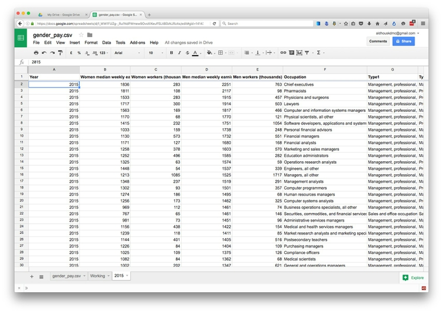

Repeat the process for column `B`, showing women's median weekly earnings:

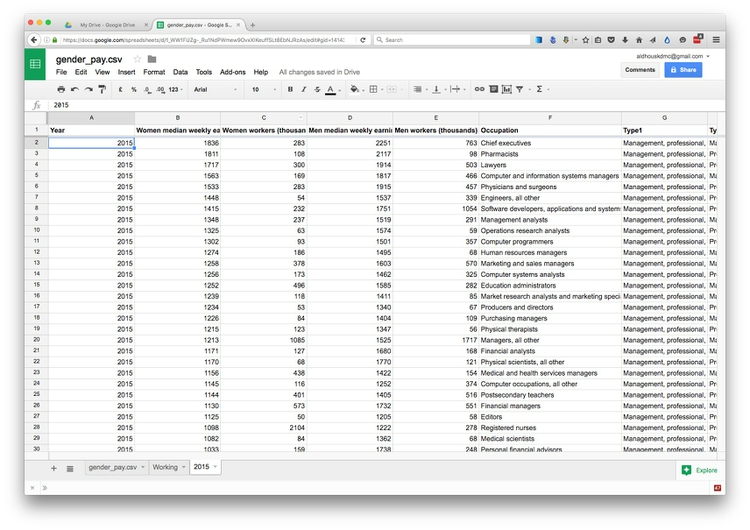

Not surprisingly, the list of top-earning occupations is fairly similar for men and for women -- although there are some differences, which may provide a starting point for further reporting.

Our second question was:

- Were there any occupations in which women earned more than men in 2015?

Remember that column `J`, containing the gender pay gap calculations, will show negative percentages if women were paid more then men. So **sort** the sheet by this column in the opposite direction, from `A → Z`:


Our last question was:

- For which occupations was the gender pay gap proportionately greatest?

To answer this question, we need to **sort** the data using the same column in the opposite direction, from `Z → A`:

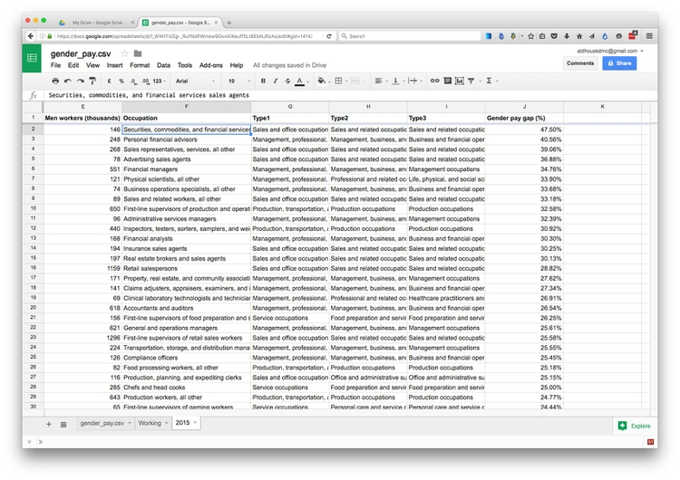

Now we have a ranking of the occupations with the biggest gender pay gap, led by `Securities, commodities, and financial services sales agents`, when the gap was `47.5%` -- meaning that women are paid 47.5% *less* than men. Putting that another way, the median earnings for women for this occupation was only slightly more than half the median earnings for men.


#### Next steps

There is plenty more that you can do with this data. For example:

- Repeat the analysis for different years.

- Which occupations have seen the greatest change in earnings from 2011 to 2015, for women and for men?

- For which occupations has the gender pay gap narrowed? For which has it widened?

- Are you interested in particular sectors, such as technology jobs? If so, you may want to restrict your analysis to those.

Again, think about how you would **filter**, **sort**, and **aggregate** the data to answer each of these questions.

==**Warning:**== This data has *not* been corrected for inflation, so if you want to run any analyses that compare earning data across different years, you will have to currect the values so that they are in a contant year's dollars!

### Analyze data on fatal and injury traffic accidents in Richmond

Load the file `richmond_collisions.xls` into Google Sheets and set up a header row. The data should look like this:

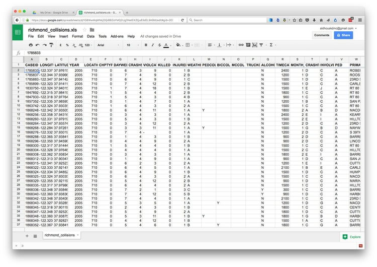


#### Questions to ask of this data

We will explore this data in more depth in Week 4, when we make charts and maps.

However, we will ask a single question of the data this week:

- How many deaths and injuries occured in each year, and for how many of these was alcohol involved?

#### Calculate the number of people killed and injured in each collision

The data contains separate columns for the number of people killed and injured in each collision. If we want a count of fatalities *and* injuries, we need to create a new variable, adding them together.

Selection column `K` with the numbers `INJURED`, right-click and select `Insert 1 right`. Call this new column `KILLED AND INJURED`, then type the following formula into the first cell and `autofill` down the column:

```SQL
=J2+K2
```

#### Make a pivot table to analyze the data by year and the involvement of alcohol

[**Pivot tables**](https://en.wikipedia.org/wiki/Pivot_table) allow you to run calculations on your data, retabulating to group the data by two variables simultaneously, and calculate an **aggregate** measure for each group. In this case, we want to know the numbers of deaths and injuries each year, calculated separately for collisions involving and not involving alcohol.

To run this analysis, select `Data>Pivot table` from the top menu. A new sheet should open:

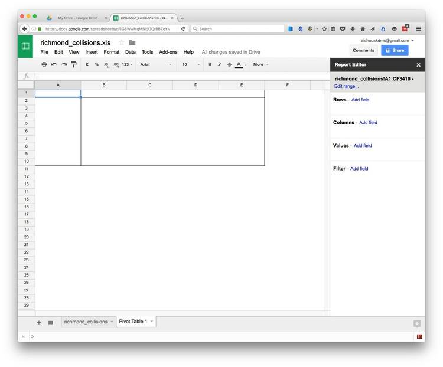

Click the `Add field` link for `Rows` and select `YEAR`. The table should now look like this:

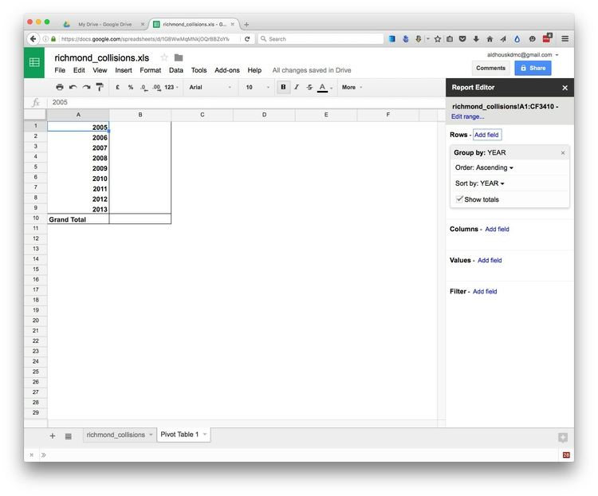

Now click the `Add field` link for `Columns` and select `ALCOHOL INVOLVED`. The table should now look like this:


Finally, click the `Add field` link for `Values` and select `KILLED AND INJURED`. Notice that by default, the pivot table has **aggregated** the data using the function `SUM`, adding the numbers together for each year, creating separate totals for collisions involving alcohol or not. This is what we want in This case, but there is also a dropdown menu to select other **aggregate** measures of the data if required.

The pivot table should now look like this:

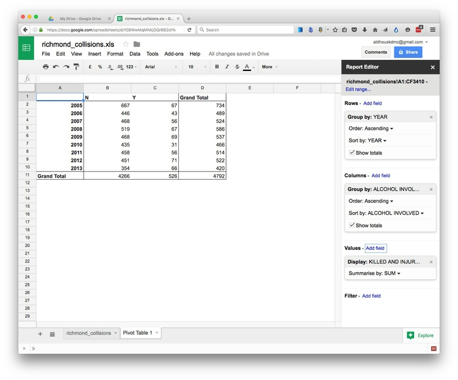

Finally, in column `E` calculate the percentage of deaths and injuries in each year in collisions that involved alcohol, typing the following formula into the first cell (and formatting the result as a percentage):

```SQL
=C2/D2
```

Copy the result down the column, and the table should look like this:


#### Next steps

The pivot table raises some questions that could help direct further reporting:

- Why was the number of deaths and injuries so high in 2005, compared to all the other years?

- And why were there so few alcohol-related deaths and injuries in 2010?

It may be that these simply represent random fluctuations in the data from year to year. Or perhaps some changes in policing, or other factors, were involved. Further reporting would be required to investigate.


### Further reading/viewing


Paul Bradshaw: [*Finding Stories in Spreadsheets*](https://leanpub.com/spreadsheetstories)
More tips and tricks for using spreadsheets in journalism.
