# Acquiring, cleaning, and formatting data

Not so many years ago, data was hard to obtain. Often data journalists would have to painstakingly compile their own datasets from paper records, or make specific requests for electronic databases using freedom of information laws.

The Internet has changed the game. While those methods may still be needed, many government databases can now be queried online, and the results of those searches downloaded. Other public datasets can be downloaded in their entirety.

For data journalists, the main problem today is usually not finding relevant data, but in working out whether it can be trusted, spotting and correcting errors and inconsistencies, and getting it in the right format for analysis and visualization.

In this class, we will cover some tips and tricks for finding the data you need online, getting it onto your computer, and how to recognize and clean “dirty” data. We will also review some common data formats, and how to convert from one to another.

### The data we will use today

Download the data for this session from [here](data/week5.zip), unzip the folder and place it on your desktop. It contains the following files:

- `oil_production.csv` Data on oil production by world region from 2000 to 2016, in thousands of barrels per day, from the [U.S. Energy Information Administration](https://www.eia.gov/beta/international/data/browser/#/?pa=0000000000000000000000000000000000g&c=ruvvvvvfvtvnvv1urvvvvfvvvvvvfvvvou20evvvvvvvvvnvvuvo&ct=0&tl_id=5-A&vs=INTL.53-1-AFG-TBPD.A&vo=0&v=H&start=1980&end=2016).

- `ucb_stanford_2014.csv` Data on federal government grants to UC Berkeley and Stanford University in 2014, downloaded from [USASpending.gov](https://www.usaspending.gov/Pages/Default.aspx).

- `ny.txt` file scraped from State of New York site documenting disciplinary actions against doctors.

- `NY.html` web page with a table giving links to pages documenting individual disciplinary actions against New York doctors.


### Data portals

Life is much easier if you can find everything you need in one place. The main effort to centralize access to data by the U.S. federal government is [Data.gov](http://www.data.gov/). You can search for data from the home page, or follow the [Data](http://catalog.data.gov/dataset) and Topics links from the top menu.

Be warned, however, that Data.gov is a work in progress, and does not contain all of the U.S. government’s data. Some of the most useful datasets are still only available on the websites of individual federal agencies. [FedStats](http://fedstats.sites.usa.gov/) has [links to agencies](http://fedstats.sites.usa.gov/agencies/) with with data collections.

It is worth familiarizing yourself with the main government agencies that have responsibility for the beats you are interested in, and the datasets they maintain.

Here are some examples of agencies with useful data:

- **[U.S. Census Bureau](http://www.census.gov/)**: population, demographic, economic and other data, including trade and manufacturing statistics. The [American FactFinder](http://factfinder2.census.gov/faces/nav/jsf/pages/index.xhtml) is especially useful for summary data about specific geographical areas. As well as running the decadal national census, the bureau operates other surveys, which provide more detailed information from representative samples of the U.S. population, including the [Current Population Survey](https://www.census.gov/programs-surveys/cps.html) (run jointly with the Bureau of Labor Statistics, see below) and the [American Community Survey](https://www.census.gov/programs-surveys/acs/).

- **[Bureau of Labor Statistics](http://www.bls.gov/)**: employment and unemployment, workplace injuries, time use, pay and consumer spending, including the [Consumer Price Index](http://www.bls.gov/cpi/), a key measure of inflation. Browse its datasets [here](http://www.bls.gov/data/).

- [**Bureau of Justice Statistics**](http://www.bjs.gov/): crime and law enforcement. [Here](http://www.bjs.gov/index.cfm?ty=dca) is its full list of data collections. The [National Crime Victimization Survey](http://www.bjs.gov/index.cfm?ty=dcdetail&iid=245) is an especially useful resource, which together with the Federal Bureau of Investigation's [Uniform Crime Reporting](http://www.fbi.gov/stats-services/crimestats) program provides the best national data on crime.

- **[Centers for Disease Control and Prevention](http://www.cdc.gov/)**: The [WONDER](http://wonder.cdc.gov/) online databases provide a wealth of information, including on causes of death. Other health datasets are available through the CDC's [National Center for Health Statistics](http://www.cdc.gov/nchs/).

- **[National Oceanic and Atmospheric Administration](http://www.noaa.gov/)**: [climate](http://www.climate.gov/maps-data) and [weather](http://www.weather.gov/), including [forecasts](http://www.nws.noaa.gov/ndfd/), and historical records of [hurricanes](http://www.aoml.noaa.gov/hrd/hurdat/Data_Storm.html) and other newsworthy [severe weather](http://www.spc.noaa.gov/gis/svrgis/) events.

Other data portals at various levels of government are emerging. The City and County of San Francisco, for example, was at the forefront of the Open Data movement, establishing [DataSF](https://data.sfgov.org/) in 2009.

If you need to make comparisons between nations, the [**World Bank**](http://www.worldbank.org/) probably has what you need. Its [World Development Indicators catalog](http://data.worldbank.org/indicator/?tab=all) contains data for more than 7,000 different measures, compiled by the bank and other UN agencies.

You can navigate the site using the search box or using the topics links to the right. When you click on a particular indicator, you are sent to a page that gives options to download the dataset from a link near the top right of the page. The data in some cases goes back as far as 1960, and is listed both by individual country and summarized by regions and income groups.

Other useful sources of data for international comparisons are [**Gapminder**](http://www.gapminder.org/data/) and the **[UN Statistical Division](http://unstats.un.org/unsd/default.htm)**. For health data in particular, try the **[Organisation for Economic Co-operation and Development](http://www.oecd.org/els/health-systems/health-data.htm)** and the **[World Health Organization](http://www.who.int/gho/en/)**.

### Search for data on the web

Often, your starting point in searching for data and documents will be Google. It can be worth focusing your queries using Google’s [advanced search](http://www.google.com/advanced_search):

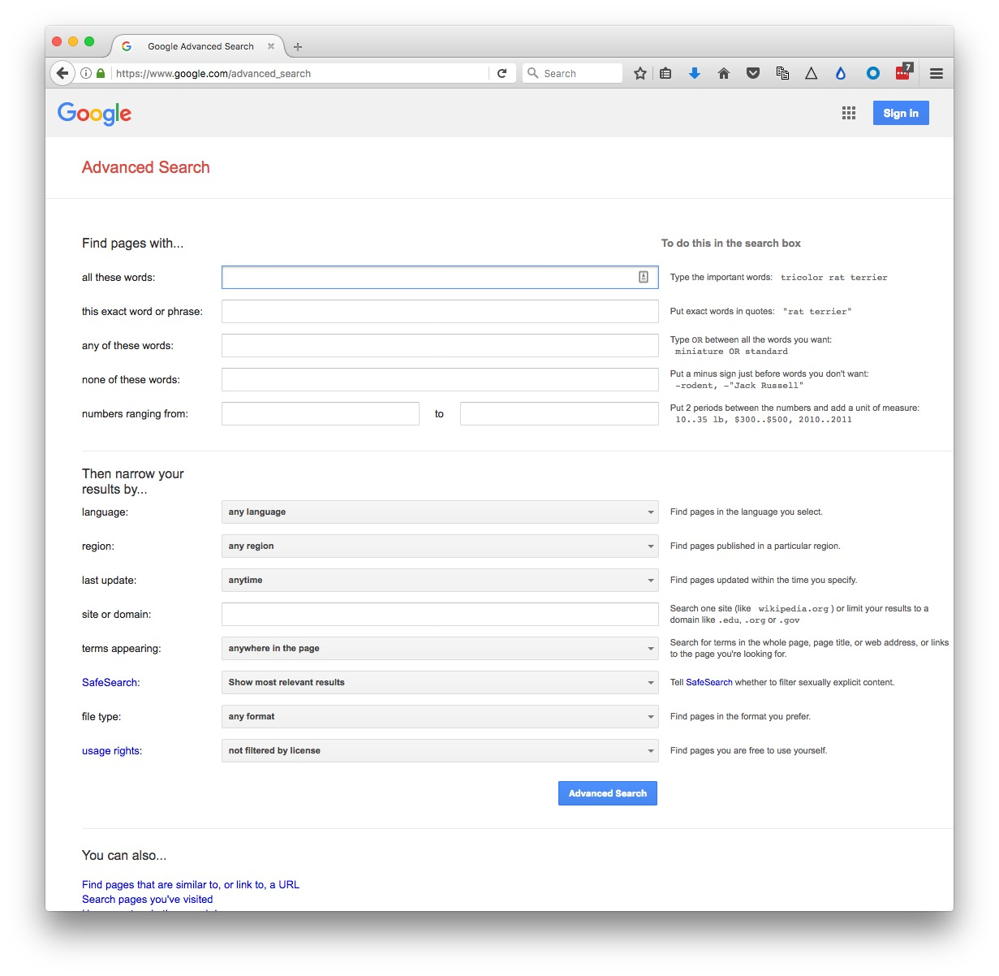

(Source: [Google](http://www.google.com/advanced_search))

The options to search by `site or domain` and `file type` can be especially useful when looking for data. For example, the [U.S. Geological Survey](http://www.usgs.gov/) is the best source of data on earthquakes and seismic risk, so when searching for this information, specifying the domain `usgs.gov` would be a good idea. You can make the domains as narrow or broad as you like: `.edu`, for instance, would search the sites of all US academic institutions using that top-level domain; `berkeley.edu` would search the web pages of this university only.

The file type search offers a drop-down menu, with the options including Excel spreadsheets, and Google Earth `KML` and `KMZ` files. These are common data formats, but you are not limited to those on the menu. In a regular Google search, type a space after your search terms followed by `filetype:xxx`, where `xxx` is the suffix for the file type in question. For example, `dbf` will look for database tables in this format. Combining file type and domain searches can be a good way to find data an agency has posted online -- some of which may not otherwise be readily accessible.

Searching for PDFs and `PPT` presentations can be a good way to find documents that may not otherwise be easy to find.

### Search online databases

Many important public databases can be searched online, and some offer options to download the results of your queries. Most of these databases give a simple search box, but it’s always worth looking for the advanced search page, which will offer more options to customize your search. Here, for example, is the [advanced search](https://clinicaltrials.gov/ct2/search/advanced) page for [ClinicalTrials.gov](https://clinicaltrials.gov/):

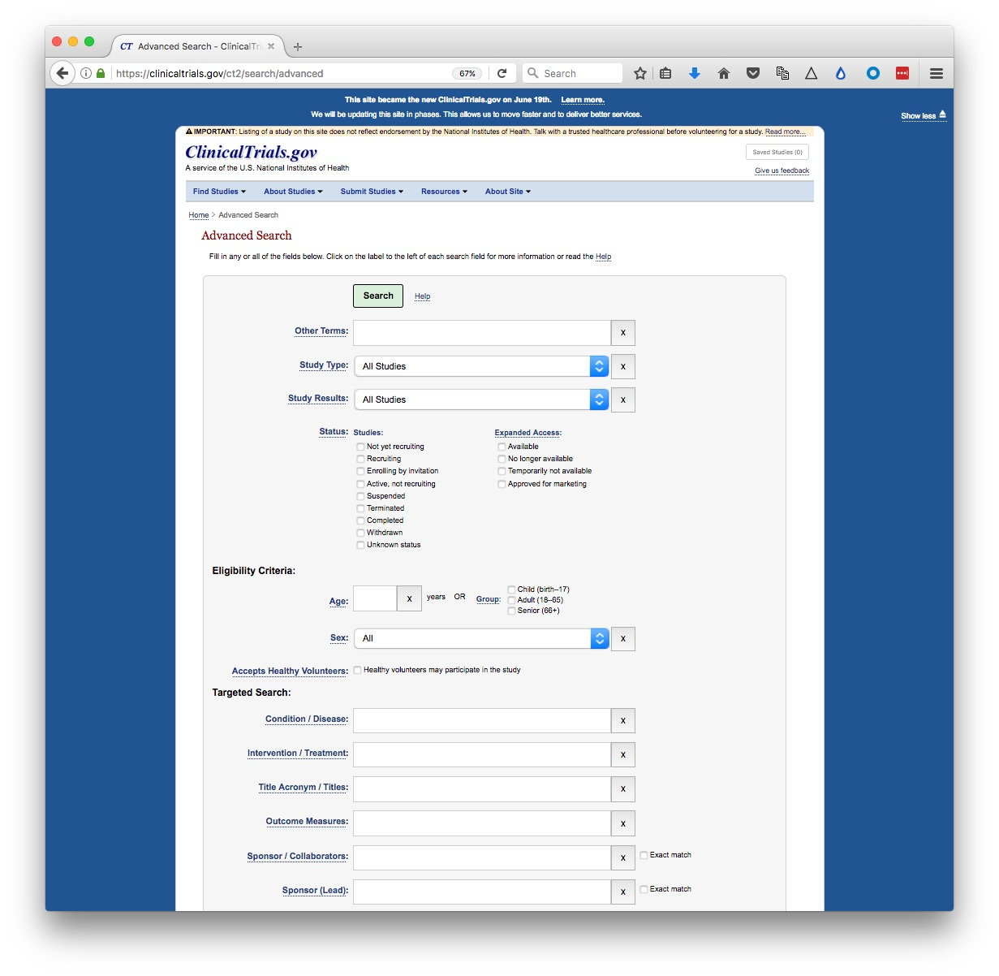

(Source: [ClinicalTrials.gov](https://clinicaltrials.gov/ct2/search/advanced))

When you start working with a new online database, take some time to familiarize yourself with how its searches work: Read the Help or FAQs, and then run test searches to see what results you obtain. [Here](https://clinicaltrials.gov/ct2/help/how-find/index), for example, is the "How To" section of ClinicalTrials.gov.

Many online databases can be searched using Boolean logic, using the operators `AND`, `OR` and `NOT` to link search terms together. So find out how a particular database uses Boolean logic -- and the default settings that it will use if you list search terms without any Boolean operators.

Putting search terms in quote marks often searches for a specific phrase. For example, searching for “heart attack” on ClinicalTrials.gov will give only give results in which those two words appear together; leaving out the quote marks will include any trial in which both words appear.

Also find out whether the database allows “wildcards,” symbols such as `*` or `%` that can be dropped into your search to obtain results with variations on a word or number.

### Look for download options -- and know when you are hitting the wall

Having run a search on an online database, you will usually want to download the results, so look for the download links or buttons.

A common problem with online databases, however, is that they may impose limits on the number of results that are returned on each search. And even when a search returns everything, there may be a limit on how many of those results can be downloaded to your own computer.

If broad searches on a database keep returning the same number of results, that is a sign that you are probably running up against a search limit, and any download will not contain the complete set of data that you are interested in. However, you may be able to work out ways of searching to obtain all of the data in chunks.

### Download the entire database

Downloading an entire database, where this is allowed, frees you from the often-limited options given on an online advanced search form: You can then upload the data into your own database software, and query it in any way that you want. We will learn how to do this next week.

So always look for ways to grab all of the data. One trick is to run a search on just the database’s wildcard character, or with the query boxes left blank. If you do the latter at ClinicalTrials.gov, for instance, your search will return all of the trials in the database, which can then be downloaded using the options at the bottom of the results page.

Other databases have an online search form, but also have a separate link from where data to be downloaded in its entirety, usually as a text file or series of text files. One example is Bioresearch Monitoring Information System, which lists doctors and other researchers involved in testing experimental drugs being considered for marketing approval by the Food and Drug Administration. It can be searched online [here](https://www.accessdata.fda.gov/scripts/cder/BMIS/index.cfm?fuseaction=Search.ShowAdvancedSearchForm), but can also be downloaded in full from [here](https://www.fda.gov/Drugs/InformationOnDrugs/ucm135162.htm).


### Automate downloads of multiple data files

Often data or documents don't reside in a single searchable database, but instead exist online as a series of separate files. In such cases, clicking on each link is tedious and time-consuming. But you can automate the process using the [DownThemAll!](https://addons.mozilla.org/en-US/firefox/addon/downthemall/) Firefox add-on.

To illustrate, go to [Gapminder's data catalog](http://www.gapminder.org/data/), and select `All` indicators. The webpage now includes links to more than 500 downloadable spreadsheets. Right-click and select `DownThemAll!`.

At the dialog box, you can choose where to save the files, and to filter the links to select just the files you want. There are check boxes to download documents or images, and so on. In this case, all the spreadsheet downloads contain the text `xls`, defining the format of the download from Google Sheets, so `Fast Filtering` using the term `xls` will correctly identify these downloads:


### Extract data from tables on the web

On other occasions, data may exist in tables on the web. Copying and pasting data from web tables can be tricky, but the [Table2Clipboard](https://addons.mozilla.org/en-US/firefox/addon/dafizilla-table2clipboard/) Firefox add-on can simplify the process.

Before using the add-on, select `Tools>Table2Clipboard` and choose the following options under the `CSV` tab:

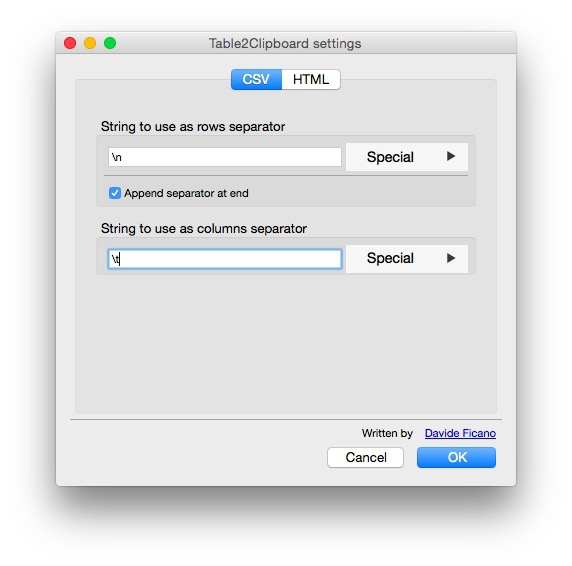

This will ensure that each row in the extracted data is put on a `new line`, and each column is separated by a `tab`.

To illustrate what Table2Clipboard does, go to the Women's Tennis Association [singles rankings page](http://www.wtatennis.com/rankings), right-click anywhere in the table and select `Table2Clipboard>Copy whole table`:

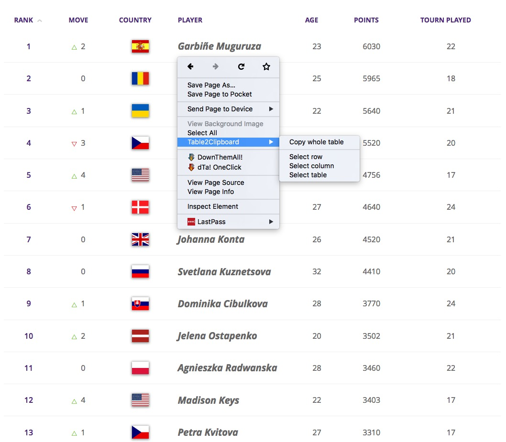

You can now paste the data into an empty text file, or into a spreadsheet. (This data particular will also come throgh with a first line containing the date the table was updated, and a list of countries.)


### Manipulate urls to expose the data you need

As you search for data using web query forms, make a habit of looking at what happens to the url. Often it will contain patterns detailing the search you have run, and it will be possible to alter the data provided by manipulating the url. This can be quicker than filling in search forms. In some cases it may even reveal more data than default search options will allow.

To illustrate how this works, go to the [ISRCTN clinical tral registry](https://www.isrctn.com/), and then navigate to the [advanced search page](https://www.isrctn.com/editAdvancedSearch). Enter `cancer` under `Condition` and note that more than 2,000 trials are returned.

The url should now have changed to the following:

```Javascript
https://www.isrctn.com/search?q=&filters=condition%3Acancer&searchType=advanced-search
```
Notice that the default is to display 10 results per page, and then change the view to see the maximum of 100 trials allowed by the dropdown menu. The url should now read:

```Javascript
https://www.isrctn.com/search?pageSize=100&sort=&page=1&q=&filters=condition%3Acancer&searchType=advanced-search
```
Now change that url to:

```Javascript
https://www.isrctn.com/search?pageSize=3000&sort=&page=1&q=&filters=condition%3Acancer&searchType=advanced-search
```
Having done so, all of the registered clinical trials involving cancer should now be displayed on a single page. We could now use DownThemAll! to download all of the individual web pages describing each of these trials, or we could use this url as the starting point to scrape data from each of those pages.


### Use application programming interfaces (APIs)

Websites like the ISRCTN clinical trial registry are not expressly designed to be searched by manipulating their urls, but some organizations make their data available through APIs that can be queried by constructing a url in a similar way. This allows websites and apps to call in specific chunks of data as required, and work with it "on the fly."

To see how this works, go to the U.S. Geological Survey's [Search Earthquake Archives](https://earthquake.usgs.gov/earthquakes/search/) page, where we will search for all earthquakes with a [magnitude](http://www.geo.mtu.edu/UPSeis/magnitude.html) of 5 or greater that occured witin 6,000 kilometers of the geographic center of the contiguous United States, which [this site](https://tools.wmflabs.org/geohack/geohack.php?pagename=Geographic_center_of_the_contiguous_United_States&params=39.828175_N_98.579500_W_region:US_type:landmark) tells us lies at a latitude of `39.828175` degrees and a longitude of `-98.5795` degrees. We will initially ask for the data in a format called [GeoJSON](https://geojson.org/) (a variant of JSON, a common format used to trasmit data over the web). Enter `1960-01-01T00:00:00` under `Start` for `Date & Time` boxes so that we obtain all recorded earthquakes from the beginning of 1960 onward. The search form should look like this:


(Source: [U.S. Geological Survey](https://earthquake.usgs.gov/earthquakes/search/))

You should recieve a quantity of data at the following url:

```Javascript
https://earthquake.usgs.gov/fdsnws/event/1/query?starttime=1960-01-01T00:00:00&latitude=39.828175&longitude=-98.5795&maxradiuskm=6000&minmagnitude=5&format=geojson&orderby=time
```

See what happens if you append `-asc` to the end of that url: This should sort the the earthquakes from oldest to newest, rather than the default of newest to oldest. [Here](https://earthquake.usgs.gov/fdsnws/event/1/) is the full documentation for querying the earthquake API by manipulating these urls,

Now remove the `-asc` and replace `geojson` in the url with `csv`. The data should now download in 	CSV format.

### Scrape data from the web

Sometimes you will need to compile your own data from information that is spread across a series of webpages, or maintained in a database that doesn't allow simple downloads of the data or API access. This is where web scraping comes in.

Using programming languages such as [R](https://www.r-project.org/) or [Python](https://www.python.org/), it is possible to write scripts that will pull data down from many webpages, or query web search forms to download an entire database piece by piece.

Web scraping by coding is beyond the scope of this class. However, the underlying process is simple to understand: Identify the patterns you would need to follow if collecting the data manually, then write a program to automate the process and write the results to a data file. That often means experimenting to reveal the most efficient way of exposing all of the data you require.

We have already been performing some of the elements of web scraping, by manipulating urls on web search forms and downloading the individual links *en masse*.

There are a number of tools that allow non-programmers to scrape data from the web. These include the web-based [Import.io](https://import.io/). In this class, we will use [**OutWit Hub**](https://www.outwit.com/). You can use the free version to see its capabilities. A license to the full Pro cost $89 at the time of writing, so is [considerably cheaper](https://www.import.io/standard-plans/) than an Import.io account.

To demonstrate webscraping, we will download data on disciplinary actions against doctors in the state of New York.

Navigate to [this page](https://apps.health.ny.gov/pubdoh/professionals/doctors/conduct/factions/AllRecordsAction.action?d-49653-p=1), which is the start of the list. Then click on the `Next` link, and see that the url changes to the following:

```Javascript
https://apps.health.ny.gov/pubdoh/professionals/doctors/conduct/factions/AllRecordsAction.action?d-49653-p=2
```

Experiment with changing the number at the end of the link until you find the end of the list. As of writing, there were 384 pages in the database.

```Javascript
https://apps.health.ny.gov/pubdoh/professionals/doctors/conduct/factions/AllRecordsAction.action?d-49653-p=384
```

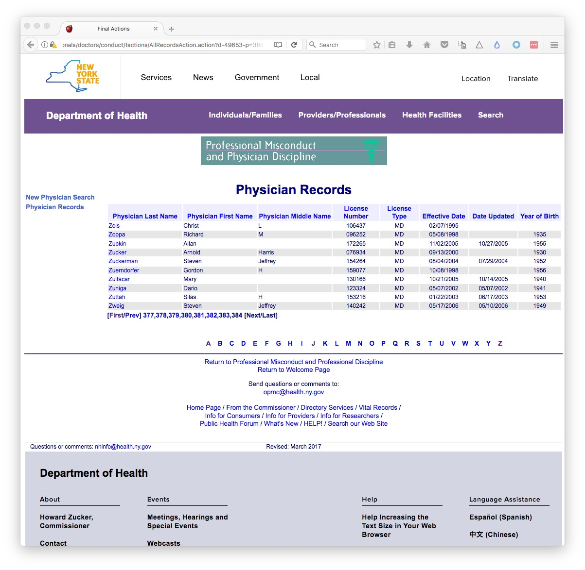

Click on the link for the last doctor's name, and notice that data on each disciplinary action, plus a link to the official documentation as a PDF, are on separate web pages. So we need to cycle through all of these pages to grab data on every disciplinary action.

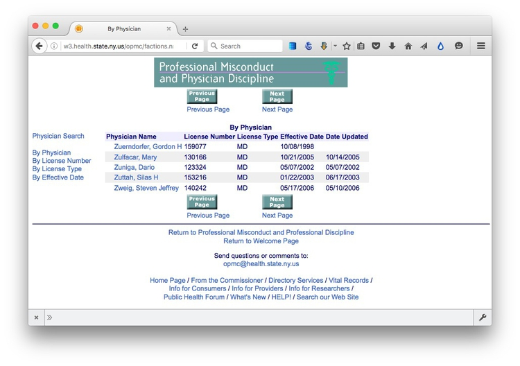

These disciplinary action pages have urls of the following form:

```Javascript
https://apps.health.ny.gov/pubdoh/professionals/doctors/conduct/factions/PhysicianDetailsAction.action?finalActionId=6450
```

The first step is to cycle through the entire list, scraping all of the urls for the individual pages. Then we need to set up a second scraper to grab the information from each of the individual disciplinary action pages, using this list of urls.

Outwit Hub can usually recognize a when a website is a paginated list, and can automatically follow "next page" links.

To scrape the list of urls, navigate in Outwit Hub to the first page in the list of disciplinary actions:

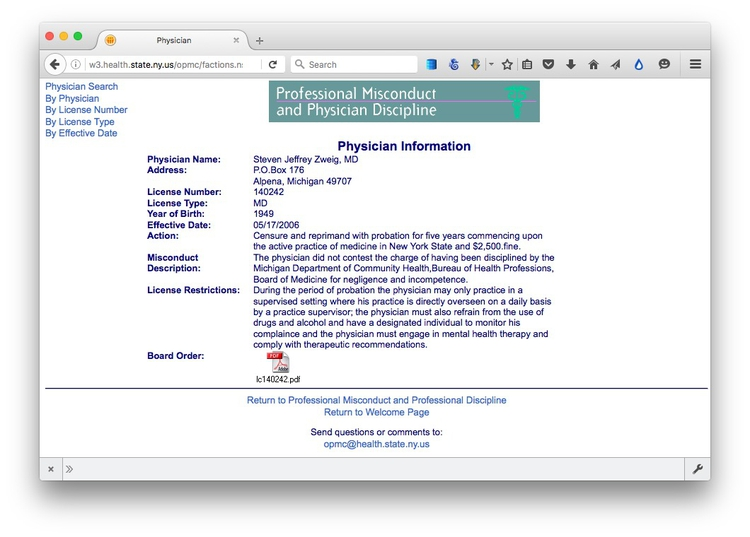

Now select `automators>scrapers` from the panel at left:

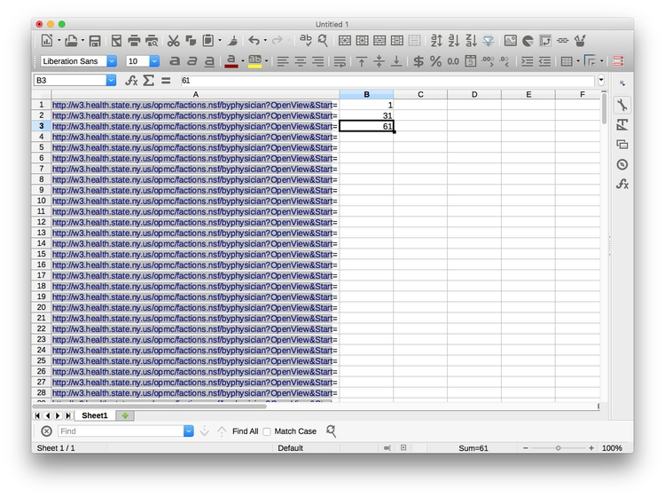

Notice that this exposes the HTML code for the page.

Click the `New` button at the bottom, and give the scraper an appropriate name, such as `NY doctor discipline IDs`, and click `OK`. You will now see a screen that allows you to extract data/text from the page, according to markers in the HTML code before and after the target.

Scroll through the HTML, and highlight this section of code, which appears before the Action ID number in the link to each disciplinary page.

```Javascript
finalActionId="
```
In the row numbered `1` in the instructions for your scraper, enter `Action ID` under `Description` and that HTML code under `Marker Before`:

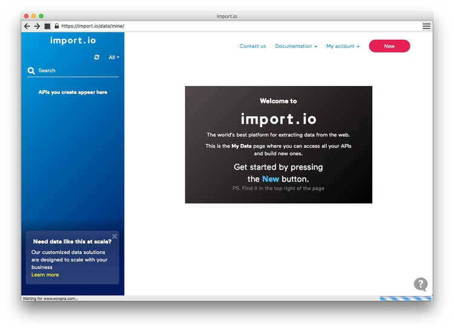

After each url the link closes with the following:

```Javascript
">
```

So copy that under `Marker After` and your scraper is ready to run:

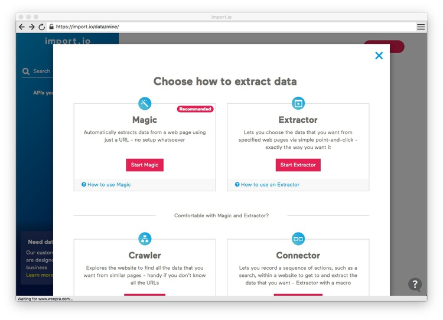

Click `Save` and then `Execute` and you should see a screen like this under `data>scraped`, which has captured the 20 links on the page:

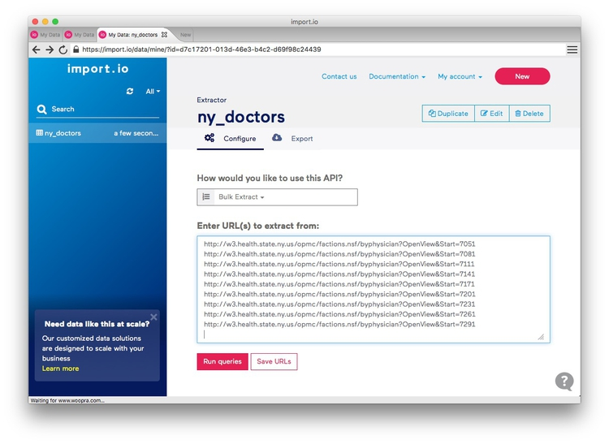

Now set the two buttons with drop down menus at bottom right to `Catch on Demand` and `Empty on Demand`. This ensures that the scraped data is appended into a single file for export at the end.

Having completed the set-up, click this control button at the top, which should automatically follow the "next page" links and scrape the IDs from each page in sequence:

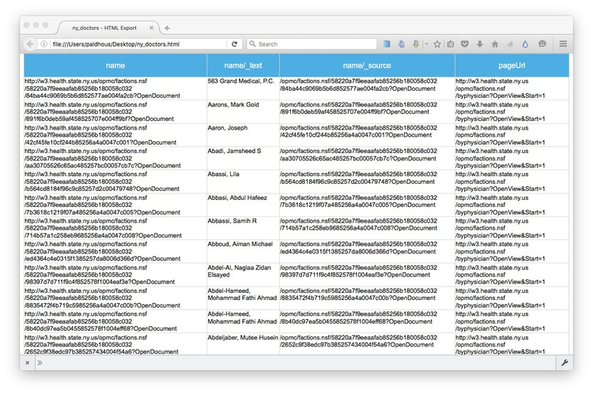

Running the full scraper will take some time. When it is complete, notice that the right-hand export panel under `data>scraped` has a series of dropdown menus, including `CSV`, `TXT`, `SQLite` and `Excel`. We will export as `TXT`, giving a list in a single text file.

One you are sure that the text file has saved correctly, click the `Empty` button under `data>scraped` to clear the results of the scrape.

In an empty Google sheet, import the file `ny.txt`, delete the header ro and all of the entries from `B`. Then copy the stem for the urls into cell `A1`:

```Javascript
https://apps.health.ny.gov/pubdoh/professionals/doctors/conduct/factions/PhysicianDetailsAction.action?finalActionId=
```
Hover over the bottom right corner of this cell, until the cursor turns into a cross, then double-click to autofill down the entire column.

Now enter the following into cell `C1`:

```Javascript
=CONCATENATE(A1,B1)
```
This will append the two together to create the full url. Again use autofill to copy the formula down the column and create the urls for each of the disciplinary actions.

Now save the spreadsheet as an HTML file (using `File>Download as>Web page (.html, zipped)`).

We will use this file to direct our second scraper, which we now need to set up.

In Outwit Hub, navigate to one of the displinary action pages and select `automators>scrapers`. Click `New` and give the scraper an appropriate name, such as `NY doctor disciplinary actions`.

Most of the data we want to extract follows the heading, a colon, and some HTML code, for example:

```Javascript
Physician Last Name:</font></b></td><td width="70%"><p><font size="2">
```
These entries are each followed by this HTML code:

```Javascript
</font>
```

The ID for the PDF of the board order is at an link preceded in the HTML code by:

```Javascript
filename=
```

The link is followed by:

```Javascript
&amp;fileSeqNum=1
```

So set the scraper up like this:

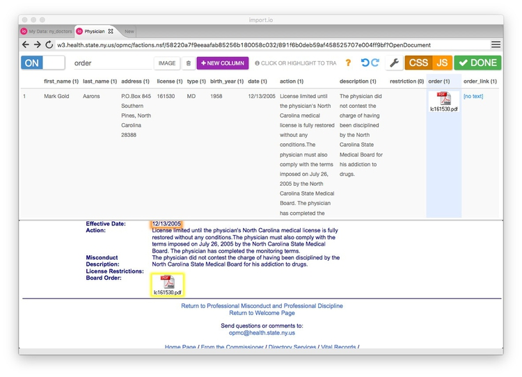

Click `Save`, then switch to `data>tables`. From the top menu in Outwit Hub, select `File>Open ...` and open the HTML file with the urls.

The urls should be in third column of the table, named `Url`. Select the first, then `⌘-A` (Mac) or `Crtl-A` (Windows) to select all the urls in the column:

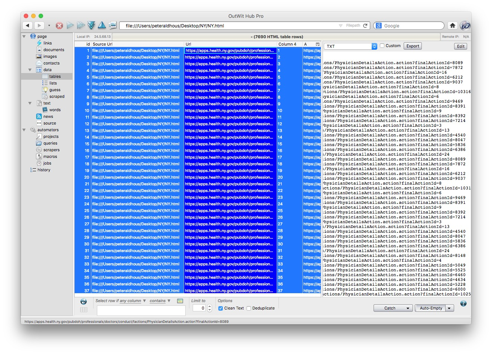

Again, set the two buttons with drop down menus at bottom right to `Catch on Demand` and `Empty on Demand`.

Now right-click, and select `Auto-Explore Pages>Fast Scrape>` and the scraper we just set up:

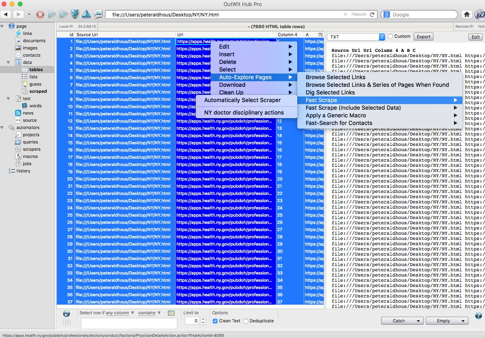

The scraper should now start to run:


The full scrape will again take some time to run. When it is completed, export the data as a `TXT` file and an `Excel` spreadsheet.


### PDFs: the bane of data journalism

Some organizations persist in making data available as PDFs, rather than text files, spreadsheets or databases. This makes the data hard to extract. While you should always ask for data in a more friendly format -- ideally a CSV or other simple text file -- as a data journalist you are at some point likely to find yourself needing to pull data out of a PDF.

For digital PDFs, **[Tabula](http://tabula.technology/)** is a useful data extraction tool -- however it will not work with PDFs created by scanning the original document, which have to be interpreted using Optical Character Recognition (OCR) software.

Also useful is the online service **[Cometdocs](http://www.cometdocs.com/)**. While it is a commercial tool, members of Investigative Reporters and Editors can [obtain a free account](http://ire.org/blog/ire-news/2013/05/22/ire-announces-partnership-cometdocs/). Cometdocs can read scanned PDFs, however its accuracy will vary depending on how well the OCR works on the document in question.

**[Adobe Acrobat Pro](https://acrobat.adobe.com/us/en/products/acrobat-pro.html)** will also perform OCR on scanned PDFs.

[Here](https://github.com/jsfenfen/parsing-prickly-pdfs) is a useful set of resources detailing more advanced tools for dealing with hard-to-parse PDFs.

### Can I trust this data?

Having identified a possible source of data for your project, you need to ask: Is it reliable, accurate and useful? If you rush into analysis or visualization without considering this question, your hard work may be undermined by the maxim: “Garbage In, Garbage Out.”

The best rule of thumb in determining the reliability of a dataset is find out whether it has been used for analysis before, and by whom. If a dataset was put together for an academic study, or is actively curated so it can be made available for experts to analyze, you can be reasonably confident that it is as complete and accurate as it can be -- the U.S. Geological Survey's earthquake data is a good example.

While in general you might be more trusting of data downloaded from a `.gov` or `.edu` domain than something found elsewhere on the web, don’t simply assume that it is reliable and accurate. Be especially wary of databases that are compiled from forms submitted to government agencies, such as the Bioresearch Monitoring Information System (BMIS) database mentioned earlier.

Government agencies may be required by law to maintain databases such as BMIS, but that doesn’t mean that the information contained in them is wholly reliable. First, forms may not always be submitted, making the data incomplete. Second, information may be entered by hand from the forms into the database -- and not surprisingly, mistakes are made.

So before using any dataset, do some background research to find out how it was put together, and whether it has been rigorously checked for errors. If possible, try to speak to the people responsible for managing the database, and any academics or other analysts who have used the data. They will be your best guide to a dataset’s strengths and weaknesses.

Even for well-curated data, make a point of speaking with experts who compile it or use it, and ask them about the data's quirks and limitations. From talking with experts on hurricanes, for example, I know not to place too much trust in data on North Atlantic storms prior to about 1990, before satellite monitoring was well developed -- even though the data available from NOAA goes back to 1851.

Always ask probing questions of a dataset before putting your trust in it. Is this data complete? Is it up-to-date? If it comes from a survey, was it based on a representative sample of people who are relevant to your project? Remember that the first dataset you find online may not be the most relevant or reliable.

### Recognize dirty data

In an ideal world, every dataset we find would have been lovingly curated, allowing us to start analyzing and visualizing without worrying about its accuracy.

In practice, however, often the best available data has some flaws, which may need to be corrected as far as is possible. So before starting to work with a new dataset, load it into a spreadsheet or database and take a look for common errors. Here, for example, is a sample of records from the BMIS database, with names including non-alphabetical characters -- which are clearly errors:


(Source: Peter Aldhous, from [Bioresearch Information Monitoring System](https://www.fda.gov/Drugs/InformationOnDrugs/ucm135162.htm) data)

Look for glitches in the alignment of columns, which may cause data to appear in the wrong field.

For people’s names, look for variations in spelling, format, initials and accents, which may cause the same person to appear in multiple guises. Similar glitches may affect addresses, and any other information entered as text.

Some fields offer some obvious checks: if you see a zip code with less than 5 digits, for instance, you know it must be wrong.

Dates can also be entered incorrectly, so it’s worth scanning for those that fall outside the timeframe that should be covered by the data.

Also scan numbers in fields that represent continuous variables for any obvious outliers. These values are worth checking out. Are they correct, or did someone misplace a decimal point or enter a number in the wrong units?

Other common problems are white spaces before and after some entries, which may need to be stripped out.

At all stages of your work, pay attention to zeros. Is each one actually supposed to represent zero, or should the cell in fact be empty, or "null"? Take particular care when exporting data from one software tool and importing to another, and check how nulls have been handled.

### Clean and process data with Open Refine

Checking and cleaning "dirty" data, and processing data into the format you need, can be the most labor intensive part of many data journalism projects. However, **[Open Refine](http://openrefine.org/)** (formerly Google Refine) can streamline the task -- and also create a reproducible script to quickly repeat the process on data that must be cleaned and processed in the same way.

When you launch Open Refine, it opens in your web browser. However, any data you load into the program will remain on your computer -- it does not get posted online.

The opening screen should look like this:

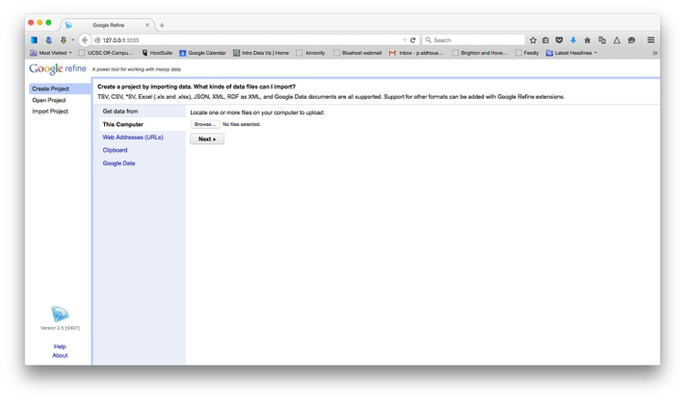

#### Reshape data from wide to long format

Click the `Choose Files` button and navigate to the file `oil_production.csv`. Click `Next>>`, and at the next screen make sure `Parse cell text into numbers, dates,...` is checked:

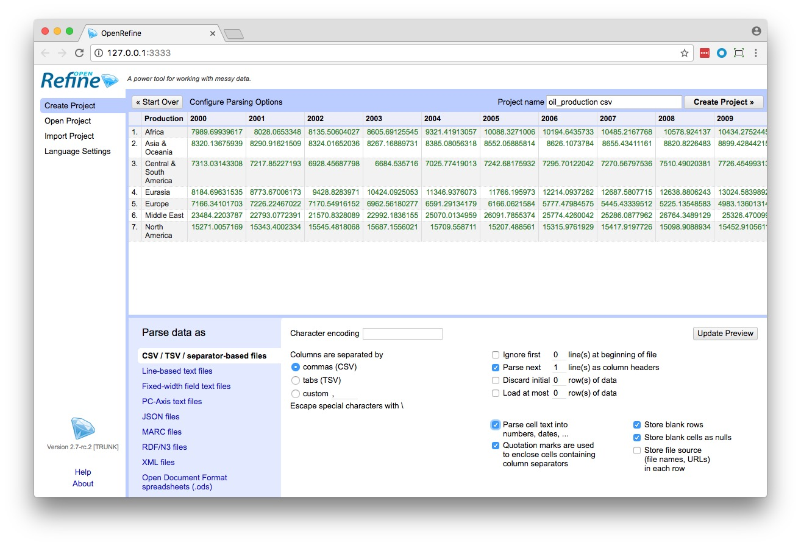

Open Refine diplays numbers and dates in green, and text entires in black. SO checking this button should make the numbers turn green. Open Refine should also recognize that the data is in a CSV file, but if not you can use the panel at bottom to specify the correct file type and format for the data.

When you are satisfied that the data has been read correctly, click the `Create Project >>` button at top right. The screen should now look like this:

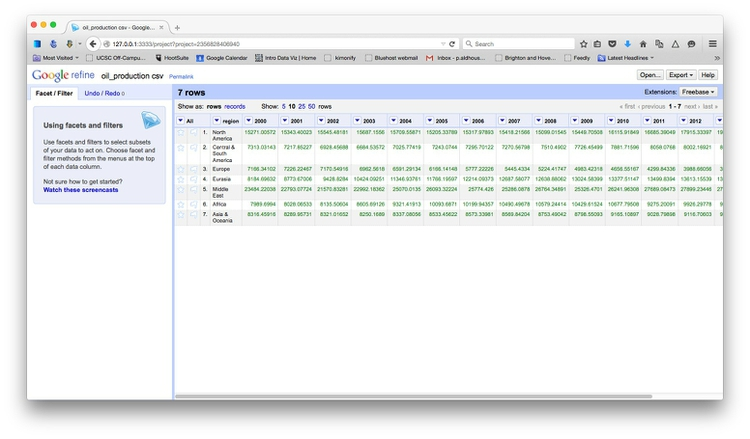

As you can see, the data is in wide format, with values for oil production by region organized in columns, one for each year. To convert this to long format, click on the small downward-pointing triangle for the first of these year columns, and select `Transpose>Transpose cells across columns into rows`.

Fill in the dialog box as below, making sure that `From Column` and `To Column` are highlighted correctly, that the `Key column` and `Value column` have been given appropriate names, and that `Fill down in other columns` is checked. (Failing to do check this box will mean that the region names each will only appear once in the reshaped data, rather than being copied down to appear next to the corresponding data for year and oil production.)

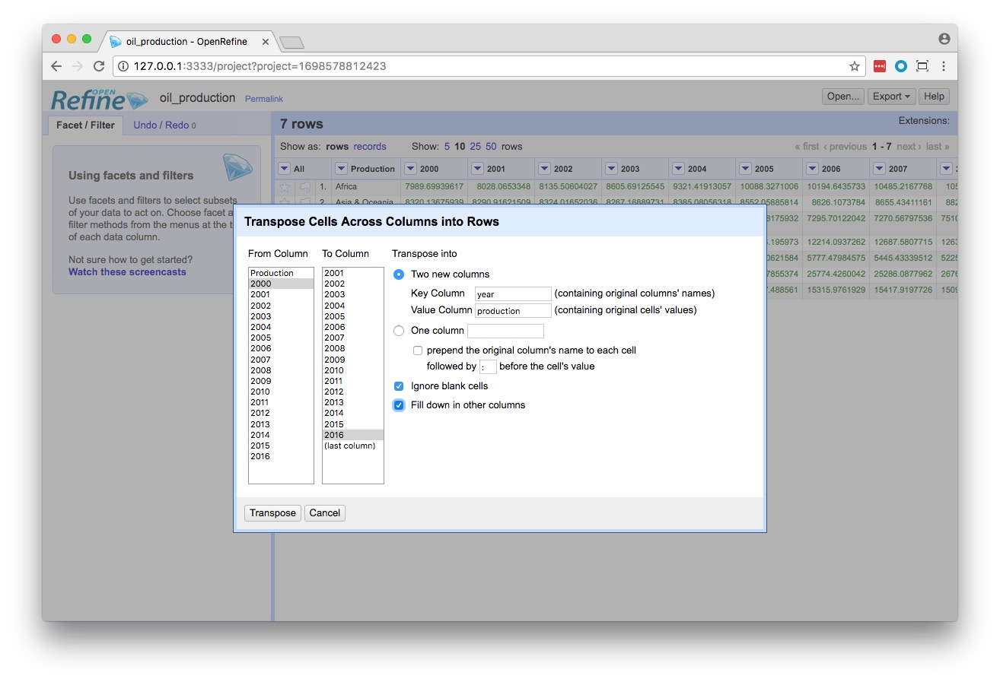

Click `Transpose` and then the `50` rows link, to see the first 50 rows of the reshaped data:

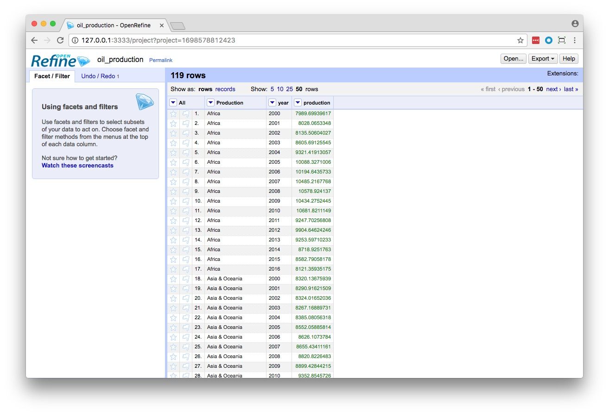

Click the `Export` button at top right and you will see options to export the data in a variety of file types, including `Comma-separated value` and `Excel` spreadsheet.

#### Clean and process dirty data

Click the Open Refine logo at top left to return to the opening screen. Create a new project from the file `ucb_stanford_2014.csv`.

Again, each field/column has a button with a downward-pointing triangle. Click on these buttons and you get the option to create “facets” for the column, which provide a powerful way to edit and clean data.

Click on the button for the field `Recipent City`, and select `Facet>Text facet`. A summary of the various entries now appears in the panel to the left:


The numbers next to each entry show how many records there are for each value.

We can edit entries individually: Select `Veterans Bureau Hospi`, which is clearly not a city, click on the `Edit` link, change it to `Unknown`. (If cleaning this data for a real project, we would need to check with an external source to get the actual city for this entry.)

Another problem is that we have a mixture of cases, with some entries in Title or Proper Case, some in UPPERCASE. We can fix this back in the field itself. Click its button again and select `Edit cells>common transforms>To titlecase`.

Now notice that we apparently have duplicate entries for `Berkeley`, `Palo Alto` and `Stanford`. This is the result of trailing white space after the city names for some entries. Select `Edit cells>common transforms>Trim leading and trailing whitespace` and notice how the problem resolves:


Having cleaned this field, close the facet by clicking the cross at top left.

Now create a text facet for the field `Recipient`:


What a mess! The only possibilities are Stanford or Berkeley, yet there are multiple variants of each, many including `Board of Trustees` for Stanford and `Regents of` for UC Berkeley.

First, manually edit `Interuniveristy Center for Japanese Language` to `Stanford`, which is where this center is based.

We could contrinute editing manually, but to illustrate Open Refine's editing functions click on the `Cluster` button. Here you can experiment with different clustering algorithms to edit entries that may be variants of the same thing. Select `key collision` and `metaphone3`, then start checking the clusters and renaming them as `Berkeley` or `Stanford` as appropriate:


Click `Merge Selected & Close` and the facet can then be quickly edited manually:


Often we may need to convert fields to text, numbers or dates. For example, click on the button for `Award Date` and select `Edit cells>common transforms>To date` and see that it changes from a string of text to a date in standard format.

Notice the field `Award amount`, which is a value in dollars. Negative values are given in brackets. Because of these symbols, the field is being
recognized as a string of text, rather than a number. So to fix this problem, we have to remove the symbols.

Select `Edit colum>Add column based on this column...` and fill in the dialog box as follows:


Here `value` refers to the value in the original column, and `replace` is a function that replaces characters in the value. We can run several `replace` operations by "chaining" them together.

Here we are replacing the "$" symbols, the commas separating thousands, and the closing brackets with nothing; we are replacing the opening brackets with a hyphen to designate negative numbers.

Click `OK` and the new column will be created. Note that it is still being treated as text, but that can be corrected by selecting `Edit cells>common transforms>To number`.

This is just one example of many data transformation functions that can be accessed using Open Refine's expression language, called GREL. Learning these functions can make Open Refine into a very powerful data processing tool. Study the "Further reading" links for more.

Open Refine's facets can also be used to inspect columns containing numbers. Select `Facet>Numeric facet` for the new field. This will create a histogram showing the distribution of numbers in the field:


We can then use the slider controls to filter the data, which is good for examining possible outliers at the top of bottom of the range. Notice that here a small number of grants have negative values, while there is one grant with a value of more than $3 billion from the National Science Foundation. This might need to be checked out to ensure that it is not an error.

While most of the data processing we have explored could also be done in a spreadsheet, the big advantage of Open Refine is that we can extract a "pipeline" for processing data to use when we obtain data in the same format in future.

Select `Undo / Redo` at top left. Notice that clicking on one of the steps detailed at left will transform the data back to that stage in our processing. This means you don't need to worry about making mistakes, as it's always possible to revert to an earlier state, before the error, and pick up from there.

Return to the final step, then click the `Extract` button. At the dialog box, check only those operations that you will want to perform in future (typically generic transformations on fields/columns, and not correcting errors for individual entries). Here I have unchecked all of the corrections in the text facets, and selected just those operations that I know I will want to repeat if I obtain data from this source again:


This will generate JSON in the right hand panel that can be copied into a blank text file and saved.

To process similar data in future. Click the `Apply` button on the `Undo / Redo` tab, paste in the text from this file, and click `Perform Operations`. The data will then be processed automatically.

When you are finished cleaning and processing your data, click the `Export` button at top right to export as a CSV file or in other formats.

Open Refine is a very powerful tool that will reward efforts to explore its wide range of its functions for manipulating data. See the "Further reading" for more.

### Standardize names with Mr People

For processing names from a string of text into a standardized format with multiple fields, you may wish to experiment with **[Mr People](http://people.ericson.net/)**, a web app made by Matt Ericson, a member of the graphics team at *The New York Times*.


(Source: [Mr People](http://people.ericson.net/))

It takes a simple list of names and turns them into separate fields for title, first name, last name, middle name and suffix.

Mr People can save you time, but it is not infallible -- it may give errors with Spanish family names, for instance, or if people have multiple titles or suffixes, such as “MD, PhD.” So always check the results before moving on to further analysis and visualization.

### Correct for inflation (and cost of living)

A common task in data journalism and visualization is to compare currency values over time. When doing so, it usually makes sense to show the values after correcting for inflation -- for example in constant 2014 dollars for a time series ending in 2014. Some data sources, such as the World Bank, provide some data both in raw form or in a given year's constant dollars.

So pay attention to whether currency values have already been corrected for inflation, or whether you will need to do so yourself. When correcting for inflation in the United States, the most widely-used method is the [**Consumer Price Index**](http://www.bls.gov/cpi/), or CPI, which is based on prices paid by urban consumers for a representative basket of goods and services. Use this [online calculator](https://data.bls.gov/cgi-bin/cpicalc.pl) to obtain conversions.

If, for example, you need to convert a column of data in a spreadsheet from 2010 dollars into today's values, fill in the calculator like this:


A dollar today is worth the same as 0.9 dollars in 2010.

So to convert today's values into 2010 dollars, use the following formula:

```SQL
2016 value * 0.9
```

And to convert the 2010 values to today's values, divide rather than multiply:

```SQL
2010 value / 0.9
```

Alternatively, fill in the calculator the other way round, and multiply as before.


Convert 2010 to today's values:

```SQL
2010 value * 1.11
```

For comparing currency values across nations, regions or cities, you may also need to correct for the cost of living -- or differences in what a dollar can buy in different places. For World Bank indicators, look for the phrase "purchasing power parity," or PPP, for data that includes this correction. PPP conversion factors for nations over time are given [here](http://data.worldbank.org/indicator/PA.NUS.PPPC.RF).


### Understand common data formats, and convert between them

Until now, we have used data in text files, mostly in CSV format.

Text files are great for transferring data from one software application to another during analysis and visualization, but other formats that are easier for machines to read are typically used when transferring data between computers online. If you are involved in web development or designing online interactive graphics, you are likely to encounter these formats.

**[JSON](http://json.org/)**, or JavaScript Object Notation, which we have already encountered today, is a data format often used by APIs. JSON treats data as a series of “objects,” which begin and end with curly brackets. Each object in turn contains a series of name-value pairs. There is a colon between the name and value in each pair, and the pairs separated by commas.

Here, for example, are the first few rows of the infectious disease and democracy data from week 1, converted to JSON:

```json
[{"country":"Bahrain","income_group":"High income: non-OECD","democ_score":45.6,"infect_rate":23},
{"country":"Bahamas, The","income_group":"High income: non-OECD","democ_score":48.4,"infect_rate":24},
{"country":"Qatar","income_group":"High income: non-OECD","democ_score":50.4,"infect_rate":24},
{"country":"Latvia","income_group":"High income: non-OECD","democ_score":52.8,"infect_rate":25},
{"country":"Barbados","income_group":"High income: non-OECD","democ_score":46,"infect_rate":26}]
```

**[XML](http://www.w3.org/XML/)**, or Extensible Markup Language, is another format often used to move data around online. For example, the RSS feeds through which you can subscribe to content from blogs and websites using a reader such as [Feedly](https://feedly.com/) are formatted in XML.

In XML data is structured by enclosing values within “tags,” similar to those used to code different elements on a web page in HTML. Here is that same data in XML format:

```xml
<?xml version="1.0" encoding="UTF-8"?>
<rows>
  <row country="Bahrain" income_group="High income: non-OECD" democ_score="45.6" infect_rate="23" ></row>
  <row country="Bahamas, The" income_group="High income: non-OECD" democ_score="48.4" infect_rate="24" ></row>
  <row country="Qatar" income_group="High income: non-OECD" democ_score="50.4" infect_rate="24" ></row>
  <row country="Latvia" income_group="High income: non-OECD" democ_score="52.8" infect_rate="25" ></row>
  <row country="Barbados" income_group="High income: non-OECD" democ_score="46" infect_rate="26" ></row>
</rows>
```

**[Mr Data Converter](https://shancarter.github.io/mr-data-converter/)** is a web app made by Shan Carter, formerly of the graphics team at *The New York Times* and now with [Google Brain](https://research.google.com/teams/brain/), that makes it easy to convert data from a spreadsheet or delimited text file to JSON or XML.

Copy the data from a `CSV` or tab-delimited text file and paste it into the top box, select the output you want, and it will appear at the bottom. You will generally want to select the `Properties` variants of JSON or XML.

You can then copy and paste this output into a text editor, and save the file with the appropriate extension (`.xml`, `.json`).

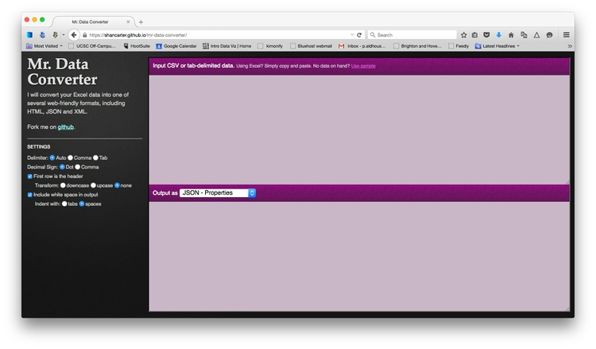

(Source: [Mr Data Converter](https://shancarter.github.io/mr-data-converter/))

To convert data from JSON or XML into text files, you can use Open Refine. First create a new project and import your JSON or XML file. Use the `Export` button and select `Tab-separated value` or `Comma-separated value` to export as a text file.

### Assignment

- Grab the data for the [top 100 ranked women's singles tennis players](http://www.wtatennis.com/rankings).
- Use Open Refine to process this data as follows:
 - When importing, skip the first row with the date and list of countries.
 - Create new columns for `First Name` and `Last Name`. Hint: First create a copy of the `Player` column with a new name using `Edit Column`. Make sure not to delete the existing column. You will also need to rename the resulting columns.
 - Create a new column for the `Country` with the square brackets removed.
 - Create a new column showing points gained per tournament. Hint: to do this you will need to run a culaculation dividing the values in the `Points` columen by the values in the `Tourn Played` column. You refer to values in a particular column like this: `cells["Points"].value`.
- Extract the operations to process this data, and save in a file with the extension `.json`.
- Now go back to the WTA site and grab the singles rankings made on April 3, 2017, for U.S. players only.
- Process this data in Open Refine using your extracted JSON, then export the processed data as a CSV file.
- Send me your JSON and CSV files.

### Further reading

Paul Bradshaw. *[Scraping For Journalists](https://leanpub.com/scrapingforjournalists)*

Dan Nguyen. *[The Bastards Book of Ruby](http://ruby.bastardsbook.com/)*
I use R or Python rather than Ruby, but this book provides a [good introduction](http://ruby.bastardsbook.com/chapters/web-scraping/) to the practice of web scraping using code, and [using your browser's web inspector](http://ruby.bastardsbook.com/chapters/web-inspecting-html/) to plan your scraping approach.

Hadley Wickham's [rvest](https://github.com/hadley/rvest) package
This is the R package I usually use for web scraping.

[Open Refine Wiki](https://github.com/OpenRefine/OpenRefine/wiki)

[Open Refine Documentation](https://github.com/OpenRefine/OpenRefine/wiki/Documentation-For-Users)

[Open Refine Recipes](https://github.com/OpenRefine/OpenRefine/wiki/Recipes)

