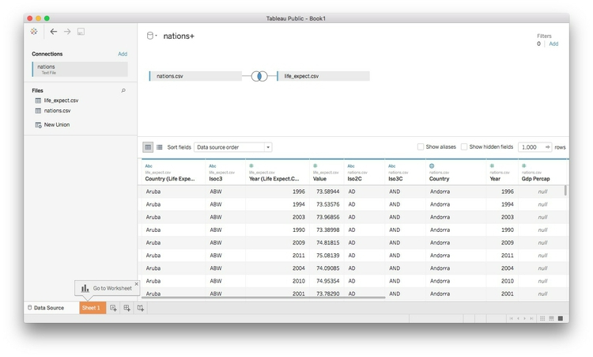
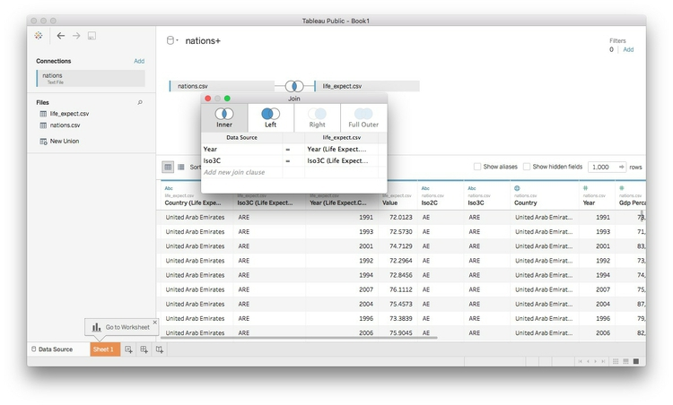

#Let's apply what we've learned so far

Your task for this week's class is to create a Tableau version of the visualization in [this Gapminder video](http://www.gapminder.org/videos/200-years-that-changed-the-world-bbc/), using data from the World Bank's [World Development Indicators](https://data.worldbank.org/indicator/?tab=all) (WDI).

Rather than using the data from week 3, start from [this version](data/week6.zip) of the data, which lacks the variable giving life expectancy at birth.

How to proceed:

- Download data in Excel format for life expectancy at birth by nation over time from [here](https://data.worldbank.org/indicator/SP.DYN.LE00.IN).
- Open in a spreadsheet and edit to remove the couple of rows above the header row, and remove columns to leave just the country names, country codes, and data from 1990 onwards,

- Process this data using Open Refine to convert from wide to long format. When doing this, I would call the new column with life expectancy data something generic like `value`, so that it can be used on other World Bank data in the same format. I would also rename `Country Code` to `iso3c` and rename `Country Name` to `country`.  Then the variable names will match those in `nations.csv`.

- Export the data in CSV format, and save the steps from Open Refine that will enable you to process WDI data in the same way in future (you can then use this for the assignment). Place this file in your `week6` folder.

- Launch Tableau, and connect to the `nations.csv` file in the `week6` folder.

 

 Now double-click on the file with the life expectancy data. Tableau will now attempt to **join** the data based on common fields:
 
 
 
 To control how the join is performed, click on the circles with the blue area of overlap. Remember that there is one row in this data for each country in each year. So to join the data appropriately, we need to join by `year` and the `iso3c` country code (joining by unambiguous codes is generally a better idea than joining by names). Choosing an inner join will retain rows from each file only where there are matches.

 
 
 The joined data should look like this in a Tableau worksheet. You can see which variables came from which file:
 
 
 
 At this point, I would rename `value` to `Life expectancy at birth`.

- Use the joined data to create a version of the Gapminder visualization, covering the period from 1990 to 2015.

### Assignment

- Download data in Excel format on carbon dioxide emissions in metric tonnes per capita, from [here](https://data.worldbank.org/indicator/EN.ATM.CO2E.PC).

- Process this data in Open Refine using the JSON you saved from the class exercise above, and export as a CSV file.
-  Join to the exported data to the file `nations.csv` in Tableau as above, then create the simple dashboard shown below, recording total carbon dioxide emissions by region and nation, from 2000 to 2014. Hint: You will need to create a calculated variable for total emissions, using the per capita emissions data and the population data from `nations.csv`.

 

