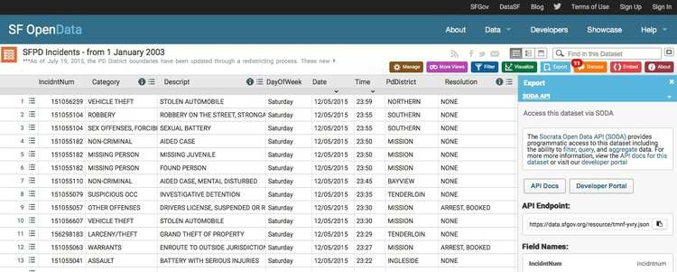
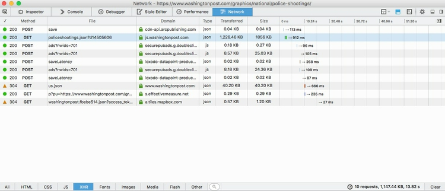

# Quick and easy graphics on deadline

Often, you will need to produce news graphics to insert into stories quickly, embedded as a simple image or iframe.

The rule of thumb here is to use data that you know you can rely on, and process quickly, without extensive cleaning. This is where knowing the datasets available for your reporting beat is invaluable.

I make my on-deadline graphics, for example those in [this post](http://www.buzzfeed.com/peteraldhous/active-shooter-stats), using rCharts and NVD3, as we explored in [week 13](http://www.peteraldhous.com/ucb/2015/dataviz/week13.html).

### SVG Crowbar to capture SVG graphics from web pages

Having made a basic NVD3 graphic, you can also capture a static version as an SVG using an extension to Chrome, developed by the *New York Times*, called [SVG Crowbar](http://nytimes.github.io/svg-crowbar/). The downloaded graphic can then be edited and annotated in a vector graphics editor such as [Adobe Illustrator](http://www.adobe.com/products/illustrator.html), if you need to make a customized version as a static image.

### Datawrapper for quick interactive charts and maps

Datawrapper is a useful web application for making simple interactive charts, developed by German journalism organizations. See [here](http://paldhous.github.io/kdmc-workshops/2015/digital-media/hands-on.html) for a tutorial, which also includes notes on using [Plotly](https://plot.ly/), another web-based charting application.

### Chartbuilder for quick image charts

[Chartbuilder](https://quartz.github.io/Chartbuilder/), developed by Quartz, can be used to make simple line, column and scatter plots as PNG images. You can combine different visual encodings (such as line and column) on the same chart.

# Working with "live" data

If you are able to make visualizations that update to use the latest data, your projects will have a much longer shelf-life than those made with static datasets.

### More on working with APIs

In [week 4](http://www.peteraldhous.com/ucb/2015/dataviz/week4.html), we touched upon APIs, which will return data on demand, often in JSON format, in response to a request in the form of a url. These incluse the U.S. Geological Survey historical [earthquakes API](http://earthquake.usgs.gov/earthquakes/search/), which we explored in class.

I used that API to make [this map](http://paldhous.github.io/earthquakes/) of seismic risk and historical earthquakes in the continental U.S. This is similar to the map we made with R and the R Leaflet htmlwidget in [week 13](http://www.peteraldhous.com/ucb/2015/dataviz/week13.html), except that the data is called in live, as JSON, each time the page loads, with an API call to this URL:

```CSS
http://earthquake.usgs.gov/fdsnws/event/1/query?starttime=1965-01-01T00:00:00&minmagnitude=6&format=geojson&latitude=39.828175&longitude=-98.5795&maxradiuskm=6000&orderby=magnitude&callback=
```
Paste this URL into your browser to see the data that is returned. To see how I processed this data using JavaScript/Leaflet, download the [GitHub repository](https://github.com/paldhous/earthquakes) and study the code in the file `maps.js`, which is in the `src` folder.

[These notes](http://www.peteraldhous.com/ucb/2014/dataviz/week11.html), from last year's class, explain how the map was made, step by step.

#### Use Socrata APIs

Many public agencies, such as the [City and County of San Francisco](http://datasf.org/), and the [California Health and Human Services Agency](https://chhs.data.ca.gov/), store their data online using the [Socrata](https://www.socrata.com/) Open Data platform.

You can download data from such sites, or you can access the data live via an API. First you need to identify the "endpoint" or unique URL, for the dataset you are interested in, as explained [here](https://dev.socrata.com/docs/endpoints.html).

From the page with the data, look for `SODA API` under the `Export` button to find this URL:



You can then control exactly what data you receive from the API by constructing URLs with [simple filters](https://dev.socrata.com/docs/filtering.html), or more complex, [SQL-like queries](https://dev.socrata.com/docs/queries/).

Some federal government agencies give API access to their data. For example, [here](http://www.bls.gov/developers/home.htm) is the documentation for the APIs available for the Bureau of Labor Statistics, including a link to code samples to access the APIs in various programming languages.

#### Use CartoDB synced tables

If geographic data is regularly updated, and accessible via a simple web link or an API, you can set up a CartoDB table to update automatically on a regular basis, as explained [here](http://blog.cartodb.com/synced-tables-create-real-time-maps-from-data-anywhere/). CartoDB reads GeoJSON, but not conventional JSON, so will need to tell the API to return CSV or -- if is is available -- GeoJSON.

#### Use your own Kimono APIs

In [week 4](http://www.peteraldhous.com/ucb/2015/dataviz/week4.html), we explored the use of Kimono for web scraping. Each Kimono scrape you perform actually creates an [API](https://www.kimonolabs.com/apidocs). To access these APIs, you need to construct a URL including the API's ID and your unique API Key, as explained [here](https://www.kimonolabs.com/apidocs#RetrieveApi).

From any of your APIs, click on the `API Docs` tab to find code examples in various languages, including jQuery, which can be used to process the data in the code for a web page.

Below, for example, is an R script used to access data from two Kimono APIs scraping [this page](http://www.rottentomatoes.com/browse/box-office/) at Rotten Tomatoes, and all the movie pages linked to it. It joins the data from the two APIs, performs some data processing, and saves the data as a CSV file.

```R
# process the data
#############################

# load required packages
library(RCurl)
library(jsonlite)
library(dplyr)

# rename old file for archive, appending current date to name
file.rename("topmovies.csv", 
            paste0("topmovies",as.character(Sys.Date()),".csv"))

# load data from rt_movies kimono API
movies <- getURL("https://www.kimonolabs.com/api/dtlk8umw?apikey=52Qc3ZCQI0HQRUyJd6zbXOmDohzQMQyB")
movies <- fromJSON(movies)
movies <- movies$results$collection1 

# load data from rt_boxoffice kimono API
boxoffice <- getURL("https://www.kimonolabs.com/api/cnz0ruai?apikey=52Qc3ZCQI0HQRUyJd6zbXOmDohzQMQyB")
boxoffice <- fromJSON(boxoffice)
boxoffice <- flatten(boxoffice$results$collection1)

# join data frames and process data
topmovies <- inner_join(movies,boxoffice, by=c("url"="title.href")) %>%
  # select required fields by index number
  select(1:5,7,8,11) %>%
  # rename title
  rename(title=title.text) %>%
  # substring on weekend_gross to remove $ symbols
  mutate(weekend_gross=substring(weekend_gross,2))

# split the dataframe into two depending on whether numbers are in millions or thousands
topmovies_m <- filter(topmovies, !grepl("k", weekend_gross))
topmovies_k <- filter(topmovies, grepl("k", weekend_gross)) 

# remove M and k, convert to numbers and divide by 1000 for the numbers in thousands
topmovies_m$weekend_gross <- as.numeric(gsub("M","",topmovies_m$weekend_gross))
topmovies_k$weekend_gross <- as.numeric(gsub("k","",topmovies_k$weekend_gross))/1000

# bind the two data frames back into one
topmovies <- bind_rows(topmovies_m, topmovies_k) %>%
  # convert audience and critic scores to integers
  mutate(audience=as.integer(audience), critics=as.integer(critics)) 

# separate top 5 movies by weekend_gross, and add a new labels column with movie title
topmovies_5 <- top_n(topmovies, 5, weekend_gross) %>%
  mutate(label=title)

# separate movies not including the top 5 by weekend_gross
topmovies_rest <- anti_join(topmovies, topmovies_5)

# bind those two data frames back together
topmovies <- bind_rows(topmovies_5, topmovies_rest)

# write data to CSV and JSON files
write.csv(topmovies,"topmovies.csv", row.names = FALSE, na="")
write(toJSON(topmovies), "topmovies.json")

# clean up environment
rm(topmovies,topmovies_k,topmovies_m,movies,boxoffice,topmovies_5,topmovies_rest)
```

#### Set up a "cron job" to update data

If you are calling an API in the code for your website, and processing the data live in the web browser, as in the earthquakes example, your visualization will update each time a users visits the site.

If you are using a script to update the data offline, you may want to run the script automatically on a regular basis. This can be achieved using a cron job, controled by a file called a crontab, which is an instruction to run a script on a particular schedule.

Here is an example:

```CSS
59 23 * * 0 Rscript ~/Dropbox/folder/script.R >/dev/null 2>&1
```

This runs an R script called `script.R` in a folder called `folder` in my Dropbox, each Sunday at one minute before midnight.

The timing is set by the numbers and asterisks at the beginning, which work like this:

```CSS
# 1. Entry: Minute when the script will be started [0-60]
# 2. Entry: Hour when the script will be started [0-23]
# 3. Entry: Day of the month when the script will be started [1-28/29/30/31]
# 4. Entry: Month of the year when the script will be started [1-12]
# 5. Entry: Weekday when the script will be started [0-6] [0 is Sunday]
```

The last part of the script, `>/dev/null 2>&1` prevents the cron job from sending you an alert each time it runs.

You can run scripts in any language in a cron job. For example, this would run a Python script called `script.py` in the same location as the R script above, on the same schedule:

```CSS
59 23 * * 0 /usr/bin/python ~/Dropbox/folder/script.py >/dev/null 2>&1
```

To create a cron job, follow these instructions:

- Open the `Terminal` (just search Spotlight for `Terminal` to find it).

- In the Terminal type `crontab -e.` This allows you to add a cron job, using the `vim` editor.

- Press `i` on your keyboard to go into vim's insert mode.

- Type in your cron command, for the R script example above: `59 23 * * 0 Rscript ~/Dropbox/folder/script.R >/dev/null 2>&1`.

- When you are done, click `escape` to exit vim's insert mode.

- Type `ZZ` to save the file and exit crontab.

- Verify the cron job details by typing `crontab -l` in the Terminal.

#### Use your web inspector to find the data behind regularly updated websites

Web pages like [this site](https://www.washingtonpost.com/graphics/national/police-shootings/) on shootings by the police, from the *Washington Post*, rely on data that is updated regularly.

To look for the data driving a web page like this, you need to examine the resources that are being loaded.

In Firefox, select `Tools>Web Developer>Web Console` from the top menu. Select the `Network` tab, and `XHR`, which stands for `XMLHttpRequest`, which is how data will often be loaded. Refresh the page, and the resources being loaded will appear. In this case, the data is in the large JSON file, second on the list:



Right-click on that list item to see various options for viewing/saving the data. For example, if you copy the URL, you can then call the data into R with the following code:

```R
# load required package
library(jsonlite)

# load data form JSON
wapo <- fromJSON("https://js.washingtonpost.com/graphics/policeshootings/policeshootings.json")
```


