# Data visualization: basic principles

Why visualize data? It is a good way to communicate complex information, because we are highly visual animals, evolved to spot patterns and make visual comparisons. To visualize effectively, however, it helps to understand a little about how our brains process visual information. The mantra for this week's class is: Design for the human brain!

### Visualization: encoding data using visual cues

Whenever we visualize, we are encoding data using visual cues, or "mapping" data onto variation in size, shape or color, and so on. There are various ways of doing this, as this primer illustrates:

These cues are not created equal, however. In the mid-1980s, statisticians William Cleveland and Robert McGill [ran some experiments](http://courses.ischool.berkeley.edu/i247/f05/readings/Cleveland_GraphicalPerception_Science85.pdf) with human volunteers, measuring how accurately they were able to perceive the quantitative information encoded by different cues. This is what they found:

This **perceptual hierarchy of visual cues** is important. When making comparisons with continuous variables, aim to use cues near the top of the scale wherever possible.

### But this doesn't mean that everything becomes a bar chart

Length on an aligned scale may be the best option to allow people to compare numbers accurately, but that doesn't mean the other possibilities are always to be avoided in visualization. Indeed, color hue is a good way of encoding categorical data. The human brain is particularly good at recognizing patterns and differences. This means that variations in color, shape and orientation, while poor for accurately encoding the precise value of continuous variables, can be good choices for representing categorical data.

You can also combine different visual cues in the same graphic to encode different variables. But always think about the main messages you are trying to impart, and where you can use visual cues near the top of the visual hierarchy to communicate that message most effectively.

To witness this perceptual hierarchy, look at the following visual encodings of the same simple dataset. In which of the three charts is it easiest to compare the numerical values that are encoded?

Note that encoding data using the area of circles -- has been popular in data visualization in recent years, [for example](https://informationisbeautiful.net/visualizations/snake-oil-scientific-evidence-for-nutritional-supplements-vizsweet/) -- makes even tougher demands on your audience.

### Which chart type should I use?

This is a frequently asked question, and the best answer is: Experiment with different charts, to see which works best to liberate the story in your data. Some of the visualization software that we'll work with subsequently -- notably [Tableau Public](https://public.tableau.com/en-us/s/) -- will suggest chart types for you to try. 

However, it is good to have a basic framework to help you prioritize particular chart types for particular visualization tasks. [Here](https://raw.githubusercontent.com/ft-interactive/chart-doctor/master/visual-vocabulary/poster.png), for example, is a useful classification of chart types from the Financial Times.

Although it is far from comprehensive, and makes some specific chart suggestions that I would not personally endorse, this "chart of charts" provides a useful framework by providing four answers to the question: "What would you like to show?"

(Source: A. Abela, [Extreme Presentation Method](https://extremepresentation.typepad.com/files/choosing-a-good-chart-09.pdf))

In Week 1, we covered charts to show the **distribution** of a single continuous variable, and to study the **relationship** between two continuous variables. So let's now explore possibilities for **comparison** between items for a single continuous variable, and **composition**, or how parts make up the whole. In each case, this framework considers both a snapshot at one point in time, and how to visualize comparison and composition over time -- a common task in data journalism.

I like to add a couple more answers to the question: **connection**, or visualizing how people, things, or organizations relate to one another; and **location**, which covers maps.

### Simple comparisons: bars and columns

Applying the perceptual hierarchy of visual cues, bar and column charts are usually the best options for simple comparisons. Vertical columns often work well when few items are being compared, while horizontal bars may be a better option when there are many items to compare, as in [this example](https://blogs.wsj.com/digits/2010/12/13/the-top-50-gawker-media-passwords/) from *The Wall Street Journal*, illustrating common passwords revealed by a 2013 data breach at Gawker Media.

Here I have used a bar chart to show payments for speaking about drug prescription made to doctors in California by the drug company Pfizer in the second half of 2009, using data gathered in reporting [this story](https://www.newscientist.com/article/dn18806-revealed-pfizers-payments-to-censured-doctors.html).

Notice how spot color is used here as a secondary visual cue, to highlight the doctor who received the most money.

There is one sacrosanct rule with bar and column charts: Because they rely on the length of the bars to encode data, you must start the bars at zero. Failing to do this will mislead your audience. Several graphics aired by Fox News have been criticized for disobeying this rule, for example:

(Source: Fox News, via [Media Matters for America](https://www.mediamatters.org/blog/2013/04/05/fox-news-newest-dishonest-chart-immigration-enf/193507))

### Comparisons: change over time

Bar or column charts can also be used to illustrate change over time, but there are other possibilities, as shown in these charts showing participation in the federal government's food stamps nutritional assistance program, from 1969 to 2016.

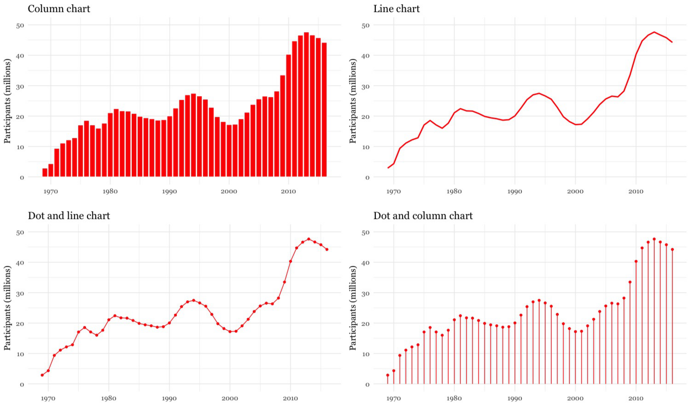

(Source: Peter Aldhous, from [U.S. Department of Agriculture](https://www.fns.usda.gov/pd/supplemental-nutrition-assistance-program-snap) data)

Each of these charts communicates the same basic information with a subtly different emphasis. The column chart emphasizes each year as a discrete point in time, while the line chart focuses on the overall trend or trajectory. The dot and line chart is a compromise between these two approaches, showing the trend while also drawing attention to the value for each year. (The dot column chart is an unusual variant of a column chart, included here to show another possible design approach.)

When comparing very many items over time, another approach may be needed to avoid charts getting too busy. One option is to encode data using color, dropping down the perceptual heiarchy of visual cues, to create a type of chart known as a heat map:

(Source: [*BBC/Ed Hawkins, Reading University*](https://www.bbc.com/news/science-environment-48678196))

If you are comparing two points in time for many items, a slope graph can be an effective choice. Slope falls about midway on the perceptual hierarchy of visual cues, but allows us to scan many items at once and note obvious differences. Here I used slope graphs to visualize data from a study examining the influence of putting house plants in hospital rooms on patient's sense of well-being, measured before abdominal surgery, and after a period of recovery. I used thicker lines and color to highlight ratings that showed statistically significant improvements.

(Source: Peter Aldhous, from data in [this research paper](http://horttech.ashspublications.org/content/18/4/563.full.pdf))

### Composition: parts of the whole

Pie charts are often maligned, but have a legitimate role in visualizing parts of a whole -- although they are not the only option. Which of these two representations of an August 2014 poll of public opinion on President Barack Obama's job performance makes the differences between his approval ratings for difference policy areas easiest to read, the pie charts or the stacked column charts below?

These graphics involve both comparison and composition -- a common situation in data journalism.

(Source: Peter Aldhous, from CBS poll data, via [PollingReport.com](https://pollingreport.com/obama_ad.htm))

In class, we'll discuss how both of these representations of the data could have been improved, given what we've learned about encoding data using visual cues.

I would suggest abandoning pie charts if there are any more than three parts to the whole, as they become very hard to read when there are many segments. ProPublica's [data style guide](https://github.com/propublica/guides/blob/master/news-apps.md) goes further, allowing pie charts with two segments only.

[Recent research](https://eagereyes.org/blog/2016/a-reanalysis-of-a-study-about-square-pie-charts-from-2009) into how people perceive composition visualizations with just two categories suggests that the best approach may actually be a square chart. Surprisingly, this is an example where an encoding of area seems to beat length for accuracy:

(Source: [Eagereyes](https://flowingdata.com/2016/07/15/square-pie-chart-beats-out-the-rest-in-perception-study/))

Charts that explictly divide a square or rectangle into component squares, sometimes called waffle charts, can be very effective, as in this visualization of voting in the 2016 presidential primary elections:

(Source: [*The New York Times*](https://www.nytimes.com/interactive/2016/08/01/us/elections/nine-percent-of-america-selected-trump-and-clinton.html))

Another approach, known as a treemap, similarly uses area to encode the size of parts of the whole, and can be effective to display "nested" variables -- where each part of the whole is broken down into further parts. Here I used a treemap for BuzzFeed News to show the number of people killed and injured in individual terrorist attacks by idealogical category over two decades:

(Source: [*BuzzFeed News*](https://www.buzzfeednews.com/article/peteraldhous/american-terrorism-by-the-numbers))

### Composition: change over time

Data journalists frequently need to show how parts of the whole vary over time. Here is an example, illustrating the development of drought across the United States, which uses a stacked columns format, in this case with no space between the columns.

(Source: The Upshot, [*The New York Times*](https://www.nytimes.com/interactive/2014/upshot/mapping-the-spread-of-drought-across-the-us.html))

In the drought example, the size of the whole remains constant. Even if the size of the whole changes, this format can be used to show changes in the relative size of parts of the whole, by converting all of the values at each time interval into percentages of the total.

Stacked column charts can also be used to simultaneously show change in composition over time and change in the size of the whole. This example is from one of my own articles, looking at change over time in the numbers of monkeys used in the U.S. in experiments involving unalleviated pain or distress.

(Source: [BuzzFeed News](https://www.buzzfeednews.com/article/peteraldhous/the-monkey-victims-of-the-war-on-terror))

Just as for simple comparisons over time, columns are not the only possibility when plotting changes in composition over time. The parts-of-the-whole equivalent of the line chart, stressing the overall trend rather than values at discrete points in time, is the stacked area chart. Again, these charts can be used to show change of time with the size of the whole held constant, or varying over time. Here *The New York Times* used this format to show the countries of origin over time for players in the world's leading sports leagues:

(Source: [*The New York Times*](https://www.nytimes.com/interactive/2017/12/29/upshot/internationalization-of-pro-sports-leagues-premier-league.html))

### Making connections: network graphs

The chart types thought-starter we have used as a framework so far misses two of my answers to the question: "What would you like to show?" We will cover **location** in subsequent classes on mapping.

Journalists may be interested in exploring **connection** -- which donors gave money to which candidate, how companies are connected through members of their boards, and so on. Network graphs can visualize these questions, and are sometimes used in news media. Here, for example, *The New York Times* showed connections between the national teams, players and club teams at the 2014 soccer World Cup:

(Source: [*The New York Times*](https://www.nytimes.com/interactive/2014/06/20/sports/worldcup/how-world-cup-players-are-connected.html))

Complex network graphs can be very hard to read -- "hairball" is a pejorative term used to describe them -- so networks often need to be filtered to tell a clear story to your audience.

If you are interested in learning how to make network graphs, I have a tutorials [here](https://paldhous.github.io/NICAR/2015/gephi.html) for a tool called [Gephi](https://gephi.org/). The [Flourish](https://flourish.studio/) web app (see the [Software](spftware.html) page) also has a network graph template.

#### Case study: Immunization in California kindergartens

Now we'll explore a dataset at different levels of analysis, to show how different visual encodings may be needed for different visualization tasks with the same data.

This data, from the [California Department of Public Health](https://www.shotsforschool.org/k-12/reporting-data/), gives numbers on immunization and enrollment at kindergartens across the state. The data is provided at the level of individual schools, but can be aggregated to look at counties, or the entire state.

When looking at change over time at the state level, the perceptual hierarchy makes a column chart a good choice:

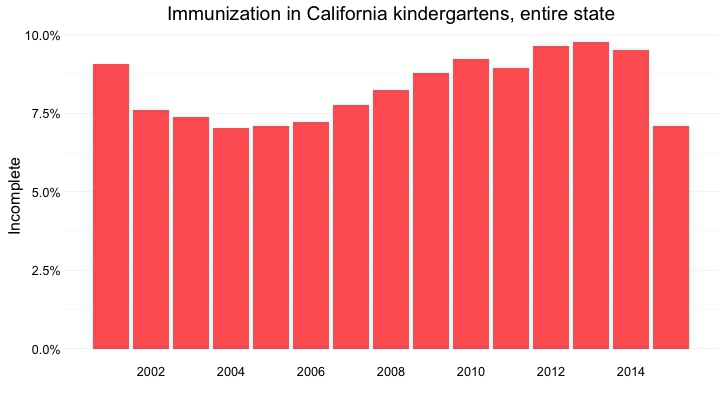

(Source: Peter Aldhous, from [California Department of Public Health](https://www.shotsforschool.org/k-12/reporting-data/) data)

Notice that I've focused on the percentage of children with *incomplete* vaccination, rather than the percentage complete, for two reasons: 
- The differences between the lengths of the bars are greater, and so is easier to read. 
- More importantly, incomplete vaccination is what increases the risk of infectious disease outbreaks, which is why we care about this data.

But as for the food stamps data, a bar chart is not the only choice:

Here's the same information presented as a line chart:

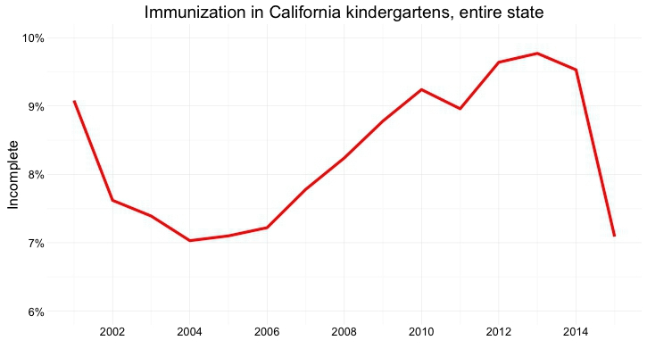

(Source: Peter Aldhous, from [California Department of Public Health](https://www.shotsforschool.org/k-12/reporting-data/) data)

Notice that here, I haven't started the Y axis at zero. This would be unforgivable for a bar chart, where the length of the bar *is* the visual encoding, and so starting at an arbitrary value would distort the comparison between the bars. Here, however, I'm emphasizing the relative slope, to show change over time, so starting at zero is less crucial.

And here's the data as a dot-and-line chart:

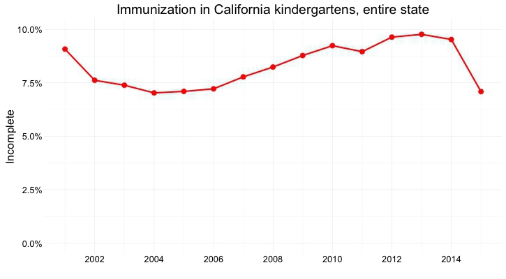

(Source: Peter Aldhous, from [California Department of Public Health](https://www.shotsforschool.org/k-12/reporting-data/) data)

Here, I've returned to a Y axis that starts at zero, so that the relative positions of the points can be compared accurately.

But what if we want to look at individual counties? When comparing a handful of counties, the dot-and-line chart, combining the visual cues of position on an aligned scale (for the yearly values) and slope (for the rate of change from year to year) works well:

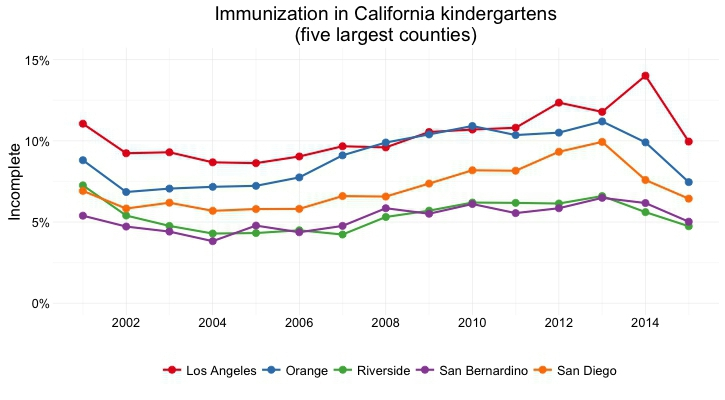

(Source: Peter Aldhous, from [California Department of Public Health](http://www.shotsforschool.org/k-12/reporting-data/) data)

But there are 58 counties in California, and trying to compare them all using a dot-and-line chart results in chaos:

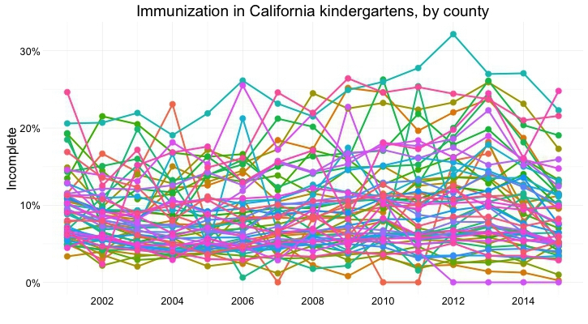

(Source: Peter Aldhous, from [California Department of Public Health](https://www.shotsforschool.org/k-12/reporting-data/) data)

In this case, it makes sense to drop down the perceptual hierarchy, and use the intensity of color to represent the percentage of incomplete immunization:

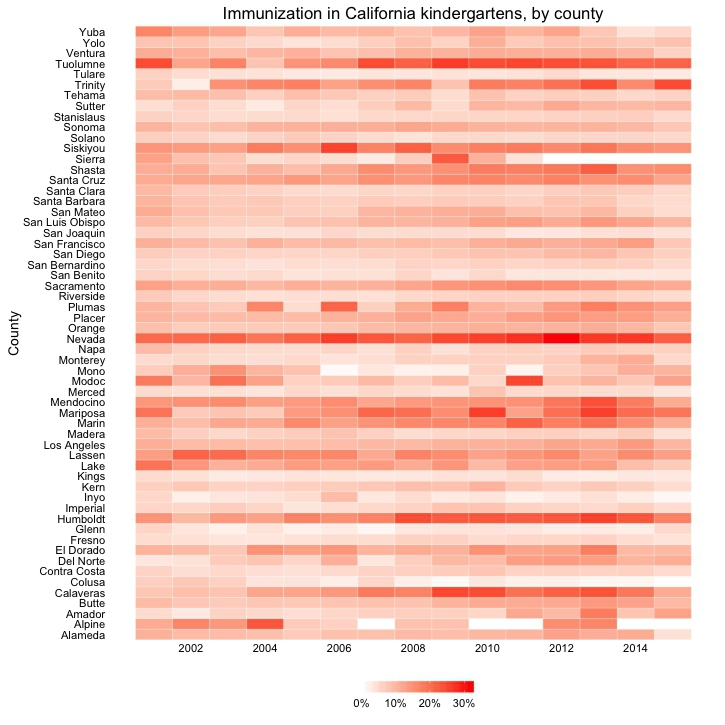

(Source: Peter Aldhous, from [California Department of Public Health](https://www.shotsforschool.org/k-12/reporting-data/) data)

This type of chart is called a heat map. It provides a quick and easy way to scan for the counties and years with the highest rates of incomplete immunization.

### Using color effectively

Color falls low on the perceptual hierarchy of visual cues, but as we have seen above, it is often deployed to highlight particular elements of a chart, and sometimes to encode data values. Poor choice of color schemes is a problem that bedevils many news graphics, so it is worth taking some time to consider how to use color to maximum effect.

It helps to think about colors in terms of the color wheel, which places colors that "harmonize" well together side by side, and arranges those that have strong visual contrast -- blue and orange, for instance -- at opposite sides of the circle:

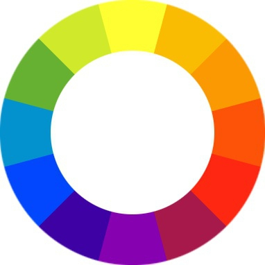

(Source: [Wikimedia Commons](https://commons.wikimedia.org/wiki/Category:Colorwheels#mediaviewer/File:Byrcolorwheel.png))

When encoding data with color, take care to fit the color scheme to your data, and the story you're aiming to tell. Color is often used to encode the values of categorical data. Here you want to use "qualitative" color schemes, where the aim is to pick colors that will be maximally distinctive, as widely spread around the color wheel as possible:

(Source: [ColorBrewer](http://colorbrewer2.org/))

When using color to encode continuous data, it usually makes sense to use increasing intensity, or saturation of color to indicate larger values. These are called "sequential" color schemes:

(Source: [ColorBrewer](http://colorbrewer2.org/))

In some circumstances, you may have data that has positive and negative values, or which highlights deviation from a central value. Here, you should use a "diverging" color scheme, which will usually have two colors reasonably well separated on the color wheel as its end points, and cycle through a neutral color in the middle:

(Source: [ColorBrewer](http://colorbrewer2.org/))

Choosing color schemes is a complex science and art, but there is no need to "roll your own" for every graphic you make. Many visualization tools include suggested color palettes, and I often make use of the website from which the examples above were taken, called [ColorBrewer](http://colorbrewer2.org/). Orginally designed for maps, but useful for charts in general, these color schemes have been rigorously tested to be maximally informative.

In class, we will take some time to play around with ColorBrewer and examine its outputs. You will notice that the colors it suggests can be displayed according to their values on three color "models": HEX, RGB and CMYK. Here is a brief explanation of these color models.

- **RGB** Three values, describing a color in terms of combinations of red, green, and blue light, with each scale ranging from 0 to 255; sometimes extended to RGB(A), where A is alpha, which encodes transparency. Example: `rgb(169, 104, 54)`.

- **HEX** A six-figure "hexadecimal" encoding of RGB values, with each scale ranging from hex 00 (equivalent to 0) to hex ff (equivalent to 255); HEX values will be familiar if you have any experience with web design, as they are commonly used to denote color in HTML and CSS. Example: `#a96836`

- **CMYK** Four values, describing a color in combinations of cyan, magenta, yellow and black, relevant to the combination of print inks. Example: `cmyk(0, 0.385, 0.68, 0.337)`

[Colorizer](http://colorizer.org/) is one of several web apps for picking colors and converting values from one model to another.

Custom color schemes can also work well, but experiment to see how different colors influence your story. The following graphic from *The Wall Street Journal*, for instance, uses an unusual pseudo-diverging scheme to encode data -- the US unemployment rate -- that would typically be represented using a sequential color scheme. It has the effect of strongly highlighting periods where the jobless rate rises to around 10%, which flow like rivers of blood through the graphic. This was presumably the designer's aim.

(Source: [*The Wall Street Journal*](https://www.wsj.com/articles/SB10001424052748703338004575230041742556522))

If you intend to roll your own color scheme, try experimenting with [I want hue](https://medialab.github.io/iwanthue/) for qualitative color palettes and the [Chroma.js Color Palette Helper](https://vis4.net/palettes/) for sequential palettes.

You will also notice that ColorBrewer allows you to select color palettes that are colorblind-safe. Red and green lie on opposite sides of the color wheel, and also can be used to suggest "good" or "go," versus "bad" or "stop." But about 5% of men have red-green colorblindness, also known as deuteranopia.

Install [Color Oracle](https://www.colororacle.org/index.html) to check how your charts and maps will look to people with various forms of colorblindness.

[Viz Palette](http://projects.susielu.com/viz-palette) is another good tool for experimenting with different color palettes, which includes color blindness simulation.

(Source: [Viz Palette](http://projects.susielu.com/viz-palette))

### Using chart furniture, minimizing chart junk, highlighting the story

In addition to the data, encoded through the visual cues we have discussed, various items of chart furniture can help frame the story told by your data:

- **Title and subtitle** These provide context for the chart.

- **Coordinate system** For most charts, this is provided by the horizontal and vertical axes, giving a cartesian system defined by X and Y coordinates; for a pie chart it is provided by angles around a circle, called a polar coordinate system.

- **Scale** Labeled tick marks and grid lines can help your audience read data values.

- **Labels** You will usually want to label each axis. Think about other labels that may be necessary to explain the message of your graphic.

- **Legend** If you use color or shape to encode data, you will often need a legend to explain this encoding.

- **Source information** Usually given as a footnote. Don't forget this!

Chart furniture can also be used to encode data, as in this example, which shows the terms of New York City's police commissioners and mayors with reference to the time scale on the X axis:

(Source: [*The New York Times*](https://www.nytimes.com/interactive/2013/12/04/nyregion/how-crime-declined-in-new-york-city-and-the-us.html))

Contemplate how much chart furniture you really need, and make sure that the story told by your data is front and center. Think data-ink: What proportion the ink or pixels in your chart is actually encoding data, and what proportion is embellishment, adding little to your story?

Here is a nice example of a graphic that minimizes chart junk, and maximizes data-ink. Notice how the Y axis doesn't need to be drawn, and the gridlines are an absence of ink, consisting of white lines passing through the columns:

(Source: The Upshot, [*The New York Times*](https://www.nytimes.com/interactive/2014/07/25/upshot/100000003019150.embedded.html))

Contrast this with the proliferation of chart junk in the earlier misleading Fox News column chart.

Labels and spot-color highlights can be particularly useful to highlight your story, as shown in the following scatter plots, used here to show the relationship between the median salaries paid to women and men for the same jobs in 2018. In this case there is no suggestion of causation; here the scatter plot format is being used to display two distributions simultaneously -- see the chart types thought-starter.

It is clear from the first, unlabeled plot, that male and female salaries for the same job are strongly correlated, as we would expect, but that relationship is not very interesting. Notice also how I have used transparency to help distinguish overlapping individual points.

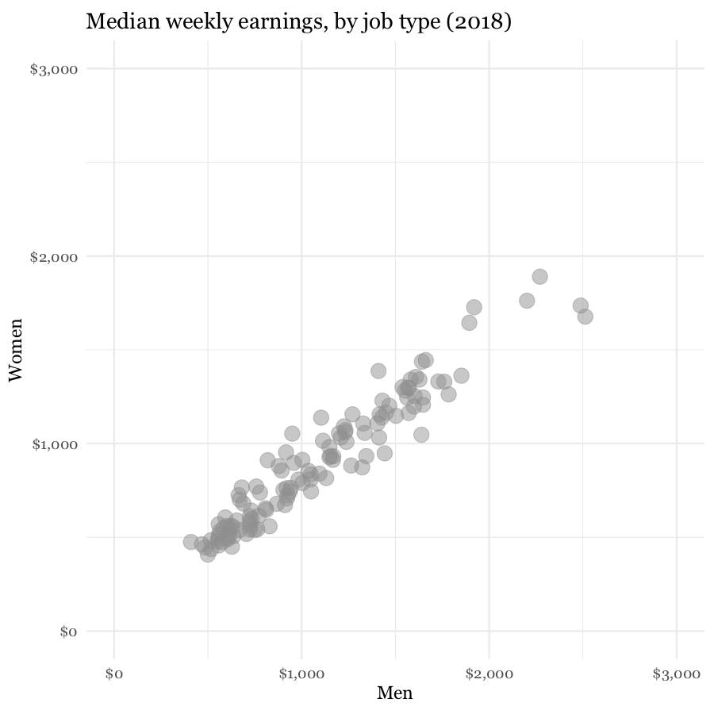

(Source: Peter Aldhous, from [Bureau of Labor Statistics](https://www.bls.gov/cps/cpsaat39.htm) data)

What we are interested in here is whether men and women are compensated similarly for doing the same jobs. The story in the data starts to emerge if you add a line of equal pay, with a slope of 1 (note that this isn't a trend line, as we discussed last week).

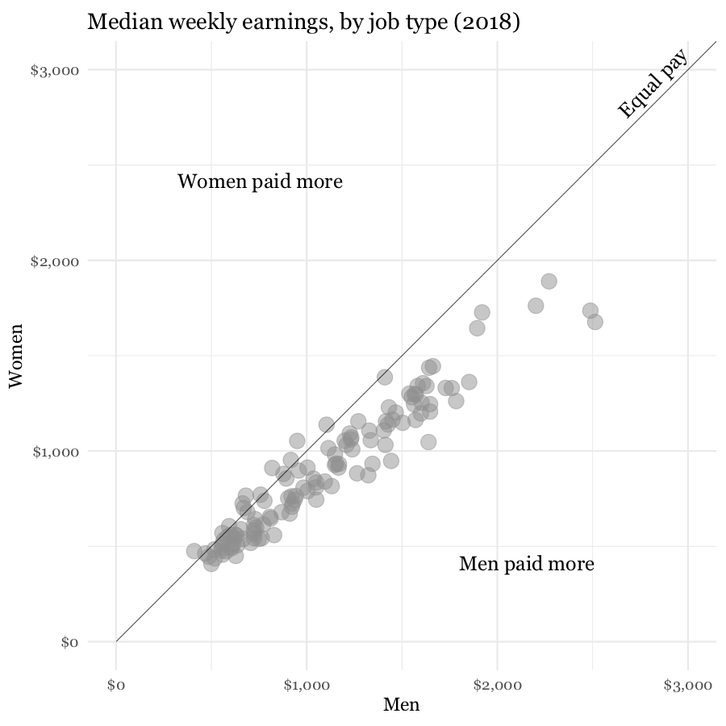

(Source: Peter Aldhous, from [Bureau of Labor Statistics](https://www.bls.gov/cps/cpsaat39.htm) data)

Notice how adding another line, representing a 25% pay gap, and highlighting the job where the pay gap between men and women is proportionately largest, emphasizes different aspects of the story:

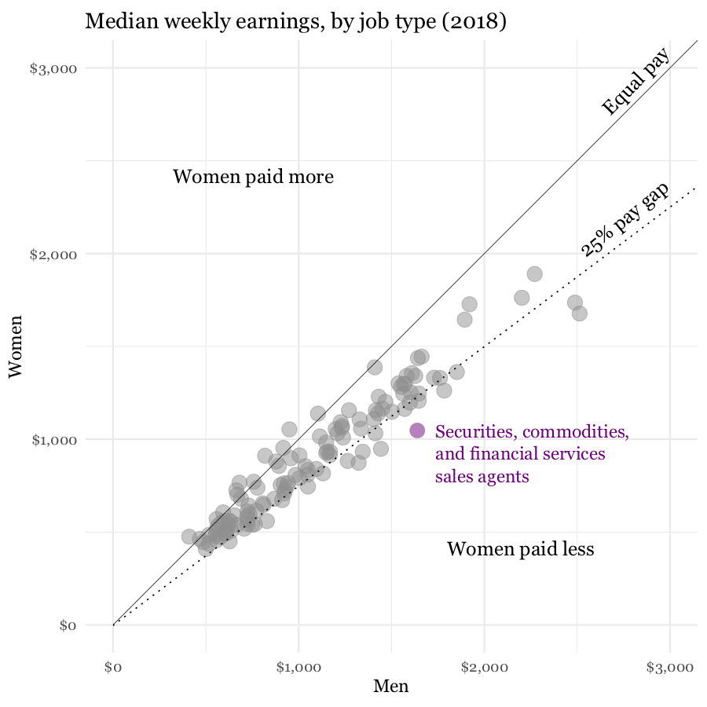

(Source: Peter Aldhous, from [Bureau of Labor Statistics](https://www.bls.gov/cps/cpsaat39.htm) data)

### Pitfalls to avoid

If you ever decide to encode data using area, be sure to do so correctly. Hopefully it is obvious that if one unit is a square with sides of length one, then the correct way to represent a value of four is a square with sides of length two (`2*2 = 4`), not a square with sides of length four (`4*4 = 16`).

Mistakes are frequently made, however, when encoding data by the area of circles. During the 2019 women's soccer Word Cup, *The Guardian* ran this graphic:

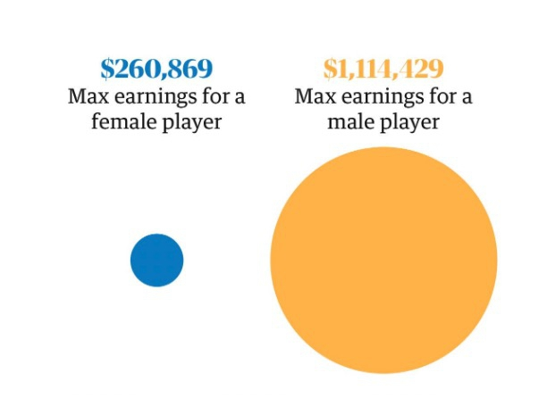

(Source: [The Guardian](https://www.theguardian.com/football/ng-interactive/2019/jun/28/revealed-the-731003-gender-pay-gap-in-us-world-cup-bonuses))

Crticis pointed out on Twitter that the data had been scaled by the radius of each circle, not its area. Because `area = π * radius^2`, you need to scale the circles by the square root of the radius to achieve the correct result, shown here in an amended version of the graphic:

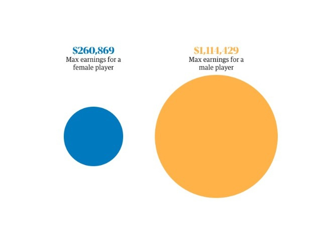

(Source: [The Guardian](https://www.theguardian.com/football/ng-interactive/2019/jun/28/revealed-the-731003-gender-pay-gap-in-us-world-cup-bonuses))

Many software packages (Microsoft Excel has been a notable culprit) allow users to create charts with 3-D effects. Some graphic designers produce customized charts with similar aesthetics. The problem is that that it is very hard to read the data values from 3-D representations, as this example illustrates:

(Source: [*Good*](https://web.archive.org/web/20140411083133/http://magazine.good.is/infographics/infographic-the-20-most-charitable-countries-in-the-world))

Above all, aim for clarity and simplicity in your chart design. Clarity should trump simplicity. As Albert Einstein [is reputed to have said](https://quoteinvestigator.com/2011/05/13/einstein-simple/): "Everything should be made as simple as possible, but not simpler."

Sometimes even leading media outlets lose their way. See if you can make sense of [this interactive graphic](https://web.archive.org/web/20170722130156/http://projects.washingtonpost.com/top-secret-america/network/[object%20Object) on clandestine US government agencies and their contractors:

(Source: [*The Washington Post*](https://web.archive.org/web/20170722130156/http://projects.washingtonpost.com/top-secret-america/network/[object%20Object]))

[Here is a good overview](https://www.data-to-viz.com/caveats.html) of pitfalls in data visualization, with tips on how to improve your charts.

### Be true to the 'feel' of the data

Think about what the data represents in the real world, and use chart forms, visual encodings and color schemes that allow the audience's senses to get close to what the data means -- note again the "rivers of blood" running through *The Wall Street Journal'*s unemployment chart, which suggest human suffering.

Look also at my reworking for BuzzFeed News of a visualization from the National Oceanic and Atmospheric Adminstration of the storm surge caused by Hurricane Katrina in 2005. My thought was that increasing the intensity of blue to represent more water would be intuitive:

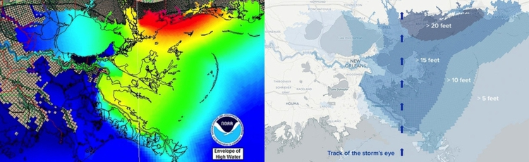

(Source: [BuzzFeed News](https://www.buzzfeednews.com/article/peteraldhous/why-katrina-was-the-storm-from-hell))

### Break the story down into scenes

Many stories have a step-by-step narrative, and different charts may tell different parts of the story. So think about communicating such stories through a series of graphics. This is another good reason to experiment with different chart types when exploring a new dataset. Here is a nice example of this approach, examining demographic change in Brazil:

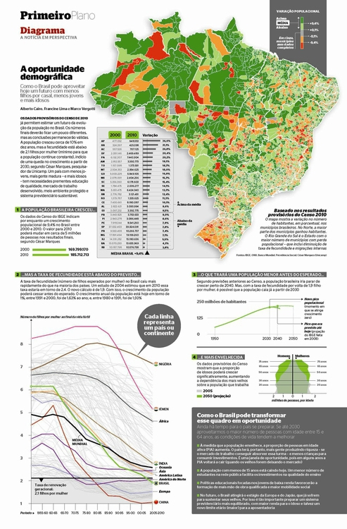

(Source: [*Época*](https://web.archive.org/web/20150822234419/http://visualopolis.com/en/component/content/article/55-featured-small/117-how-we-work-at-epoca.html)
)
### Good practice for interactives

Nowadays the primary publication medium for many news graphics is the web or apps on mobile platforms, rather than print, which opens up many possibilities for interactivity. This can greatly enhance your ability to tell a story, but it also creates new possibilities to confuse and distract your audience -- think of this as interactive chart junk.

A good general approach for interactive graphics is to provide an overview first, and then allow the interested user to zoom or filter to dig deeper into the data. In such cases, the starting state for an interactive should tell a clear story: If users have to make an effort to dig into a graphic to get anything from it, few are likely to do so. Indeed, assume that much of your audience will spend only a short time interacting with the data.

Similarly, don't hide labels or information essential to understanding the graphic in tooltips that are accessed only on clicks or hovers. This is where to put more detailed information for users who have sufficient interest to explore further.

Make the controls for an interactive obvious -- play buttons should look like play buttons, for instance. You can include a few words of explanation, but only a very few: as far as possible, how to use the interactive should be intuitive, and built into its design.

The interactivity of the web also facilitates a scene-by-scene narrative -- a device employed by the *Washington Post* in [this exploration](https://www.washingtonpost.com/graphics/2018/world/too-many-men/) of the consequences of the excess of boys and young men in China and India:

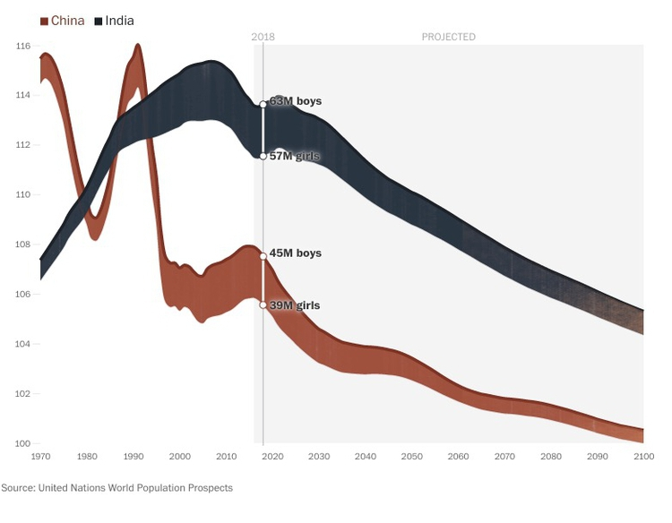

(Source: [*Washington Post*](https://www.washingtonpost.com/graphics/2018/world/too-many-men/))

### 'Mobile-first' may change your approach

News content is now largely viewed on mobile devices with small screens

At the most basic level, this means making graphics "responsive," so that their size adjusts to screen size. But there is more to effective design for mobile than this.

“Small multiples,” showing multiple variants small charts or maps, provide another approach to graphics on mobile. They can reflow easily for different screen widths, and have been used very successfully in recent years by several news organizations. Here is a small section from a larger graphic showing the severity of drought in California in late 2013 and early 2014:

(Source: [*Los Angeles Times*](https://www.latimes.com/local/lanow/la-me-g-california-drought-map-htmlstory.html))

[This interactive](https://chicagosmilliondollarblocks.com), exploring spending on incarceration by block in Chicago, is an example of organizing and displaying the same material differently for different screen sizes. However, it seems to have been optimized for a desktop view and then adapted for mobile. Open it up on your laptop then reduce the size of your browswer window to see how it behaves.

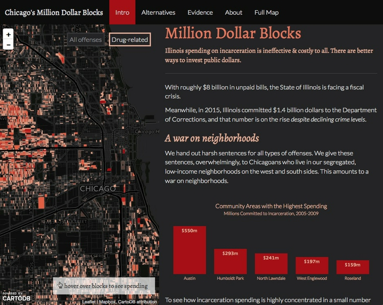

(Source: [DataMade](https://chicagosmilliondollarblocks.com/))

Again, a step-by-step narrative can be a useful device in overcoming the limitations of a small screen. [This interactive](https://www.tampabay.com/projects/2015/investigations/pinellas-failure-factories/chart-failing-black-students/), exploring school segregation by race in Florida, is a good example of this approach, and was clearly designed with a "mobile first" perspective:

(Source: [*Tampa Bay Times*](https://www.tampabay.com/projects/2015/investigations/pinellas-failure-factories/chart-failing-black-students/))

### Be careful with animation

Animation in interactives can be very effective. But remember the goal of staying true to the 'feel' of the data. Animated images evolve over time, so animation can be particularly useful to encode data that changes over time. But again you need to think about what the human brain is able to perceive. Research has shown that people have trouble tracking more than about four points at a time. Try playing [Gapminder World](https://www.gapminder.org/tools/) without the energetic audio commentary of Hans Rosling's ["200 Countries"](https://www.gapminder.org/videos/200-years-that-changed-the-world-bbc/) video, and see whether the story told by the data is clear.

Animated transitions between different states of a graphic can be pleasing. But overdo it, and you're into the realm of annoying Powerpoint presentations with items zooming into slides with distracting animation effects. It's also possible for elegant animated transitions to "steal the show" from the story told by the data, which arguably is the case for [this exploration](https://archive.nytimes.com/www.nytimes.com/interactive/2012/02/13/us/politics/2013-budget-proposal-graphic.html) by *The New York Times* of President Obama's 2013 budget request to Congress:

(Source: [*The New York Times*](https://archive.nytimes.com/www.nytimes.com/interactive/2012/02/13/us/politics/2013-budget-proposal-graphic.html))

### Sketch and experiment to find the story

One key message I'd like you to take from this class is that there are many ways of visualizing the same data. Effective graphics and interactives do not usually emerge fully formed. They usually arise through sketching and experimentation.

As you sketch and experiment with data, use the framework suggested by the chart selector thought-starter to prioritize different chart types, and always keep the perceptual hierarchy of visual cues at the front of your mind. Remember the mantra: Design for the human brain!

Also, show your experiments to friends and colleagues. If people are confused or don't see the story, you may need to try a different approach.

### Learn from the experts

Over the coming weeks and beyond, make a habit of looking for innovative graphics, especially those employing unusual chart forms, that communicate the story from data in an effective way. Work out how they use visual cues to encode data. Here are a couple of examples from *The New York Times* to get you started. Follow the links from the source credits to explore the interactive/animated versions:

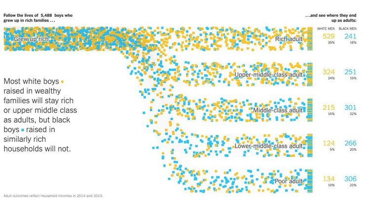

(Source: [*The New York Times*](https://www.nytimes.com/interactive/2018/03/19/upshot/race-class-white-and-black-men.html))

(Source: [*The New York Times*](https://www.nytimes.com/interactive/2017/07/28/climate/more-frequent-extreme-summer-heat.html))

Similarly, make note of graphics that communicate less effectively, and see if you can work out why.

### Assignment

 - By start of next week’s class, complete [this quiz](week2quiz.html) on principles of data analysis and visualizaton.

### Further reading

Alberto Cairo: [*The Functional Art: An Introduction to Information Graphics and Visualization*](https://www.amazon.com/The-Functional-Art-introduction-visualization/dp/0321834739)

Nathan Yau: [*Data Points: Visualization That Means Something*](https://www.amazon.com/Data-Points-Visualization-Means-Something/dp/111846219X)

