# Interviewing data: exploratory graphical analysis

### Introducing Tableau Public

Today we will work with [**Tableau Public**](https://public.tableau.com/s/), which allows you to create a wide variety of interactive charts, maps and tables and organize them into **dashboards** that can be saved to the cloud and embedded on the web.

Tableau was developed for exploratory graphical data analysis, so it is a good tool for exploring a new dataset -- filtering, sorting and summarizing/aggregating the data in different ways while experimenting with various chart types, to find stories in the data.

It also explicitly allows you to use the basic operations

Although Tableau was not designed as a publication tool, the ability to embed finished dashboards and stories has also allowed allowed newsrooms and individual journalists lacking JavaScript coding expertise to create interactive online graphics.

You can also use it to quickly prototype charts that you may later make for publication using another tool.

### The data we will use today

Download the data for this session from [here](data/week3.zip), unzip the folder and place it on your desktop. It contains the following file:

- `nations.csv` Data from the [World Bank Indicators](https://data.worldbank.org/indicator/) portal. Contains the following variables, with data from 1990 to 2017 for each country where available:
 -  `iso2c` `iso3c` Two- and Three-letter codes for each country, assigned by the [International Organization for Standardization](https://www.iso.org/standard/63545.html).
 - `country` Country name.
 - `year`
 - `population` Estimated [total population](https://data.worldbank.org/indicator/SP.POP.TOTL) at mid-year, including all residents apart from refugees.
 - `gdp_percap` [Gross Domestic Product per capita](https://data.worldbank.org/indicator/NY.GDP.PCAP.PP.CD) in current international dollars, corrected for purchasing power in different territories.
 - `life_expect` [Life expectancy at birth](https://data.worldbank.org/indicator/SP.DYN.LE00.IN), in years.
 - `population` Estimated [total population](https://data.worldbank.org/indicator/SP.POP.TOTL) at mid-year, including all residents apart from refugees.
 - `birth_rate` [Live births during the year per 1,000 people](https://data.worldbank.org/indicator/SP.DYN.CBRT.IN), based on mid-year population estimate.
 - `neonat_mortal_rate` [Neonatal mortality rate](https://data.worldbank.org/indicator/SH.DYN.NMRT): babies dying before reaching 28 days of age, per 1,000 live births in a given year.
 - `region` `income` World Bank [regions and income groups](https://siteresources.worldbank.org/DATASTATISTICS/Resources/CLASS.XLS), explained [here](https://datahelpdesk.worldbank.org/knowledgebase/articles/906519).

### Visualize the data on neonatal mortality

#### Connect to the data

Launch Tableau Public, and you should see the following screen:

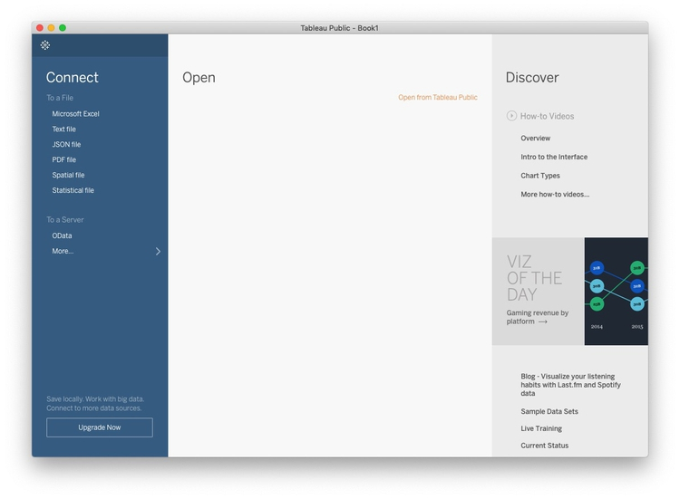

Under the `Connect` heading at top left, select `Text File`, navigate to the file `nations.csv` and `Open`. At this point, you can view the data, which will be labeled as follows:

 - Text: `Abc`
 - Numbers: `#`
 - Dates: calendar symbol
 - Geography: globe symbol

You can edit variables to give them the correct data type if there are any problems:

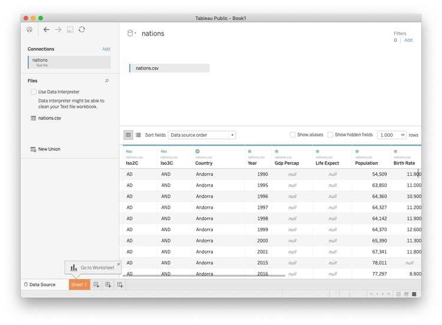

Once the data has loaded, click `Sheet 1` at bottom left and you should see a screen like this:

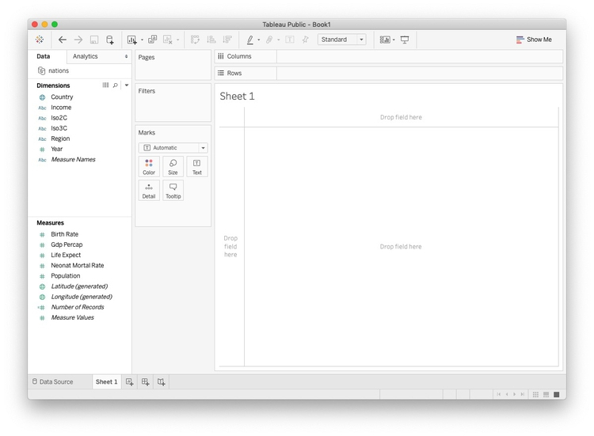

#### Dimensions and measures: categorical and continuous

The variables in the data should appear in the `Data` panel at left. Notice that Tableau has divided them into `Dimensions` and `Measures`. These broadly correspond to categorical and continuous variables. Dimensions are variables containing text or dates, while measures contain numbers.

If any variable appears in the wrong place, click the small downward-pointing triangle that appears when it is highlighted and select `Convert to Dimension` or `Convert to Measure` as required.

#### Shelves and Show Me

Notice that the main panel contains a series of "shelves," called `Pages,` `Columns`, `Rows`, `Filters` and so on. Tableau charts and maps are made by dragging and dropping fields from the data into these shelves.

Over to the right you should see the `Show Me` panel, which will highlight chart types you can make from the data currently loaded into the `Columns` and `Rows` shelves. It is your go-to resource when experimenting with different visualization possibilities. You can open and close this panel by clicking on its title bar.

#### Columns and rows: X and Y axes

The starting point for creating any chart or map in Tableau is to place fields into `Columns` and `Rows`, which for most charts correspond to the X and Y axes, respectively. When making maps, longitude goes in `Columns` and latitude in `Rows`. If you display the data as a table, then these labels are self-explanatory.

#### Some questions to ask this data

Remember our discussion about interviewing data  from week 1? Let's frame some questions to ask today:

- How has the neonatal death rate for each country changed over time?
- How has the total number of neonatal deaths changed over time, globally, regionally, and nationally?

#### Create new calculated variables

The data contains variables giving birth and neonatal death rates, but not the total numbers of births and deaths, which must be calculated. From the top menu, select `Analysis>Create Calculated Field`. Fill in the dialog box as follows (just start typing a variable name to select it for use in a formula):

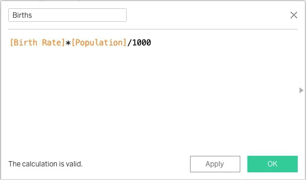

Notice that calculated fields appear in the `Data` panel preceded by an `=` symbol.

Now create a second calculated field giving the total number of neonatal deaths:


In the second formula, we have rounded the number of neonatal deaths to the nearest thousand using `-3` (`-2` would round to the nearest hundred, `-1` to the nearest ten, `1` to one decimal place, `2` to two decimal places, and so on.)

Here we have simply run some simple arithmetic, but it's possible to use a wide variety of functions to manipulate data in Tableau in many ways. To see all of the available functions, click on the little gray triangle at the right of the dialog boxes above.

#### Understand that Tableau's default behavior is to summarize/aggregate data

As we work through today's exercises, notice that Tableau routinely summarizes or aggregates measures that are dropped into `Columns` and `Rows`, calculating a `SUM` or `AVG` (average or mean), for example.

This behavior *can* be turned off by selecting `Analysis` from the top menu and unchecking `Aggregate Measures`. However, I do not recommend doing this, as it will disable some Tableau functions. Instead, if you don't want to summarize *all* of the data, drop categorical variables into the `Detail` shelf so that any summary statistic will be calculated at the correct level for your analysis. If you do want to see every data point, you can adjust what you drop into this shelf so the summary is being performed on every single row in the data, and therefore has no effect. We'll spend some time in class seeing how this works.

#### Make a line chart showing neonatal mortality rate by country over time

To address our first question, and explore the neonatal death rate over time by country, we can use a line chart.

First, select `Neonat Mortal Rate` in the `Measures` panel and click the small downward-pointing triangle at right to bring up its menu. Select `Rename` and change to `Neonatal death rate (per 1,000 births)`.

Then drag this variable to `Rows` and `Year` to `Columns`.  The chart should now look like this:

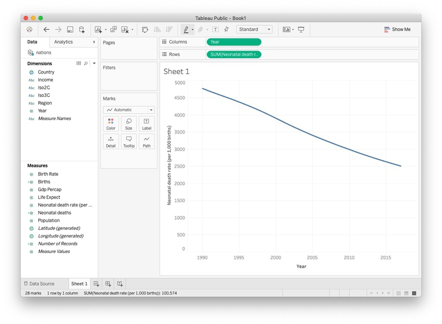

Tableau has summarized the data by adding up the rates for each country in every year, using the function `SUM`. You can change the summary function by opening the menu for the variable in `Rows`, as follows:

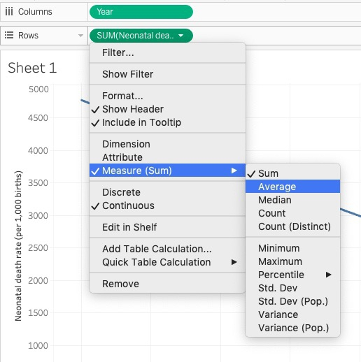

Adding rates together across countries makes no sense. And we aren't interested in the average or median neonatal death rate across countries. Instead, we want one line for each country. So drag `Country` to `Detail` in the `Marks` shelf:

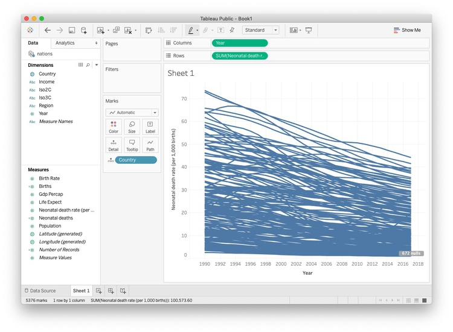

Notice that changing the summary function now makes no difference to the chart, apart from the wording of the axis. This is because the chart is plotting values for each country in each year, for which there is only one record. So the `SUM` or `AVG` is the sum or mean of just one number.

We can use color to distinguish the different regions, so drag region to `Color`:

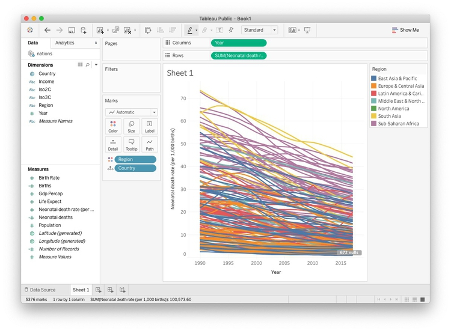

`Region` is a categorical variable, and Tableau has selected its default qualitative color palette. For a more subtle color scheme, click on `Color`, select `Edit Colors...` and at the dialog box select the `Tableau Classic Medium` qualitative color scheme, then click `Assign Palette` and `OK`.

Tableau's qualitative color palettes are well designed, so there is no need to adopt a ColorBrewer palette. However, it is possible to edit colors individually if you wish, by double clicking on each data item at this dialog box and inputing RGB or HEX values.

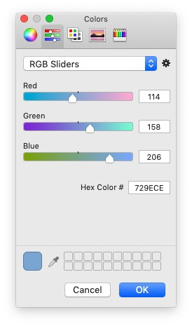

Click on `Color` again and set transparency to 75%. (For your assignment you will create a chart with overlapping circles, which will benefit from using some transparency to allow all circles to be seen. So we are setting transparency now for consistency.)

Now we'll tidy up the X axis to make the lines fill the chart area. Right-click on the X axis, select `Edit Axis`, edit the dialog box as follows and then close it:

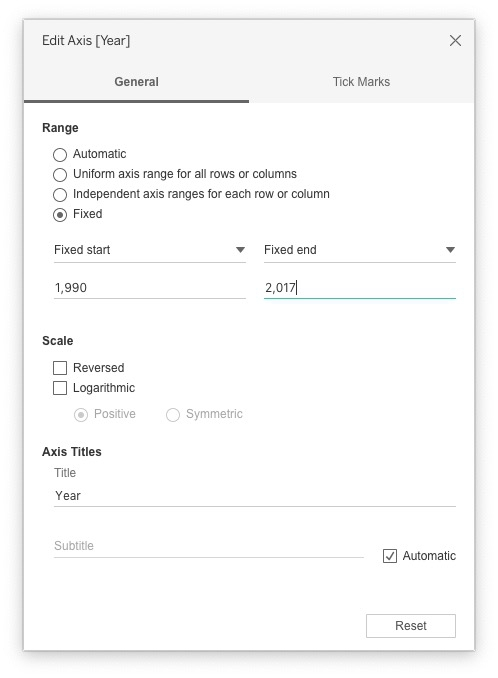

Notice that a pin has now appeared on the axis, letting you know that it has been fixed.

Right-click on the X axis again, select `Format` and use the dropdown menu set the `Font` for the entire worksheet to bold. Close the `Format` panel and the chart should now look like this:

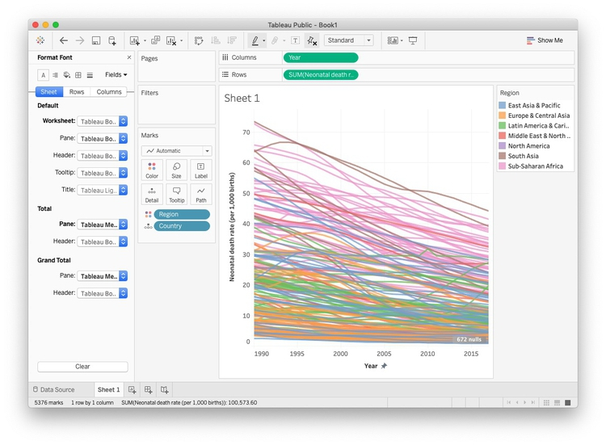

Remove the `Sheet 1` title on the chart by selecting the text, opening the dropdown menu, and selecting `Hide Title`.

We can also highlight the countries with the highest total number of neonatal deaths by dragging `Neonatal deaths` to `Size`. The chart should now look like this:

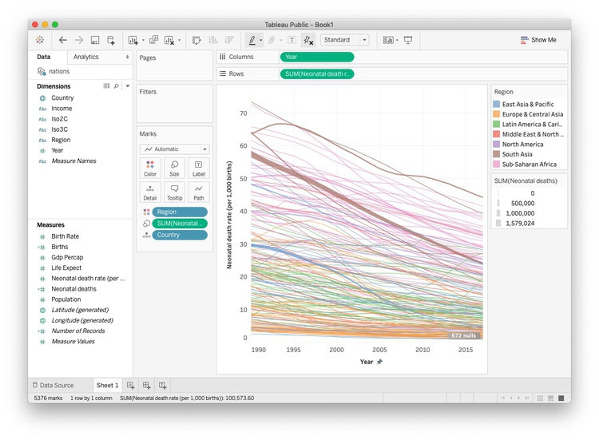

Notice that Tableau has added a size legend for line thickness.

This line chart shows that the trend in most countries has been to reduce neonatal deaths, while some countries have had more complex trajectories. But this is a very busy chart -- not something that I'd recommend publishing!

However, to make comparisons between individual countries, we can add controls to filter the chart.

Tableau's default behavior when data is filtered is to redraw charts to reflect the values in the filtered data. So if we want the Y axis and the line thicknesses to stay the same when the chart is filtered, we need to freeze them.

To freeze the line thicknesses, hover over the title bar for the line thickness legend, select `Edit Sizes...` and fill in the dialog box as follows:

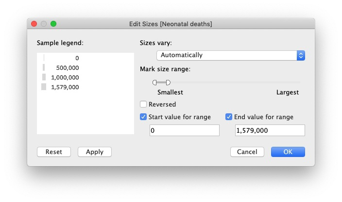

Now remove this legend from the visualization, by opening its dropdown menu and selecting `Hide Card`. We can later add an annotation to explain the line thickness. (We will later make a map to serve as a color legend for region, so also hide the color legend.)

To freeze the Y axis, right-click on it, select `Edit Axis...`, make it `Fixed` and close the dialog box:

Now drag `Country` to `Filters`, make sure `All` are checked, and at the dialog box, click `OK`:

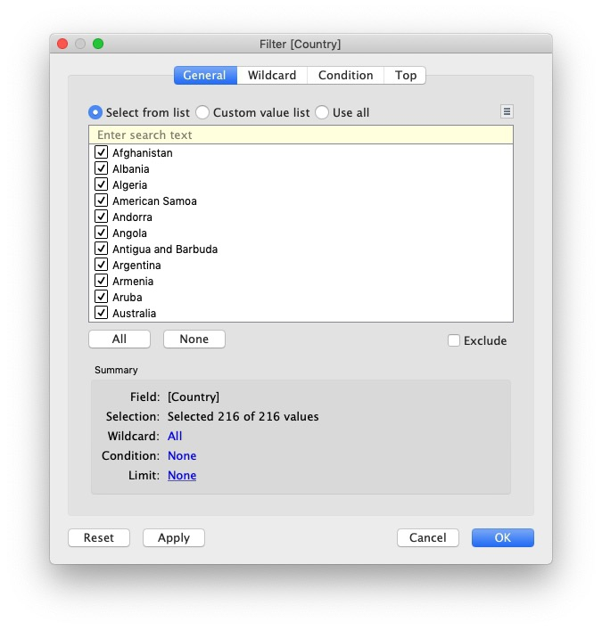

So far we have made all countries available to be filtered, but we have not filtered any from the chart. Now we need to add a filter control to select countries to compare. On `Country` in the `Filters` shelf, select `Show Filter`. A default filter control, with a checkbox for each nation, will appear to the right of the chart:

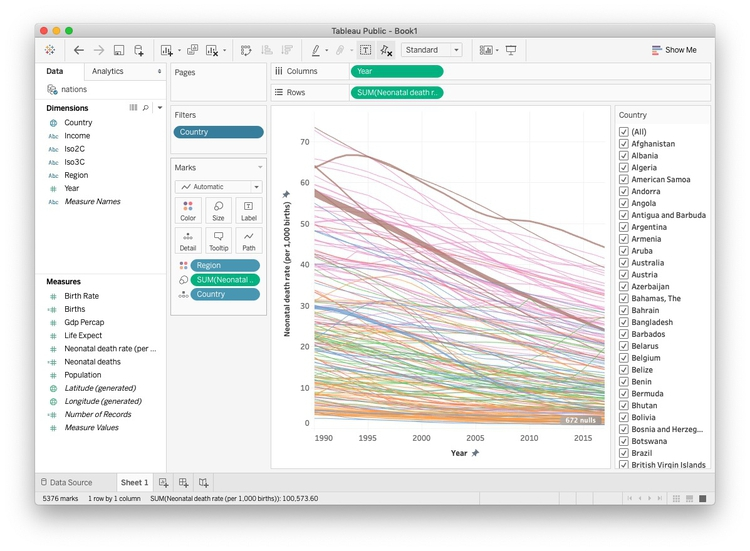

This isn't the best filter control for this visualization. To change it, click on the title bar for the filter, note the range of filter controls available, and select `Multiple Values (custom list)`. This allows users to select individual countries by starting to type their names.

Take some time to explore how this filter works.

In the `Data` panel at left, rename `Income` to `Income group`. Then add `Region` and `Income group` to `Filters`, making sure that `All` options are checked for each. Select `Show Filter` for both of these filters, and select `Single Value Dropdown` for the control. Reset both of these filters to `All`, and the chart should now look like this:

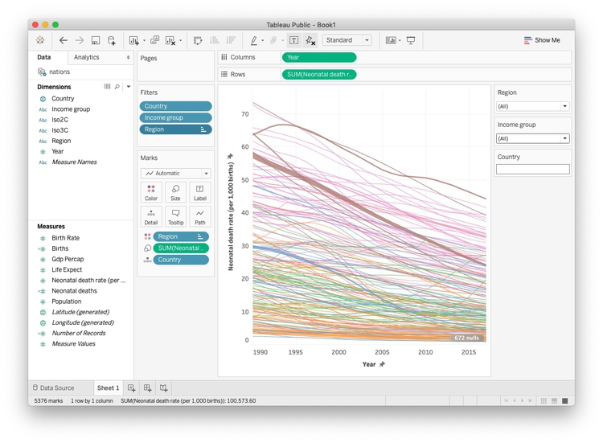

Notice that the `Income group` filter lists the options in alphabetical order, rather than income order, which would make more sense. To fix this, right-click on `Income group` in the `Data` panel and select `Default Properties>Sort`. At the dialog box below, select `Manual` sort, edit the order as follows and click `OK`:

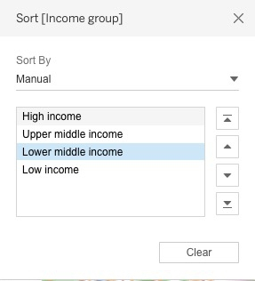

Hover over one of the lines, and notice the tooltip that appears. By default, all the variables we have used to make the visualization appear in the tooltip. If you need any more, just drag those fields onto `Tooltip`.

Click on `Tooltip` and edit as follows. (Unchecking `Include command buttons` disables some interactivity, giving a plain tooltip):

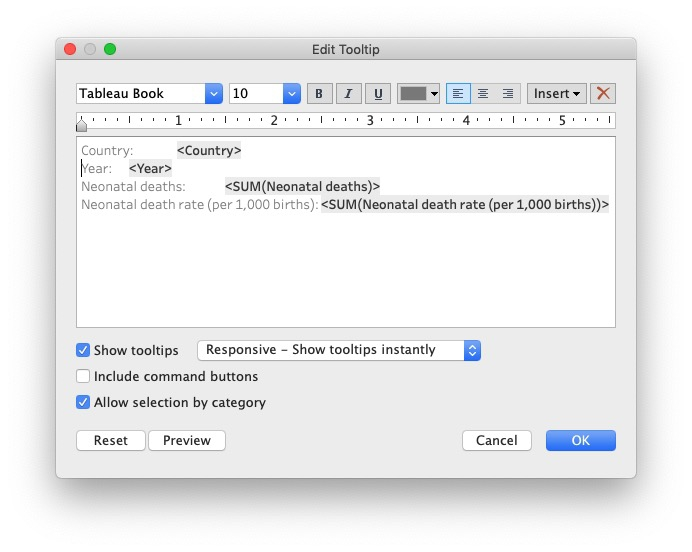

#### Save to the web

Right click on `Sheet 1` at bottom left and `Rename Sheet` to `Line chart`. Then select `File>Save to Tableau Public...` from the top menu. At the logon dialog box enter your Tableau Public account details, give the Workbook a suitable name and click `Save`. When the save is complete, a view of the  visualization on Tableau's servers will open in your default browser.

Note: Each time you save, you save the entire workbook, with all the worksheets and dashboards in that project. So as you save your work, keep saving under the same name (don't use `Save As`).

#### An alternative to filtering: highlight countries for comparison with color

In week 2, we looked at Alberto Cairo's visualizations of Brazilian demography, which included a line chart of fertility rates over time for different countries with most of those lines grayed out, and just a few countries highlighted in color.

To achieve something similar for our chart, open up the menu for the sheet and select `Duplicate` to copy the chart.

Now need to create a new calculated variable with the names of those countries we want to highlight, and other countries given the same label, such as `Other`.

Select `Analysis>Create Calculated Field...`, call the new variable `Country2` and fill in the formula as follows:

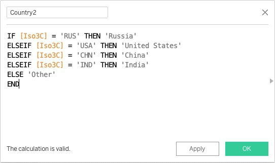

You can copy the formula from here:

```R
IF [Iso3C] = 'RUS' THEN 'Russia'
ELSEIF [Iso3C] = 'USA' THEN 'United States'
ELSEIF [Iso3C] = 'CHN' THEN 'China'
ELSEIF [Iso3C] = 'IND' THEN 'India'
ELSE 'Other'
END
```

This formula use some simple functions to name the four highlighted countries according to their three-letter county codes, and label all the rest as `Other`.

Now drag `Country2` onto `Color` and the chart should look like this:

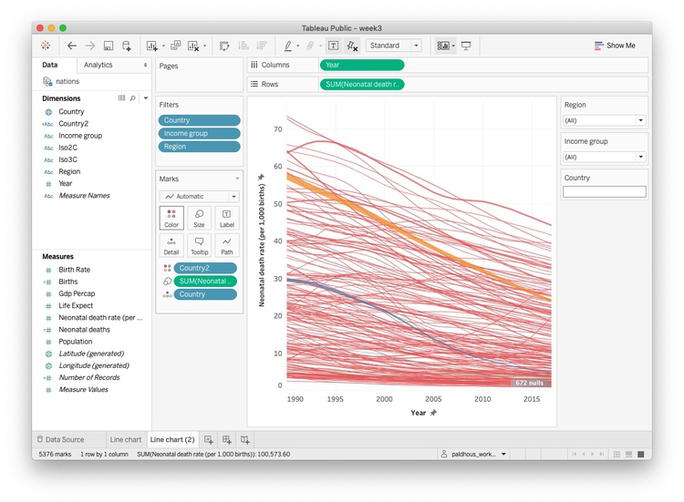

Select `Color>Edit Colors...` and change the colors manually, selecting a light gray, such as HEX `#dcdcdc` for `Other`:

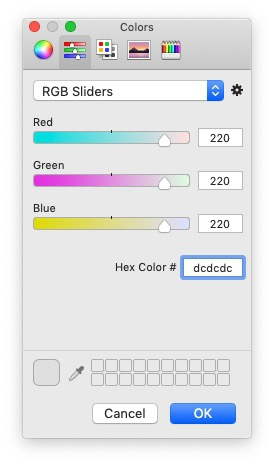

The chart should now look like this:


This is OK, except the lines for Russia and the United States are partially obscured. To fix that, open the menu for `Country2` in the `Marks` shelf, select `Sort...` and manually edit the order as follows:

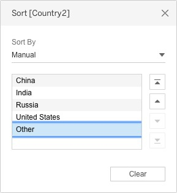

Now we have the desired chart appearance:

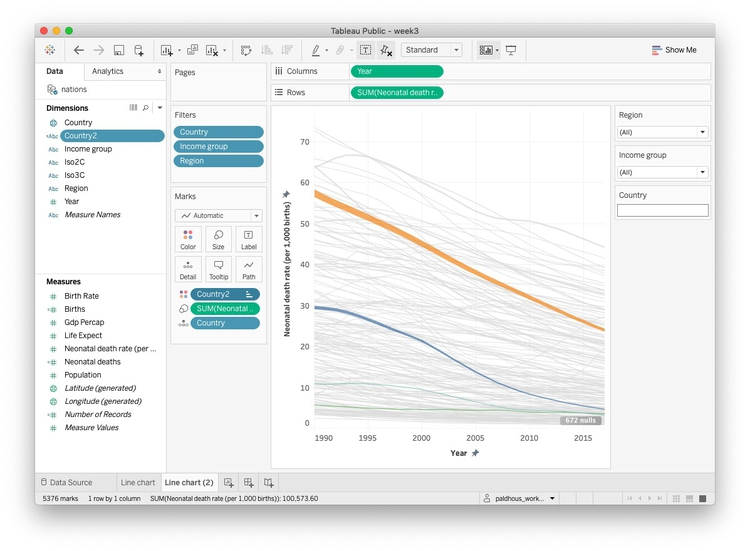

Rename the sheet `Line chart alt`.

#### Make a map to use as a color legend for the first chart

Select `Worksheet>New Worksheet` from the top menu, and double-click on `Country`. Tableau recognizes the names of countries and states/provinces; for the U.S., it also recognizes geographies including counties, zip codes, and congressional districts. Click on `unknown` at bottom right to manually edit any countries that haven't been recognized:

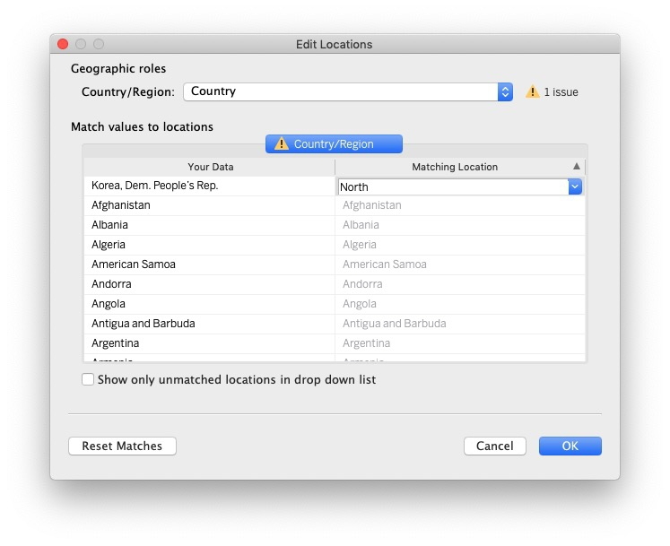

Tableau's default map-making behavior is to put a circle at the geographic center, or centroid, of each area, which can be scaled and colored to reflect values from the data:

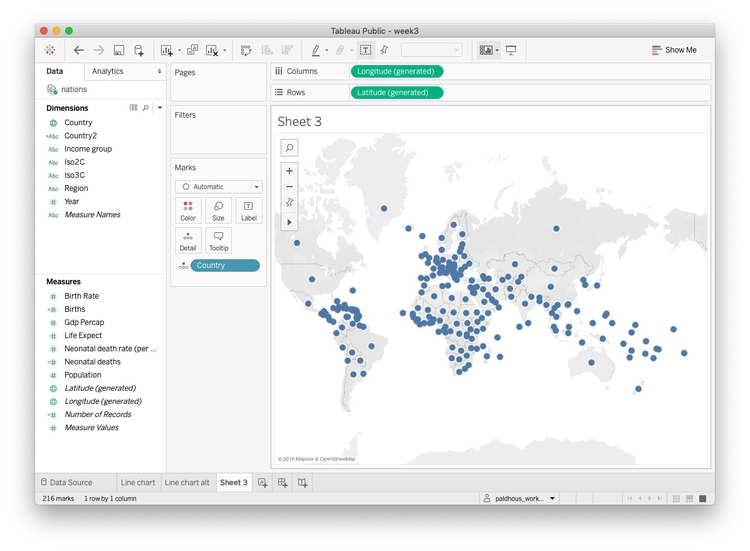

However, we need each country to be filled with color by region. Using `Show Me`, switch to the `filled maps` option, and each nation should fill with color. Drag `Region` to `Color` and see how the same color scheme we used previously carries over to the map. Click on `Color`, set the transparency to 75% to match the line chart and remove the borders. Also click on `Tooltip` and uncheck `Show tooltips` so that no tooltip appears on the legend.

We will use this map as a color legend, so its separate color legend is unnecessary. Click the color legend’s title bar and select `Hide Card` to remove it from the visualization. Also remove the `Sheet 3` title.

Center the map in the view by clicking on it, holding and panning, as you would on Google Maps.

From the top menu, select `Map>Map Options...` and uncheck all the options at the dialog box to remove the controls from the map:

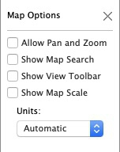

The map should now look something like this:

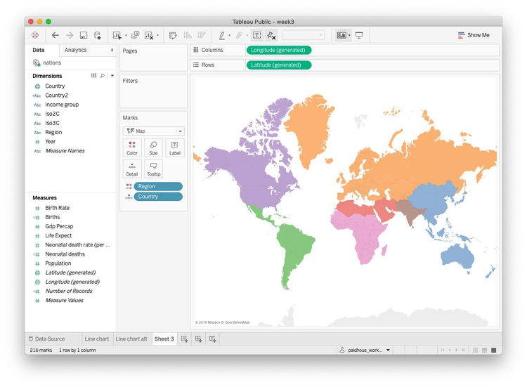

Rename the worksheet `Map legend` and save to the web again.


#### Make a series of treemaps showing neonatal deaths over time

Select `Worksheet>New Worksheet` from the top menu to open a new sheet.

Remember our second question:

- How has the total number of neonatal deaths changed over time, globally, regionally, and nationally?

To address this question in a single chart, we can use a series of treemps, which allow us to directly compare the neonatal deaths in each country, nested by region.

Drag `Country` and `Region` onto `Columns` and `Neonatal deaths` onto `Rows`. Then open `Show Me` and select the `treemap` option. The initial chart should look like this:

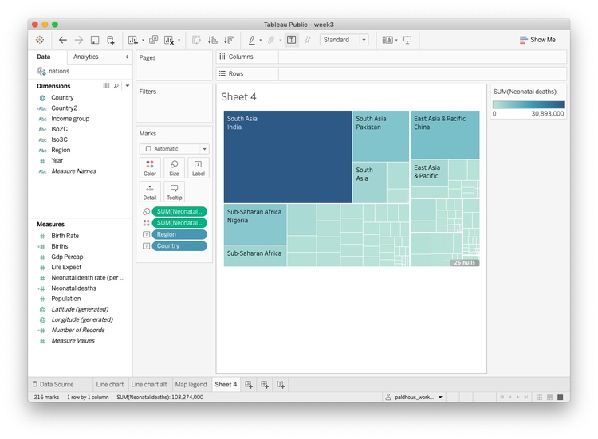

Look at the `Marks` shelf and see that the size and color of the rectangles reflect the `SUM` of `Neonatal deaths` for each country, while each rectangle is labeled with `Region` and `Country`.

Now drag `Region` to `Color` to color the rectangles by region. Tableau will rember the region color palette you selected previously in the same worksheet. Click on `Color` and again set the opacity to 75%. Remove the color legend and the sheet title.

The treemap should now look like this:

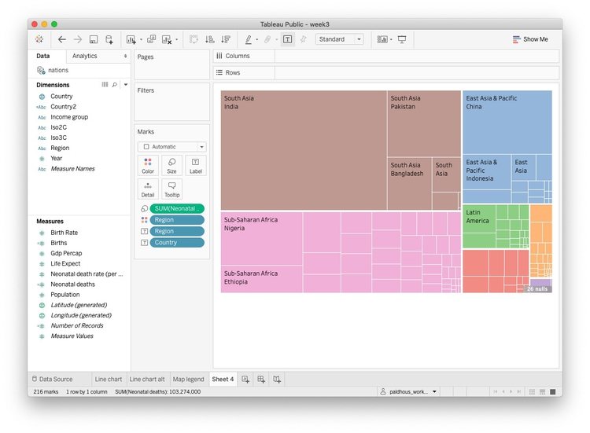

Tableau has by default aggregated `Neonatal deaths` using the `SUM` function, so what we are seeing is the number for each country added up across the years.

To see one year at a time, we need to filter by year. If you drag the existing `Year` variable to the `Filters` shelf, you will get the option to filter by a range of numbers, which isn't what we need:

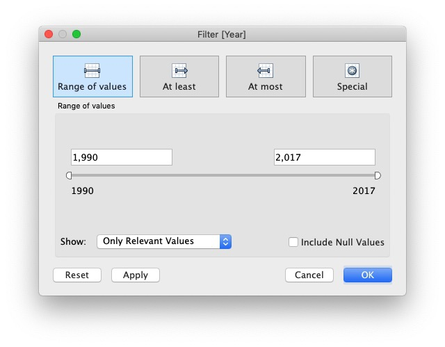

Instead, we need to be able check individual years, and draw a treemap for each one. To do that, select `Year` in the `Dimensions` panel and `Duplicate`.

Select the new variable and `Convert to Discrete` and then `Rename`	it `Year (discrete)`. This allows each year to be selected individually, rather than as part of a range of numbers.

Now drag this new variable to `Filters`, select 2017, and click `OK`:

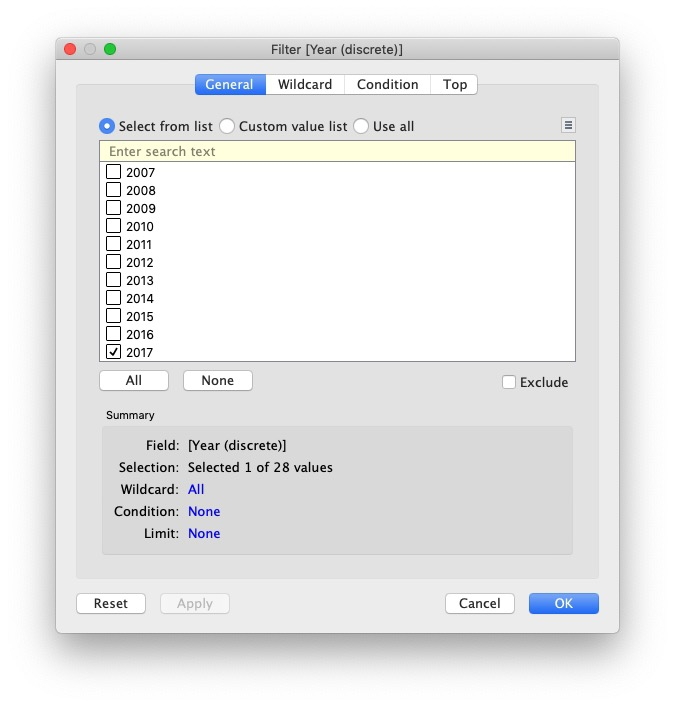

The treemap now displays the data for 2017:

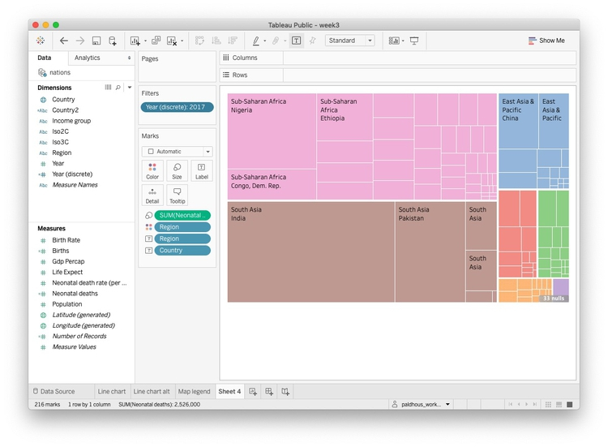

That's good for a snapshot of the data, but with a little tinkering, we can adapt this visualization to show change in the number of neonatal deaths over time at the national, regional and global levels.

Select `Year (discrete)` in the `Filters` shelf and `Edit Filter...` to edit the filter. Select every fifth year, starting with 1990, and click `OK`:

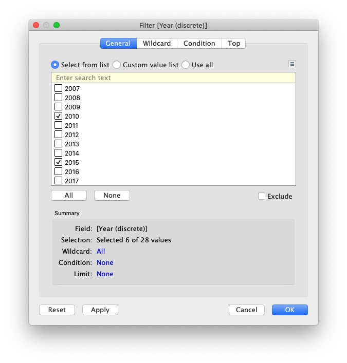

Now drag `Year (discrete)` onto `Rows` and the chart should look like this:

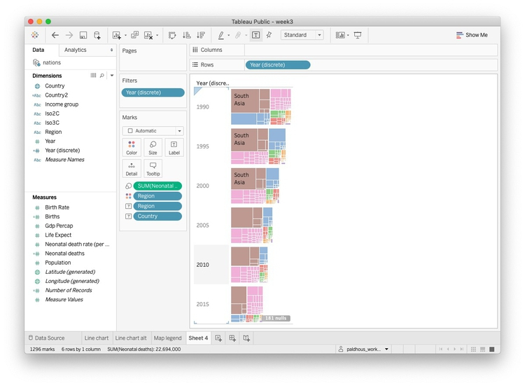

The formatting needs work, but notice that we now have a bar chart made out of treemaps.

Extend the chart area to the right by changing from `Standard` to `Entire View` on the dropdown menu in the top ribbon:


I find it more intuitive to have the most recent year at the top, so select `Year (discrete)` in the `Rows` shelf, select `Sort` and fill in the dialog box so that the years are sorted in `Descending` order:

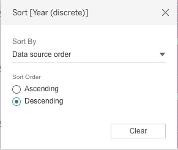

The chart should now look like this:

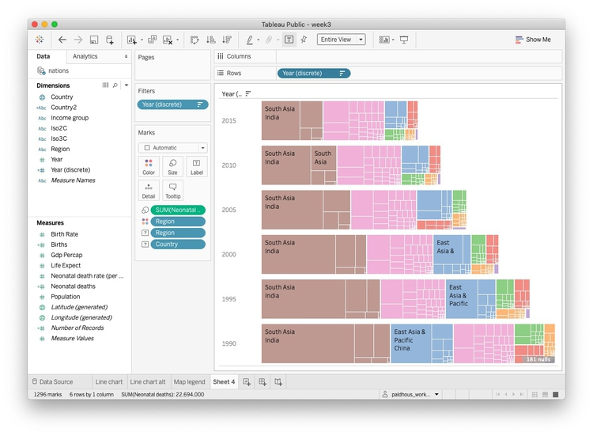

To remove some more clutter from the chart, select `Format>Borders...` from the top menu, and under `Sheet>Row Divider`, set `Pane` to `None`. Then close the `Format Borders` panel.

Select `Format>Font...` and set a Bold font for the entire worksheet. Then close the `Format Font` panel.

Right-click on `Year (discrete)` at the top left of the chart and select `Hide Field Labels for Rows`. Hover just above the left hand edge of the bars until you see a double headed arrow, and then drag the bars a little closer to the year labels.

The labels will only appear in the larger rectangles. Rather than removing them entirely, let’s just leave a label for India in 2015, to make it clear that this is the country with by far the largest number of neonatal deaths. 

First drag the `Region` label from the `Marks` shelf to remove it. Then click on `Label` in the Marks shelf, and switch from `All` to `Selected` under `Marks to Label`. Then right-click on the rectangle for India in 2015, and select `Mark Label>Always Show`. The chart should now look like this:

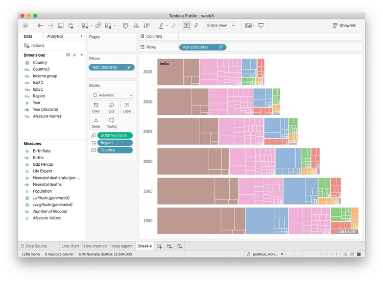

Click on `Tooltip` and edit as follows:

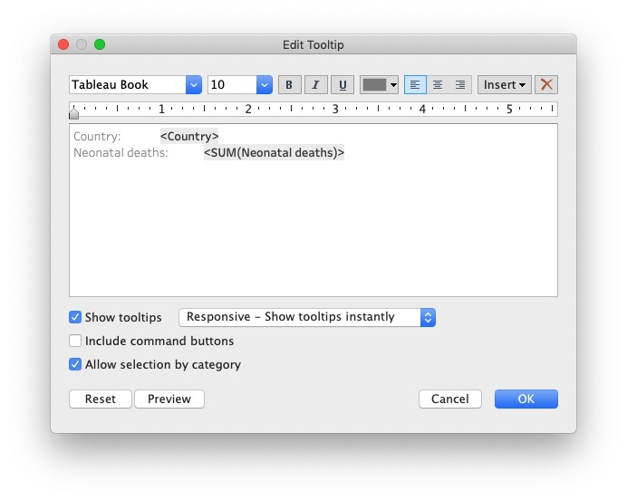

Rename the sheet `Treemap bar chart` and save to the web.

#### Make a dashboard combining both charts

From the top menu, select `Dashboard>New Dashboard`. Set its `Size` to `Automatic`, so that the dashboard will fill to the size of any screen on which it is displayed:

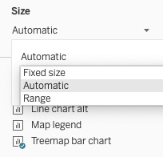

To make a dashboard, drag charts, and other elements from the left-hand panel to the dashboard area. Notice that Tableau allows you to add items including: horizontal and vertical containers, text boxes, images (useful for adding a publication's logo), embedded web pages and blank space. These can be added `Tiled`, which means they cannot overlap, or `Floating`, which allows one element to be placed over another.

Drag `Treemap bar chart` from the panel at left to the main panel. The default title, from the worksheet name, isn't very informative, so right-click on that, select `Edit Title ...` and change to `Total deaths`.

Now add `Line Chart` to the right of the dashboard (the gray area will show where it will appear) and edit its title to `Death rates`. Also add a note to explain that line widths are proportional to the total number of deaths. The dashboard should now look like this:

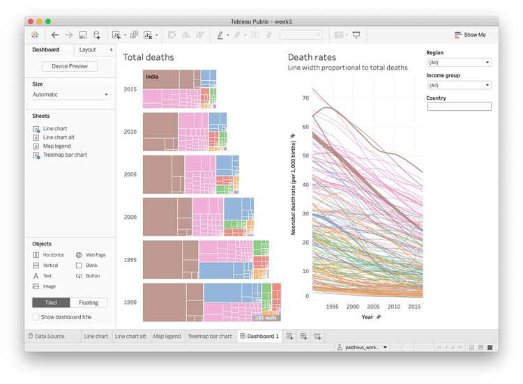

Notice that the `Country`, `Region` and `Income group` filters control only the line chart. To make them control the treemaps, too, click on each filter, open up the dropdown menu form the downward-pointing triangle, and select `Apply to Worksheets>Selected Worksheets...` and fill in the dialog box as follows:

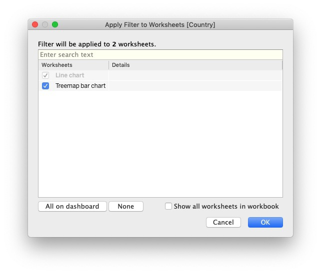

The filters will now control both charts.

Add `Map legend` for a color legend at bottom right. (You will probably need to drag the window for the last filter down to push it into position.) Hide the legend's title.

We can also allow the highlighting of a country on one chart to be carried across the entire dashboard. Select `Dashboard>Actions...` from the top menu, and at the first dialog box select `Add action>Highlight`. Filling the second dialog box as follows will cause each country to be highlighted across the dashboard when it is clicked on just one of the charts:

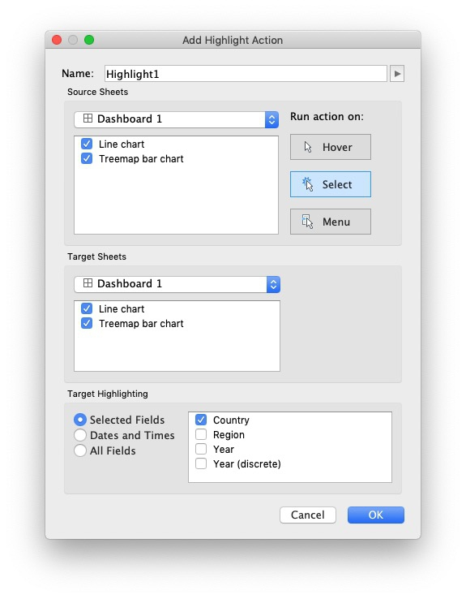

Click `OK` on both dialog boxes to apply this action.

Select `Dashboard>Show Title` from the top menu. Right-click on it, select `Edit Title...` and change from the default to something more informative:

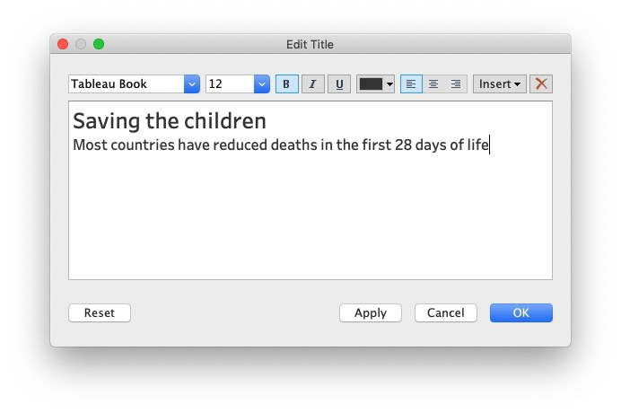

Now drag a `Text` box to the bottom of the dashboard and add a footnote giving source information:

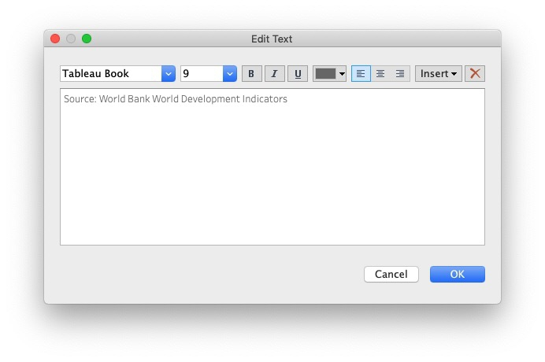

The dashboard should now look like this:

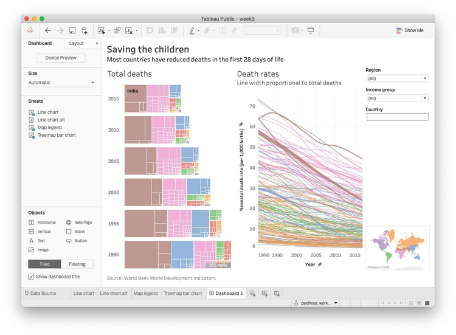

#### Design for different devices

This dashboard works on a large screen, but not on a small phone. To see this, click the `Device Preview` button at top left and select `Phone` under `Device type`. In portrait orientation, this layout does not work at all:

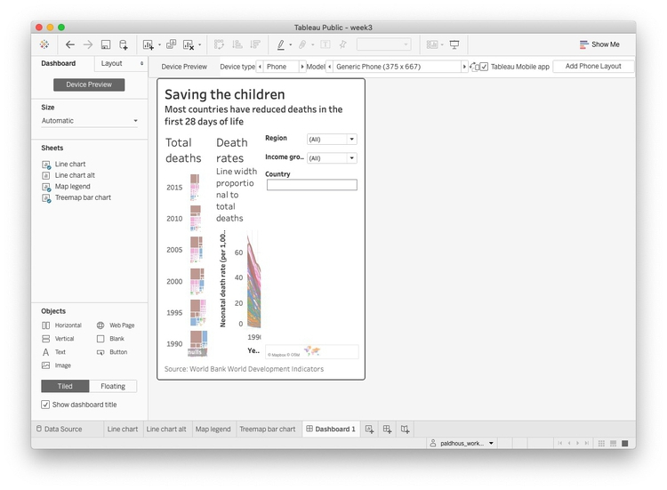

Click the `Add Phone Layout` at top right, and then click `Custom` tab under `Layout - Phone` in the left-hand panel. You can then rearrange and if necessary remove elements for different devices. Here I have removed the line chart and filter controls, and changed the legend to a `Floating` element so that it sits in the blank space to the top right of the bar chart of treemaps.

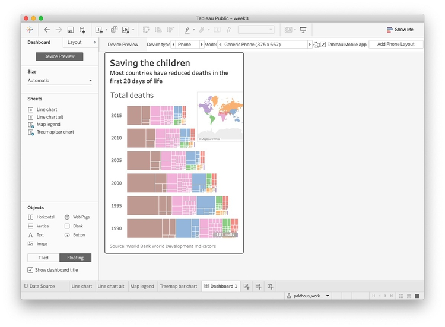

Switch back to the `Default` device, and save to the web once more. Once the dashboard is online, use the `Share` link at the bottom to obtain an embed code, which can be inserted into the HTML of any web page.

(You can also `Download` a static view of the graphic as a PNG image or a PDF.)

You can download the workbook for a Tableau visualization by clicking the `Download Workbook` link. The files (which will have the extension `.twbx`) will open in Tableau Public.

Having saved a Tableau visualization to the web, you can reopen it by selecting `File>Open from Tableau Public...` from the top menu.

#### Another approach to responsive design

As an alternative to using Tableau's built-in device options, you may wish to create different dashboards, each with sizes appropriate for phones, tablets, and desktops respectively. You can then follow the instructions [here](https://public.tableau.com/s/blog/2014/11/making-responsive-tableau-dashboards) to put the embed codes for each of these dashboards into a `div` with a separate class, and then use `@media` CSS rules to ensure that only the div with the correct dashboard displays, depending on the size of the device.

When making responsively designed web pages, make sure to include this line of code between the `<head></head>` tags of your HTML:

```CSS
<meta name="viewport" content="width=device-width, initial-scale=1.0">
```

### Assignment

- Create [a second dashboard](https://public.tableau.com/views/class3_5/Dashboard2?:embed=y&:display_count=yes) like this from the `nations.csv` data.

 Here are some hints:

 - Drop `Year` into the `Pages` shelf to create the control to cycle through the years.
 - You will need to change the `Marks` to solid circles and scale them by the total number of neonatal deaths. Having done so, you will also need to increase the size of all circles so countries with small numbers of neonatal deaths are visible. Good news: Tableau's default behavior is to size circles correctly by area, so they will be the correct sizes, relative to one another.
 - You will need to switch to a `Logarithmic` X axis and alter/fix its range.
 - Format GDP per capita in dollars by clicking on it in the `Data` panel and selecting `Default Properties>Number Format>Currency (Custom)`.
 - Create a single trend line for each year's data, so that the line shifts with the circles from year to year. Do this by dragging `Trend line` into the chart area from the `Analytics` panel. You will then need to select `Analysis>Trend Lines>Edit Trend Lines...` and adjust the options to give a single line with the correct behavior.
 -  Getting the smaller circles rendered on top of the larger ones, so their tooltips can be accessed, is tricky. To solve this, open the dropdown menu for `Country` in the `Marks` shelf, select `Sort` and fill in the dialog box as follows:

   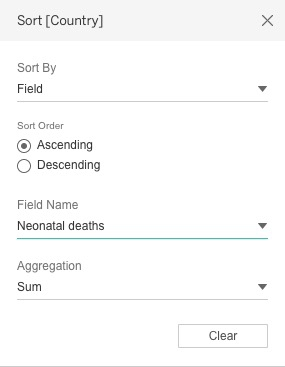

   Now drag `Country` so it appears at the top of the list of fields in the `Marks` shelf.

 This should be a challenging exercise that will help you learn how Tableau works. If you get stuck, download my visualization and study how it is put together.

- By next week's class, file the url for your second dashboard via bCourses. (Don't worry about designing for different devices.)

### Further reading/viewing

[Tableau Public training videos](https://public.tableau.com/s/resources)

[Gallery of Tableau Public visualizations](https://public.tableau.com/en-us/s/gallery): Again, you can download the workbooks to see how they were put together.

[Tableau Public Knowledge Base](https://www.tableau.com/support/knowledgebase): Useful resource with the answers to many queries about how to use the software.


