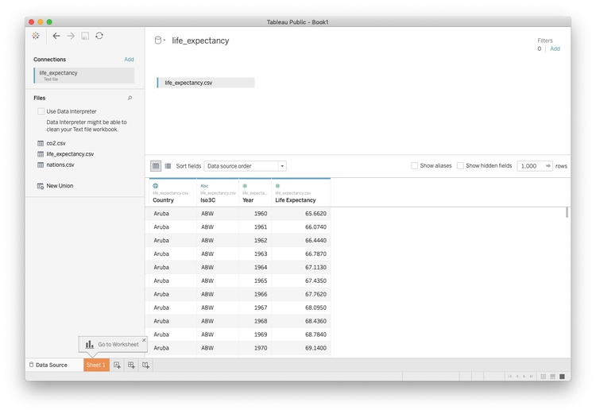
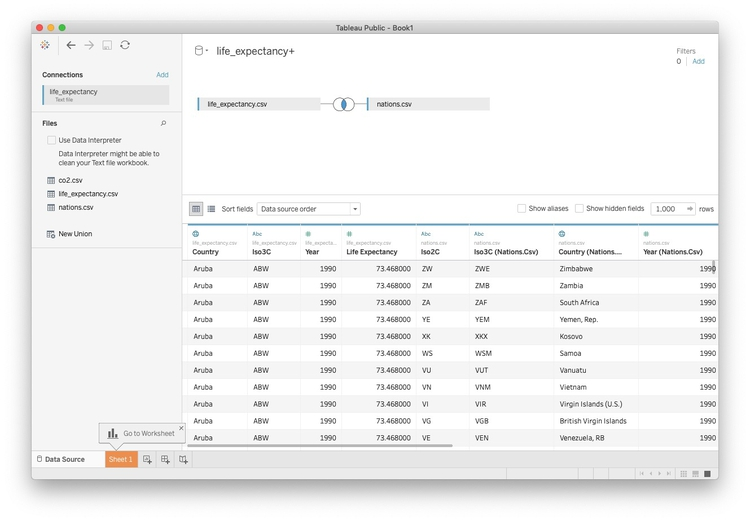

#Let's apply what we've learned so far

Your task for this week's class is to create a Tableau version of the visualization in [this Gapminder video](https://www.gapminder.org/videos/200-years-that-changed-the-world-bbc/), using data from the World Bank's [World Development Indicators](https://data.worldbank.org/indicator/?tab=all) (WDI):

@

(Source: [BBC/Gapminder](http://www.gapminder.org/videos/200-years-that-changed-the-world-bbc/))

### The data we will use today

Download the data for this session from [here](data/week6.zip), unzip the folder and place it on your desktop. It contains the following files:

- `nations.csv` As used in week 3, but lacking the variable for life expectancy at birth.

- `co2.csv` From the [Global Carbon Atlas](http://www.globalcarbonatlas.org/en/CO2-emissions). Contains the following fields:
 - `iso3c` Three-letter code for each country.
 - `country` Country name.
 - `year`
 - `emissions` Carbon dioxide emissions, in millions of tonnes.

### How to proceed

- Download data in Excel format for life expectancy at birth by nation over time from [here](https://data.worldbank.org/indicator/SP.DYN.LE00.IN).

- Process this data using Open Refine to remove the rows above the header row, and remove columns to leave just the country names, country codes, and data from 1960 onwards. Then convert from wide to long format. When doing this, I would call the new column with life expectancy data `life_expectancy`. I would also rename `Country Code` to `iso3c` and rename `Country Name` to `country`. Then the variable names will match those in `nations.csv`. Place this file in the `week6` folder.

- Export the data in CSV format with the filename `life_expectancy.csv` and place this file in the `week6` folder.

- Launch Tableau, and connect to the `life_expectancy.csv` file in the `week6` folder.

 

 Now double-click on the file `nations.csv`. Tableau will now attempt to **join** the data based on common fields:

 

To control how the join is performed, click on the circles with the blue area of overlap. Remember that there is one row in this data for each country in each year. So to join the data appropriately, we need to join by `year` and the `iso3c` country code (joining by unambiguous codes is generally a better idea than joining by names).

There are four types of join in Tableau:

 

**Inner Join:** Returns values from both tables that match on the selected variables. The rest of the data is discarded.
**Left Join:** Returns all the values from the left-hand table, plus those from the from the right-hand table that match on the selected variables. Where there is no match, values will be null.
**Right Join:** Returns all the values from the right-hand table, plus those from the from the left-hand table that match on the selected variables. Where there is no match, values will be null.
**Full Outer Join:** Returns all the values from the both tables, matching them on the selected variables where possible. Where there is no match, values will be null.

For this exercise, choose an inner join.

 

The joined data should look like this in a Tableau worksheet. You can see which variables came from which file:

 

- Use the joined data to create a version of the Gapminder visualization, covering the period from 1990 to 2017.

### Assignment

-  Join the file `co2.csv` to the file `nations.csv` in Tableau as above, then create [this simple dashboard](https://public.tableau.com/profile/paldhous.workshops#!/vizhome/co22019dataviz/Dashboard1?publish=yes) shown below, recording total carbon dioxide emissions by region and nation, from 1990 to 2017. 

 

