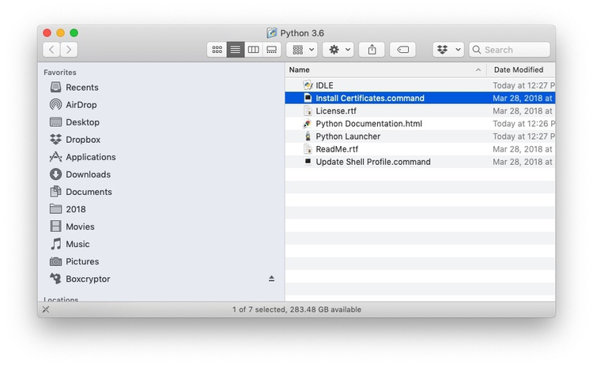

# Software and other tools

When you try to install some of the software below, you will be warned that it comes from an unknown developer. To override this warning and install the software, right-click and select `Open`.

### [Google Sheets](https://www.google.com/sheets/about/)
Our spreadsheet application for these classes will be Google Sheets. Use from your [Google Drive ](https://drive.google.com/)account.

### [Chrome](https://www.google.com/chrome/)

Some of the tools we will use are Chrome add-ons. Ensure that you have the latest version of this popular web browser.

### [Sublime Text](https://www.sublimetext.com/) or [Brackets](http://brackets.io/)

For some exercises, you will need a text editor optimized for authoring web pages. These are both good options.

### [ColorBrewer](http://colorbrewer2.org/)
Your go-to resource for color schemes to encode data. Web app: no installation required.

### [Color Oracle](https://colororacle.org/)
Allows you to simulate the effects of three forms of colorblindness on your screen, to check that your charts and maps do not exclude the color-impaired. [Download](https://colororacle.org/index.html) and move to your Applications folder. When launched, program icon will appear to the right of your menu bar. You can set to start at login under `Preferences`.

### [Tableau Public](https://public.tableau.com/s/)
Visualization software designed for exploratory graphic analysis, which also allows you to create interactive online graphics without JavaScript coding. You will also need to [sign up](https://public.tableausoftware.com/auth/signup) for a free Tableau Public account.

### [GitHub Desktop](https://desktop.github.com/)

Point-and-click GUI for version control of your projects, and synching with remote hosting at [GitHub](https://github.com/). Download from [here](https://desktop.github.com/). You will also need to sign up [here](https://github.com/) for a free GitHub account.

### [Haroopad](http://pad.haroopress.com/)

[Markdown](https://en.wikipedia.org/wiki/Markdown) editor, which will make authoring webpages much easier. Download from [here](http://pad.haroopress.com/user.html). (If you are already using Markdown, feel free to keep using the editor of your choice.)

### [Open Refine](http://openrefine.org/)
A powerful tool for data cleaning. Download the **version 3.2** [from here](http://openrefine.org/download.html). When launched, Open Refine will work in your default web browser; note that your data remains on your computer, and is not uploaded to the web.

### [Tabula](https://tabula.technology/)
A tool for extracting tables of data from digital PDFs. Downlaod from [here](https://tabula.technology/). When launched, Tabula will work in your default web browser; again, your data remains on your computer, and is not uploaded to the web.

### [Mr. Data Converter](https://shancarter.github.io/mr-data-converter/)
Allows you to convert tabular (spreadsheet/CSV) data to web-friendly formats including JSON. Web app: no installation required.

### [R](https://www.r-project.org/) and [R Studio](https://www.rstudio.com/)
R is a software environment and programming language for statistical computing and graphics. Download the version for OSX from [here](https://cran.rstudio.com/). R Studio provides a user interface that makes it much easier to use. Download the latest free version of RStudio Desktop [from here](https://www.rstudio.com/products/rstudio/download/).

### [GPS Visualizer batch geocoder](https://www.gpsvisualizer.com/geocoder/)
Allows you to convert addresses to latitude and longitude coordinates. Web app: no installation required; however, you will need to sign up for API keys for the geocoding services it uses.

### [QGIS](https://qgis.org/en/site/)
The leading open source Geographic Information System. Download the **long-term release** from [here](https://qgis.org/en/site/forusers/download.html), and download Python 3.6 from [this link](https://www.python.org/ftp/python/3.6.5/python-3.6.5-macosx10.9.pkg).

First install Python 3.6. When the installation package has finished running, this window should open:

Double-click on each of `Install Certificates.command` and `Udpate Shell Profile.command` to complete the installation. Doing so will open a Terminal window and run a script. You can close each window after the script has run.

Now install QGIS.

### [Mapbox Studio](https://www.mapbox.com/mapbox-studio/)

Web-based map design studio. Sign up [here](https://www.mapbox.com/signup/) for a free Mapbox account.

## Other visualization tools

While we won't use these two web apps in class, they can be useful for making online visualizations. They lack the data analysis capabilities of Tableau and R. But if one of their templates are useful for your project, you may want to try them out.

### [Datawrapper](https://datawrapper.de/)

Web app developed by German journalism organizations that has been used to make simple online charts and maps by several leading news outlets. No installation required, but you will need to sign up for a free Datawrapper account using the `Login/Sign Up` link at top right of the home page.

### [Flourish](https://flourish.studio/)

[Templates](https://app.flourish.studio/templates) for more sophisticated online visualizations including network graphs, animated bar charts, treemaps, and more, from the UK digital design studio [Kiln](https://www.kiln.digital/). Sign up for a free account on the home page.

